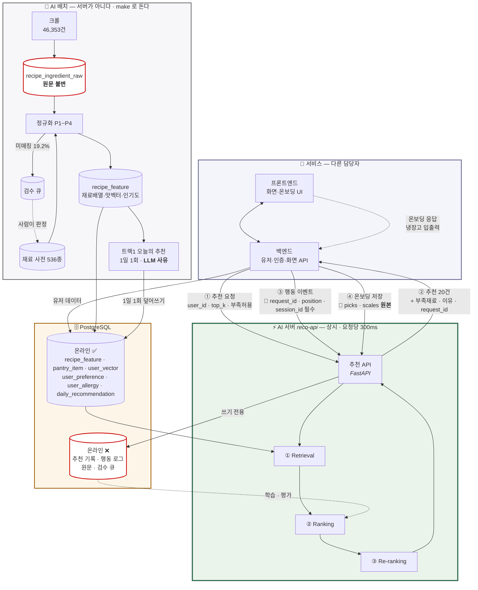
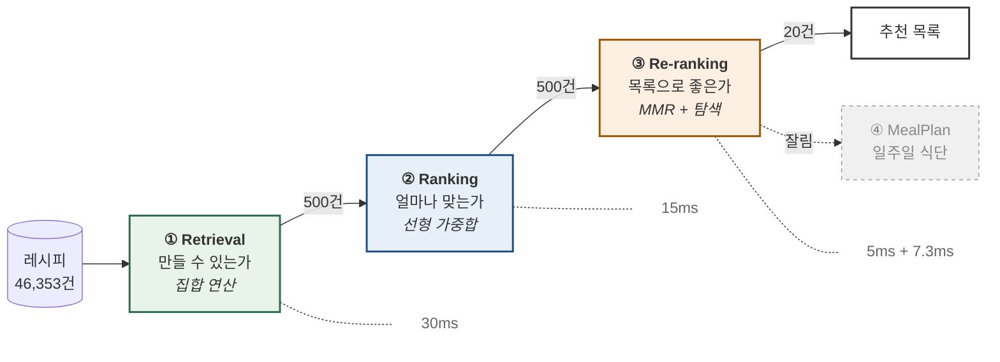

# 아키텍처 개요 — AI 파트 공유용

> 작성자: 박재우 · 작성일: 2026-09-03

| 항목 | 내용 |
|---|---|
| 대상 | AI 파트 3명 · 새로 합류하는 사람 |
| 목적 | **왜 이렇게 만들었는지**를 이해하는 것. 명세가 아니다 |
| 분량 | 30분 |
| 기준 | `01` v3.0 · `04` v2.2 · **실측 2026-09-03** |

> ⚠️ **일정은 `04` 를 본다.** `04` 는 09-02 에 전면 개정됐다 — 3인 병렬 재편과
> 크롤 실측 정정이 들어 있고, 남은 15영업일 대비 버퍼는 약 30% 다.
> `01`(v2.9)의 주차 라벨(W5·W6)은 8주 원안 기준이라 남은 3주와 맞지 않는다.

이 문서는 결정의 **이유**를 담는다. 정확한 값과 예외는 각 절 끝의 상세 문서에 있다.
숫자가 어긋나면 상세 문서가 맞다. 그리고 `01` 과 `04` 가 충돌하면 **`04` 가 이긴다** —
`01` 은 "어떻게 만드는 것이 옳은가", `04` 는 "그중 3명이 남은 3주에 무엇을".

---

## 1. 무엇을 만드는가

사용자가 **냉장고에 가진 재료**로 만들 수 있는 레시피 중에서, **그 사람 취향에 맞는 것**을
골라 주는 엔진이다. 두 조건이 동시에 걸린다는 점이 이 문제의 성격을 결정한다.

재료만 보면 검색 필터지 추천이 아니다. 취향만 보면 만들 수 없는 걸 권하게 된다.
그래서 **재료로 후보를 좁히고, 취향으로 순서를 매긴다**. 이 두 문장이 전체 구조다.

제약이 하나 더 있다. 실유저가 **50~100명**이다. 협업 필터링(CF)은 사람이 겹쳐야 작동하는데,
100명으로는 겹치지 않는다. 그래서 처음부터 **콘텐츠 기반 + 지식 기반**으로 간다.
"나중에 CF로 바꾸겠다"가 아니라, **CF를 못 쓰는 상태에서 최선을 내는 설계**다.

### 전체 그림

굵은 경계가 **온라인/오프라인 분리**다. 오프라인은 느려도 되고, 온라인은 300ms 를 지킨다.



**AI 파트는 프론트와 직접 말하지 않는다.** 백엔드가 유일한 호출자다
(초안 기능명세 `COMMON-005` — "백엔드에서만 호출").

**AI 파트 산출물은 프로세스가 셋이다.** 같은 팀이 만들지만 도는 방식이 다르다.

| | 무엇 | 언제 도나 |
|---|---|---|
| **AI 서버** `reco-api` | ①②③④ 추천 · 이벤트 · 온보딩 | **상시**. 요청이 오면 300ms 안에 |
| **AI 배치** | 크롤 적재 · 정규화 · 특성 생성 · **트랙1 오늘의 추천** | **비상시**. 사람이 `make` 로 |
| **대시보드** | 디버거 · 검수 큐 · 품질 화면 | 별도 프로세스 |

> ⚠️ **배치를 서버 안에 그리면 안 된다.** "추천 요청할 때 정규화도 도나?" 로
> 읽힌다. 46,353건 정규화는 10분짜리 일회성 작업이고 요청 경로에 없다.

> 🔴 **④ 온보딩도 AI 서버가 받는다** (`POST /v1/onboarding/{user_id}` · 09-03 신설).
> 백엔드가 화면 응답을 그대로 넘겨주면 되고, **가공은 우리가 한다.** 이 계약이
> 없던 동안 `f_taste`(0.16) + `f_ing_pref`(0.11) = **가중치 0.27 을 저장할 곳이 없었다.**
> 특히 고른 레시피 `picks` 와 척도 `scales` 를 **원본 그대로** 받는다 —
> `taste_vec` 은 그 평균이라 결과만 저장하면 시드가 바뀔 때 다시 계산할 수 없다
> (실제로 09-02 에 맛 시드 2건을 고쳤다). 상세는 `05` · `02` I-8.

> 🔴 **③ 행동 이벤트에 `request_id` 와 `position` 이 반드시 실려야 한다.**
> 우리가 응답에 담아 보낸 식별자를 백엔드가 되돌려주지 않으면
> **"3번째로 보여준 그 레시피를 눌렀다"를 복원할 수 없다.** 클릭 기록만 남고
> 무엇과 나란히 놓였을 때 눌렸는지를 모르면, 우리가 위에 올린 것이
> 인기 있어서 눌린 것처럼 보인다. **학습 자체가 성립하지 않는다.**

빨간 테두리 둘이 **되돌릴 수 없는 것**이다. 재료 원문은 사전을 고치면 언제든
다시 정규화되지만, **추천 기록은 그 순간에만 존재한다** — 그래서 로그 규약을
가장 먼저 못박았다.

### DB 를 두 칸으로 나눈 이유 — "온라인 조회"

**추천 요청 1건을 처리하는 300ms 안에 읽는가**로 갈린다. 스키마의 테이블마다
`온라인: ✅/❌` 가 붙어 있다.

| | 테이블 | 뜻 |
|---|---|---|
| ✅✅ | `recipe_feature` · `pantry_item` · **`daily_recommendation`** | **매 요청마다** 읽는다 |
| ✅ | `ingredient` · `user_preference` · `user_allergy` · `user_vector` | 요청 처리에 필요 |
| ❌ | 원문 · 정규화 결과 · 추천 기록 · 행동 로그 · 검수 큐 | 배치·분석 전용 |

`daily_recommendation` 이 ✅✅ 인 것이 처음엔 이상해 보인다 — **배치가 쓰는 표인데
온라인**이다. 그게 트랙 분리의 요점이다. 무거운 계산(LLM 사유)은 배치에서 끝내고,
요청 경로에는 **조회만** 남긴다(7절 · `02` I-16).

이 구분이 세 가지를 정한다.

**① 인덱스를 어디에 거는가.** `recipe_feature` 는 배열 GIN 으로 30ms 를 맞췄고,
`recipe_ingredient_raw` 는 45만 행인데 빈도 집계용만 있다 — 온라인이 아니니까.

**② `recipe_feature` 가 왜 비정규화인가.** 재료는 `recipe_ingredient` 에 정규화돼
있는데 매 요청마다 46,353건을 조인하면 300ms 를 못 지킨다. **배열로 미리 펼친
사본**이 `recipe_feature` 다.

**③ 로그가 ❌ 인 것이 중요하다.** 추천 기록은 **쓰기만** 하고 읽지 않는다.
그래서 쓰기가 실패해도 추천은 나갈 수 있고, 라이터를 "삼키되 센다" 로 만든 근거가 된다.

### 🔴 우리 트래픽을 실유저 지표에서 걷어낸다 *(09-02 신설)*

같은 로그 테이블에 **개발자가 디버거로 눌러본 것**과 **시딩 데이터**가 섞인다.
`is_simulated` 는 '가상 유저'만 거르므로 **실유저 ID 로 눌러본 것은 그대로 통과한다.**
그래서 접두어를 하나 늘렸다 — 이것도 소급이 안 되는 종류다.

```
session_id    c-  실사용자      g-  게스트      d-  개발·디버거·시딩
model_version mock-%           ← mock 서버가 만든 응답
```

`v_real_events` · `v_real_recommendations` 두 뷰가 `d-` 와 `mock-%` 를 걸러 낸다.
**지표는 표가 아니라 뷰를 읽는다** (결정 D-15). 나눠 두지 않으면 나중에 못 가른다 —
디버거로 100번 눌러본 것이 CTR 에 섞이면 그 기간 지표가 통째로 버려진다.

---

## 2. 왜 네 단계로 나눴는가 *(④ 는 이번 범위에서 잘렸다)*

한 번에 46,353건을 다 평가할 수는 없다. 그래서 **싼 연산으로 크게 줄이고, 비싼 연산을
적은 수에만** 건다. 단계마다 하는 일과 남는 개수가 다르다.



| 단계 | 무엇을 묻나 | 방법 | 남는 수 | 지연 |
|---|---|---|---:|---:|
| ① Retrieval | 만들 수 있는가 | 집합 연산 | 500 | 실측 30ms |
| ② Ranking | 얼마나 맞는가 | 선형 가중합 | 500 | ~15ms |
| ③ Re-ranking | 목록으로 좋은가 | MMR + 탐색 | **20** | ~5ms |
| ④ MealPlan | 일주일 식단 | 조합 최적화 | — | **잘림** |

①이 **하드 컷**이고 ②가 **점수**다. 이 구분이 중요하다. 알러지는 ①에서 자른다 —
②의 페널티로 두면 점수가 아주 높을 때 언젠가 통과하기 때문이다. **안전은 점수로 다루지 않는다.**

③이 따로 있는 이유는 ②가 아이템을 **하나씩** 보기 때문이다. 개별 점수가 높은 20개를
그냥 나열하면 비슷한 게 몰린다. 목록은 집합으로 봐야 한다.

여기에 탐색 확률 계산(Thompson MC 200회) **7.3ms** 가 붙어
전체 약 **58ms**. 목표 300ms 에 240ms 가 남는다. **여유가 있다는 사실 자체가 설계 자산**이다 —
나중에 무거운 걸 넣을 자리가 아니라, 무거운 건 전부 배치로 밀어냈다는 증거다.

> 상세: `01` 0-5(데이터 플로우) · 5-0-1(모델 아키텍처)

---

## 3. 데이터를 어떻게 놓았는가

### 원문은 절대 건드리지 않는다

크롤링 원문은 `recipe_ingredient_raw` 에 그대로 둔다. 정규화 결과는 `recipe_ingredient` 에
따로 쌓는다. **규칙이 8주 내내 바뀌기 때문**이다. 사전을 보강할 때마다 전체를 다시 정규화하는데,
원문이 남아 있지 않으면 그게 불가능하다.

서빙은 세 번째 테이블 `recipe_feature` 만 읽는다. 조인 없이 한 테이블만 스캔한다.

### 조인 대신 배열을 쓴 이유

`recipe_feature` 에는 재료 ID 배열이 **세 개** 들어 있다. 하나가 아니라 셋인 데는 이유가 있다.

- `essential_ids` — 필수 재료 중 기본양념을 뺀 것. **만들 수 있는가**를 판정한다
- `all_ids` — 양념·고명까지 전부. **알러지**를 검사한다
- `category_ids` — 재료의 카테고리. **대체재** 확장에 쓴다

셋을 하나로 합치면 안전과 편의 중 하나가 반드시 틀린다. 알러젠이 고명에만 들어 있는
레시피를 `essential_ids` 로 검사하면 놓친다. 반대로 고명까지 "만들려면 있어야 하는 것"으로
치면 만들 수 있는 게 거의 없어진다. **판정 목적이 다르면 배열도 달라야 한다.**

46,353건을 조인으로 풀면 300ms 를 못 지킨다는 판단에서 나온 비정규화다. 실제로
`cook_minutes` 같은 값도 `recipe` 에서 복사해 둔다. 조인을 한 번도 안 하기 위해서다.

### 재료 정규화 — P1부터 P5까지

크롤링 원문은 `"다진 마늘 1큰술(생략가능)"` 같은 문자열이다. 이걸 재료 ID 로 바꾸는 게
파이프라인에서 **가장 긴 작업**이고, 여기가 막히면 후보 자체가 안 나온다.

- **P1 전처리** — 유니코드 정규화, 전각 문자 변환. **괄호는 지우지 않는다.**
  지우면 `"(생략가능)"` 이 사라져서 선택 재료가 전부 필수가 된다
- **P2 분해** — 뒤에서부터 수량과 단위를 뗀다. `"약간"` 은 0이 아니라 **NULL** 이다.
  0으로 두면 "안 넣는다"가 되어 버린다
- **P3 매칭** — 사전과 맞춘다. 완전일치(L0) → 별칭(L1) → 규칙 변형(L2) 순으로 내려가고,
  **여기까지만 자동 확정**한다. 오타 교정이나 임베딩 유사도는 후보 제안까지만 하고
  사람이 확인한다. `건포도`를 `포도`로 바꾸는 사고를 막기 위해서다
- **P4 역할 판정** — 필수/선택/양념/고명을 가른다
- **P5 수량 환산** — 그램으로 바꾼다. 실패하면 NULL

P4 는 설계대로 안 되고 있다. 원문의 `group_name` 이 전부 `"기본재료"` 로 와서 규칙 두 개가
발동하지 않고, `is_seasoning` 플래그가 절반을 감당하는 중이다. 실데이터를 보고 알게 된 것이다.

### 시드 데이터 — 무엇이 실측이고 무엇이 아닌가

재료 사전 536종, 별칭 245개, 단위 환산 193행이 있다. 여기에 두 가지가 더 붙는다.

**맛 프로파일**(41+36종)과 **소비기한**(59+42종)은 **실측이 아니라 요리 상식이다.**
사람이 매긴 값이고, 파일 주석에 "실측으로 쓰지 말 것"이라고 못 박아 뒀다.
리포트에 "실측 맛 프로파일"이라고 쓰면 안 된다. 소비기한 쪽 출처는 아직 미결이다(`02` I-14).

맛 쪽은 로컬 LLM 으로 교차 검증해 봤다(MAE 0.044, 87.9% 일치). 그런데 LLM 이 짠맛·단맛을
일관되게 높게 매기는 편향이 있어서, **값을 가져다 쓰지 않고 검수 플래그로만** 쓴다.
그 과정에서 잡은 시드 오류 2건은 **09-02 에 고쳤다.**

| 무엇 | 어떻게 | 왜 틀렸나 |
|---|---|---|
| 식용유 `기름짐` | 0.60 → **1.00** | 기름 그 자체다. 상한이 아니면 무엇이 상한인가 |
| 멸치 | 1종 → **3종 분리** | 국물용·잔멸치·총칭이 맛도 역할도 다르다 |

> 🔴 **이게 온보딩 원본을 저장하는 이유다.** `taste_vec` 은 고른 레시피의
> `flavor_vec` 평균이라, 이렇게 시드를 고치면 **모든 유저의 취향 벡터가 바뀌어야 한다.**
> `user_vector.onboarding_picks`·`onboarding_scales` 가 없으면 유저를 다시 모아야 한다.

> 상세: `01` ④ · `seeds/00_README.md` · `02` I-15 *(09-02 확정 — 닫힘)*

### 로그 — 나중에 학습할 수 있게

`recommendation_log` 는 요청 시점 스냅샷과 단계별 통과/탈락 기록을, `event_log` 는
클릭·조리 같은 이벤트 8종을 남긴다.

여기서 하나만 기억하면 된다. **기여도(w·f)가 아니라 피처 원값 17종을 저장한다.**
기여도만 남기면 가중치 0인 피처 7개가 로그에서 사라져서 나중에 그 피처를 켜고 학습하려 해도
과거 데이터가 없다. 그리고 온라인은 SQL, 오프라인은 pandas 로 피처를 두 번 계산하면
**반드시 어긋난다**(training-serving skew). 서빙 시점 값을 그대로 학습에 쓰면 이 문제가 원천 제거된다.

`0.0` 과 `None` 을 구분하는 것도 같은 맥락이다. `0.0` 은 "계산했더니 0", `None` 은
"계산할 수단이 없음"이다. LightGBM 은 결측을 그대로 처리하므로 0으로 메우면 정보가 왜곡된다.

### 🔴 `impression` 이 무엇을 뜻하는지도 같이 남긴다 *(09-02 신설)*

`event_log.source` 를 새로 뒀다. **DEFAULT 를 두지 않는다** — 기본값이 있으면
새로 생긴 삽입 경로가 조용히 오분류된다.

| 값 | 뜻 |
|---|---|
| `served` | 서버가 응답에 담았다. **본 것이 아니라 보낸 것이다** |
| `viewport` | 클라이언트가 실제 화면 노출을 관측했다 |
| `client` | 사용자 행위 보고 (click·cook·save…). 관측 주체가 없다 |

지금은 프론트 합의가 어려워 `served` 로 쓴다. 나중에 `viewport` 로 바꾸면
**두 시대의 `impression` 은 뜻이 다르다** — `served` 는 스크롤해서 안 본 것도 포함한다.
이 열이 없으면 두 시대가 한 테이블에서 섞여 **둘 다 못 쓰게 된다.** 사후 백필은 불가능하다.
전환기에 둘을 동시에 쓰면 `r(p) = viewport(p) / served(p)` 로 환산계수가 나오고,
그래서 멱등 인덱스도 `(request_id, recipe_id, source)` 로 잡았다 —
`source` 를 키에서 빼면 두 기록이 공존하지 못해 그 창이 닫힌다.

`impression` 은 **`position` 이 NULL 이면 아예 안 들어간다**(CHECK). 라이터 버그 하나로
조용히 비어 가는 것을 DDL 이 막는다 — 비면 그 시대 데이터는 '상위 k 만 잘라 보기' 조차 안 된다.

---

## 4. 1단계 — 후보 고르기

PostgreSQL 함수 하나가 집합 연산 네 개를 AND 로 겹친다.

```
essential_ids && pantry_ids                          가진 재료와 겹치는가
NOT (all_ids && allergy_ids)                         알러젠이 없는가
icount(essential_ids - pantry_ids) <= max_missing    부족한 게 k개 이하인가
cook_minutes <= 상한                                  시간 안에 되는가
```

그리고 부족 개수 오름차순, 인기순으로 정렬해 500개를 뽑는다.

### 🔴 500 컷은 **결정적**이어야 한다

인기도를 처음엔 `percent_rank` 로 정했다가 09-02 에 **`row_number` + `recipe_id`
tie-break** 로 정정했다. `review_count` 가 이산값이라 동점이 거대한 블록을 만드는데,
**8,470건이 정확히 같은 점수**면 `LIMIT 500` 경계가 실행마다 달라진다.
그 위에서 계산한 **propensity 가 재현되지 않고**, propensity 재현성은 로그 규약에서
동결한 것이다(9절). 분포도 `percent_rank` 는 3분위가 통째로 비었다 (결정 D-9).

> 후기 2건짜리 8,470건이 0.17~0.35 로 퍼지는 **가짜 정밀도**가 생긴다.
> w=0.10 짜리 피처에서 그건 순위 안정성보다 싸다.

### 합성 피처는 조회에서 격리한다 *(09-02)*

`retrieve_candidates` · `retrieve_for_user` 에 `p_include_test` 인자가 붙었다
(기본 `FALSE`). B·C 트랙이 스코어러·화면을 만들려면 가짜 `recipe_feature` 가 필요한데,
그것이 A 트랙의 실데이터와 섞이면 안 된다. `feature_version` 이 `test-` 로 시작하면
조회에서 빠진다 (결정 D-17).

> 🔴 **시그니처가 바뀌었다.** 앞에 `DROP FUNCTION IF EXISTS` 가 붙어 있다 —
> 없으면 PostgreSQL 이 옛 함수를 지우지 않고 **오버로드로 한 벌 더 만든다.**
> 인자를 생략해 부르면 어느 쪽이 잡힐지 알 수 없다.

### `max_missing` 이 서비스 성격을 정한다

"없어도 이만큼까지는 사면 된다"는 파라미터다. 기본값 2다.

이 값 하나가 아키텍처를 안 바꾸고 서비스를 옮긴다. **0이면 순수 재료 소비 앱**,
**5면 개인화 추천 앱**이 된다. 그래서 "취향 기반 검색을 따로 만들자"는 제안을 받았을 때,
새 경로를 만드는 대신 이 파라미터를 조절하는 것으로 답했다.

대가도 있다. ①이 이미 걸러 놓기 때문에 상위 후보의 `f_coverage` 가 거의 다 1.0 이 되어
**랭킹 피처로서 정보를 잃는다**. 이게 나중에 추천 이유 생성에서 문제를 일으킨다(7절).

### 기본양념을 따로 다루는 이유

간장·소금 같은 `is_staple` 재료는 **모든 유저가 항상 가진 것으로 친다**.
안 그러면 간장을 등록 안 한 사람에게 한식 레시피 95%가 "재료 부족"으로 탈락한다.

알고리즘 문제가 아니라 데이터 모델링 문제라서, SQL 함수 안에 가뒀다.
앱 코드가 각자 구현하면 반드시 어긋나기 때문이다.

현재 39종이고 튜닝 대상이다. 너무 많으면 전부 "만들 수 있음"이 되어 Retrieval 이 무의미해지고,
적으면 한식이 몰살한다. 부작용도 하나 있었다 — 필수 재료가 전부 기본양념인 레시피
(간장계란밥 같은)는 배열이 비어서 `&&` 가 영원히 거짓이 된다. 조건을 하나 더 붙여 막았다.

### 알러지는 네 갈래로 검사한다

직접 지정한 재료, 카테고리 하위 전개(ltree), 알러젠 그룹 일치, 그리고 직접 지정 재료의
그룹 확산까지 UNION 한다.

하나로 부족한 이유는 대칭적이다. 카테고리만 쓰면 메밀을 놓친다 — 메밀은 잡곡류인데
같은 잡곡류인 보리·귀리는 메밀 알러젠이 아니다. **카테고리와 알러젠이 일치하지 않는다.**
반대로 그룹만 쓰면 계층 누락을 놓친다.

ltree 를 쓰는 건 `"견과류"` 한 줄 등록으로 아몬드·호두·잣을 전부 잡기 위해서다.
재료를 일일이 열거하면 신규 재료가 들어올 때마다 구멍이 생긴다.

**안전 관련은 이중화한다**는 원칙의 구체적 적용이다.

### 성능

20만 건, 냉장고 36개 재료에서 **p95 30.2ms**다. 그중 DB 내부가 13.2ms 이고
나머지 17ms 는 Python 왕복이다.

인덱스는 재미있는 결과가 나왔다. `&&` 선택도가 6.2%로 높아서 **GIN 인덱스를 강제해도
순차 스캔과 거의 같았다**(9.2ms vs 9.4ms). 그래서 "GIN 을 타야 한다"를 요구사항이 아니라
**가정**으로 재분류하고 플래너 자율에 맡겼다. 스모크 테스트의 단정도 정보 출력으로 낮췄다.

> 상세: `01` ② · `infra/init/04_functions.sql`

---

## 5. 2단계 — 점수 매기기 (목적함수)

여기가 이 시스템의 심장이다.

```
raw   = (Σ wᵢ·fᵢ) / Σ wᵢ      ← 계산 가능한 피처만                                    피처 17종의 가중합
score = raw × p_recent × p_cooked × (1 − p_avoid)    페널티는 곱한다
```

피처는 전부 **0~1로 정규화**한다. 그래야 가중치가 의미를 갖는다.
페널티를 더하지 않고 곱하는 이유는, 더하면 점수 높은 항목이 페널티를 이겨 버리기 때문이다.
최근 7일 노출은 0.7배, 14일 내 조리는 0.5배가 곱해진다.

### 가중치

```
f_coverage    0.24    보유 재료로 얼마나 커버되는가
f_taste       0.16    맛 선호와 얼마나 맞는가
f_expiring    0.15    임박한 재료를 소진하는가
f_ing_pref    0.11    좋아하는 재료가 들어가는가
f_cooccur     0.10    전에 만든 것과 비슷한가
f_popularity  0.10    많이 만드는가
f_missing     0.05    부족한 재료가 적은가
f_time_fit    0.03    조리 시간이 맞는가
                      ────
                      0.94   ← 데이터가 있어 계산되는 몫
f_cuisine     0.04    선호 요리 계열인가     ⏸ 데이터 대기
f_season      0.02    제철인가              ⏸ 데이터 대기
                      ────
                      1.00   ← 설계 의도
```

**설계 의도는 1.00 인데 계산되는 것은 0.94 다.** 두 피처가 데이터를 기다린다.
(스코어러 자체는 아직 미구현이다 — 10절 참조)

나머지 7종은 가중치 0이다. **0인 이유가 갈래마다 다르다**는 게 중요하다.

- `f_quality` — 원래는 `f_popularity` 와 상관이 높아 뺐는데, 크롤에
  **평점·조회수가 0건**이라 지금은 만들 재료 자체가 없다
- `f_pantry_use`·`f_skill_fit` — 계산은 되는데 아직 안 켰다 (난이도 97.7% 존재)
- `f_dish_type` — **음식 유형 분류가 0건**이라 계산할 수 없다
- `f_content` — 콜드 유저는 임베딩이 NULL 이라 웜 전환 시 켠다
- `f_ing_cf`·`f_group_pref` — **계산할 수단 자체가 없다**

### 🔴 "못 쓴다"가 두 종류다

| | 뜻 | 되살리려면 | 가중치 |
|---|---|---|---|
| `UNAVAILABLE_FEATURES` | **수단이 없다** — 잘린 방법에 의존 | 그 방법을 구현 | 0 이어야 한다 |
| `PENDING_DATA_FEATURES` | **데이터가 없다** — 수단은 있다 | 데이터만 오면 됨 | 그대로 둔다 |

`f_cuisine`·`f_season` 이 뒤쪽이다. 레시피 쪽 `cuisine_family` 가 **46,353건 전수 0건**
이고(만개의레시피 4축이 크롤에 오지 않았다) 제철 시드도 없다.

**가중치를 0 으로 내리지 않는 이유**는 나눗셈 정규화 때문이다 —
`raw = Σwᵢfᵢ / Σwᵢ` 에서 `fᵢ=None` 이면 분자·분모에서 함께 빠지므로
**비례 재분배와 수학적으로 같다.** 지금 점수는 옳고, 데이터가 오면
**가중치를 다시 유도할 필요 없이** 그대로 켜진다.

이 구분은 **실제 사고에서 나왔다.** 이전 판이 `f_cooccur` 0.09 와 `f_group_pref` 0.07,
즉 **가중치 예산의 16%를 만들 수 없는 피처에 배정**했다. 합이 1.00 이라 검증은 통과하는데
서빙은 0.84 짜리 랭커가 될 뻔했다. 그래서 "가중치가 0보다 크면 반드시 계산 가능해야 한다"를
계약 테스트에 넣었다.

**그런데 그 테스트가 놓치는 자리가 있었다 (09-02 발견).** 검사가
`UNAVAILABLE_FEATURES` 집합만 보는데, 크롤이 도착하며 `f_cuisine`·`f_season` 이
계산 불가가 된 것을 집합에 반영하지 않아 **0.06 이 검사 밖에 있었다.**

점수 자체는 틀리지 않았다 — 나눗셈 정규화가 `None` 을 알아서 빼기 때문이다(위).
틀린 것은 **문서와 검사**였다. 표는 "요리 계열이 4% 기여한다"고 말하는데
실제로는 0% 였고, 그것을 막으라고 만든 검사가 통과시키고 있었다.

두 집합을 갈라 다시 막았고, **실효 가중치(0.94)를 상수로 노출**해
문서에 쓰는 숫자와 코드를 묶었다 — `make doc-check` 가 매번 대조한다.

### 🔴 이 가중치는 학습한 값이 아니다

**사람이 도메인 직관으로 매긴 임시값**이다. 문서와 코드 양쪽에 "검증되지 않은 추정치"라고
적혀 있다. 리포트에 "학습된 가중치"라고 쓰면 안 된다.

교체 계획은 있다 — 쌍대비교 600쌍을 모아 Bradley-Terry 로 추정한다(9절).
그때까지 검증 수단은 ablation 과 페르소나 sanity check 뿐이다.

### `f_taste` 에 미해결 문제가 있다

유저의 맛 선호 벡터와 레시피의 맛 벡터를 **코사인 유사도**로 비교한다.
둘 다 같은 6축(매움·짠맛·단맛·신맛·감칠맛·기름짐)이라 변환 없이 내적 한 번으로 끝난다.

문제는 **두 벡터가 모두 음수가 없다**는 것이다. 비음수 벡터끼리의 코사인은 [0,1]에 갇혀서
**무작위 벡터끼리도 0.767 이 나온다.** 실측한 우리 값이 0.747 이었다.
**무작위와 구분되지 않는다.** 즉 지금 `f_taste` 는 가중치 0.16 을 쓰면서 일을 안 하고 있을 수 있다.

값을 `2v−1` 로 재척도하는 건 답이 아니다 — 측정해 보니 오히려 나빠졌다(+0.909).
코퍼스 평균을 빼는 **중심화**가 후보이고, 이때 유저 벡터도 **같은 평균으로** 빼야 좌표계가 맞는다.
방법은 `01` 5-2-2-2 에서 확정됐다(v2.8) — 같은 μ 를 레시피와 유저 양쪽에서 뺀다.
미구현인 것은 μ 값 자체다. 코퍼스 평균은 실제 46,353건에서만 나온다.

> 🔴 **μ 는 아무 때나 갱신하지 않는다 — A-5 와 A-13, 딱 두 번이다** (결정 D-13).
> μ 가 바뀌면 그 전에 계산한 `f_taste` 와 뒤의 것이 **다른 좌표계**가 되고,
> 로그의 `stats_version` 이 그 경계를 표시한다. 갱신하면 B·C 에 알려야 한다.
> 6축을 저장하는 것은 확정이고, **실제로 어느 축을 쓸지는 W3 에서 정한다** (D-11).

### 콜드스타트

유저 데이터가 없어도 **재고 기반 피처는 전부 산다**(`f_coverage`·`f_missing`·`f_expiring`).
온보딩 설문으로 `f_taste`·`f_ing_pref` 가 살고, 레시피 데이터만으로 계산되는
인기·시간도 산다.

죽는 건 넷이다 — `f_content`(임베딩 NULL) · 협업 신호 둘 · 그리고 **`f_cooccur`**.
`f_cooccur` 는 "유저가 최근 만든 것과 얼마나 겹치는가"라 **콜드 유저에게는 값이 없다.**
IDF 가중치를 레시피 데이터만으로 만들 수 있다는 것과, 콜드 유저에게 값이 나온다는 것은
다른 이야기다 (`01` 5-2-2-1).

`f_cuisine`·`f_season` 은 온보딩과 무관하게 **레시피 쪽 데이터가 없어서** 안 산다(위 표).
이벤트가 20건 쌓이면 점진적으로 웜 가중치로 옮긴다.

한 가지 덧붙이면, `f_expiring` 은 원래 사실상 죽어 있었다. 유저가 기한을 입력하지 않기
때문이다. ~~등록일~~ **구매일** + 재료별 기본 소비기한으로 **추정**해서 되살렸다.
다만 그 소비기한 시드도 통념이지 실측이 아니다(`02` I-14).

### 🔴 기준일은 **구매일**이지 앱 등록일이 아니다 *(09-02)*

`pantry_item.purchased_at` 을 새로 뒀다. 마트에서 사고 사흘 뒤에 앱에 넣는 사람에게
등록일을 기준으로 잡으면 **사흘을 공짜로 벌어 준다** — 이미 상한 두부를 "아직 이틀 남음"
으로 본다. 미래 구매는 CHECK 로 막는다.

```
effective_expiry = COALESCE(purchased_at, added_at::date) + 재료별 소비기한 일수
```

유저가 `expires_at` 을 직접 주면 그것이 추정을 이긴다. 그리고 이 값은
**소비기한**(use-by)이지 유통기한(sell-by)이 아니다 — 유통기한은 판매 가능 기한이라
지나도 먹을 수 있고, 우리가 알고 싶은 것은 "언제까지 먹을 수 있나" 다.

> 🔴 **DB 시간대를 `Asia/Seoul` 로 못박았다** (`01_extensions.sql` 의 `ALTER DATABASE`).
> UTC 면 한국 시간 자정~오전 9시에 `current_date` 가 **하루 전**이라
> 임박 판정이 통째로 어긋난다. 컨테이너 `TZ`/`PGTZ` 만으로는 부족하다 —
> 밖에서 붙는 psycopg2 세션에는 적용되지 않는다.

> 상세: `01` ⑤ · `app/schemas/common.py`

---

## 6. 3단계 — 목록으로 다듬기

### MMR — 비슷한 게 몰리는 걸 막는다

`MMR(d) = λ·score − (1−λ)·max_sim`, λ=0.7 이다. 이미 뽑은 것과 비슷하면 감점한다.

유사도는 임베딩 코사인이 아니라 **재료 자카드**를 쓴다. 임베딩은 배치가 안 돌면 NULL 일 수
있는데 재료 배열은 항상 있기 때문이다. 기본양념은 빼고, 흔한 재료는 IDF 로 낮춘다 —
양파처럼 어디에나 있는 재료가 유사도를 부풀리기 때문이다.

효과는 측정됐다. 다양화가 없으면 Top-20 의 근중복 쌍이 8.1 개인데, MMR 을 넣으면 0.1 로 줄고
점수는 96.7% 유지된다.

### 우연성은 다양성과 다른 문제다

MMR 은 **이번 목록 20개 안**의 문제를 푼다. 우연성은 **세션에 걸쳐 새로운 걸 만나는가**의
문제다. 지표도 다르고 해법도 다르다.

설계가 잡은 사용자 요구는 이렇다 — 진짜 취향이 8개 영역인데 온보딩으로 아는 건 3개다.
**나머지 5개를 발견해야 한다.** "이 재료 든 비슷한 메뉴만 계속 보인다"는 체감은
목록 내부 지표(ILD·근중복)로는 잡히지 않는다.

그렇다고 **멀기만 하면 안 된다.** 거리만 쓰면 발견은 늘어나는데(3.20) 탐색 슬롯의 적중률이
14.4%에서 12.7%로 떨어진다. "이상한 게 두 칸 껴 있네"가 된다.
그래서 **우연성 = 관련성 × 의외성**으로 품질 하한을 건다.

### 왜 아이템이 아니라 클러스터에 거는가

표본 때문이다. 레시피 46,353개를 각각 하나의 선택지로 두면, 8주 동안 노출 2만 회를 나눠
**선택지당 0.43회**가 된다. 아무것도 학습되지 않는다.

k-means 로 50개 클러스터를 만들면 **선택지당 400회**가 확보된다.
축을 바꾸면 열린다는 판단이고, 같은 논리가 이 프로젝트 여러 곳에 반복해서 나온다.

### 탐색 정책을 절반씩 섞는 이유

탐색 슬롯 2칸을 **절반은 균등 무작위, 절반은 Thompson 샘플링**으로 채운다.
성능만 보면 Thompson 을 2칸 다 쓰는 게 낫다(숨은 취향 발견 3.89 vs 3.54).
그런데 그렇게 하지 않는다.

Thompson 만 쓰면 유망하지 않은 클러스터를 **아예 안 뽑는다.** 50개 중 32개가 노출 확률 0이
되고, 시뮬레이션 횟수를 5배로 늘려도 27개가 남는다. 표본 문제가 아니라 정책의 성질이다.

노출 확률이 0이면 나중에 그 영역을 **영원히 평가할 수 없다**(IPS 의 분모가 0이 된다).
균등 절반은 모든 후보에 최소 노출 확률을 보장하려고 낸 값이다.
**0.35 만큼의 성능을 주고 평가 가능성을 산 것이다.**

같은 이유로 UCB 는 성능이 가장 좋은데도(4.14) 기각했다. 결정적이라 확률 자체가 없다.

탐색 슬롯의 **위치도 매번 무작위**로 뽑는다. 고정하면(예: 6위·14위) 얻는 게 두 점뿐인데,
필요한 건 위치별 검사 확률 **곡선** 전체이기 때문이다. 비용은 같고 코드는 한 줄이다.

> 🔴 **그 한 줄이 실제로는 안 꽂혀 있었다 (09-02 수정).** `exploration_slots()` 로
> 위치를 뽑아 놓고 **결과를 쓰지 않아서**, 탐색 아이템이 점수 순서 그대로 남았다 —
> 즉 항상 비슷한 위치에 왔다. 그러면 위치별 CTR 이 검사 확률 곡선이 되지 않아
> **IPS 보정이 성립하지 않는다.** 지금은 8개 위치에 고르게 퍼지고,
> 계약 테스트가 "탐색 아이템이 여러 위치에 퍼진다(8종)"로 이것을 붙들고 있다.

### 구현 상태

계약·스키마·`mixed_exploration()`·`exploration_slots()` 실삽입·계약 테스트는 **구현됐다.**
k-means 배치와 클러스터 통계 갱신은 **아직이다.** MMR 자체도 아직 구현 전이다.

클러스터가 없으면 균등 탐색으로 폴백하므로 **배치가 없어도 서비스는 산다.**

> ⚠️ **클러스터는 한 번만 매긴다** — A-4 직후 딱 한 번이다 (결정 D-12).
> `recommendation_log` 에 `cluster_version` 칸이 없어서, 중간에 다시 매기면
> **어느 판의 클러스터로 뽑은 탐색인지 사후에 못 가른다.** 다시 매겨야 하면
> `batch_run` 에 시각을 남기고 그 앞뒤를 손으로 가른다.
> (`01`/`04` 의 W5·W6 주차 라벨은 8주 원안 기준이라 남은 3주와 맞지 않는다 — 맨 위 경고 참조)

> 상세: `01` 5-3 · 5-3-5 · `app/services/recommends/serendipity.py`

---

## 7. 추천 이유를 어떻게 만드는가

"왜 이걸 추천했는지"를 한 문장으로 보여 준다. 설명가능성이 이 프로젝트의 핵심이라
그냥 붙이는 장식이 아니다.

### 기여도의 argmax 로 고르면 안 된다

처음엔 "가장 크게 기여한 피처의 템플릿을 쓴다"였다. 측정해 보니 **Top-20 전부가
`f_coverage` 하나로 붕괴**했다.

구조적인 문제다. ①이 이미 `max_missing` 으로 걸렀기 때문에 상위 후보의 `f_coverage` 는
거의 항상 1.0 이고, 가중치 0.24 가 최대다. 곱의 argmax 가 사실상 상수가 된다.

그래서 **이유는 "점수가 높은 이유"가 아니라 "다른 후보와 달라서 뽑힌 이유"** 로 재정의했다.
같은 요청의 후보 500개를 기준으로 표준화하고(z-salience), 상위 2개를 이어 붙인다.
표준편차에 하한 0.05 를 두는데, 없으면 반대로 깨진다 — 전부 0.98~0.99 인 피처에서
0.01 차이가 튀어서 그게 이유가 되어 버린다.

### 템플릿을 쓴다. 그리고 그게 안전장치다

템플릿 15종이 있고, 그중 **10종이 w>0** 인데, `f_cuisine`·`f_season` 은 값이 영구 None 이라
오늘 실제로 발화 가능한 것은 **8종**이다.
각 템플릿은 종결형과 연결형을 **두 벌** 적어 둔다. 한국어 연결어미는 규칙이 서로 달라서
계산으로 맞히려 하면 반드시 깨진다. 조사는 받침으로 자동 선택한다.

여기서 나중에 알게 된 게 있다. 연결형을 `고`/`며`/`여` 로 제한한 것이 편의가 아니라
**안전장치였다.** 중립 접속만 허용한다는 뜻이고, 그래서 **이 코드는 인과를 만들어낼
문법적 수단이 없다.** 같은 사실 2개를 LLM 에 주고 문장을 만들게 했더니 10건 중 7건이
`"~므로"` 같은 인과 접속을 써서 **없는 인과관계를 지어냈다.**

### 추천을 두 트랙으로 나눈다

LLM 으로 사유를 쓰고 싶다는 요구가 있어서 실측했다. 결론은 **온라인에서는 못 한다**다.
사유 1건이 25토큰이라 **10건이면 300ms 안에 833 tok/s** 가 필요한데,
가장 빠른 로컬 모델이 **90.9 tok/s** 다. 9배가 모자란다.

처리량이나 비용 때문이 아니다. **지연 하나 때문**이다. 그래서 트랙을 나눴다.

- **트랙 1 — 오늘의 추천**: 새벽 배치로 미리 계산하고 **LLM 으로 사유를 쓴다**.
  조회는 여전히 30ms. 유저 100명이면 배치 30분
- **트랙 2 — 잔여 재료 추천**: 실시간. **템플릿 사유만** 쓴다. LLM 을 안 부른다

오프라인으로 옮긴 게 지연만 푼 게 아니다. **정확성 문제도 같이 풀린다** —
배치라서 사람이 검수할 시간이 있다. 게이트를 통과한 사유에도 오류가 25% 남기 때문에
검수가 선택이 아니라 필수다.

### 🔴 트랙 1 은 **사전 계산**으로 만든다 *(결정 D-19 · 09-03)*

"실시간으로 할까"는 닫혔다. 메인화면은 미리 계산해 둔 `daily_recommendation` 을
**조회만** 한다.

| | 트랙 1 오늘의 추천 | 트랙 2 잔여 재료 |
|---|---|---|
| 트리거 | 배치 1일 1회 | 실시간 |
| 사유 | **LLM** (실패 시 템플릿) | 템플릿 |
| 응답 | ~30ms (조회만) | ~58ms |

테이블은 **결정과 함께 지금 만들었다.** 나중에 필요해지면 DDL 변경이라 전원이
재초기화해야 하는데, 비어 있는 테이블의 비용은 0 이다.

```
user_id · rank (PK) · recipe_id · score
reason · reason_source          llm | template | fallback
pantry_fingerprint              🔴 stale 판정
config_hash · stats_version     점수 재현
batch_run_id · computed_at
```

`pantry_fingerprint` 가 핵심이다. 새벽에 계산했는데 **낮에 재료를 쓰면 사유가 어긋난다** —
"두부가 상하기 전에 쓰세요" 인데 두부를 이미 다 썼다. 계산 시점 냉장고의 지문을 남겨 두고
조회할 때 현재 값과 비교해 **stale 로 표시**한다. 지문이 없으면 어긋났다는 사실조차 모른다.

`reason_source` 를 나눠 두는 것도 같은 종류다 — 나중에 "LLM 사유가 템플릿보다 나은가"를
재려면 어느 쪽이 쓴 문장인지가 남아 있어야 한다.

> ⏳ **배치 구현 자체는 3주 계획에 없다.** 테이블과 계약만 준비하고, 실제 배치는
> 여유가 생기면 만든다. 기능명세 `MAIN-000` 이 약속한 것이라 안 만들면 프론트에 알려야 한다.
> 트랙2 에 템플릿 사유를 남길지는 **남긴다**로 정했고(0ms · 디버거와 ablation 이 여기 걸린다),
> 배치를 어디서 돌릴지 등 나머지 4건은 여전히 미결이다 (`02` I-16).

> 상세: `01` 5-5 · 5-6-1 · `scripts/bench/out/ONLINE_LLM_REASON.md` · 결정 D-19

---

## 8. 왜 이 모델인가

### 세 가지 접근 중에 골랐다

- **A. 순수형** — LLM 없이 규칙 + 전통 ML 로 4단계를 짠다 ← **채택**
- **B. Two-Tower 단일 모델** — 학습 데이터 50명으로 불가능. 합성 데이터로 학습하면 순환 논리
- **C. LLM 추천기 / RAG** — 비용·지연·재현성 문제. ML 기여가 얕아 보인다

A 를 고른 핵심 이유는 **학습 데이터가 0건이어도 돌아가고, 가중치가 곧 기여도라
설명가능성이 공짜**라는 점이다.

### 선형이 GAM 보다 나았다 — 측정했다

"선형은 단순해서 임시로 쓰는 것"이 아니다. 실제로 재 봤다.

정답을 모르는 조건에서 라벨 600쌍이면 **선형 0.809, GAM 0.675** 다.
6,000쌍으로 늘려도 **0.868 대 0.851** 로 선형이 이긴다.

이유는 파라미터당 샘플 수다. 600쌍에서 선형 8모수는 샘플 75개씩이고,
GAM 128모수는 **4.7개씩**이다. 데이터가 적을 때 표현력은 부채다.

**"선형을 쓴다"가 "비선형을 포기한다"가 아니다.** 비단조성(조리 시간)이나 포화(부족 재료)는
**피처 쪽에 넣었다.** ablation 해 보니 변환으로 얻은 이득이 전부 조리시간 3구간 더미
하나에서 나왔다.

### 언제 선형을 버리는가

트리거가 **아닌 것**부터 정했다. 가중치가 17개로 는 것도, 피처끼리 상관하는 것도 트리거가 아니다.

진짜 트리거는 셋이다 — ① 도메인 지식으로 못 만드는 유저×아이템 교차가 필요할 때,
② 시퀀스·텍스트·이미지가 들어올 때, ③ **라벨 일관성 × 라벨 수**가 충분할 때.

③이 미묘하다. 사람 판단이 얼마나 일관되냐에 따라 필요 라벨이 6,000쌍이 되기도 하고,
일관성이 낮으면 **GAM 이 영원히 선형을 못 넘는다.** 그 일관성은 아직 측정된 적이 없고,
같은 쌍을 5% 중복 출제해서 재는 것이 유일한 방법이다.

경로는 선형 → GAM → GA2M → LightGBM 이다.

### 딥러닝이 막힌 건 GPU 가 아니다

Two-Tower 파라미터 70만 개는 fp32 로 **2.8MB** 다. 4,000 샘플로 학습하면 몇 초에 끝난다.
**그게 끝난다는 사실 자체가 데이터 부족의 증거다.**

막힌 건 **아이템당 상호작용**이다. 판단 기준은 "개체당 상호작용이 잠재차원의
2배 이상". 그런데 이 숫자가 크롤 도착으로 **둘로 갈렸다.**

| 무엇 기준 | 아이템당 | 판정 |
|---|---:|---|
| **우리 유저 행동 로그** | **0.091건** (0건 아이템 91%) | K=16 기준선 32건의 1/350. 안 열린다 |
| **크롤 후기** | **11.89건** (작성자×레시피 551,151쌍) | K=8 이면 손에 닿는다 |

> 🔴 **"0.4건"은 쓰지 않는다.** 레시피 1만 건 시절의 값이고
> 46,353건으로 정정되며 폐기됐다 (`08` 8절).
>
> 🔑 **두 숫자를 섞으면 안 된다.** 후기 작성자는 **우리 유저가 아니다.**
> 그래서 *우리 유저에게 개인화하는* 모델은 여전히 안 열리고,
> *후기로 도는* item-item CF 는 열린다. 리포트에서 이 구분을 흐리면
> "데이터가 충분한데 왜 안 했나"가 된다.

필요한 유저 수는 대략 이렇다.

```
Two-Tower (인기 500개, K=16)      800명
Two-Tower (전 카탈로그, K=64)   32,000명
DeepFM (아이템 ID 포함)          8,000명
LightGCN                         5,000명
SASRec / BERT4Rec               50,000명
```

8주에 도달 가능한 건 100~300명이다. **그런데 축을 바꾸면 지금도 열린다** —
`recipe × ingredient` 는 유저가 0명이어도 되고, `user × ingredient` ALS 는 64명이면 된다.
아이템 ID 를 뺀 FM 은 파라미터가 451개라 100명이면 된다.

> 상세: `03` · `07` E절

---

## 9. 어떻게 평가하는가

### 주 지표가 NDCG 가 아니다

**요청 단위 pairwise 정확도**를 쓴다. NDCG 를 안 쓰는 이유가 둘이다.

positive 를 Poisson(2)로 두면 **요청의 13.5%가 positive 0건**이라 NDCG 가 정의되지 않는다.
그리고 dismiss 같은 **음수 라벨이 NDCG 에서는 클리핑돼 사라진다.**

지표보다 **하네스를 먼저 검증한다.** IDCG 를 top-K 안에서만 계산하는 흔한 버그는
편향이 +0.182 인데, 우리가 재려는 개선 폭(0.01~0.03)의 **6~18배**다.
지표가 틀리면 무엇을 측정하든 의미가 없다.

### 로그로 학습하려면 확률을 남겨야 한다

우리 정책은 상위 k개를 그대로 내보내는 결정적 정책이라, **상위 18칸은 자기 자신만 관측한다.**
안 보여준 걸 보여줬다면 어땠을지 알 수 없다. 그래서 IPS/SNIPS 로 보정한다.

여기서 가장 중요한 원칙 하나 — **propensity 는 소급이 불가능하다.**
지표 함수도 분할 규칙도 추정량도 나중에 짜면 된다. 그런데 **로그 시점의 확률성과
propensity 값은 서빙 그 순간에만 존재한다.** 안 남기면 영원히 없다.

지금은 아직 못 쓴다. 탐색 2칸 × 1,000 노출이면 위치당 100회라 상대오차가 30%인데,
인접 위치 간 실제 차이는 5.9%다. 쓸 수 있는 문턱은 유효표본 약 1,800 이다.

### A/B 테스트를 안 하는 진짜 이유

**군집 때문이지 노출 수 때문이 아니다.**

배정 단위가 유저라서, 한 사람이 여러 번 요청해도 그게 독립 표본이 아니다.
수식으로는 유저당 노출을 아무리 늘려도 유효표본이 `(유저수/2) / ICC` 로 **포화한다.**
**유저 수만이 A/B 를 연다.**

유저 100명이면 검출 가능한 CTR 차이가 약 4.1%p, 상대로 +41%다.
v0 → v1 은 그런 크기의 개선이 아니다.

대신 **Team-Draft Interleaving** 을 쓴다. 두 랭커의 결과를 한 목록으로 섞고 클릭된 쪽에
점수를 준다. **같은 사람이 두 모델을 동시에 평가**하므로 사람 간 분산이 상쇄되고,
검정 단위가 유저가 아니라 요청이 된다.

필요 요청은 1,414 건인데 W6 목표가 1,000 이라 빠듯하다. 그래서 목표를 뒤집었다 —
확보한 요청에서 **검출 가능한 최소 차이를 역산해서 보고**한다.

### 쌍대비교로 가중치를 배운다

**"A와 B 중 어느 쪽을 만들겠는가"** 만 묻는다. 절대 점수를 안 매기는 이유는 사람마다
점수 기준이 다르기 때문이고, 우리가 배우려는 게 정확히 **순서**이기 때문이다.

`P(A≻B) = σ(w·(f_A − f_B))` 인 절편 없는 로지스틱 회귀다(Bradley-Terry).

600쌍이면 된다 — 20명이 30쌍씩, 한 쌍 10초면 1인당 5분이다.
11개 개별 가중치를 다 배우는 것보다 **5블록으로 묶는 게 낫다**
(정답 회복률 0.874 → 0.926 — **실제 성능이 아니라 우리 가중치를 되찾은 비율**이다).

**수집 방식은 09-03 에 확정됐다** (`02` I-13 닫힘 · 결정 D-18) — 쌍은 무작위가 아니라
**블록별 120쌍씩 층화 추출**하고, 도구는 화면을 새로 만들지 않고 **구글폼**을 쓴다.
여기에 **5% 를 중복 출제**해 같은 쌍의 재현율로 **라벨 일관성**을 잰다.
일관성은 "언제 선형을 버리는가"의 세 번째 트리거(8절)이기도 한데, 아직 측정된 적이 없다.

정직한 한계도 기록해 뒀다. **블록은 식별되지만 개별 피처는 안 된다.**
그리고 시나리오를 짤 때 임박 재료를 반드시 2~3개 넣어야 한다 — 없으면 `f_expiring` 의
차분이 0이 되어 가중치 0.15 짜리 블록이 통째로 학습 불가가 된다.

> 상세: `07` D절 · `01` 5-2-5 · 5-7-2

---

## 10. 지금 어디까지 왔나 *(2026-09-03 기준)*

### 데이터 — 크롤 도착, 적재 완료

```
레시피      46,353건        재료 원문   451,862
조리 순서  362,677단계      후기        624,422
재료 사전      536종        정규화 커버리지  80.8%
```

정규화 **P1~P4** 가 완성됐다(`make normalize-test` **113건** — P1·P2 74 · P3 23 · P4 16).
P5 수량 환산(g)은 **의도적으로 보류**했다 — 있음/없음 필터링이면 충분하고,
맛 강도는 단위·제목·순서로 등급을 매긴다. 커버리지는 조리도구 필터·단위 시드·
물 등록으로 **69.2% → 80.8%** 로 올렸고, 검수 300종(75분)이면 89.4% 가 된다.

> 🔴 **검수는 병목이 아니다.** 재료 원문을 그대로 보관하므로 사전을 고치면
> 언제든 재정규화된다. 로그와 달리 **늦어도 잃는 것이 없다.**

### 엔진 — 파이프라인이 파이썬으로 이어졌다

| | 상태 | 검증 |
|---|---|---|
| 규약 동결 5건 | ✅ | — |
| 계약 (스키마 · API) | ✅ | `make contract` **98건** |
| DDL 소급 불가 컬럼 | ✅ | `make ddl-test` **47건** |
| Retrieval 실연동 | ✅ | `make smoke-py` 19건 · `make smoke` 13건 |
| 로그 쓰기 | ✅ 만듦 · **아직 미개통** | `make log-test` 48건 |
| 온보딩 계약 | ✅ 계약·mock | `POST /v1/onboarding/{user_id}` — `05` |
| 스코어러 | ⬜ | mock 이 난수를 만든다 |
| 화면 2종 | ⬜ | 코드 0줄 |

문서 수치도 기계가 본다 — `make doc-check` 가 DB·코드와 대조한다.
**숫자를 고칠 때는 여기부터 돌린다.**

### 🔴 지금 실데이터 추천이 0건이다

`recipe_feature` 가 0행이라 빌더 게이트에 전부 걸린다. **정규화 배치를 돌려야
후보가 나오기 시작한다.** 스코어러를 다 만들어도 여기가 없으면 보여줄 것이 없다.

### 착수 후 드러난 설계 결함 — 전부 수정

**① propensity 가 로그에 한 번도 안 남는 구조였다.** 후보 저장 함수가
`ScoredCandidate` 를 돌려주는데 propensity 는 `RankedItem` 에만 있었다.
없으면 편향 보정(IPS)의 분모가 사라져 **off-policy 평가가 통째로 불가능**하다.
병합 단계를 신설해 해소했다 — 스키마 변경 없이.

**② 로더가 멱등하지 않았다.** 두 번 돌리면 재료 원문이 **전량 2배**가 됐다
(451,862 → 903,724). 유니크 제약이 없어 `ON CONFLICT` 가 아무것도 안 했고
**에러도 안 났다.** 제약 2건을 추가해 지금은 몇 번 돌려도 같다 —
`recipe_ingredient_raw UNIQUE(recipe_id, position)` 과
`recipe_review UNIQUE ... NULLS NOT DISTINCT`. 뒤쪽에 `NULLS NOT DISTINCT` 가 필요한 것은
후기의 작성자 해시가 NULL 일 수 있어서다. 기본 규칙에서는 NULL 끼리 서로 다르다고 봐서
**같은 후기가 몇 번이든 다시 들어간다.**

**③ mock 이 픽스처로 못 쓸 상태였다.** 같은 요청 2회에 propensity 가 달라지고
(모듈 전역 누적), `final_rank` 가 점수 내림차순이 아니었다(top_k=20 에서 53/59명 역전).

위 셋은 대표다. **전수는 열한 건**이고 성격이 둘로 갈린다.

| 언제 | 몇 건 | 어디에 |
|---|---:|---|
| 착수 **전**에 발견 | 3건 | 로더 멱등성 · 사전 로딩 · 커버리지 게이트 |
| S2 **적대적 검증**에서 | 8건 | `04` S2 절에 전수 기록 |

S2 의 여덟은 이렇다 — 묘비가 정본을 영구 차단 · `include_trace=false` 가 추적을
통째로 유실 · 점수 재현 필수값이 조용히 NULL · 커넥션 풀이 1개만 캐시 ·
묘비가 실패 유발값을 재사용 · 긴 세션 ID 로 요청 로그 유실 ·
노출 카운터가 시도 수를 셈 · CHECK 가 로그 삭제를 막아 개인정보 파기와 충돌.

> 🔑 **열한 건 다 화면상으로는 정상이었다.** 응답은 200 이고 목록도 20개가 나왔다.
> 그래서 완료 기준을 전부 **"돌아간다"에서 "다시 돌려도 같고, 나중에 되돌릴 수 있다"로
> 바꿨다.** 로더는 두 번 돌려 행수를 비교하고, 로그는 왕복시켜 값이 살아 있는지 보고,
> mock 은 같은 요청 두 번에 같은 답이 나오는지 본다. `make contract` 98건 ·
> `ddl-test` 47건 · `log-test` 48건이 그 기준을 코드로 옮겨 둔 것이다.

### 크롤 데이터에 없는 것 셋 — 설계 전제가 틀렸다

| 없는 것 | 영향 |
|---|---|
| **레시피 이미지 0건** | 카드 UI 를 만들 수 없다. 원본 링크만 가능 |
| **음식 유형 분류 0건** | 자유 태그 45,529종뿐. `f_cuisine`(0.04) 계산 불가 |
| **평점·조회수 0건** | `f_quality` 를 만들 재료가 없다 (w=0 유지) |

앞의 둘은 기능명세 초안도 있다고 전제했다. 팀과 조율이 필요하다.

### 인력 — 2인에서 **3인 병렬**로

| 트랙 | 맡는 것 | 공수 |
|---|---|---|
| **A** 데이터 | 정규화 배치 → 레시피 특성 | 9일 |
| **B** 엔진 | 피처·스코어러 + 로그 개통 | 10.5일 |
| **C** 관측 | 화면 2종 · 평가 도구 | 10.5일 |

병렬이 가능한 이유는 **규약·스키마·계약이 먼저 고정됐기 때문**이다.
세 사람이 서로를 기다리지 않고, 3주 계획에 스키마 변경이 없다.

> 🔴 **B 의 로그 개통이 최우선이다.** 지금 추천 기록이 0행이라 C 가 화면에
> 띄울 데이터가 없고, **그 시점이 로그 규약이 잠기는 순간**이다 —
> 그 전까지는 규약을 공짜로 바꿀 수 있다.

**자른 것** — Grafana 3보드, FM·ALS, MealPlan, 규칙 기반 시뮬레이터.
자른 것을 설계 문서에서 **지우지 않는다.** "어떻게 하는지는 알지만 인력 제약으로
우선순위를 낮췄다"가 리포트의 확장성 절이 된다.

### 09-02~03 에 닫힌 것 셋

| | 무엇 | 어떻게 닫혔나 |
|---|---|---|
| **I-8** | 온보딩 문항 | 5문항 확정. 계약 `OnboardingIn`/`OnboardingOut` 신설 |
| **I-13** | 쌍대비교 600쌍 | 20명 × 30쌍. 블록별 120쌍 층화 + 구글폼 (D-18) |
| **I-15** | `flavor_vec` 산출 | LLM 교차검증(MAE 0.044) · 시드 결함 2건 수정 |

~~**`flavor_vec` 중심화가 미결이다**~~ — **방법은 확정됐다**(`01` 5-2-2-2).
남은 것은 결정이 아니라 **작업**이다: 코퍼스 평균 μ 를 실제 46,353건에서 뽑는 일이고,
A 트랙의 A-5·A-13 두 시점에만 한다(D-13). 그때까지 `f_taste`(0.16)가
무작위 수준일 수 있다는 사실은 그대로다.

### 남은 미결 다섯

| | 무엇 | 못 하면 |
|---|---|---|
| **I-6** | 실유저 100명 모집 설계 | LightGBM v1 자체가 불가 |
| **I-11** | `cuisine` 라벨 200건 | kNN 분류 불가 → `f_cuisine`(0.04) 계속 죽음 |
| **I-14** | 소비기한 데이터 출처 | 리포트에 "실측"이라 못 쓴다 |
| **I-16** | 트랙2 사유 정책 나머지 4건 | 배치 위치 · 검수 주체 · stale 처리 · 트랙1 Top-N |
| **I-17** | DB 분리 시 인증 · 폴백 | DB 가 내려가면 추천이 통째로 죽는 구조다 |

I-16 의 첫 질문(**트랙2 에 템플릿 사유를 남기나**)은 **남긴다**로 답했다 —
0ms 이고, 디버거와 ablation 이 거기 걸려 있다.

> 상세: `04` · `02` · 작업 지시는 `docs/draft/작업분담_*.md`
> 결정 D-1~D-19 는 `docs/draft/05_작업분담_결정사항.md`

---

## 읽는 순서

처음이면 이 문서 → `04`(무엇을 만드는지) 순으로 읽으면 된다.
맡은 부분이 정해지면 그때 `01` 의 해당 장만 보면 된다.

| 맡은 것 | 읽을 곳 |
|---|---|
| 정규화 | `01` ④ · `seeds/00_README.md` |
| 엔진 | `01` ⑤⑥ · `05` |
| 대시보드 | `01` ③ · `05` |
| DB | `01` 1-7 · `06` 8절 |

### 환경 만들기 *(09-02 개편)*

의존성은 `pyproject.toml` + `uv.lock` 한 벌로 모았다. 트랙마다 필요한 것이 달라서
extras 로 갈라 둔다 — `api`(fastapi·uvicorn) · `dash`(streamlit) · `obs`(mlflow) ·
`ml`(numpy·scikit-learn) · `rank-v1`(lightgbm) · `embed`(sentence-transformers).
`rank-v1` 과 `embed` 는 기본에 없고 `make install TRACK=? EXTRA=?` 로 얹는다 — `embed` 는 이번 3주에 쓰지 않는다.

```bash
make install TRACK=A     # 데이터   A|B|C 중 자기 트랙
make bootstrap           # 기동 → 시드 → 검증
```

> 🔴 **맨손 `uv sync` 를 치지 않는다.** 락에 없는 패키지를 **지운다** —
> 다른 트랙의 extras 가 통째로 날아가고, 그 사실이 조용히 일어난다.
> 실제로 09-02 에 fastapi·numpy 가 사라져 mock 서버가 죽었다.
> `db/`·`reco/` 밑에 있던 트랙별 의존성 목록 두 벌은 함께 폐지됐다 — 찾지 말 것.

> ⚠️ **`make seed-reset` 은 가드가 걸려 있다.** CASCADE 로 `recipe_ingredient` ·
> `pantry_item` 까지 같이 지워지므로 행이 있으면 멈춘다. `FORCE=1` 로만 강행된다.
