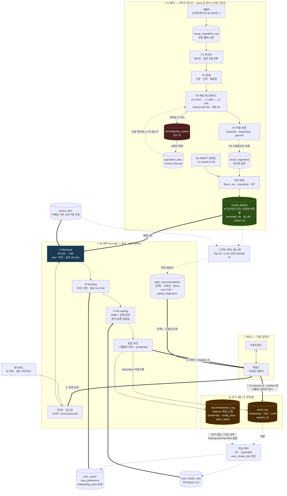
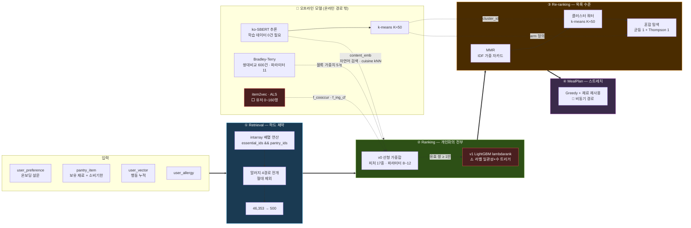

# 냉장고 기반 개인화 레시피 추천 시스템 — 설계 문서

> 작성자: 박재우 · 작성일: 2026-09-03

| 항목 | 내용 |
|---|---|
| 문서 버전 | **v3.1** (2026-09-03 — 🔴 **스키마·계약 개정 반영**: `daily_recommendation`[26] 신설 · `pantry_item.purchased_at` · `user_vector.onboarding_picks` · `session_id` `d-` 접두어 · `p_include_test` 격리 인자 · DB 시간대 `Asia/Seoul` · 탐색 슬롯 실삽입) |
| 이전 | v3.0 (2026-09-02 — 크롤 실측 반영: 요리 유형 축 0건 · 평점/이미지 0건 · `event_log.source` 신설 · 알러지 `severity` 함정 · 로더 멱등 제약 · 3인 병렬) |
| 최초 작성 | 2026-08-26 |
| 프로젝트 성격 | 부트캠프 최종 프로젝트 |
| 팀 규모 | 20명 |
| 기간 | 8주 (2개월) |
| 문서 상태 | ①~⑦ 작성 완료. ⑧(팀 분할)은 3명 체제라 작성하지 않음 — [`04`](04_실행계획.md) 가 대체 |

## v3.1 주요 변경 — 09-02~03 스키마·계약 개정

**이 판은 새 설계가 아니라 `infra/init/` · `app/schemas/` 와 본문 인라인 DDL 의 대조 결과다.**
문서가 조용히 낡은 자리를 실측으로 맞췄다 (`make doc-check`).

| | 내용 |
|---|---|
| **테이블 25 → 29** | `feature_stats` · `recipe_review` · `scoring_config` · **`daily_recommendation`[26]** 이 목록에 없었다 (2-0 · 2-7-1) |
| **`daily_recommendation` 신설** | 🔑 **D-19 — 트랙 1 은 사전 계산으로 만든다.** 실시간이 아니다 (2-7-1 · 5-6-1) |
| **`pantry_item.purchased_at`** | 소비기한 추정 기준일이 `added_at`(앱 등록)이 아니라 **구매일**로 바뀌었다 (2-6 · 5-2-1) |
| **`user_vector.onboarding_picks`·`onboarding_scales`** | `taste_vec` 은 평균이라 **원본이 없으면 시드가 바뀔 때 재계산 불가** (2-5) |
| **`session_id` `d-` 접두어** | `c-`실사용자 · `g-`게스트 · **`d-`개발·디버거·시딩.** 뷰가 `d-` 와 `mock-%` 를 거른다 (3-2) |
| **`p_include_test`** | `feature_version` 이 `test-` 로 시작하면 조회에서 제외 — B·C 의 합성 피처 격리 (2-12 · 5-1) |
| 🔴 **DB 시간대 `Asia/Seoul`** | UTC 면 한국 자정~오전 9시에 `current_date` 가 하루 전이라 `f_expiring` 이 어긋난다 (2-10) |
| **탐색 슬롯 실삽입** | 이전에는 `exploration_slots()` 결과를 **버려서** 탐색 아이템이 점수 순서에 그대로 남았다 (5-3-3) |
| **로더 멱등 제약** | `recipe_ingredient_raw UNIQUE(recipe_id,position)` · `recipe_review UNIQUE NULLS NOT DISTINCT` (2-3 · 2-7-1) |
| **온보딩 계약 신설** | `POST /v1/onboarding/{user_id}` — 엔드포인트 **7 → 8개** (⑦) |
| 검증 건수 재측정 | contract **98** · ddl-test **47** · normalize-test **113** · smoke **13** · smoke-py **19** · log-test **48** |

---

## v2.3 주요 변경 — 그림과 응답시간

| | 내용 |
|---|---|
| **0-5 신설** | **데이터 플로우 다이어그램** — 온라인/오프라인 분리와 검수 되먹임 고리를 한 장에 |
| **5-0-1 신설** | **모델 아키텍처 다이어그램** — 4단계가 각각 다른 종류의 판단을 한다 |
| **5-6-1 신설** | 응답시간 5초 검토 → **기각.** 목표를 늘리지 말고 **경로를 나눈다** |
| 07 E-1-1 신설 | 딥러닝 해금 로드맵 그림 + **유저 수 ≠ 유저당 상호작용** |
| 검증 | `make diagrams` — 실제 mermaid 파서로 렌더 가능 여부 확인 |

> **응답시간 결론:** 현재 ~58ms / 목표 300ms 로 **240ms 가 남는다.**
> 딥러닝 모델은 추론이 빠르고(Two-Tower 1ms 미만), 막힌 것은 **학습 데이터**다.
> 5초가 여는 것은 LLM 재랭킹 하나뿐이고 그건 온라인에 넣지 않는다.

---

## v2.1 주요 변경 — 5-2-6 신설

**"가중치가 많아지면 ML/DL 이 나은가"에 측정으로 답했다.** 그리고 그 과정에서
내 결론이 두 번 뒤집혔다 — 그 기록을 본문에 남겼다.

| | 내용 |
|---|---|
| **5-2-6 신설** | 전환 트리거는 라벨 수가 아니라 **라벨 일관성 × 라벨 수** |
| 🔴 정정 1 | 처음 만든 도메인 변환 3개는 **정답을 알고 만든 것**이었다 |
| 🔴 정정 2 | 처음 GAM 은 구간 6 고정이라 **불리했다** (6→0.792 vs 16→0.854) |
| 🔴 정정 3 | **제안한 변환 3개가 전부 기각됐다** — 이득은 전부 시간 구간더미에서 나왔다 |
| 🔴 발견 | **600쌍으로는 임박소진 블록이 식별되지 않을 수 있다** — ✅ *(v3.1)* **D-18 이 닫음** — 블록별 120쌍 층화 + 임박 시나리오 A/B/C |
| 5-7 수정 필요 | "선형이 상관에 취약"은 NDCG 기준 재현 안 됨 |
| 5-2-4 수정 | "이벤트 3,000건"과 "쌍 15,000"은 같은 축이 아니다 |
| 재현 | `scripts/bench/q3_linear_vs_gam.py` (43초) · `Q3TEMP`·`Q3MODE` 로 민감도 확인 |

---

## v2.6 주요 변경 — 온보딩 확정

| | 결론 |
|---|---|
| ~~**온보딩 선택 3 → 8개**~~ **3개로 확정 (S0 ②)** | 랜덤 오차 63% 개선 (0.213 → 0.348). **근거 없는 숫자 0개** |
| **척도 문항 3축 병행** | 체계 편향을 깨는 **유일한** 수단 — 개수로는 안 준다 |
| 🔴 조리법 보정 **기각** | 배수가 또 근거 없는 숫자. `dish_type` 분류기 선행 필요 |
| 🔴 강도 보정 **기각** | 판별력이 오히려 나빠졌다 (0.747 → 0.867). 주재료로 쏠린다 |
| 음식 형태 | **이미 있다** — `f_dish_type` 가중치만 0.00. 켜면 된다 |
| 식감 | 보류 — 좋은 축이나 **레시피 쪽 짝이 없다**(조리법 의존) |

---

## v2.5 주요 변경 — 2-5-1 신설

**"축을 늘리면, 모델을 키우면 좋아지나"에 네 번 측정으로 답했다.**

| | 결론 |
|---|---|
| 맛 축 6개 | **유지** — 늘리는 것이 아니라 맞추는 것이 이득. 근거 없는 축은 급락시킨다 |
| 맛·나라·카테고리 | 🔴 **합치지 마라** — 가중치가 3개→1개로 줄어 NDCG 0.961→0.528 |
| 코사인 대신 벡터 | ⚠️ 가능하고 코사인의 일반화. **라벨 2,000쌍부터** 이득 |
| 모델 크기 | ⚠️ **라벨 수에 최적점이 있다.** 600쌍인 지금은 오히려 줄이는 게 낫다 |
| ~~🔴 공백~~ | ~~**`flavor_vec` 산출 방법이 설계에 없다**~~ → ✅ **닫힘 (v3.1)** — 재료 기반 규칙 채택 · `seeds/ingredient_flavor.yaml` + `app/services/normalize/p5_flavor.py` (2-5-1 ⑤) |

> 딥러닝이 막힌 이유는 응답시간(5-6-1)도 GPU 도 아니고 **라벨**이다.
> 샘플/파라미터 300~1,000 이 최적인데 DeepFM(20만 모수)은 6,000만 라벨이 필요하다.

---

## 이전 버전 변경 이력

v2.0 이하의 변경 이력은 [`09_CHANGELOG.md`](09_CHANGELOG.md) 로 이관했다.
**헤더에는 최신 1개 버전만 남긴다** — 정정 서사가 본문 앞에 쌓이면 읽는 사람이
머릿속에서 diff 를 수행해야 한다. 폐기된 문장은 본문 그 자리에서 ~~취소선~~ 처리한다.

## 관련 문서

**처음 보는 사람은 [`00_README.md`](../README.md) 부터.** 역할별로 어디를 읽어야 하는지 있다.

| 문서 | 내용 |
|---|---|
| [`02_협의필요_이슈.md`](02_협의필요_이슈.md) | **혼자 결정할 수 없는 것** 24건. 크롤러팀·백엔드팀·DB관리자·전체팀별로 정리 |
| [`03_모델_선정_사유.md`](03_모델_선정_사유.md) | **왜 이 모델을 골랐고 왜 저 모델을 버렸는가.** 모델 6종 정량 비교 · 유저 수별 해금 로드맵 · 발표 QA 대응 |
| [`04_실행계획.md`](04_실행계획.md) | 🔴 **~~2명~~ 3명 · 남은 3주 기준으로 범위를 자른 결과.** 주차별 마일스톤 · 컷라인 · 역할 분담. **충돌 시 이 문서가 우선** |
| [`05_API_명세.md`](05_API_명세.md) | 엔드포인트 **8개** 전체 스펙 *(v3.1 — 온보딩 추가)*. **Mock 실호출 캡처 기반** — `make api-docs` 로 재생성 |
| [`06_인프라_사양.md`](06_인프라_사양.md) | **서버 사양 · 디스크·RAM·GPU 산출**. 행당 크기는 전부 실측. 서버 요청서 템플릿 포함 |
| [`07_평가_및_딥러닝_로드맵.md`](07_평가_및_딥러닝_로드맵.md) | **평가 방법론(D) · 딥러닝 전환 경로(E)** · 🔴 소급 불가 항목 10종 · 하지 않기로 한 것(F) |
| [`../scripts/bench/README.md`](../scripts/bench/README.md) | **판단 근거 시뮬레이션** — 이 문서에 인용된 숫자의 재현 경로 |
| [`../seeds/README.md`](../seeds/README.md) | 시드 데이터 구조 · 갭 · 보강 절차 |
| [`../infra/README.md`](../infra/README.md) | DB 부트스트랩 · 스키마 분리 · 2단 구성 |

> 🔴 **소급 불가 항목**은 두 곳에 있다 — 협의가 필요한 것은 `02` 최상단 요약, 구현으로 해결하는 것은 `07` E-3 (10종·약 8h). **크롤러팀 C-5(reviews)가 가장 시급하다.**
>
> ⚠️ **이 문서는 20명 전제로 쓰였다.** AI 파트 실제 개발 인력은 **3명**이며,
> 무엇을 실제로 만드는지는 [`04_실행계획.md`](04_실행계획.md) 가 정한다.
> 설계는 "어떻게 만드는 것이 옳은가", 실행계획은 "그중 **3명이 남은 3주에** 무엇을 하는가" 다.

## 구현 산출물

설계와 별개로 **실제 만들어진 것**. 문서가 SoT 이고, 아래는 그 구현체다.

| 디렉토리 | 내용 | 규모 | 검증 |
|---|---|---|---|
| [`seeds/`](../seeds/) | 재료 시드 + 소비기한 + 대체 라벨 (산출물 A) | 재료 536 · alias 245 · 단위환산 193 · 소비기한 100 · 대체 100쌍 | ✅ `make validate` |
| [`db/`](../infra/) | DB 부트스트랩 (산출물 B) | DDL **29테이블** · 함수 **6** · 뷰 2 · compose 6서비스 | ✅ **실행 검증** (2-12) |
| [`app/schemas/`](../app/schemas/) | **계약 + Mock 서버** (산출물 D 일부) | 모델 20종+ · 엔드포인트 **8개** *(v3.1 — 온보딩 추가)* | ✅ `make contract` **98건** |
| [`app/services/recommends/`](../app/services/recommends/) | **이유 생성(z-salience) · 혼합 탐색 · interleave** *(v1.9~v2.0)* | 모듈 3종 | ✅ 계약 검증 포함 |
| [`app/services/eval/`](../app/services/eval/) | **캘리브레이션 임계값** (5-7-3) | Wilson 하한 · 필요표본 계산 | ✅ 계약 검증 포함 |
| [`app/services/ingest/`](../app/services/ingest/) | **크롤러 출력 어댑터** | YAML 매핑 · probe 진단 | ✅ `make probe-all` 3종 |
| [`app/services/normalize/`](../app/services/normalize/) | **정규화 P1 · P2 + 구조매칭(p3_head)** (산출물 C 일부) | 코드 4 · fixture 74건 | ✅ `make normalize-test` |
| [`scripts/bench/`](../scripts/bench/) | **판단 근거 시뮬레이션** *(v2.0~v2.1)* | 5종 — 문서 인용 숫자 재현 | ✅ `make bench-quick` |
| [`app/services/normalize/p3_match.py`](../app/services/normalize/p3_match.py) | **P3 매칭 캐스케이드** L0~L2 + 커버리지 *(v2.2)* | 회귀 23건 · 실데이터 mention **82.4%** *(v3.1 재측정)* | ✅ `make normalize-test` · `make coverage` |
| [`app/services/normalize/p4_role.py`](../app/services/normalize/p4_role.py) | **P4 역할 판정** + 주재료 가드 *(v2.4)* | 회귀 16건 · 실데이터 essential 51.9% | ✅ `make normalize-test` |
| `app/services/normalize/` P5 | 수량 환산 | — | ⬜ **다음 단계** |
| `reco/retrieval\|ranking\|rerank/` `dashboard/` | 엔진·대시보드 (산출물 D) | — | ⬜ 미착수 |

```bash
make install TRACK=A|B|C   # 🔴 의존성 설치. 맨손 `uv sync` 금지 — 락에 없는 패키지를 지운다
make bootstrap       # 기동 → 시드 적재 → 검증  (스모크 13/13)
make contract        # API·스테이지 계약 98건
make ddl-test        # 소급 불가 컬럼 왕복 47건
make normalize-test  # P1·P2 74 + P3 23 + P4 16 = 113건
make log-test        # 라이터 종단 48건
make doc-check       # 🔑 문서 수치 ↔ 실제 DB·코드 대조
make probe-all       # 크롤러 어댑터 3종
make validate     # 시드 정합성        (DB 불필요)
make dry-run      # 적재 계획          (DB 불필요)
make smoke        # Retrieval 설계 검증 13건 (smoke-py 19건)
```

> 🔴 **의존성은 `pyproject.toml` + `uv.lock` 하나로 관리한다** *(09-02)*.
> `db/` · `reco/` 에 각각 있던 **트랙별 requirements 파일 2종은 폐지**됐다.
> extras: `api`(fastapi·uvicorn) · `dash`(streamlit) · `obs`(mlflow) ·
> `ml`(numpy·scikit-learn) · `rank-v1`(lightgbm) ·
> `embed`(sentence-transformers) — ⬜ 이번 3주에는 쓰지 않는다.
> **`uv sync` 를 맨손으로 치지 말 것** — 락에 없는 패키지를 지운다
> (실제로 09-02 에 fastapi·numpy 가 사라져 mock 서버가 죽었다).

## 문서 진행 현황

| # | 섹션 | 상태 |
|---|---|---|
| 0 | 프로젝트 범위 · 확정 제약 · 아키텍처 결정 | ✅ 확정 |
| ① | 시스템 아키텍처 | ✅ 확정 (v0.2 개정) |
| ② | 데이터 모델 & 스키마 | ✅ 확정 (**v3.1** — 29테이블 · `daily_recommendation` · `purchased_at` · `onboarding_picks`) |
| ③ | 로그 추적 & 관측성 4층 | ✅ 확정 (**v3.1** — `session_id` `d-` · `source` 착지) |
| ④ | 재료 정규화 파이프라인 | ✅ 확정 (v0.4) |
| ⑤ | 추천 파이프라인 4단계 | ✅ 확정 (**v3.1** — 2트랙 분리 D-19 · 탐색 슬롯 실삽입 · 블록별 120쌍 D-18) · 5-8·5-9 대체안 **미반영** |
| ⑥ | ML 스택 · 학습 전략 · 평가 체계 | ✅ 확정 (v1.8 — 임베딩 용도 5종) · 전환 조건은 **5-2-6 이 대체** |
| ⑦ | API 계약 | ✅ 확정 (**v3.1** — **8개** · 온보딩 신설 · `purchased_at`) — 계약은 [`app/schemas/`](../app/schemas/) |
| ⑧ | ~~20명 팀 분할 & 8주 일정~~ | ❌ **작성 안 함** — ~~2명이면~~ 3명이면 무의미. [`04_실행계획.md`](04_실행계획.md) 가 대체 |
| ⑨ | ~~리스크 & 대응~~ | ❌ **작성 안 함** — [`04_실행계획.md`](04_실행계획.md) 의 컷라인 6개 · 미해결 의존성 6개가 대체 |

---

# 0. 프로젝트 개요

## 0-1. 한 줄 정의

> 사용자가 **보유한 재료(냉장고)** 로 만들 수 있는 레시피 중, **개인 선호(온보딩 설문 + 행동 로그)** 에 맞는 것을 골라 추천하는 **추천 엔진과 그 관측 체계**.

## 0-2. 범위 (Scope) — v0.2에서 명확화

### ✅ In Scope

| 영역 | 내용 |
|---|---|
| **추천 엔진** | Retrieval → Ranking → Re-ranking 파이프라인 (Python) |
| **재료 정규화** | 크롤링 원문 → 정규 재료 매핑 파이프라인 + 검수 도구 |
| **AI 대시보드** | 추천 디버거 · 로그 탐색기 · 검수 큐 · 데이터 품질 (Streamlit) |
| **지표 대시보드** | 추천 품질 · 레이턴시 · 커버리지 시계열 (Grafana) |
| **실험 추적** | 모델 버전별 하이퍼파라미터 · 지표 · 아티팩트 (MLflow) |
| **로그 추적** | 4층 관측성 (파이프라인 trace / 행동 로그 / 실험 / 데이터 품질) |
| **평가 체계** | 오프라인 지표 + ~~규칙 기반 시뮬레이터~~ **쌍대비교 라벨 600쌍**(5-2-5) + 팀 정성 평가 |
| **연구 리포트** | 모델 비교 실험 결과 |

### ❌ Out of Scope

| 영역 | 사유 |
|---|---|
| 유저용 웹/모바일 앱 | 데모 산출물 아님. 로그 유입은 디버거가 대체 |
| Spring Boot 백엔드 | **AI 파트 범위에서** 제외. FastAPI 가 AI 쪽 API 를 낸다 |
| 인증/인가 (JWT, OAuth) | 대시보드 내 유저 선택으로 대체 |
| 클라우드 배포 · CI/CD | 로컬 Docker Compose 단일 환경 |
| 식단 플래닝 (MealPlan) | **스트레치 목표.** ①~③ 안정화 후 착수 |

> ⚠️ **"백엔드 제외"는 우리가 안 만든다는 뜻이지 없다는 뜻이 아니다** *(09-02 명확화)*.
> 팀에 백엔드 담당자가 있고, **AI 파트는 프론트와 직접 말하지 않는다** —
> 백엔드가 유일한 호출자다(기능명세 초안 `COMMON-005` "백엔드에서만 호출").
> 경계와 주고받는 것은 `00` 1절 그림을 본다.
>
> 🔴 그래서 **백엔드에 요구할 것이 하나 있다** — 우리가 응답에 담아 보낸
> `request_id` 와 노출 순위 `position` 을 행동 이벤트에 **되돌려 실어야 한다.**
> 없으면 "3번째로 보여준 그것을 눌렀다"를 복원할 수 없고, 클릭 기록만 남아
> 우리가 위에 올린 것이 인기 있어서 눌린 것처럼 보인다. **학습이 성립하지 않는다.**

## 0-3. 확정 제약

| 제약 | 값 | 설계에 미치는 파장 |
|---|---|---|
| 실유저 규모 | **50명 내외** (팀원 + 직계 지인) | **협업 필터링(CF) 사실상 불가.** 유저 50 × 레시피 46,353 = 밀도 0.001% 미만. MF·NCF·Two-Tower 전부 학습 불가 → 콘텐츠 기반 + 지식 기반 하이브리드로 확정 |
| 서비스 스택 | **Python 단일 (FastAPI)** | 언어 경계가 사라져 팀 간 계약 부담 감소. 대신 모듈 경계를 패키지로 강제해야 함 |
| 대시보드 | **Streamlit + Grafana + MLflow UI** | 3개 도구가 각각 다른 관측 층을 담당. 전부 무료·검증됨 |
| 인프라 | **로컬 · 교내 서버 + Docker Compose** | 클라우드 비용 0. 리소스 제약 → 온라인/오프라인 분리 필수 |
| GPU | **교내 GPU 서버 사용 가능** | 배치 전용. 임베딩 생성·LTR 학습에 활용. **온라인 추론 경로에는 GPU 의존 금지** |
| 레시피 데이터 | 만개의레시피 등 **크롤링 진행 중** | 재료가 **자유 텍스트** → 재료 정규화가 전체 크리티컬 패스 |
| 개인화 데이터 | **없음** | 온보딩 설문 + 콘텐츠 기반으로 Day 1 동작 → 로그 축적 후 하이브리드 전환 |
| 식단 플래닝 | **스트레치 목표** | 독립 레이어로 격리. 실패해도 ①~③은 생존 |
| LLM 사용 | ~~**사용 안 함 (접근 A 순수형)**~~ → **온라인 금지 · 오프라인 한정 허용** *(v2.7~v3.1)* | 🔴 **온라인 경로에는 여전히 없다** — 지연 때문이다(5-6-1). 대신 **트랙 1 새벽 배치**가 `daily_recommendation.reason` 을 LLM 으로 쓰고, 실패하면 템플릿으로 떨어진다(`reason_source`). 재료 정규화는 여전히 사전+규칙+임베딩이며 **LLM 자동 확정은 금지**(4-4-1) |
| 시뮬레이션 유저 | ~~**규칙 기반 시뮬레이터**~~ → **잘렸다** *(v1.9 · 5-2-5 교환 조건)* | 판단 2 의 순환 논리에 가장 가까웠다 — 선호 함수를 우리가 써놓고 그것을 학습한다. **−30h 시뮬레이터 / +14h 쌍대비교**로 바꿨다. `sim_persona` · `is_simulated` 스키마는 남는다 (지표 격리는 여전히 필요하다) |
| 최우선 성공 기준 | **동작하는 추천 엔진 + 그 근거를 보여주는 대시보드** | 그다음 모델 비교 리포트 |

## 0-4. 최종 산출물

1. **추천 API** — FastAPI (`POST /v1/recommend` 외 **8개**, ⑦)
2. **AI 대시보드** — Streamlit 6개 화면
3. **지표 대시보드** — Grafana 3개 보드
4. **실험 추적 서버** — MLflow
5. **배치 파이프라인** — 크롤 → 정규화 → 피처 → 학습 → 평가
   · *(v3.1)* **트랙 1 "오늘의 추천" 배치** — Top-10 + LLM 사유 → `daily_recommendation`
6. **모델 비교 연구 리포트**

---

# 0-5. 핵심 판단 (설계 근거)

## 판단 1 — CF는 쓸 수 없다

유저 50명 규모에서 user-item 상호작용 행렬의 밀도는 0.001% 미만이다. Matrix Factorization, NCF, Two-Tower 등 상호작용 기반 모델은 학습 신호 자체가 존재하지 않는다.

**따라서 이 프로젝트의 추천은 다음 두 축으로 구성된다.**

- **지식 기반(Knowledge-based)**: 재료 보유 여부, 알러지, 식이 제약 → 하드 필터
- **콘텐츠 기반(Content-based)**: 재료·맛·카테고리·조리시간 등 아이템 속성과 유저 프로필의 매칭

CF는 **리포트의 비교 baseline**으로만 학습하며, "데이터 희소 상황에서 CF가 실패함을 정량적으로 보인다"가 리포트의 논지가 된다.

## 판단 2 — Synthetic 데이터의 순환 논리를 경계한다

"시뮬레이터로 상호작용을 생성 → 그 데이터로 랭킹 모델 학습 → 같은 시뮬레이터로 평가"는 **순환 논리**다. 모델은 결국 *시뮬레이터의 선호 함수*를 근사할 뿐이며, 성능이 높게 나오는 것은 당연하다. 이를 실유저 성능의 근거로 리포트에 제시하면 심사에서 즉시 반박된다.

**시뮬레이터의 허용된 용도 (리포트에 명시)**

| 용도 | 설명 |
|---|---|
| 파이프라인 부하·기능 테스트 | 수천 유저 트래픽 시뮬레이션, p95 레이턴시 측정 |
| **평가 하네스 자체의 검증** | 정답을 아는 데이터로 NDCG·Recall 계산 코드의 정확성 확인 |
| 랭킹 가중치 초기값 부트스트랩 | 실유저 로그가 쌓이면 순차 대체 |
| 엣지케이스 커버리지 테스트 | 알러지 유저, 재료 3개뿐인 유저, 빈 냉장고 등 |

> **리포트 원칙**: "synthetic은 학습 신호가 아니라 **하네스 검증용**으로 한정했다"를 명시한다.

## 판단 3 — 숨은 최대 난제는 알고리즘이 아니라 재료 정규화다

냉장고 기반 추천의 성패는 유저가 입력한 `"대파"` 와 레시피의 `"파 1대(흰 부분만)"`, `"쪽파 약간"`, `"대파 1/2대"` 를 같은 것으로 묶을 수 있느냐에 달려 있다. 크롤링 데이터의 재료 표기는 자유 텍스트이므로 여기서 대부분의 시스템이 무너진다.

**개발 인력 다수를 여기에 투입한다.** (④ 섹션에서 상세)

## 판단 4 — 유저 앱이 없으면 로그 유입구가 없다 *(v0.2 신규)*

유저용 앱을 만들지 않기로 하면서 **실유저 행동 로그를 생성할 화면이 사라졌다.** 로그가 없으면 랭킹 모델 학습도, 품질 지표 산출도, 콜드→웜 전환 검증도 불가능하다.

**해결: 대시보드의 "추천 디버거" 화면이 로그 유입구를 겸한다.**

```
[추천 디버거 화면]
  ┌ 유저 선택: [팀원A ▾]   냉장고: [돼지고기][김치][두부] + 재료추가
  ├ 모델 버전: [ranker-v2-lgbm ▾]   부족허용 k: [2 ▾]
  ├ ▶ 추천 실행
  │
  ├─ 결과 Top-20 ─────────────────────────────
  │   1. 김치찌개   점수 0.87  [👍][👎][🍳조리함]  ← 클릭 시 event_log 적재
  │      ▸ 재료매칭 0.32 · 맛일치 0.21 · 인기도 0.18 · 신선도 0.16
  │   2. 두부김치   점수 0.81  [👍][👎][🍳조리함]
  │
  └─ 파이프라인 Trace ────────────────────────
      ① Retrieval  230,412 → 487   34ms
         알러지컷 12 · 부족>k 1,502 · 무교집합 227,999 · staple보정 +39
      ② Ranking    487 → 487       18ms   점수 p50=0.41 max=0.93
      ③ Re-ranking 487 → 20         6ms   다양성탈락 31 · 탐색슬롯 2
```

이 화면 하나가 **세 가지 역할**을 동시에 수행한다.
1. **개발자 도구** — 왜 이 결과가 나왔는지 단계별로 확인
2. **로그 유입구** — 팀원 20명이 평가하면 그것이 곧 실유저 로그
3. **발표 데모** — 추천이 "블랙박스가 아님"을 보여주는 가장 강력한 화면

**우선순위상 대시보드에서 가장 먼저 만들어야 할 화면이다.**

---

# 0-6. 아키텍처 접근안 비교 및 결정

| 안 | 내용 | 장점 | 단점 | 채택 |
|---|---|---|---|---|
| **A. 4-Stage 파이프라인** | Retrieval → Ranking → Re-ranking → Planning. 규칙 + 전통 ML | 산업 표준(YouTube/Netflix 구조). 각 스테이지 독립 모듈 + 명확한 입출력 계약 → **20명 병렬화에 최적**. 재료 제약은 ①에서 하드 필터, 개인화는 ②에서 스코어링으로 분리 | 스테이지 간 계약이 흔들리면 전원 블록 → 1주차 계약 동결로 대응 | ✅ **채택** |
| B. Two-Tower 임베딩 단일 모델 | 유저 타워 / 레시피 타워 → ANN 검색 | 우아함, 확장성 | **학습 데이터 50명으론 불가능.** Synthetic 학습 시 순환 논리 | 리포트 baseline으로만 |
| C. LLM-as-Recommender (RAG) | 벡터 DB + LLM이 추천 및 이유 생성 | 콜드스타트 강함, 설명력 최고, 빠른 구현 | 비용·지연, 재현성 낮음, **20명 일거리가 안 나옴**, ML 기여가 얕아 보임 | 미채택 |

> **결정: A 순수형.** LLM 의존 없이 규칙 + 전통 ML만으로 구성한다.

---

## 0-5. 한눈에 보기 — 데이터 플로우 *(v2.3)*

**이 그림 하나가 시스템 전체다.** 굵은 경계는 **온라인/오프라인 분리**이고,
그것이 설계 1-4 의 절대 원칙이다 — 오프라인은 느려도 되고, 온라인은 300ms 를 지킨다.



### 이 그림에서 읽어야 할 것 ~~4가지~~ 5가지

| # | | |
|---|---|---|
| **1** | **트랙 2(실시간)는 `recipe_feature` 하나만 읽는다** | 배열 3개(`essential_ids`·`all_ids`·`category_ids`)로 조인 없이 끝낸다. 이것이 p95 30.2ms 의 이유다 (2-4) |
| **5** | 🔑 **추천은 두 트랙이다** *(v3.1)* | **트랙 1 "오늘의 추천"은 사전 계산**이다 — 새벽 배치가 `daily_recommendation` 에 LLM 사유까지 써두고 메인화면은 **조회만** 한다(~30ms). 실시간(트랙 2)은 템플릿 사유로 돈다(~58ms). LLM 을 온라인에 넣지 못하는 이유는 지연 하나다 (5-6-1 · D-19) |
| **2** | **검수가 곧 커버리지다** | P3 미매칭 → 검수 큐 → `alias(manual)` → **다음 회차엔 L1 이 잡는다.** 점선 되먹임 고리가 이 프로젝트의 실제 엔진이다 (4-4) |
| **3** | **로그가 학습으로 되먹여진다** | `recommendation_log` 가 **피처 원값**을 남기므로 학습이 그것을 그대로 쓴다 — 온라인/오프라인이 다른 코드로 피처를 두 번 계산하는 skew 가 원천 제거된다 (3-1) |
| **4** | **점선은 전부 배치다** | 실선 = 요청 경로(300ms 예산), 점선 = 배치(시간 제한 없음). **무거운 것은 전부 점선으로 보낸다** (5-6-1) |

---

# ① 시스템 아키텍처

## 1-1. 서비스 구성 (Docker Compose · 컨테이너 6개)

```
┌──────────────────────────────────────────────────────────────┐
│  Streamlit Dashboard  :8501                                  │
│   1. 개요           2. 추천 디버거 ★   3. 로그 탐색기               │
│   4. 재료사전 검수   5. 데이터 품질     6. 실험 비교(MLflow링크)       │
└─────────┬──────────────────────┬───────────────┬─────────────┘
          │ HTTP                 │ link          │ link
┌─────────▼──────────────┐  ┌────▼────────┐  ┌───▼──────────────┐
│ Reco API — FastAPI     │  │ MLflow      │  │ Grafana  :3000   │
│  :8000                 │  │  :5000      │  │ (PG 데이터소스)     │
│                        │  │             │  │  · 추천 품질        │
│  reco/                 │  │ 실험·모델·    │  │  · 레이턴시         │
│   ├ retrieval/   ①     │  │ 아티팩트      │  │  · 데이터 품질      │
│   ├ ranking/     ②     │  │ 추적         │  └───┬──────────────┘
│   ├ rerank/      ③     │  └──────┬──────┘      │
│   ├ mealplan/    ④(S)  │         │             │
│   ├ features/          │         │             │
│   ├ tracing/    ← 핵심  │         │             │
│   └ api/               │         │             │
└─────────┬──────────────┘         │             │
          │                        │             │
┌─────────▼────────────────────────▼─────────────▼─────────────┐
│  PostgreSQL 16   :5432                                        │
│   확장: pgvector · intarray · pg_trgm · ltree                  │
│   DB:  recodb (앱)  │  mlflowdb (MLflow 백엔드)                 │
└───────────────────────────────────────────────────────────────┘
┌───────────────────────────────────────────────────────────────┐
│  Redis 7  :6379    피처 캐시 / 추천 결과 캐시 / trace 버퍼           │
└───────────────────────────────────────────────────────────────┘
┌───────────────────────────────────────────────────────────────┐
│  Batch (Python · cron 컨테이너)                                 │
│   crawl → clean → normalize → feature → train → evaluate      │
│   결과: PG 적재 + MLflow 기록 + /artifacts 볼륨                   │
└───────────────────────────────────────────────────────────────┘
```

★ = 최우선 구현 대상, (S) = 스트레치

## 1-2. Python 단일 서비스로 간 이유

v0.1의 Spring + Python 2서비스 구조는 **언어 경계를 팀 경계로 삼아 병렬화**하려는 장치였다. 유저 앱과 백엔드가 범위에서 빠지면서 그 필요가 사라졌고, 남은 것은 폴리글랏 운영 비용뿐이다.

| | v0.1 (2서비스) | v0.2 (단일) |
|---|---|---|
| 컨테이너 | 8개 | 6개 |
| 팀 간 계약 | REST 계약 + DTO 이중 정의 | 없음 (같은 언어) |
| 배포 | 2개 독립 배포 | 1개 |
| 디버깅 | 서비스 경계 넘는 추적 필요 | 단일 프로세스 trace |

**대신 잃은 것을 보완해야 한다.** 언어가 경계를 강제해주지 않으므로, **패키지 경계와 인터페이스를 규율로 강제**한다.

```
reco/
├── retrieval/     # ① 입력: RetrievalRequest  → 출력: List[Candidate]
│   ├── __init__.py     ← 외부는 여기 노출 함수만 호출
│   └── strategies/
├── ranking/       # ② 입력: List[Candidate]   → 출력: List[ScoredCandidate]
├── rerank/        # ③ 입력: List[ScoredCandidate] → 출력: List[RankedItem]
├── mealplan/      # ④ (스트레치)
├── features/      # 피처 조회 (Redis/PG) — 상위 스테이지가 공유
├── tracing/       # 파이프라인 trace 수집 (③ 섹션)
├── schemas/       # Pydantic 모델. 스테이지 간 계약의 유일한 정의처
└── api/           # FastAPI 라우터. 로직 없음, 오케스트레이션만
```

**규율 3가지**
1. 스테이지는 **`schemas/` 의 Pydantic 모델로만** 대화한다. dict 전달 금지
2. 스테이지 간 **직접 import 금지**. `api/` 가 순서대로 호출한다
3. 각 스테이지는 **DB 접근을 `features/` 에 위임**한다. 스테이지가 SQL을 직접 쓰지 않는다

이 3가지가 지켜지면 스테이지별로 담당자를 나눠도 서로 충돌하지 않고, 단위 테스트도 스테이지 단위로 가능하다.

## 1-3. 대시보드를 3개 도구로 나눈 이유

하나로 다 하려 하면 어느 하나도 제대로 안 된다. **관측 층이 다르면 도구도 다르다.**

| 도구 | 담당 층 | 왜 이것인가 | 구현 비용 |
|---|---|---|---|
| **Streamlit** | 인터랙티브 도구 | 추천 디버거·검수 큐처럼 **입력받아 처리하고 쓰기까지** 하는 화면. Grafana로는 불가능 | 화면당 100~300줄 |
| **Grafana** | 시계열 지표 | PostgreSQL을 데이터소스로 직접 연결. 쿼리만 쓰면 차트·알림·기간비교가 공짜 | 보드당 SQL 5~10개 |
| **MLflow UI** | 실험 비교 | 모델 버전별 파라미터·지표·아티팩트 비교가 기본 제공. **모델 비교 리포트의 근거 자료가 그대로 나옴** | 라이브러리 호출 몇 줄 |

> **Prometheus는 쓰지 않는다.** 레이턴시·처리량은 `recommendation_log.latency_ms` 에 이미 적재되므로 Grafana가 PostgreSQL을 직접 쿼리하면 된다. Prometheus + exporter를 붙이면 컨테이너 2개와 설정 부담만 늘고 얻는 것이 없다.

## 1-4. 온라인 / 오프라인 분리 — 절대 원칙

```
[온라인 경로]  목표 p95 < 300ms
요청 → FastAPI → Redis 피처 조회 + PG 역색인 조회 → 스코어링 → 응답
  ✅ 허용: 인덱스 조회, 사전 계산된 벡터 내적, 가중합, 로드된 모델의 predict
  ❌ 금지: 임베딩 추론, 전체 스캔, 조인 3개 이상, 모델 재학습, GPU 의존

[오프라인 경로]  야간 배치 (또는 수동 트리거)
크롤링 → 정제 → 재료정규화 → 임베딩 생성 → 피처 빌드 → 모델 학습 → 평가
  → PG / Redis / /artifacts 볼륨 적재 + MLflow 기록
```

**규칙: 무거운 건 전부 배치로 밀어낸다.** 레시피 임베딩 46,353건을 온라인에서 만들면 끝장이지만, 배치에서 GPU로 미리 만들어 pgvector에 넣어두면 온라인은 조회만 한다. 교내 GPU 서버는 **배치 전용**이며, 온라인 경로가 GPU에 의존하면 GPU 서버가 내려갔을 때 서비스 전체가 죽는다.

## 1-5. 데이터 정합성 경계

- **Source of Truth = PostgreSQL** (레시피, 재료, 유저, 팬트리, 로그 전부)
- **Redis는 순수 캐시** — 날아가도 배치 재실행으로 복구 가능해야 한다. Redis에만 존재하는 데이터를 만들지 않는다
- **MLflow는 실험 메타데이터 전용** — 서빙 경로가 MLflow를 조회하지 않는다. 모델 파일은 `/artifacts` 볼륨에서 로드
- **모델 아티팩트는 버전 디렉토리**로 관리 (`/artifacts/ranker/v3/model.pkl`) → 롤백이 심볼릭 링크 교체 한 번

## 1-6. docker-compose 서비스 목록

**필요한 것만 단계적으로 올린다.** 디스크를 아끼는 것보다 *지금 검증할 수 있는 범위를
좁게 유지*하는 것이 목적이다. 미검증 코드가 누적되면 첫 실행에서 오류가 한꺼번에 터져
원인 분리가 어려워진다.

| 단계 | 명령 | 서비스 | 이미지 | 포트 | 크기 | 시점 |
|---|---|---|---|---|---|---|
| **1** | `make up` | `postgres` | `pgvector/pgvector:pg16` | 5432 | 400MB | **지금** |
| **1** | `make up` | `redis` | `redis:7-alpine` | 6379 | 40MB | **지금** |
| 2 | `make up-obs` | `grafana` | `grafana/grafana-oss:11.3.0` | 3000 | 400MB | 대시보드 트랙 |
| 2 | `make up-obs` | `mlflow` | 자체 빌드 (+psycopg2) | 5000 | 1GB | **선택** — 아래 참조 |
| 3 | `make up-all` | `reco-api` | 자체 빌드 | 8000 | — | 산출물 D 이후 |
| 3 | `make up-all` | `dashboard` | 자체 빌드 | 8501 | — | 산출물 D 이후 |
| — | (cron) | `batch` | 자체 빌드 | — | — | 배치 착수 시 |

**1단계만으로 스키마 · 시드 · Retrieval · 성능이 전부 검증된다.**

> 📐 **서버 사양 · 디스크 · RAM 산출은 [`06_인프라_사양.md`](06_인프라_사양.md) 참조.**
> 행당 크기가 전부 실측이며 서버 요청서 템플릿도 있다.
> 요약: **4 core · 16 GB · 50 GB · VRAM 4GB(선택, 배치 전용)**.

### PostgreSQL 은 컨테이너가 사실상 필수다

`pgvector` 는 C 확장이라 PostgreSQL 버전에 맞춰 컴파일되어야 한다. 네이티브 설치는
20명이 각자 다른 OS 에서 다른 방법으로 해야 하고 버전 매칭이 자주 깨진다.
`pgvector/pgvector:pg16` 이미지에 `vector` 는 컴파일 완료 상태로,
`intarray`·`pg_trgm`·`ltree` 는 contrib 로 포함되어 있다.

**진짜 이득은 설치 편의가 아니라 20명 환경 통일이다.**

### MLflow 는 컨테이너가 필요 없다

순수 Python 패키지이고 **서버가 상태를 갖지 않는다.** 상태는 전부 백엔드 DB(`mlflowdb`)와
artifact 경로에 있으므로, 각자 로컬에서 `mlflow ui` 를 띄워도 같은 실험 데이터를 본다.
컨테이너의 가치는 "항상 켜져 있는 공용 UI 주소" 하나뿐이다.

```bash
make mlflow-ui     # `make install TRACK=C` 가 obs extra 로 깐다
```

> 🔴 **`backend-store-uri` 는 반드시 `mlflowdb` 다.** MLflow 는 백엔드 DB 에 자기 테이블
> 15개쯤을 자동 생성하는데, 우리 접속은 `search_path = reco, public` 이므로 `recodb` 로
> 붙이면 **MLflow 테이블이 `reco` 스키마에 쏟아진다.** `00_databases.sql` 이 `mlflowdb` 를
> 따로 만드는 이유가 이것이다.

## 1-7. DB 배치 전략 — 공유 DB · 2단 구성 *(v0.7 신규)*

DB 는 애플리케이션에서 분리해 **별도 서버로 운영**한다. DB 관리자가 AI 파트에 있으므로
운영 통제권도 우리에게 있다.

### 결정 1 — 백엔드팀과 **DB 인스턴스를 공유하되 스키마로 나눈다**

```
recodb
├── reco     ← AI 파트 29테이블 + 함수 6 + 뷰 2
├── app      ← 백엔드팀
└── public   ← 확장만 (vector · intarray · pg_trgm · ltree)
```

인스턴스를 나누지 않는 이유는 두 가지다. 교내 서버 리소스를 두 배로 쓸 이유가 없고,
**백엔드팀 유저 테이블과의 조인이 필요해지면 인스턴스가 다를 때 아예 불가능**하다.

`recipe` · `app_user` · `event_log` 는 극히 일반적인 이름이라 `public` 에 두면 충돌이
확실하다. 나중에 옮기면 29테이블 + 모든 쿼리 + 함수 + 뷰 + 적재 스크립트를 전부 고쳐야
하므로, **소급 비용이 큰 항목으로 분류해 지금 적용했다.**

> ⚠️ **확장은 반드시 `public` 한 곳에만 설치한다.** 스키마마다 따로 설치하면
> `vector`·`ltree` 타입이 스키마별로 달라져 조인·비교가 실패한다.

`search_path` 는 네 겹으로 보장한다 — SQL 파일 상단 · 함수 정의 · 역할 기본값 · 접속 직후.
공유 DB 에서 `ALTER DATABASE ... SET search_path` 는 **쓰지 않는다.** 다른 팀에 영향을 준다.

### 결정 2 — **로컬 개발 DB 를 유지한다 (2단 구성)**

|  | 로컬 (compose) | 공용 원격 |
|---|---|---|
| 용도 | 개발 · 실험 · 스키마 변경 | **SoT** — 크롤링 데이터 · 실유저 로그 · 검수 큐 |
| 배치 실행 | 자유 | `reco_batch` 계정으로만 |
| 스키마 변경 | 자유 (`make down-v`) | DB 관리자 승인 |
| 전환 | — | `.env` 의 `DATABASE_URL` 한 줄 |

**로컬 DB 를 없애면 안 되는 이유는 TRUNCATE 다.** 정규화 재실행이 `recipe_ingredient`
TRUNCATE 기반이므로(4-1), 20명이 공용 DB 하나를 쓰면 누군가 재정규화를 돌리는 순간
**전원이 멈춘다.** 가능성이 아니라 확실히 일어난다.

### 결정 3 — 역할 3종으로 권한을 나눈다

| 역할 | 권한 | 사용처 |
|---|---|---|
| `reco_app` | SELECT · INSERT · UPDATE · DELETE | FastAPI |
| `reco_batch` | + **TRUNCATE** · CREATE | 배치 |
| `reco_ro` | **SELECT 만** | Grafana |

**`reco_app` 에 TRUNCATE 를 주지 않는 것이 핵심이다.** 앱 계정에 권한이 있으면 버그
하나로 크롤링 데이터 전체가 날아간다. Grafana 도 `reco_ro` 로 붙는다 — 대시보드가
쓰기 권한을 들고 있으면 언젠가 사고가 난다.

### 결정 4 — 원격 DB 초기화는 명시적 스크립트로만

`/docker-entrypoint-initdb.d` 자동 실행은 **컨테이너가 볼륨을 처음 만들 때만** 동작한다.
원격 DB 에는 그 메커니즘이 아예 없다.

```bash
./infra/apply_schema.sh "postgresql://user:pw@db.example.ac.kr:5432/recodb"
```

로컬 `psql` 없이 일회용 컨테이너로 실행한다. `05_roles.sql` 은 제외한다 — 원격 역할과
비밀번호는 DB 관리자가 만든다.

### 성능 목표 재검토 — 왕복 횟수가 곱해진다

유닉스 소켓 → 네트워크 TCP 로 바뀌면 쿼리마다 RTT 가 붙는다. 교내망 0.5~2ms 수준이면
p95 300ms 목표에 여유가 있지만, **왕복 횟수만큼 곱해진다는 점이 본질이다.**

현재 구조는 `retrieve_for_user()` 하나로 감싸 **1왕복**이라 안전하다.
**원격 DB 에서는 "함수로 감싸 1왕복" 원칙(2-12)이 로컬일 때보다 훨씬 중요해진다.**
애플리케이션에서 스테이지마다 DB 를 따로 조회하도록 만들면 그 순간 목표가 깨진다.

### 지금 적용 vs 나중 — 판단 근거

| 항목 | 시점 | 근거 |
|---|---|---|
| 스키마 네임스페이스 | **지금** | 나중엔 29테이블 + 전 코드 수정. 지금은 헤더 한 줄 |
| 초기화 경로 (`apply_schema.sh`) | **지금** | 원격엔 자동 실행 메커니즘이 없다. 구조가 바뀐다 |
| 역할·권한 정의 | **지금** | 공유 DB 에서 Grafana 쓰기 권한은 사고 대기 상태 |
| `DATABASE_URL` 값 | 나중 | 이미 환경변수. 소급 비용 0 |
| compose 의 postgres 제거 | **하지 않음** | 2단 구성의 로컬 절반이다 |
| 커넥션 풀 튜닝 | 나중 | 실측 후 |

---

# ② 데이터 모델 & 스키마

## 2-0. 테이블 전체 목록 (29개) *(v3.1 — 4개 누락분 보강)*

검토 편의를 위해 전체 테이블을 먼저 나열한다. **쓰기 주체**가 서로 다른 테이블을 한 팀이 동시에 건드리지 않도록 하는 것이 20명 협업의 핵심이다.

| # | 테이블 | 그룹 | 목적 | 예상 행수 | 쓰기 주체 | 온라인 읽기 |
|---|---|---|---|---|---|---|
| 1 | `ingredient_category` | 재료 | 재료 계층 (채소>파류) | ~200 | 사람(초기) | 알러지 전개 |
| 2 | `ingredient` | 재료 | 정규 재료 사전 | 3~5천 | 배치+사람 | ✅ |
| 3 | `ingredient_alias` | 재료 | 표기 변형 사전 | 2만+ | 배치+사람 | 입력 파싱 |
| 4 | `ingredient_substitute` | 재료 | 대체 재료 관계 | ~5천 | 사람 | 대체 제안 |
| 5 | `recipe` | 레시피 | 레시피 본문 | 20~30만 | 크롤러 | 결과 조립 |
| 6 | `recipe_ingredient_raw` | 레시피 | **크롤링 원문 (불변)** | 300만+ | 크롤러 | ❌ |
| 7 | `recipe_ingredient` | 레시피 | 정규화 결과 | 300만+ | 배치 | ❌ (분석용) |
| 8 | `recipe_step` | 레시피 | 조리 단계 | 200만+ | 크롤러 | 상세 조회 |
| 9 | `recipe_feature` | 레시피 | **온라인 서빙 전용 비정규화** | 20~30만 | 배치 | ✅✅ 핵심 |
| 10 | `app_user` | 유저 | 계정 (실유저 + 시뮬) | ~5천 | 대시보드 | ✅ |
| 11 | `sim_persona` | 유저 | 규칙 기반 시뮬 페르소나 정의 | ~100 | 사람 | ❌ |
| 12 | `user_preference` | 유저 | 온보딩 설문 결과 | = 유저수 | 대시보드 | ✅ |
| 13 | `user_ingredient_pref` | 유저 | 재료별 선호도 | ~50만 | 대시보드+배치 | ✅ |
| 14 | `user_allergy` | 유저 | **알러지 (절대 제약)** | ~1천 | 대시보드 | ✅ |
| 15 | `user_vector` | 유저 | 배치 계산 유저 벡터 | = 유저수 | 배치 | ✅ |
| 16 | `pantry_item` | 냉장고 | 보유 재료 인벤토리 | ~5만 | 대시보드 | ✅✅ |
| 17 | `event_log` | 로그 | 유저 행동 로그 | 무제한 증가 | API | ❌ |
| 18 | `recommendation_log` | 로그 | **추천 요청 trace (재현성)** | 무제한 증가 | API | ❌ |
| 19 | `data_quality_snapshot` | 로그 | 데이터 품질 시계열 | ~1천 | 배치 | ❌ |
| 20 | `batch_run` | 로그 | 배치 실행 이력 | ~5천 | 배치 | ❌ |
| 21 | `normalization_queue` | 운영 | 재료 검수 작업 큐 | 5~10만 | 배치+사람 | ❌ |
| 22 | `normalization_audit` | 운영 | 검수 이력 (되돌리기) | ~10만 | 사람 | ❌ |
| 23 | `cuisine_taxonomy` | 레시피 | 요리 계열 분류 사전 *(v0.3 신규)* | ~16 | 사람 | 표시·필터 |
| 24 | `ingredient_unit_weight` | 재료 | 재료별 개수단위 → g 환산표 *(v0.4 신규)* | ~2천 | 사람 | 수량 판정 |
| 25 | `user_cluster_stat` | 유저 | 클러스터별 노출·반응 — Thompson 탐색의 사후분포 *(v2.0 신규)* | ~5천 | 배치 | ✅ (탐색 슬롯) |
| 26 | `scoring_config` | 로그 | **점수 설정 레지스트리** — `config_hash` 를 되돌리는 유일한 경로 *(v2.9)* | ~100 | 사람 | ❌ |
| 27 | `feature_stats` | 로그 | **피처 파생 통계** — `f_taste` 중심화의 μ. `stats_version` 으로 복원 *(v2.8)* | ~100 | 배치 | ✅ (μ 조회) |
| 28 | `recipe_review` | 레시피 | **크롤 후기** — 인기도(`review_count`)와 item-item CF 의 유일한 실상호작용 *(v3.0)* | **624,422** | 크롤러 | ❌ |
| 29 | `daily_recommendation` | 추천 | 🔑 **트랙 1 "오늘의 추천" 사전 계산** — 메인화면이 조회만 한다 *(v3.1 신규 · D-19)* | 유저수 × 20 | 배치 | ✅✅ |

> **읽어야 할 신호**: 온라인 읽기 경로에 있는 테이블은 10개뿐이다. 나머지 19개는 배치·분석·운영용이다. **온라인 경로를 좁게 유지하는 것이 p95 300ms를 지키는 유일한 방법**이며, 새 테이블을 온라인 경로에 추가하려면 그때마다 명시적 검토가 필요하다.
>
> 🔴 *(v3.1)* **26~29 는 이미 `infra/init/02_schema.sql` 에 있는데 이 목록에만 없었다.**
> 목록이 낡으면 새로 합류한 사람이 "없는 줄 알고 다시 만든다." 상세 DDL 은 2-7-1.

---

## 2-1. 스키마 형태를 지배하는 4가지 결정

### 결정 1 — 재료는 3층 구조로 관리한다

```
raw_mention  "대파 1대(흰 부분만)"          ← 크롤링 원문, 절대 수정 안 함
    ↓ 파싱 + 매칭
alias        "대파" / "파" / "쪽파" / "왕파"  ← 표기 변형 사전
    ↓ 정규화
ingredient   {id: 1042, name: "대파"}       ← 정규 재료 (canonical)
    ↓ 계층
category     대파 ⊂ 파류 ⊂ 채소 ⊂ 농산물
```

원문을 보존하는 이유: 정규화 규칙은 8주 내내 계속 바뀐다. 원문이 있으면 **언제든 전체 재정규화**가 가능하지만, 덮어썼으면 크롤링을 다시 해야 한다.

### 결정 2 — 조미료(staple)를 분리하지 않으면 서비스가 죽는다

가장 흔하고 치명적인 함정. `is_staple = true` 인 재료(소금·설탕·간장·식용유·후추·다진마늘·참기름 등 39종)를 **"모든 유저가 항상 보유"로 가정**하지 않으면, 냉장고에 간장을 등록하지 않은 유저에게 **한식 레시피의 95%가 "재료 부족"으로 걸러진다.** 이는 알고리즘 문제가 아니라 데이터 모델링 문제다.

### 결정 3 — 온라인 쿼리는 배열 1개로 끝낸다

46,353 레시피에 조인을 걸면 300ms를 지킬 수 없다. 레시피의 재료 집합을 **`INTEGER[]` 배열로 비정규화**하여 `recipe_feature` 에 넣고, PostgreSQL `intarray` + GIN 인덱스로 집합 연산한다. 정규화 테이블(`recipe_ingredient`)은 배치·분석용으로 유지하고 **온라인은 배열만 본다.**

### 결정 4 — 로그 테이블은 처음부터 완성형으로 만든다 *(v0.2 신규)*

로그 스키마는 **소급이 불가능한 거의 유일한 영역**이다. 3주 뒤에 `position` 컬럼이 필요하다는 걸 깨달아도 지난 3주치 데이터에는 채울 방법이 없다. 따라서 ③ 섹션의 4층 관측 설계를 **1주차에 전부 확정**하고, 실제로 쓰이지 않더라도 컬럼을 미리 만든다. 빈 컬럼의 비용은 0이지만 없는 컬럼의 비용은 프로젝트 3주다.

---

## 2-2. 재료 온톨로지 (프로젝트의 심장)

```sql
-- ─────────────────────────────────────────────────────────
-- [1] ingredient_category : 재료 계층
--     쓰기: 사람(초기 1회) │ 규모: ~200 │ 온라인: 알러지 전개 시
-- ─────────────────────────────────────────────────────────
CREATE TABLE ingredient_category (
    id          SERIAL PRIMARY KEY,
    name        VARCHAR(64)  NOT NULL,
    parent_id   INT          REFERENCES ingredient_category(id),
    depth       SMALLINT     NOT NULL,   -- 0=루트
    path        LTREE        NOT NULL    -- '농산물.채소.파류' ← 조상/자손 질의 O(1)
);
CREATE INDEX idx_cat_path ON ingredient_category USING GIST (path);
```

`LTREE` 가 **알러지 처리의 핵심**이다. "견과류 알러지"를 등록하면 `path <@ '농산물.견과류'` 로 아몬드·호두·캐슈넛·잣을 **한 번의 쿼리로 전개**한다. 알러지는 오탐이 곧 사고이므로 자식 노드 누락이 있어서는 안 된다. `parent_id` 만으로 재귀 CTE를 돌리면 매 요청마다 재귀 비용이 발생하므로 `path` 를 함께 둔다.

```sql
-- ─────────────────────────────────────────────────────────
-- [2] ingredient : 정규 재료 사전 — 모든 조인의 중심
--     쓰기: 배치(신규후보) + 사람(검수) │ 규모: 3~5천 │ 온라인: ✅
-- ─────────────────────────────────────────────────────────
CREATE TABLE ingredient (
    id              SERIAL       PRIMARY KEY,
    name            VARCHAR(64)  NOT NULL UNIQUE,      -- '대파'
    category_id     INT          REFERENCES ingredient_category(id),

    is_staple       BOOLEAN      NOT NULL DEFAULT FALSE, -- ★결정2. 항상 보유 가정
    is_seasoning    BOOLEAN      NOT NULL DEFAULT FALSE, -- 양념류(맛 프로파일 계산 시 제외)
    allergen_group  VARCHAR(32),                         -- CHECK 10종: 'nut'|'sesame'|'soy'|'gluten'|'egg'
                                                         --   |'dairy'|'fish'|'shellfish'|'peach'|'buckwheat'

    embedding       vector(768),                         -- 배치 계산 (ko-SBERT)
    freq_count      INT          NOT NULL DEFAULT 0,     -- 코퍼스 등장 빈도 → 검수 우선순위
    -- 🔑 기본 소비기한(일). f_expiring 을 유저 입력 없이 동작시킨다 (v1.9)
    --    seeds/ingredient_shelf_life.yaml — 카테고리 58 + 재료 예외 42, 536종 전량 해소
    --    ⚠️ 통념 기반이지 실측이 아니다
    shelf_life_days INT,
    storage_default VARCHAR(8)   CHECK (storage_default IN ('fridge','pantry','freezer')),
    nutrition_100g  JSONB,                               -- 식약처 DB 연동 시 (선택)

    verified_by     VARCHAR(64),                         -- 검수자 (누가 승인했나)
    verified_at     TIMESTAMPTZ,
    created_at      TIMESTAMPTZ  NOT NULL DEFAULT now()
);
CREATE INDEX idx_ing_freq     ON ingredient (freq_count DESC);
CREATE INDEX idx_ing_category ON ingredient (category_id);
CREATE INDEX idx_ing_staple   ON ingredient (is_staple) WHERE is_staple;  -- 부분 인덱스
```

| 컬럼 | 설계 의도 |
|---|---|
| `is_staple` | 결정 2. 이 39개를 모든 유저의 팬트리에 자동 합산한다 |
| `is_seasoning` | 맛 프로파일 계산에서 제외. 고춧가루가 들어갔다고 "매운 요리"는 아니다(양이 관건) |
| `allergen_group` | `category` 계층과 **중복 설계**. 계층이 잘못 잡혀도 알러지는 이 컬럼으로 걸러진다. 안전 관련은 이중화한다 |
| `freq_count` | 지프 법칙 대응. 검수 우선순위 결정의 유일한 근거 |
| `verified_by/at` | 20명이 검수하므로 책임 추적이 필요하다 |

```sql
-- ─────────────────────────────────────────────────────────
-- [3] ingredient_alias : 표기 변형 사전 — 정규화 성능을 좌우
--     쓰기: 배치(자동생성) + 사람(검수) │ 규모: 2만+ │ 온라인: 유저 입력 파싱
-- ─────────────────────────────────────────────────────────
CREATE TABLE ingredient_alias (
    id              SERIAL       PRIMARY KEY,
    alias           VARCHAR(96)  NOT NULL,          -- '왕파', '파(대파)', '대파흰부분'
    ingredient_id   INT          NOT NULL REFERENCES ingredient(id) ON DELETE CASCADE,
    source          VARCHAR(16)  NOT NULL,          -- 'seed'|'rule'|'manual'|'embedding'
    confidence      REAL         NOT NULL DEFAULT 1.0,
    created_at      TIMESTAMPTZ  NOT NULL DEFAULT now(),
    UNIQUE (alias, ingredient_id)
);
CREATE INDEX idx_alias_trgm ON ingredient_alias USING GIN (alias gin_trgm_ops); -- 오타 대응
CREATE INDEX idx_alias_ing  ON ingredient_alias (ingredient_id);
```

`source` 를 남기는 이유: 자동 생성 alias의 품질이 나쁘다고 판명되면 `WHERE source='embedding' AND confidence < 0.8` 으로 **일괄 철회**할 수 있다. 어디서 왔는지 모르는 사전은 정리할 수 없다.

`pg_trgm` GIN 인덱스는 `"대파" ↔ "대 파"`, `"애호박" ↔ "얘호박"` 같은 오타·띄어쓰기 변형을 유사도로 잡아낸다. 유저가 냉장고에 재료를 입력할 때 자동완성의 백엔드가 된다.

```sql
-- ─────────────────────────────────────────────────────────
-- [4] ingredient_substitute : 대체 재료 (방향성 있음)
--     쓰기: 사람 │ 규모: ~5천 │ 온라인: '조금만 사면 가능' 제안
-- ─────────────────────────────────────────────────────────
CREATE TABLE ingredient_substitute (
    from_id     INT   NOT NULL REFERENCES ingredient(id),
    to_id       INT   NOT NULL REFERENCES ingredient(id),
    score       REAL  NOT NULL,          -- 0~1 대체 적합도
    reason      VARCHAR(32),             -- 'same_role'|'same_category'|'nutrition'
    PRIMARY KEY (from_id, to_id),
    CHECK (from_id <> to_id)
);
```

**방향성이 있다는 점이 중요하다.** "설탕 대신 올리고당"은 대부분 성립하지만 "올리고당 대신 설탕"은 요리에 따라 실패한다. 양방향 대칭 테이블로 만들면 이 비대칭을 표현할 수 없다.

---

## 2-3. 레시피 도메인

```sql
-- ─────────────────────────────────────────────────────────
-- [5] recipe : 레시피 본문
--     쓰기: 크롤러 │ 규모: 20~30만 │ 온라인: 최종 결과 조립 시
-- ─────────────────────────────────────────────────────────
CREATE TABLE recipe (
    id              BIGSERIAL    PRIMARY KEY,
    source          VARCHAR(32)  NOT NULL,      -- 'mangae'|'foodcom'|...
    source_id       VARCHAR(64)  NOT NULL,
    url             TEXT,

    title           VARCHAR(255) NOT NULL,
    description     TEXT,
    image_url       TEXT,

    servings        SMALLINT,
    cook_minutes    SMALLINT,                   -- ★파싱 실패 시 NULL. 0으로 채우지 말 것
    difficulty      SMALLINT,                   -- 1~5
    -- ── 분류 축 (v0.3: 단일 category 문자열에서 다축으로 분리) ──
    dish_type       VARCHAR(24),                -- '국/탕'|'메인반찬'|'면/만두'   ← 원본 종류별
    situation       VARCHAR(24)[],              -- ['술안주','다이어트']          ← 원본 상황별
    main_ing_cat    VARCHAR(24),                -- '돼지고기'|'해물류'            ← 원본 재료별
    method          VARCHAR(24),                -- '볶음'|'끓이기'|'굽기'         ← 원본 방법별
    cuisine_family  VARCHAR(16),                -- ★파생·거친 축. NULL 허용
    cuisine         VARCHAR(24)                 -- ★파생·세분 축. NULL 허용
                    REFERENCES cuisine_taxonomy(code),
    cuisine_conf    REAL,                       -- 분류 신뢰도 0~1

    view_count      INT          NOT NULL DEFAULT 0,
    rating_avg      REAL,                       -- 🔴 실크롤 46,353건 전수 **0건** (v3.0)
    rating_count    INT          NOT NULL DEFAULT 0,
    -- 🔑 인기도 프록시. `view_count`·`rating_avg` 가 실제로 오지 않아
    --    `popularity_score` 의 **유일한 입력**이 됐다 (02 C-5 · D-9)
    review_count    INT          NOT NULL DEFAULT 0,

    raw_json        JSONB        NOT NULL,      -- 크롤링 원본 통째 보존
    status          VARCHAR(16)  NOT NULL DEFAULT 'raw',
                                 -- raw → normalized → published │ rejected
    reject_reason   VARCHAR(64),                -- 'no_ingredient'|'low_coverage'|'duplicate'
    crawled_at      TIMESTAMPTZ  NOT NULL,
    UNIQUE (source, source_id)
);
CREATE INDEX idx_recipe_status ON recipe (status);
```

> ⚠️ **`cook_minutes` 를 0으로 채우지 말 것.** 파싱 실패와 "1분 요리"는 완전히 다르다. NULL로 두면 "이 레시피는 조리시간 필터에서 제외"라는 처리가 가능하지만, 0으로 채우면 **모든 파싱 실패 레시피가 "가장 빠른 요리"로 최상위에 올라온다.** 랭킹이 조용히 망가지는 대표적 경로다.

`status` 생명주기가 파이프라인의 진행도를 나타낸다. `published` 인 것만 추천 대상이며, `recipe_feature` 에 적재되는 것도 `published` 뿐이다.

```sql
-- ─────────────────────────────────────────────────────────
-- [6] recipe_ingredient_raw : 크롤링 원문 (★불변, 절대 UPDATE 금지)
--     쓰기: 크롤러 │ 규모: 300만+ │ 온라인: ❌
-- ─────────────────────────────────────────────────────────
-- 🔴 UNIQUE (recipe_id, position) 이 없으면 `ON CONFLICT DO NOTHING` 이
--    아무것도 하지 않아 로더를 두 번 돌릴 때마다 전량이 배로 늘어난다.
--    실측(09-02): 2회 실행으로 451,862 → 903,724 행. 에러도 안 났다.
CREATE TABLE recipe_ingredient_raw (
    id          BIGSERIAL    PRIMARY KEY,
    recipe_id   BIGINT       NOT NULL REFERENCES recipe(id) ON DELETE CASCADE,
    group_name  VARCHAR(32),                -- ★'[재료]' '[양념]' '[고명]' — role 판별 1차 근거
    position    SMALLINT     NOT NULL,
    raw_text    VARCHAR(255) NOT NULL,      -- '대파 1대(흰 부분만)'
    UNIQUE (recipe_id, position)            -- 🔴 재적재 멱등 (위 주석)
);
CREATE INDEX idx_rir_recipe ON recipe_ingredient_raw (recipe_id);
CREATE INDEX idx_rir_text   ON recipe_ingredient_raw (raw_text);  -- 빈도 집계용
```

> ✅ **어댑터 층으로 대응 완료** *(v1.4)* — 크롤러 출력 형태를 아직 모르므로
> [`app/services/ingest/`](../app/services/ingest/) 가 **YAML 매핑으로 흡수**한다. 실제 JSON 이 오면
> `app/services/ingest/sources/mangae.yaml` 의 `paths` 만 고치면 되고 이 스키마는 그대로다.
>
> ```bash
> make probe SAMPLE=샘플.json     # 무엇이 매핑되고 무엇이 없는지 리포트
> ```
>
> 아래 요구사항은 여전히 유효하나, **없어도 폴백으로 동작한다.**

> 🔴 **크롤러 팀 1주차 필수 요구사항 — `group_name` 을 반드시 수집할 것**
>
> 만개의레시피는 재료가 `[재료] / [양념] / [고명]` 처럼 그룹으로 나뉘어 있다. 이 그룹명만으로 `role`(필수/양념/고명) 분류의 상당 부분이 **자동으로 해결된다.** 재료를 평평하게 합쳐서 저장하면 이 정보는 **영구히 복구 불가능**하며, 필수 재료 판별을 전부 휴리스틱으로 해야 한다.
>
> 이 테이블은 **한 번 쓰면 절대 UPDATE하지 않는다.** 정규화 규칙이 바뀔 때마다 `recipe_ingredient` 를 TRUNCATE하고 이 테이블로부터 전체 재생성한다.

> 🔴 **크롤러 팀 1주차 필수 요구사항 ② — 카테고리 4축 원문을 `raw_json` 에 담을 것** *(v0.3 추가)*
>
> 만개의레시피는 레시피를 **종류별 / 상황별 / 재료별 / 방법별** 4개 축으로 분류하고 있다. 이 값들을 `recipe.raw_json` 에 그대로 넣어두면 파싱은 **언제든 나중에** 할 수 있다.
>
> **보류해도 되는 것과 안 되는 것을 정확히 가른다.**
>
> | 항목 | 보류 가능 | 이유 |
> |---|---|---|
> | `cuisine` 분류 규칙 작성 | ✅ | 원본에서 언제든 재계산 |
> | `dish_type` 등 파싱 | ✅ | `raw_json` 에 있으면 됨 |
> | **카테고리 영역 크롤링 자체** | 🔴 **불가** | 안 긁으면 46,353건 재크롤링 |
>
> 로그 스키마(결정 4)와 같은 원칙이다 — **파싱은 미뤄도 되지만 수집은 미룰 수 없다.**

```sql
-- ─────────────────────────────────────────────────────────
-- [7] recipe_ingredient : 정규화 결과 (재생성 가능)
--     쓰기: 배치 │ 규모: 300만+ │ 온라인: ❌ (배치/분석 전용)
-- ─────────────────────────────────────────────────────────
CREATE TABLE recipe_ingredient (
    recipe_id       BIGINT       NOT NULL REFERENCES recipe(id) ON DELETE CASCADE,
    ingredient_id   INT          NOT NULL REFERENCES ingredient(id),
    raw_id          BIGINT       REFERENCES recipe_ingredient_raw(id),

    quantity        REAL,
    unit            VARCHAR(16),          -- 'g'|'ml'|'개'|'대'|'큰술'|'약간'
    quantity_g      REAL,                 -- 단위 환산 결과 (실패 시 NULL)

    role            VARCHAR(16)  NOT NULL,  -- 'essential'|'optional'|'seasoning'|'garnish'
    match_method    VARCHAR(16)  NOT NULL,  -- 'exact'|'alias'|'rule'|'fuzzy'|'embed'|'manual'
    match_score     REAL         NOT NULL,

    PRIMARY KEY (recipe_id, ingredient_id)
);
CREATE INDEX idx_ri_ing    ON recipe_ingredient (ingredient_id);
CREATE INDEX idx_ri_method ON recipe_ingredient (match_method);  -- 품질 집계용
```

`match_method` 와 `match_score` 는 **데이터 품질 추적의 원천**이다(③ 4층). `match_method='fuzzy'` 비율이 높으면 alias 사전이 부실하다는 신호이고, 이 분포가 Grafana 대시보드의 핵심 차트가 된다.

```sql
-- ─────────────────────────────────────────────────────────
-- [8] recipe_step : 조리 단계
--     쓰기: 크롤러 │ 규모: 200만+ │ 온라인: 상세 조회 시
-- ─────────────────────────────────────────────────────────
CREATE TABLE recipe_step (
    recipe_id   BIGINT   NOT NULL REFERENCES recipe(id) ON DELETE CASCADE,
    step_no     SMALLINT NOT NULL,
    text        TEXT     NOT NULL,
    image_url   TEXT,
    PRIMARY KEY (recipe_id, step_no)
);
```

### 2-3-1. 요리 계열 축 (cuisine) — 설계 확정 · 구현 보류

> 🔴 **크롤 실측(09-02) — 이 절의 전제가 깨졌다.** 만개의레시피 원본 4축
> (`종류별`·`상황별`·`재료별`·`방법별`)이 **실제 크롤에 하나도 오지 않았다.**
> `recipe.cuisine_family`·`dish_type`·`situation`·`method`·`main_ing_cat`
> 모두 **46,353건 전수 0건**이고, `categories` 는 고유 **45,529종** 자유 태그다.
>
> 따라서 이 절의 매핑·캡 규칙은 **태그→유형 매핑(약 12h)이 선행되어야** 산다.
> 그때까지 `f_cuisine`(0.04)·`f_dish_type`(0)은 `PENDING_DATA_FEATURES` 다.
> 5-3-2 캡은 이미 **클러스터 쿼터(K≈50)로 대체 결정**돼 있어 재랭킹은 살아 있다.

> ⚠️ **v0.1 예시 정정 — `'한식/국·탕'` 은 실제 데이터가 아니다**
>
> v0.1 스키마에 `category VARCHAR(32) -- '한식/국·탕'` 이라고 적었으나, **이 문자열은 만개의레시피에 존재하지 않는다.** 두 조각의 출처가 완전히 다르다.
>
> | 조각 | 원본에 있나 | 정체 |
> |---|---|---|
> | `국·탕` | ✅ 있음 | *종류별* 축의 실제 값 → `dish_type` |
> | `한식` | ❌ **없음** | 원본에 존재하지 않음 → 규칙으로 **파생**해야 함 |
>
> 한국 사이트라 한식이 기본값이고, 기본값에는 아무도 태그를 달지 않는다. `양식`·`퓨전`만 종류별 축에 명시되어 있다.

#### 원본 축이 이미 오염되어 있다

만개의레시피의 **종류별** 축을 보면 두 개념이 섞여 있다.

```
밑반찬  메인반찬  국/탕  찌개  면/만두  밥/죽/떡  디저트   ← 요리의 "형태"
양식  퓨전                                                  ← 요리의 "계열"  ⚠️
```

**이 오염이 cuisine을 별도 컬럼으로 빼야 하는 진짜 이유다.** 원본이 안 나눠놨으므로, 우리가 안 나누면 그 혼란을 그대로 물려받는다.

**실제로 발생하는 손실** — 파스타 레시피 하나를 보면:

| 등록자가 고른 종류별 | 얻는 것 | 잃는 것 |
|---|---|---|
| `양식` | cuisine = western ✅ | dish_type 없음 ❌ (파스타? 스테이크?) |
| `면/만두` | dish_type = 면/만두 ✅ | cuisine 없음 ❌ (한식 면요리와 구분 불가) |

같은 파스타인데 **등록자가 무엇을 골랐느냐에 따라 둘 중 하나만 얻는다.** 축이 하나면 반드시 정보가 하나 날아간다. 컬럼을 나눠야 둘 다 채울 수 있다.

#### 원본 4축 → 우리 컬럼 매핑

```
원본 종류별 ──┬─ '국/탕' '면/만두' '찌개' … ──→  dish_type       (그대로 복사)
              └─ '양식' '퓨전'              ──→  cuisine_family  (⚠️ 축 오염분 이관)
원본 상황별  ────────────────────────────────→  situation[]     (그대로)
원본 재료별  ────────────────────────────────→  main_ing_cat    (그대로)
원본 방법별  ────────────────────────────────→  method          (그대로)
    (없음)   ────────────────────────────────→  cuisine_family  ★규칙으로 파생
                                                 cuisine
```

**예상 원본 값** *(기억 기준 — 실제 크롤링 데이터로 반드시 검증할 것)*

| 축 | 값 |
|---|---|
| 종류별 | 밑반찬 · 메인반찬 · 국/탕 · 찌개 · 면/만두 · 밥/죽/떡 · 디저트 · **양식** · **퓨전** · 김치/젓갈/장류 · 양념/소스/잼 · 샐러드 · 스프 · 빵 · 과자 · 차/음료/술 · 기타 |
| 상황별 | 일상 · 초스피드 · 손님접대 · 술안주 · 다이어트 · 도시락 · 영양식 · 간식 · 야식 · 해장 · 명절 · 이유식 · 기타 |
| 재료별 | 소고기 · 돼지고기 · 닭고기 · 육류 · 채소류 · 해물류 · 달걀/유제품 · 가공식품류 · 쌀 · 밀가루 · 건어물류 · 버섯류 · 과일류 · 콩/견과류 · 곡류 · 기타 |
| 방법별 | 볶음 · 끓이기 · 부침 · 조림 · 무침 · 비빔 · 찜 · 절임 · 튀김 · 삶기 · 굽기 · 데치기 · 회 · 기타 |

#### 적용 예시

| | 김치찌개 | 크림파스타 | 짜장면 |
|---|---|---|---|
| `dish_type` | `찌개` | `면/만두` | `면/만두` |
| `method` | `끓이기` | `볶음` | `볶음` |
| `main_ing_cat` | `돼지고기` | `달걀/유제품` | `돼지고기` |
| `situation` | `['일상','해장']` | `['손님접대']` | `['일상']` |
| `cuisine_family` | `korean` | `western` | `chinese` |
| `cuisine` | `korean` | **`NULL`** | `korean_chinese` |
| `cuisine_conf` | 0.7 (재료 추론) | 0.9 (원본 '양식') | 0.6 (제목 키워드) |

크림파스타의 `cuisine = NULL` 이 **2계층 구조를 만든 이유 그 자체**다. family는 확실히 알지만 fine은 모르는 상태를, 단일 축으로는 표현할 방법이 없어 통째로 버려야 한다.

#### 왜 2계층인가

`한식` / `이탈리안` 같은 분류를 하나의 축으로 두면 **모르는 경우를 표현할 수 없다.** 파스타면이 보이면 `western` 인 것은 확실하지만 `italian` 인지 `american` 인지는 알 수 없고, 단일 축이면 이 레시피는 통째로 미분류가 된다.

```
cuisine_family   (거친 축, 7종)   ← 다양성 re-ranking · 분포 분석
      ↑ 결정론적 롤업
cuisine          (세분 축, 16종)  ← 유저 표시 · 필터 · 리포트
```

| 목적 | 어느 축을 쓰나 | 이유 |
|---|---|---|
| Re-ranking 다양성 제어 | **family** | 세분 축은 각 200건 수준이라 강제할 후보가 없다 |
| 유저 필터 · 표시 | fine | "이탈리안만 보기"가 자연스럽다 |
| 온보딩 선호 매칭 | family | 설문에서 16종을 묻는 것은 비현실적 |
| 분포 분석 · 리포트 | 둘 다 | |

**리스크 격리가 이 구조의 진짜 이유다.** 1주차에 분포를 봤더니 `mexican` 이 40건뿐이라면, 세분 축만 버리고 family로 운영하면 된다. 설계를 다시 하지 않아도 된다.

#### 값 집합

```sql
-- ─────────────────────────────────────────────────────────
-- [23] cuisine_taxonomy : 요리 계열 분류 사전  (v0.3 신규)
--      쓰기: 사람(시드) │ 규모: ~16 │ 온라인: 기동 시 메모리 로드
-- ─────────────────────────────────────────────────────────
CREATE TABLE cuisine_taxonomy (
    code        VARCHAR(24) PRIMARY KEY,   -- 'italian'
    family      VARCHAR(16) NOT NULL,      -- 'western'
    label_ko    VARCHAR(32) NOT NULL,      -- '이탈리안'
    label_en    VARCHAR(32) NOT NULL,
    active      BOOLEAN     NOT NULL DEFAULT TRUE,  -- ★분포가 나쁘면 FALSE로 비활성
    sort_order  SMALLINT    NOT NULL DEFAULT 0
);
```

| family | cuisine (fine) | 비고 |
|---|---|---|
| `korean` | `korean` | 압도적 다수 예상 |
| `chinese` | `chinese`, `korean_chinese` | 짜장면·탕수육은 **한국식 중화**. 별도 값이 없으면 매번 논쟁이 재발한다 |
| `japanese` | `japanese`, `izakaya` | |
| `western` | `italian`, `french`, `american`, `mexican`, `spanish`, `mediterranean` | 한국 인식상 전부 "양식" |
| `asian_other` | `thai`, `vietnamese`, `indian` | |
| `fusion` | `fusion` | 명시적 퓨전 |
| `unknown` | — (`NULL`) | **필수** |

> **비대칭을 문서에 남긴다.** `mexican` 을 `western` 에 넣은 것은 요리 전통이 아니라 **한국인의 인식 범주**를 따른 결정이다. family는 인식 범주, fine은 실제 전통 — 이 비대칭을 명시하지 않으면 나중에 반드시 재논쟁이 생긴다.

`active` 플래그는 분포 확인 후 세분 값을 **스키마 변경 없이 접을 수 있게** 한다.

> **(v1.8) 실측 결과 — 규칙 ①이 막혔다.** 크롤링 `categories` 가
> `["카레","카레만드는법","레시피","집밥","한끼식사"]` 처럼 **자유 태그**로 확인되어
> 원본 카테고리 매핑을 쓸 수 없다. 보완책으로 **임베딩 kNN 분류**를 채택했다 (6-4-5-1).

#### 분류 규칙 (구현 보류 — 분포 확인 후 착수)

```
① 원본 카테고리 직접 매핑    양식 → western, 퓨전 → fusion            conf 0.9
② 시그니처 재료 집합 매칭    고춧가루+간장+참기름     → korean         conf 0.7
                            파스타면/올리브유/버터   → western
                            미소된장/미림/가쓰오     → japanese
                            두반장/굴소스           → chinese
                            피시소스/코코넛밀크/고수 → southeast_asian
③ 제목 키워드                "파스타" "리조또" → western               conf 0.6
   ──────────────────────────────────────────────────────────
   전부 실패 → cuisine = NULL, cuisine_family = NULL   ★억지로 채우지 않는다
```

②는 `recipe_feature.all_ids` 가 이미 재료 ID 배열이므로 **배열 교집합 한 번**으로 끝난다. 새 인프라가 필요 없다.

> **`NULL` 을 반드시 살려둔다.** 부대찌개, 김치파스타, 짜장면 같은 것은 어떤 규칙으로도 깔끔히 안 잡힌다. 신뢰도가 낮은 것을 억지로 `korean` 에 밀어넣으면 그 순간 이 컬럼은 노이즈가 되고, 다양성 re-ranking이 조용히 망가진다.

#### ⚠️ 반드시 알고 시작할 것 — 분포 편향

한국 레시피 사이트를 크롤링하면 **`korean` 이 70~80%를 차지할 가능성이 매우 높다.**

여기서 세 가지가 따라온다.

1. cuisine 다양성을 re-ranking 제약으로 걸어도 **후보 자체가 없어서** 강제가 안 된다
2. 리포트의 다양성 지표가 낮게 나오는데, 그것은 **모델 탓이 아니라 카탈로그 한계**다
3. 이 사실을 미리 명시하면 분석력으로 평가받지만, 모르고 있다가 질문받으면 크게 흔들린다

**1주차에 실제 분포를 뽑아 이 문서에 숫자를 박아둔다.** 그 숫자가 나오기 전에는 분류 규칙을 확정하지 않는다.

#### 솔직한 가치 평가

| 쓰임 | 가치 | 비고 |
|---|---|---|
| Re-ranking 다양성 축 | **높음** | 연속 5개가 전부 한식인 것을 막는다. 가장 실질적 |
| 온보딩 선호 매칭 | **높음** | 콜드스타트에서 몇 안 되는 정보 |
| 유저 필터 | 중간 | 있으면 좋고 없어도 된다 |
| 식단 플래닝 | 중간 | 3일치가 전부 한식이 되는 것을 방지 |
| **랭킹 모델 피처** | **낮음** | 재료 매칭과 `flavor_vec` 6축이 훨씬 세밀한 신호다 |

> **`cuisine` 의 가치는 모델 피처가 아니라 "유저에게 설명 가능한 라벨"과 "다양성 제어 축"에 있다.** "이게 있으면 추천이 정확해진다"고 기대하면 실망하고, "결과가 덜 지루해지고 설명이 쉬워진다"고 보면 정확하다.

---

## 2-4. 온라인 서빙 테이블 — 이 프로젝트의 성능은 여기서 결정된다

```sql
-- ─────────────────────────────────────────────────────────
-- [9] recipe_feature : 비정규화 서빙 테이블 (★온라인 경로의 핵심)
--     쓰기: 배치 │ 규모: 20~30만 │ 온라인: ✅✅ 모든 추천이 이 테이블을 읽는다
-- ─────────────────────────────────────────────────────────
CREATE TABLE recipe_feature (
    recipe_id            BIGINT     PRIMARY KEY REFERENCES recipe(id) ON DELETE CASCADE,

    -- ── 집합 연산용 배열 (결정 3) ───────────────────────
    essential_ids        INTEGER[]  NOT NULL,   -- role='essential' 이고 staple 아닌 것
    all_ids              INTEGER[]  NOT NULL,   -- 알러지 검사용. 양념·고명 전부 포함
    category_ids         INTEGER[]  NOT NULL,   -- 상위 카테고리 (대체 재료 검색용)

    -- ── 스칼라 피처 (배치 계산) ─────────────────────────
    n_essential          SMALLINT   NOT NULL,
    n_total              SMALLINT   NOT NULL,
    -- 🔴 정규화가 못 붙인 재료 수 (P3 미매칭). **적재 전에 넣어야 소급이 된다.**
    --    n_total > 0 가드는 *전멸*만 잡는다 — 12개 중 11개를 놓쳐도 통과한다.
    --    매칭률 = n_total / (n_total + n_unmatched) 로 부분 실패를 거른다 (D-10).
    n_unmatched          SMALLINT   NOT NULL DEFAULT 0,
    -- REAL[] + CHECK 로 길이를 강제한다. PostgreSQL 은 `REAL[6]` 의 **차원을 검사하지
    -- 않으므로**(선언만 되고 무시된다) 길이 보장은 CHECK 가 한다.
    flavor_vec           REAL[]     NOT NULL,   -- 길이 6: [매움,짠맛,단맛,신맛,감칠맛,기름짐]
    nutrition            JSONB,                 -- {kcal,carb_g,protein_g,fat_g,sodium_mg} 1인분
    -- 🔴 ~~log(조회수) · 평점 결합~~ → **`review_count` 백분위** (D-9 · v3.1)
    --    조회수·평점이 실크롤에 오지 않았다. 아래 "인기도" 참조.
    popularity_score     REAL       NOT NULL DEFAULT 0,
    quality_score        REAL       NOT NULL DEFAULT 0,   -- 🔴 이미지 0건 → 현재 산출 불가
    season_vec           REAL[],                -- 길이 12. 제철 시드가 없어 NULL 허용
    cook_minutes         SMALLINT,              -- recipe에서 복사 (조인 회피)
    difficulty           SMALLINT,              -- recipe에서 복사
    cuisine_family       VARCHAR(16),           -- 분류축 (v0.3) — 🔴 실크롤 0건 (2-3-1)
    cluster_id           SMALLINT,              -- ★우연성·다양성 축 (v2.0, 5-3-5). NULL 이면 균등 탐색 폴백
    cluster_version      VARCHAR(16),           -- 재클러스터링 시 배정이 바뀐다
    dish_type            VARCHAR(24),           -- 다양성 보조 축. 🔴 실크롤 0건

    -- ── 콘텐츠 임베딩 ──────────────────────────────────
    content_emb          vector(768),           -- title + 재료 + 카테고리 문장 임베딩

    -- 🔑 피처 정의 버전 + **격리 게이트** (v3.1). `test-` 로 시작하면 조회에서 빠진다.
    --    v1, v2, …   A 의 실배치 산출물. 추천에 나간다
    --    test-*      B·C·스모크의 합성 피처. `retrieve_candidates` 가 자동 제외
    feature_version      VARCHAR(16) NOT NULL,
    updated_at           TIMESTAMPTZ NOT NULL DEFAULT now(),
    CHECK (array_length(flavor_vec, 1) = 6),
    CHECK (season_vec IS NULL OR array_length(season_vec, 1) = 12)
);

CREATE INDEX idx_rf_essential ON recipe_feature USING GIN (essential_ids gin__int_ops);
CREATE INDEX idx_rf_all       ON recipe_feature USING GIN (all_ids       gin__int_ops);
CREATE INDEX idx_rf_emb       ON recipe_feature USING hnsw (content_emb vector_cosine_ops);
CREATE INDEX idx_rf_pop       ON recipe_feature (popularity_score DESC);
```

### 왜 배열 3개인가

| 배열 | 용도 | 왜 분리했나 |
|---|---|---|
| `essential_ids` | "만들 수 있나?" 판정 | staple과 고명을 빼야 실제 부족 재료가 나온다 |
| `all_ids` | 알러지 하드 컷 | **양념·고명에 든 알러젠도 반드시 잡아야 한다.** 여기에 essential만 넣으면 사고가 난다 |
| `category_ids` | 대체 재료 확장 검색 | "파류가 하나라도 있으면 OK" 같은 느슨한 매칭 |

`essential_ids` 와 `all_ids` 를 하나로 합치고 싶은 유혹이 있지만, **안전(알러지)과 편의(재료 매칭)는 다른 집합을 요구한다.** 합치면 둘 중 하나가 반드시 틀린다.

### 🔑 인기도 — `percent_rank` 가 아니라 `row_number` + `recipe_id` tie-break *(v3.1 · D-9)*

~~`log(조회수)` 와 평점을 결합해 0~1 로 정규화한다.~~
🔴 **조회수·평점이 실크롤에 오지 않았다** (46,353건 전수 0건). 남은 입력은
`recipe.review_count` 하나이고, 그것으로 계산한다.

```sql
popularity_score =
  (row_number() OVER (ORDER BY ln(1 + recipe.review_count), recipe.id))::real
  / count(*) OVER ()
```

**`percent_rank` 를 쓰면 안 되는 이유가 둘 있다.**

| | |
|---|---|
| ① 분포가 비지 않게 | `review_count` 가 이산값이라 동점이 거대한 블록을 만든다. 실측 — `percent_rank` 는 1분위 8,102 · 2분위 8,470 · **3분위 0**, `row_number` 는 전 분위 4,632~4,636 |
| ② **후보 절단이 결정적이어야 한다** | 아래 쿼리가 `ORDER BY missing_count, popularity_score DESC LIMIT 500` 인데 **8,470건이 정확히 동점**이면 500 경계가 실행마다 달라진다. 그 위에서 계산한 **propensity 가 재현되지 않고**, propensity 재현성은 S0 ① 에서 동결한 로그 규약이다 |

`recipe_id` tie-break 를 명시하면 같은 데이터에 항상 같은 순서가 나온다.
후기 2건짜리 8,470건이 0.17~0.35 로 퍼지는 **가짜 정밀도**가 생기지만,
w=0.10 짜리 피처에서 그건 순위 안정성보다 싸다. (실측 Pearson corr 0.9242)

> ⚠️ `COUNT(*) FROM recipe_review` (실적재 624,422) 가 아니라 **크롤 원문 개수**
> (627,605) 를 쓴다. 실적재는 후기 파싱 규칙이 바뀔 때마다 흔들린다.

### Stage ① Retrieval — 단일 쿼리

```sql
SELECT recipe_id,
       icount(essential_ids - :pantry_ids) AS missing_count
FROM   recipe_feature
       -- 🔴 ⓪' 격리 게이트 (v3.1). B·C 가 넣는 합성 피처를 실추천에서 뺀다.
WHERE  (:include_test OR feature_version NOT LIKE 'test-%')
  AND  n_total > 0                                             -- ⓪ 빌더 게이트 (아래)
  AND  (essential_ids && :pantry_ids                           -- ① GIN 인덱스로 1차 축소
        OR cardinality(essential_ids) = 0)                     --   ★F3 — 빈 배열은 && 가 항상 FALSE
  AND  (cardinality(:allergy_expanded_ids) = 0
        OR NOT (all_ids && :allergy_expanded_ids))             -- ② 알러지 하드 컷
  AND  icount(essential_ids - :pantry_ids) <= :max_missing     -- ③ 부족 재료 k개 이하
  AND  (:max_minutes IS NULL OR cook_minutes IS NULL
        OR cook_minutes <= :max_minutes)                       -- ④ 조리시간 제약
ORDER BY missing_count ASC, popularity_score DESC
LIMIT 500;
```

`:pantry_ids` 에는 **유저 냉장고 재료 + staple 전체**를 합쳐 넣는다(결정 2).
정본은 `infra/init/04_functions.sql` 의 `retrieve_candidates()` 이며,
**실측 응답은 14.8ms** (합성 50,007건 · 09-03 `make smoke-big`).
이 성능이 안 나오면 Redis Set으로 역색인을 옮기는 것이 플랜 B다.

> **⓪ `n_total > 0` 가 없으면 정규화 실패 레시피가 만점을 받는다.**
> 아래 `coverage` 가 `n_essential = 0 → 1.0` 이기 때문이다. 재료가 하나도 안 붙은
> 레시피는 `n_essential` 도 0 이라 **"만들 수 있는 레시피" 최상위로 올라온다.**
> 이 가드는 *전멸*만 잡으므로 부분 실패는 `n_unmatched` 비율로 따로 거른다 (D-10).

`feature_version` 컬럼은 두 가지 일을 한다. **① 부분 재계산** — `WHERE feature_version <> 'v3'` 로 남은 것만 처리하면 46,353건 전체 재계산(수 시간)을 매번 돌리지 않아도 된다. **② 격리** *(v3.1)* — `test-` 로 시작하는 행은 `p_include_test` 를 명시적으로 켜지 않는 한 조회에서 빠진다. B·C 가 스코어러·화면을 만들며 합성 `recipe_feature` 를 넣는데, 필터가 없으면 **합성 5만 건이 실추천에 그대로 섞인다.** *지우기로 약속하는 것보다 구조로 막는 편이 낫다 — 약속은 언젠가 잊는다.*

---

## 2-5. 유저 도메인

```sql
-- ─────────────────────────────────────────────────────────
-- [10] app_user : 계정 (인증 제거로 v0.1 대비 단순화)
--      쓰기: 대시보드 │ 규모: ~5천(시뮬 포함) │ 온라인: ✅
-- ─────────────────────────────────────────────────────────
CREATE TABLE app_user (
    id            BIGSERIAL   PRIMARY KEY,
    username      VARCHAR(64) NOT NULL UNIQUE,      -- 팀원 이름 또는 sim_00042
    display_name  VARCHAR(64),

    is_simulated  BOOLEAN     NOT NULL DEFAULT FALSE,  -- ★실유저/시뮬 격리 플래그
    persona_id    INT         REFERENCES sim_persona(id),
    consent_at      TIMESTAMPTZ,          -- 🔴 소급 불가 (07 E-3 ⑩)
    -- 'v1-min' = 필수 동의만 · 'v1-res' = 연구 보관까지 (S0 ③ · 2단 동의)
    consent_version VARCHAR(16),
    -- 🔴 선택 동의. 8주 이후에도 기록을 남길 수 있는지를 가른다.
    --    필수 동의를 좁게 유지해야 100명이 모이고(LightGBM 성립 하한),
    --    이 체크 하나가 프로젝트 종료 후를 연다.
    consent_research BOOLEAN   NOT NULL DEFAULT FALSE,
    created_at    TIMESTAMPTZ NOT NULL DEFAULT now(),
    CHECK (persona_id IS NULL OR is_simulated),      -- 실유저에 페르소나가 붙는 것을 차단
    CHECK (consent_version IS NULL OR consent_at IS NOT NULL),
    CHECK (NOT consent_research OR consent_at IS NOT NULL)
);
CREATE INDEX idx_user_sim ON app_user (is_simulated);
```

> **`is_simulated` 는 단순한 플래그가 아니라 분석의 생명줄이다.**
> 지표를 낼 때 **반드시** `WHERE is_simulated = FALSE` 로 필터링해야 한다. 시뮬 유저 4,950명과 실유저 50명을 섞어 CTR을 계산하면 그 숫자는 아무 의미가 없다. Grafana 쿼리 템플릿과 평가 스크립트 모두에 이 조건을 기본값으로 넣는다.

```sql
-- ─────────────────────────────────────────────────────────
-- [11] sim_persona : 규칙 기반 시뮬레이터 페르소나 정의
--      쓰기: 사람(YAML → 적재) │ 규모: ~100 │ 온라인: ❌
-- ─────────────────────────────────────────────────────────
CREATE TABLE sim_persona (
    id             SERIAL      PRIMARY KEY,
    name           VARCHAR(64) NOT NULL,       -- '자취_시간없음_매운맛선호'
    description    TEXT,
    params         JSONB       NOT NULL,       -- 선호 파라미터 전체
    /* params 예시:
       { "taste_vec": [0.8,0.5,0.2,0.3,0.6,0.4],
         "max_cook_minutes": 20,
         "pref_cuisines": ["korean"],
         "pref_dish_types": ["국/탕","면/만두"],
         "avoid_ingredients": [1502, 3311],
         "pantry_size_range": [5, 12],
         "click_noise": 0.15 }                 ← 결정론적이지 않게 만드는 노이즈
    */
    created_at     TIMESTAMPTZ NOT NULL DEFAULT now()
);
```

페르소나를 **DB에 두는 이유**: 대시보드에서 페르소나별 추천 결과를 눈으로 비교할 수 있고, "이 페르소나에게 이런 게 추천되는 건 이상하다"는 정성 검토가 가능해진다. 코드에만 있으면 ML 담당자 외에는 아무도 확인할 수 없다.

`click_noise` 가 중요하다. 노이즈 없이 시뮬레이션하면 모델이 페르소나 규칙을 **100% 복원**해버리고, 그 결과 지표가 비현실적으로 높게 나온다. 판단 2의 순환 논리를 완화하는 최소 장치다.

```sql
-- ─────────────────────────────────────────────────────────
-- [12] user_preference : 온보딩 설문 (콜드스타트의 전부)
--      쓰기: 대시보드 │ 규모: = 유저수 │ 온라인: ✅
-- ─────────────────────────────────────────────────────────
CREATE TABLE user_preference (
    user_id            BIGINT      PRIMARY KEY REFERENCES app_user(id) ON DELETE CASCADE,

    spicy_level        SMALLINT    CHECK (spicy_level  BETWEEN 0 AND 4),
    sweet_level        SMALLINT    CHECK (sweet_level  BETWEEN 0 AND 4),
    salty_level        SMALLINT    CHECK (salty_level  BETWEEN 0 AND 4),

    max_cook_minutes   SMALLINT,                  -- 조리 시간 상한
    skill_level        SMALLINT    CHECK (skill_level BETWEEN 1 AND 3),
    diet_type          VARCHAR(16),               -- 'none'|'vegetarian'|'vegan'|'halal'|'lowcarb'
    goal               VARCHAR(16),               -- 'diet'|'bulk'|'health'|'convenience'|'none'
    household_size     SMALLINT,
    pref_cuisines      VARCHAR(16)[],             -- ['korean','japanese'] ← family 코드 (v0.3)
    pref_dish_types    VARCHAR(24)[],             -- ['국/탕','면/만두']    (v0.3)

    onboarding_version VARCHAR(16) NOT NULL,      -- 설문 문항이 바뀌면 버전 증가
    updated_at         TIMESTAMPTZ NOT NULL DEFAULT now()
);
```

> **v0.3 명확화**: 기존 `pref_categories` 는 `['한식','일식']` 처럼 값이 담겨 있어 *요리 계열*인지 *요리 종류*인지 모호했다. `pref_cuisines`(family 코드) 와 `pref_dish_types` 로 분리해 축을 명시한다. 설문 문항도 두 질문으로 나뉜다.

`onboarding_version` 이 있어야 "설문 문항을 3주차에 바꿨더니 이전 유저 데이터와 축이 안 맞는" 사고를 감지할 수 있다.

```sql
-- ─────────────────────────────────────────────────────────
-- [13] user_ingredient_pref : 재료별 선호도
--      쓰기: 대시보드(명시) + 배치(행동학습) │ 규모: ~50만 │ 온라인: ✅
-- ─────────────────────────────────────────────────────────
CREATE TABLE user_ingredient_pref (
    user_id        BIGINT      NOT NULL REFERENCES app_user(id) ON DELETE CASCADE,
    ingredient_id  INT         NOT NULL REFERENCES ingredient(id),
    score          REAL        NOT NULL CHECK (score BETWEEN -1.0 AND 1.0),
    source         VARCHAR(16) NOT NULL,   -- 'onboarding'|'behavior'|'explicit'
    updated_at     TIMESTAMPTZ NOT NULL DEFAULT now(),
    PRIMARY KEY (user_id, ingredient_id, source)   -- ★source별로 따로 보관
);
```

> **PK에 `source` 를 넣은 이유가 핵심이다.**
> 온보딩에서 "오이 싫어함(-0.8)"이라 했는데 행동 로그에서 오이 레시피를 3번 조리했다면(+0.4), 이 둘을 **덮어쓰면 안 된다.** 따로 보관해두고 랭킹 시점에 가중 결합해야, 나중에 "명시 선호와 실제 행동이 얼마나 다른가"를 분석할 수 있다. 이건 리포트의 좋은 소재이기도 하다.

```sql
-- ─────────────────────────────────────────────────────────
-- [14] user_allergy : 알러지 — 절대 제약 (별도 테이블로 분리)
--      쓰기: 대시보드 │ 규모: ~1천 │ 온라인: ✅
-- ─────────────────────────────────────────────────────────
CREATE TABLE user_allergy (
    id             BIGSERIAL   PRIMARY KEY,
    user_id        BIGINT      NOT NULL REFERENCES app_user(id) ON DELETE CASCADE,
    ingredient_id  INT         REFERENCES ingredient(id),          -- 개별 재료
    category_id    INT         REFERENCES ingredient_category(id), -- 또는 카테고리 전체
    -- 컬럼 전용 그룹(buckwheat 등) 대응. 카테고리로는 못 잡는 알러젠이 있다
    allergen_group VARCHAR(32),
    -- 🔴 온보딩 저장 시 반드시 'allergy' 를 **명시**한다. 기본값에 맡기면
    --    그룹 확산(③')이 조용히 꺼져 본인이 적은 재료만 막힌다 — 실측(09-02):
    --    아몬드만 등록하고 severity 를 생략하면 호두·잣이 통과한다.
    severity       VARCHAR(16) NOT NULL DEFAULT 'avoid',           -- 'avoid'|'allergy'
    created_at     TIMESTAMPTZ NOT NULL DEFAULT now(),
    CHECK (ingredient_id IS NOT NULL OR category_id IS NOT NULL
           OR allergen_group IS NOT NULL)
);
CREATE INDEX idx_allergy_user ON user_allergy (user_id);
```

**`user_ingredient_pref` 에 `score = -1.0` 으로 합치지 않고 별도 테이블로 뺀 이유**: 선호도는 랭킹에서 *점수를 낮추는* 소프트 신호지만, 알러지는 *후보에서 제거하는* 하드 제약이다. 같은 테이블에 두면 언젠가 누군가 "-1.0도 그냥 점수니까 랭킹에서 처리하자"고 리팩터링하고, 그 순간 알러지 유발 레시피가 노출된다. **다른 성질의 제약은 다른 테이블에 둔다.**

`severity` 로 "싫어함(avoid)"과 "알러지(allergy)"를 구분한다. avoid는 점수 강한 감점, allergy는 하드 컷이다.

> 🔴 **기본값이 `'avoid'` 다.** 온보딩에서 알러지를 넣을 때 값을 생략하면
> 직접 지정한 재료는 막히지만 **같은 알러젠 그룹으로 확산되지 않는다**(③').
> 실측 — 아몬드만 등록: 명시하면 호두·잣도 차단, 생략하면 둘 다 통과.
> 에러가 안 나고 본인이 적은 재료는 잘 걸러지므로 **겉보기엔 정상이다.**
> 백엔드 연동 시 반드시 전달할 것.

```sql
-- ─────────────────────────────────────────────────────────
-- [15] user_vector : 배치 계산 유저 벡터
--      쓰기: 배치 │ 규모: = 유저수 │ 온라인: ✅
-- ─────────────────────────────────────────────────────────
CREATE TABLE user_vector (
    user_id        BIGINT      PRIMARY KEY REFERENCES app_user(id) ON DELETE CASCADE,

    taste_vec      REAL[]      NOT NULL,   -- ★길이 6. recipe_feature.flavor_vec 과 동일 축
    content_emb    vector(768),            -- 좋아한 레시피 임베딩의 가중 평균

    n_events       INT         NOT NULL DEFAULT 0,  -- ★콜드→웜 전환 스위치
    n_positive     INT         NOT NULL DEFAULT 0,
    computed_from  VARCHAR(16) NOT NULL,   -- 'onboarding'|'blended'|'behavior'

    -- 🔴 온보딩 **원본 보존** (v3.1 신설). `taste_vec` 은 고른 레시피 `flavor_vec` 의
    --    평균이라 **결과만 남기면 다시 계산할 수 없다.** 시드(ingredient_flavor.yaml)가
    --    바뀌면 flavor_vec 이 바뀌고 taste_vec 도 따라 바뀌어야 하는데, 원본이 없으면
    --    유저를 다시 모아야 한다 — 실제로 09-02 에 시드 2건을 고쳤다 (2-5-1 ⑤).
    onboarding_picks  SMALLINT[],   -- seeds/onboarding_recipes.yaml 제시 20개 중 고른 인덱스
    -- 척도 문항 원본 [매움, 짠맛, 단맛] 0~4. user_preference 에도 있지만 여기 스냅샷을
    -- 두면 taste_vec 재계산이 **이 테이블 하나로 끝난다.**
    onboarding_scales SMALLINT[],
    updated_at     TIMESTAMPTZ NOT NULL DEFAULT now(),
    CHECK (array_length(taste_vec, 1) = 6),
    CHECK (onboarding_picks IS NULL OR array_length(onboarding_picks, 1) BETWEEN 1 AND 20),
    CHECK (onboarding_scales IS NULL OR array_length(onboarding_scales, 1) = 3)
);
```

> 🔑 **`onboarding_picks` · `onboarding_scales` 가 없으면 시드를 못 고친다** *(v3.1)*.
> `taste_vec` 은 **평균이라 되돌릴 수 없는 연산**이다. 원본 인덱스와 척도를 함께
> 저장해두면 시드가 바뀔 때마다 배치 한 번으로 전 유저의 `taste_vec` 이 재계산된다.
> 저장 경로는 `POST /v1/onboarding/{user_id}` (`OnboardingIn.picks`·`scales`, ⑦).

**설계 포인트 2가지**

1. **`taste_vec` 과 `recipe_feature.flavor_vec` 을 같은 6축으로 맞춘다.** 유저의 "매운맛 3단계"와 레시피의 "매움 0.7"이 같은 좌표계에 있어야 랭킹에서 내적 한 번으로 끝난다. 축이 다르면 매번 변환 로직이 끼어들고 그것이 버그의 온상이 된다.
2. **`n_events` 가 콜드→웜 전환의 스위치다.** 이벤트가 0건이면 온보딩 설문에 100% 의존하고, 쌓일수록 행동 기반 비중을 올린다. `computed_from` 이 현재 어느 모드인지 기록하므로 대시보드에서 "지금 몇 명이 웜 상태인가"를 바로 볼 수 있다.

---

## 2-5-1. 선호 벡터를 어떻게 쓸 것인가 — 축 · 블록 · 모델 크기 *(v2.5 신규)*

**"축을 늘리면, 모델을 키우면 성능이 올라가나?"** 를 네 번 측정했다.
재현: `scripts/bench/taste_axes.py` · `merge_vs_separate.py` · `vector_vs_scalar.py` · `capacity_curve.py`

결론을 먼저 쓴다.

| 질문 | 답 |
|---|---|
| 맛 축을 6개에서 늘릴까 | ❌ **유지.** 늘리는 것 자체는 이득이 아니다 |
| 맛·나라·카테고리를 한 벡터로 합칠까 | 🔴 **하지 마라.** NDCG 0.961 → 0.528 |
| 코사인 대신 벡터를 그대로 쓸까 | ⚠️ **가능하고 코사인의 일반화다.** 단 라벨 2,000쌍부터 |
| 모델을 키우면 좋아지나 | ⚠️ **라벨 수에 맞을 때만.** 지금은 오히려 줄이는 게 낫다 |

---

### ① 축 수 — 늘리는 것이 아니라 **맞추는 것**이 이득이다

진짜 취향이 8축에 있다고 두고 관측 축 수를 바꾼 NDCG@10:

| 관측 축 | 노이즈 0.0 | 0.3 | 0.6 | 1.0 |
|---|---|---|---|---|
| 3 | 0.062 | 0.050 | 0.020 | 0.011 |
| **6 (현재)** | 0.386 | 0.217 | 0.083 | 0.032 |
| **8 (진짜 축 수)** | **1.000** | **0.428** | **0.156** | 0.042 |
| 10 | 0.489 | 0.294 | 0.115 | 0.037 |
| 12 | 0.323 | 0.225 | 0.101 | 0.046 |
| 24 | 0.103 | 0.094 | 0.056 | 0.029 |

**🔴 근거 없는 축을 더하면 급락한다.** 진짜가 6축인데 늘린 경우(노이즈 0):
`6축 1.000 → 9축 0.318 → 12축 0.161 → 18축 0.091`.
"혹시 몰라서" 늘린 축은 순수 노이즈로 작동한다.

**🔴 상관된 축은 무익하거나 해롭다.** 6축 대비 12축의 이득이
`rho 0.00 +0.017 · 0.30 ±0.000 · 0.60 −0.014 · 0.85 −0.011`.
매움↔짠맛, 기름짐↔감칠맛처럼 상관된 축을 더하는 것은 같은 것을 두 번 묻는 것이다.

**🔴 그리고 노이즈가 전부를 지배한다.** 같은 8축인데 노이즈 0.6 이면 0.156 이다.
축이 6이든 8이든 10이든 전부 0.08~0.16 구간에 뭉친다 — **축 수 논쟁이 무의미해지는 지점.**

> **그래서 축 수보다 먼저 정할 것이 있다 → ⑤ `flavor_vec` 산출 방법.**

---

### ② 블록은 따로 둔다 — 합치면 가중치가 하나로 줄어든다

"맛 선호 + 나라별 선호 + 큰 카테고리 선호를 축으로 만들어 `taste_vec` 을 늘리자"는
표현력만 보면 맞다. 그런데 **세 가지는 이미 별도 피처로 존재한다.**

| | 현재 피처 | 가중치 |
|---|---|---|
| 맛 | `f_taste` = `cos(taste_vec, flavor_vec)` | 0.16 |
| 나라 | `f_cuisine` = `cuisine_family ∈ pref_cuisines` → **1/0** | 0.04 |
| 큰 카테고리 | `f_ing_pref` = 재료별 `user_ingredient_pref` 평균 | 0.11 |

합치면 이렇게 된다.

```
따로   f_taste·w₁ + f_cuisine·w₂ + f_ing_pref·w₃    ← 가중치 3개
합침   cos(합친벡터_유저, 합친벡터_레시피)·w          ← 가중치 1개
```

| 방식 | NDCG@10 |
|---|---|
| **따로 (가중치 3개)** | **0.961** ±0.017 |
| 합침 (가중치 1개) | 0.528 ±0.014 |
| 합침 + 블록 정규화 | 0.658 ±0.015 |

**합치는 순간 "이 유저는 나라보다 재료를 중시한다"를 표현할 방법이 사라진다.**
현재 가중치가 0.16 / 0.04 / 0.11 로 4배 차이인데 그것을 못 쓴다.
가중치가 균등해도 진다 (0.968 vs 0.720). 극단이면 더 크게 진다 (0.929 vs 0.340).

> 그리고 5-2-5 의 쌍대비교가 배우려는 것이 정확히 **블록 간 비율**이다 — 합치면 배울 것이 없다.

#### 대신 할 것 — 축이 아니라 **해상도**

| # | 지금 | 개선 | 파라미터 |
|---|---|---|---|
| 1 | `f_cuisine` 이 **이진(1/0)** | `user_preference.cuisine_pref REAL[7]` → 연속 선호 | 그대로 1개 |
| 2 | `f_ing_pref` 가 재료 단위라 "해산물 전반"을 못 잡음 | `ingredient_category` depth 0 (6개) 선호를 받아 **폴백** | 그대로 1개 |
| 3 | 맛 6축 | **유지** (①의 근거) | — |

**둘 다 축을 늘리는 것이 아니라 피처 하나가 정밀해지는 것이다.**

---

### ③ 코사인 대신 벡터를 그대로 — 가능하다. 단 라벨 2,000쌍부터

세 단계가 있다.

```
① 코사인 + 블록 가중치     score = Σ_b w_b · cos(u_b, r_b)         파라미터 3
② 축별 가중 (대각 이중선형)  score = Σ_b Σ_k a_bk · û_bk · r̂_bk       파라미터 19
③ 완전 이중선형            score = Σ_b û_b^T W_b r̂_b               파라미터 121
```

**①은 ②의 특수한 경우다** — 정규화 벡터의 원소별 곱을 다 더하면 정확히 코사인이다.
즉 한 블록 안의 축 가중치를 전부 같게 둔 것이 ①이고, **②는 ①의 엄격한 일반화**다.
데이터가 충분하면 ② ≥ ① 이 보장된다. **질문은 표현력이 아니라 표본 효율이다.**

| 라벨 쌍 | ① 코사인 (3) | ② 축별가중 (19) | ③ 완전이중선형 (121) |
|---|---|---|---|
| 300 | **0.256** | 0.196 | 0.107 |
| **600** | **0.350** | 0.287 | 0.123 |
| 2,000 | 0.510 | **0.583** | 0.226 |
| 6,000 | 0.514 | **0.720** | 0.334 |

**교차점이 600~2,000쌍 사이**이고, I-13 이 확보하려는 것이 **600쌍**이다 — 경계 바로 아래.
③은 모든 구간에서 진다 (6,000쌍에서도 0.334). **121 파라미터는 이 규모에서 불가능하다.**

> ⚠️ **축별 중요도가 균등하면 ②가 항상 진다** (600쌍 ① 0.574 vs ② 0.236).
> ②의 이득은 "축마다 중요도가 다르다"가 사실일 때만 나오고, **그것이 사실인지 우리는 모른다.**

#### ②로 가는 길을 열어두는 것은 공짜다

`contrib` 분해가 유지된다 — 축별 기여도를 블록으로 다시 합치면
`f_taste`·`f_cuisine`·`f_ing_pref` 기여도가 그대로 나온다. **오히려 더 정밀해진다.**

---

### ④ 모델 크기 — 라벨 수에 최적점이 있다

같은 과제·같은 정보에서 **파라미터 수만** 바꿨다.

| 라벨 쌍 | p=1 | p=3 | p=6 | p=19 | p=121 | 최적 | 샘플/모수 |
|---|---|---|---|---|---|---|---|
| 300 | **0.506** | 0.437 | 0.362 | 0.296 | 0.112 | **1** | 300 |
| **600** | **0.503** | 0.491 | 0.364 | 0.336 | 0.132 | **1** | 600 |
| 2,000 | 0.511 | **0.593** | 0.575 | 0.558 | 0.259 | **3** | 667 |
| 6,000 | 0.500 | 0.591 | 0.618 | **0.687** | 0.351 | **19** | 316 |
| 20,000 | 0.504 | 0.612 | 0.654 | **0.812** | 0.613 | **19** | 1,053 |

**두 방향 다 틀릴 수 있다.**

| 흔한 오해 | 측정 |
|---|---|
| "모델을 키우면 좋아진다" | ❌ 600쌍에서 p=19 는 p=1 보다 **0.17 낮다** |
| "작은 데이터엔 작은 모델이 항상 낫다" | ❌ 20,000쌍에서 p=1 은 **0.31 낮다** — 0.50 에서 천장에 갇힌다 |

**샘플/파라미터 300~1,000 근처가 최적**이다. `03` 이 딥러닝 기각에 쓴 기준
(`샘플/파라미터 ≥ 8.9`)은 **"학습이 되느냐"의 하한**이고, 이것은 **"가장 좋으냐"의 최적점**이다.

#### 우리 위치

```
확보 예정 라벨   600쌍 (I-13)
현재 v0         17 피처 · 실효 파라미터 8~12
```

**이미 최적보다 큰 쪽에 있다.** 그래서 5-2-5 가 **5블록 축약(파라미터 5)** 을 권했다 —
같은 절 측정에서 600쌍에 11피처 0.874 vs 5블록 0.926 이었다. **같은 현상이다.**

| 규모 | 파라미터 | 필요 라벨 (샘플/모수 ~300) | 우리 |
|---|---|---|---|
| v0 선형 (5블록) | 5 | 1,500 | ✅ 600쌍으로도 |
| v0 전체 17피처 | 12 | 3,600 | ⚠️ 빠듯 |
| ② 축별 가중 | 19 | 5,700 | ⬜ 2,000쌍부터 |
| LightGBM (GAM) | 48~128 | 1.4만~3.8만 | ⬜ (5-2-6) |
| ID-free Two-Tower | ~1.2만 | 360만 | 🔴 |
| DeepFM | ~20만 | 6,000만 | 🔴 (07 E-1) |

> **딥러닝이 막힌 이유가 이 표 한 줄이다.** 응답시간(5-6-1)도, GPU 도, 알고리즘도 아니고 **라벨**이다.

---

### ⑥ 온보딩 — 개수와 척도는 **보완재**다 *(v2.6)*

`taste_vec` 을 얼마나 정확히 받느냐가 ①의 **노이즈 축**을 결정한다.
재현: `scripts/bench/onboarding_size.py`

| 선택 개수 | 랜덤오차 0.15 | 0.30 | 0.50 |
|---|---|---|---|
| 3 *(원안)* | 0.213 | 0.123 | 0.091 |
| **8** | **0.348** | **0.176** | 0.104 |
| 12 | 0.374 | 0.209 | 0.116 |
| 20 | 0.418 | 0.228 | 0.137 |

**3 → 8 개면 63% 개선**이고, 무엇보다 **근거 없는 숫자를 하나도 만들지 않는다.**
평균의 표준오차가 1/√n 으로 줄 뿐이다.

> 🔴 **그런데 확정은 ~~8개~~ 3개다 (S0 ②).** 이탈률이 개수에 붙어 있고, 측정이 말하는
> 이득(랜덤 오차)은 **척도 문항 3축이 다른 경로로 더 크게 준다**(아래). 계약은 개수를
> 강제하지 않는다 — `OnboardingIn.picks` 는 `1~20` 을 받고 **몇 개를 보여줄지는
> 프론트가 정한다.** 그래서 3개로 시작하고, 이탈률이 낮으면 늘리는 것이 **코드 변경
> 없이** 가능하다. 원본 인덱스를 저장하므로(`onboarding_picks`) 늘려도 과거가 죽지 않는다.

#### 🔴 그런데 개수로는 체계 편향이 안 줄어든다

| 선택 개수 | 편향 0.0 | 0.2 | 0.4 |
|---|---|---|---|
| 3 | 0.132 | 0.124 | 0.132 |
| 8 | 0.175 | 0.179 | 0.184 |
| 20 | 0.238 | 0.242 | 0.234 |

가로로 값이 변하지 않는다. `ingredient_flavor.yaml` 은 **한 사람이 매겼으므로**
일관된 편향이 있을 가능성이 크고(02 I-15), 그것은 표본을 늘려도 사라지지 않는다.

**척도 문항 3축(매움·단맛·짠맛)이 그것을 깬다** — `flavor_vec` 을 거치지 않는 독립 관측이라
제 편향이 묻지 않는다. 절반쯤 섞을 때 0.173 → 0.218 (+26%).

> **개수는 랜덤 오차를, 척도는 체계 편향을 잡는다. 대체재가 아니라 보완재다.**

#### 🔴 채택하지 않은 것 — 조리법 보정

`국·탕 → 짠맛 ×0.7`, `볶음 → 기름짐 ×1.3` 같은 축별 배수를 검토했으나 **접었다.**

| 사유 | |
|---|---|
| 배수가 또 근거 없는 숫자다 | `0.7`·`1.3` 의 출처가 없다. 4-4-1 의 임계값 0.6 과 같은 종류 |
| 검증이 더 어렵다 | "고춧가루는 맵다"는 누구나 판단하지만 "국물은 짠맛 ×0.7"은 사람도 확신 못 한다 |
| `dish_type` 이 아직 없다 | 크롤 데이터에 4축이 없어(2-3-1) **분류기가 선행**해야 한다. 부정확한 입력에 근거 없는 배수를 곱하는 구조 |
| 파라미터가 는다 | 축 6 × 조리법 5 = 최대 30개. ④가 "600쌍에서는 줄이는 게 낫다"고 측정한 상황 |

**같은 목적(조리법 반영)은 LLM 배치 라벨링이 열릴 때 다시 본다** — LLM 은 조리 단계를
읽고 추론할 수 있어, 재료 집계가 원리적으로 못 하는 일을 하는 유일한 후보다.

#### 🔴 채택하지 않은 것 — 강도 보정 (단위·제목·순서)

수량 환산(P5) 없이 "많이 들어감"을 근사하려 `단위 종류 · 제목 등장 · 목록 순서`로
강도 배수를 만들었으나(`app/services/normalize/p5_intensity.py`) **판별력이 오히려 나빠졌다.**

| 방식 | 원본 코사인 (↓ 좋음) |
|---|---|
| ② 역할 가중 | **+0.747** |
| ③ 강도만 | +0.913 🔴 |
| ④ 역할+강도 | +0.867 🔴 |

원인: 강도가 **주재료 쪽으로 쏠린다.** 주재료는 `g`·`개` 단위에 제목에도 등장해 3.0~3.6 을
받고 양념은 `큰술` 이라 1.0 이다. 그런데 **맛을 만드는 것은 양념**이라, 강도가
`role_w` 가 애써 올려놓은 양념 가중치를 다시 눌러버린다.

> **고칠 방향은 있다** — 강도를 주재료가 아니라 **양념 안에서만** 재는 것이다.
> `큰술`·`작은술` 은 같은 단위계라 P5 없이도 비교된다. 다만 **표본 3건으로 집계 방식을
> 정하는 것 자체가 4-4-1 과 같은 위험**이라, 크롤 30~50건이 온 뒤로 미룬다.

#### 음식 형태는 새로 받을 것이 아니다

`recipe_feature.dish_type` 과 `user_preference.pref_dish_types` 가 **양쪽 다 이미 있고**
`f_dish_type` 도 계산 가능하다 — **가중치만 0.00** 이다.
새 축을 만드는 것이 아니라 **켤지 말지를 쌍대비교 블록 학습에서 결정**하면 된다. 비용 0.

---

### ⑤ ~~🔴 그런데 `flavor_vec` 을 채우는 방법이 설계에 없다~~ → ✅ **결정됐다 (I-15 닫힘)**

> 🔑 *(v3.1)* **`02` I-15 는 닫혔다.** 아래 후보 중 **재료 기반 규칙**을 채택했고
> 시드와 코드가 모두 있다 — `seeds/ingredient_flavor.yaml` +
> [`app/services/normalize/p5_flavor.py`](../app/services/normalize/p5_flavor.py).

`recipe_feature.flavor_vec` 은 **재료 목록 + 역할**에서 집계한다. 그것이 곧 ①의
**노이즈 축**이라, 채우는 방법이 부정확하면 축을 6개로 하든 12개로 하든 0.1 근처에서 논다.

검토했던 후보와 판정:

| 방법 | 비용 | 예상 노이즈 | 판정 |
|---|---|---|---|
| **재료 기반 규칙** (고춧가루→매움) | 시드에 6축 추가 · 536종 | 중 | ✅ **채택** — `ingredient_flavor.yaml` (카테고리 기본 + 재료 예외) |
| 제목·설명 키워드 ("매콤","달콤") | 낮음 | 높음 | ❌ 표기가 없는 레시피가 많다 |
| ko-SBERT 임베딩 → 회귀 | 라벨 필요 | 중 | ⬜ 보류 — 라벨 수 미측정 |
| LLM 배치 라벨링 | 46,353건 | 낮음? | ⬜ 보류 — **교차검증에만** 썼다 (아래) |

#### 집계 방식이 시드만큼 중요하다

```
mean     재료 수에 희석된다. 재료 12개 레시피는 전부 밋밋해진다
max      "고추 한 조각"이 매움 0.9 를 만든다. 과대평가
role_w   역할 가중 평균 — 양념 3 · 필수 1 · 선택·고명 0.5      ← 채택
top3     축별 상위 3개 평균 — max 와 mean 의 절충
```

**맛은 주로 양념에서 온다.** 소고기·감자·양파는 맛 축에 거의 기여하지 않고
고춧가루·간장·식초가 결정한다. 단순 평균을 쓰면 재료가 많은 레시피에서 양념 신호가
희석돼 **모든 레시피가 비슷해진다** — 그러면 `f_taste` 가 무용지물이다.
`scripts/bench/flavor_agg.py` 가 넷을 **판별력(레시피 간 거리)** 으로 비교한다.

#### 🔴 시드 결함 2건을 실제로 고쳤다 *(09-02)*

| 항목 | 이전 | 수정 | 근거 |
|---|---|---|---|
| **식용유** 기름짐 | 0.60 | **1.00** | 참기름 0.90 보다 낮을 이유가 없었다. 참기름은 향·감칠맛이 더할 뿐이고 **기름짐 축 자체는 순수 유지가 최고**다. LLM 교차검증도 1.00 |
| **멸치** | 1종 | **3종 분리** | `국물용멸치`(우려내고 건진다 → 감칠맛 0.90, 짠맛 0.20) · `잔멸치`(그대로 먹는다 → 짠맛 0.80) · `멸치`(총칭, 중간값 0.45). 원문에서 총칭이 가장 흔해 중간값을 둔다 |

**이것이 `user_vector.onboarding_picks` 를 신설한 직접적 이유다** (2-5).
시드가 바뀌면 `flavor_vec` 이 바뀌고 `taste_vec` 도 따라 바뀌어야 하는데,
원본 없이 평균만 저장했다면 **유저를 다시 모아야 했다.**

> ⚠️ 시드값은 **요리 상식이지 실측이 아니다.** 리포트에 "실측"으로 쓰지 말 것.
> 크롤 데이터가 오면 실제 레시피의 `flavor_vec` 으로 교체·검증한다.

---

### 🔴 이 측정들이 말하지 못하는 것

| | |
|---|---|
| 진짜 축이 몇 개인지 모른다 | ①의 "8축" 은 가정이다. 실제 값은 라벨이 있어야 안다 |
| 축별 중요도 편차를 모른다 | ③의 ② 이득이 여기 달려 있다 |
| `flavor_vec` 노이즈 수준을 모른다 | ⑤의 **방법**은 정해졌지만(재료 기반 규칙) **정확도**는 여전히 미측정이다. 시드가 요리 상식 기반이라 편향이 얼마인지 모른다 |
| 전부 시뮬레이션이다 | 견고한 것은 **순서와 방향**이지 소수점이 아니다 |

---

## 2-6. 냉장고 (Pantry)

```sql
-- ─────────────────────────────────────────────────────────
-- [16] pantry_item : 보유 재료 인벤토리
--      쓰기: 대시보드 │ 규모: ~5만 │ 온라인: ✅✅ 매 추천 요청마다
-- ─────────────────────────────────────────────────────────
CREATE TABLE pantry_item (
    id             BIGSERIAL   PRIMARY KEY,
    user_id        BIGINT      NOT NULL REFERENCES app_user(id) ON DELETE CASCADE,
    ingredient_id  INT         NOT NULL REFERENCES ingredient(id) ON DELETE CASCADE,
    quantity       REAL,
    unit           VARCHAR(16),
    -- 🔴 **구매일** (v3.1 신설). 소비기한 추정의 **기준일**이다.
    --    `added_at`(앱 등록 시각)과 다르다 — 마트에서 사고 사흘 뒤에 등록하면
    --    added_at 기준은 **사흘을 공짜로 벌어준다.** 실제로는 이미 지난 시간이라
    --    그만큼 임박 판정이 늦어지고 재료가 상한다.
    --    영수증을 쓰면 구매일이 거기 찍혀 있으므로 정확해진다. NULL 이면 added_at 폴백.
    purchased_at   DATE,
    -- ★**소비기한**(use-by) 임박 → 랭킹 가산점. **유통기한(sell-by)이 아니다** —
    --   유통기한은 판매 가능 기한이라 지나도 먹을 수 있고, 우리가 알고 싶은 것은
    --   "언제까지 먹을 수 있나" 다.
    expires_at     DATE,
    -- 🔑 유저가 넣은 값인지 시스템 추정치인지 구분한다 (v1.9)
    --    추정식: expires_at = COALESCE(purchased_at, added_at::date) + shelf_life_days
    expires_at_source VARCHAR(10) NOT NULL DEFAULT 'estimated'
                      CHECK (expires_at_source IN ('user','estimated','unknown')),
    added_at       TIMESTAMPTZ NOT NULL DEFAULT now(),
    -- 구매일이 등록일보다 뒤일 수는 없다 (미래 구매)
    CHECK (purchased_at IS NULL OR purchased_at <= (added_at AT TIME ZONE 'UTC')::date + 1),
    -- 🔴 소급 불가 (07 E-3 ③). 삭제 대신 tombstone — 한 행에 재료의 생애 전체.
    removed_at     TIMESTAMPTZ,
    -- 🔴 **3값이다** (S0 ⑤). 2값이면 NULL 이 두 가지를 뜻해 못 나눈다:
    --      NULL      물어보지 않았다 (버튼 없던 시절 · 조용히 사라진 건)
    --      unknown   물었는데 유저가 건너뛰었다
    --    스킵이 폐기 쪽에 몰리면(버린 걸 밝히기 싫어서) MNAR 이라, 이 둘을 못 가르면
    --    낭비율의 **상한·하한조차** 못 낸다. 지금은 공짜, 나중은 소급 불가.
    removed_reason VARCHAR(10)
                   CHECK (removed_reason IN ('consumed','discarded','unknown')),
    CHECK (removed_reason IS NULL OR removed_at IS NOT NULL)
    -- UNIQUE 는 부분 유니크 인덱스로 옮겼다 (idx_pantry_active WHERE removed_at IS NULL)
);
CREATE INDEX idx_pantry_user    ON pantry_item (user_id);
CREATE INDEX idx_pantry_expires ON pantry_item (user_id, expires_at)
                                 WHERE expires_at IS NOT NULL;
```

`expires_at` 이 이 서비스의 **가장 강력한 차별화 피처**다. "~~유통기한~~ **소비기한** 2일 남은 애호박을 쓰는 레시피"를 위로 올리면 유저 가치가 즉시 체감되고, 발표 데모에서도 설명이 필요 없다. 추천 이유 문구도 `"애호박(D-2)을 소진할 수 있어요"` 처럼 자동 생성된다.

> 🔴 **용어 정정 *(v3.1)*** — 이 문서에서 ~~유통기한(sell-by)~~ 이라 쓴 곳은 전부
> **소비기한(use-by)** 이다. 유통기한은 *판매 가능 기한*이라 지나도 먹을 수 있고,
> 추천이 알고 싶은 것은 *"언제까지 먹을 수 있나"* 다. 계약(`PantryItemIn.expires_at`)과
> 시드(`seeds/ingredient_shelf_life.yaml`) 모두 소비기한 기준이다.

### 🔴 그런데 유저는 소비기한을 입력하지 않는다 *(v1.9)*

가장 강력한 피처가 **유저가 타이핑해야만 동작한다면 동작하지 않는다.**
`ingredient.shelf_life_days` 로 추정하고, 유저 입력이 있으면 그것이 이긴다.

```sql
-- ❌ v3.0 까지 — 앱 등록일 기준
-- COALESCE(p.expires_at, (p.added_at + make_interval(days => i.shelf_life_days))::date)

-- ✅ v3.1 — 🔴 기준일은 **구매일**이다
COALESCE(p.expires_at,
         (COALESCE(p.purchased_at, p.added_at::date)
          + make_interval(days => i.shelf_life_days))::date)
```

**왜 바꿨나.** `added_at` 은 앱에 넣은 시각이다. 마트에서 사고 사흘 뒤에 등록하면
추정 소비기한이 **사흘 뒤로 밀린다** — 이미 지나간 시간을 공짜로 벌어주는 것이라
임박 판정이 늦어지고, 하필 그 재료가 상한다. 유저가 구매일을 넣지 않으면
`added_at` 으로 폴백하므로 **기존 동작은 그대로**다 (`PantryItemIn.purchased_at` 은 선택 항목).

`expires_at_source` 를 남기는 것은 나중에 **"추정치가 유저 입력만큼 유용한가"**를
측정하기 위해서다. 구분하지 않으면 그 질문에 영원히 답할 수 없다.
상세는 5-2-1.

---

## 2-7. 로그 & 관측 테이블 *(v0.2 대폭 확장 — 상세는 ③)*

```sql
-- ─────────────────────────────────────────────────────────
-- [17] event_log : 유저 행동 로그 (L2)
--      쓰기: API │ 규모: 무제한 증가 │ 온라인: ❌ (append only)
-- ─────────────────────────────────────────────────────────
CREATE TABLE event_log (
    id           BIGSERIAL   PRIMARY KEY,
    user_id      BIGINT      NOT NULL REFERENCES app_user(id),
    recipe_id    BIGINT,
    event_type   VARCHAR(16) NOT NULL,
      -- impression | click | save | unsave | cook | rating | dismiss | search
    value        REAL,                  -- rating 점수 / dwell time(sec)
    -- 🔴 소급 불가 (07 E-3 ⑥). 접두어로 출처를 가른다 — 섞이면 나중에 못 나눈다.
    --      c-  실사용자 (클라이언트)   g-  게스트
    --      d-  **개발·디버거·시딩 트래픽** (v3.1 신설)
    --    d- 가 없으면 개발자가 디버거로 눌러본 것이 실유저 지표에 섞인다.
    --    is_simulated 는 '가상 유저'만 거르므로 **실유저 ID 로 눌러본 것은 통과한다.**
    session_id   VARCHAR(64),
    request_id   UUID,                  -- ★recommendation_log 조인 키
    position     SMALLINT,              -- ★피드 내 노출 순위 (position bias 보정)
    context      JSONB,                 -- {hour, weekday, pantry_size, source_screen}
    -- 🔴 09-02 신설. 이 이벤트를 **무엇이 관측했는가** — DEFAULT 를 두지 않는다.
    --    served   서버가 응답에 담았다 (본 것이 아니라 보낸 것이다)
    --    viewport 클라이언트가 실제 노출을 관측했다
    --    client   사용자 행위 보고 (click·cook…)
    --    지금은 프론트 합의가 어려워 impression 을 'served' 로 쓴다. 나중에
    --    'viewport' 로 바꾸면 **두 시대의 뜻이 다르다** — 이 열이 없으면
    --    한 테이블에서 섞여 둘 다 못 쓰게 된다. 사후 백필 불가.
    source       VARCHAR(16) NOT NULL
                 CHECK (source IN ('served','viewport','client')),
    created_at   TIMESTAMPTZ NOT NULL DEFAULT now(),
    CHECK (session_id IS NULL OR session_id ~ '^[cgd]-'),   -- 🔴 접두어 강제 (v3.1)
    -- 🔴 impression 에 position 이 없으면 그 시대가 통째로 못 쓴다 —
    --    '상위 k 만 잘라 보기' 조차 안 되고 position bias 보정이 불가능하다.
    CHECK (event_type <> 'impression' OR position IS NOT NULL)
    -- ⚠️ `CHECK (source<>'served' OR request_id IS NOT NULL)` 은 넣지 않는다 —
    --    FK 의 ON DELETE SET NULL 과 충돌해 추천 로그가 삭제 불가가 된다
    --    (보존기간 만료분 정리 = 개인정보 파기와 충돌). 라이터가 지킨다.
);
-- 🔴 재시도·리플레이 멱등. source 를 키에 넣어야 dual 기록이 공존한다 —
--    빼면 전환기 환산계수 r(p)=viewport(p)/served(p) 를 구할 창이 닫힌다.
CREATE UNIQUE INDEX ux_ev_impression ON event_log (request_id, recipe_id, source)
    WHERE event_type = 'impression' AND request_id IS NOT NULL;
CREATE INDEX idx_ev_user    ON event_log (user_id, created_at DESC);
CREATE INDEX idx_ev_request ON event_log (request_id);
CREATE INDEX idx_ev_type    ON event_log (event_type, created_at DESC);
CREATE INDEX idx_ev_recipe  ON event_log (recipe_id, event_type);

-- ─────────────────────────────────────────────────────────
-- [18] recommendation_log : 추천 요청 trace (L1) ★재현성의 근거
--      쓰기: API │ 규모: 무제한 증가 │ 온라인: ❌
-- ─────────────────────────────────────────────────────────
CREATE TABLE recommendation_log (
    request_id       UUID        PRIMARY KEY,
    user_id          BIGINT      NOT NULL REFERENCES app_user(id),

    model_version    VARCHAR(32) NOT NULL,   -- 'ranker-v2-lgbm'
    mlflow_run_id    VARCHAR(64),            -- ★MLflow 실험과 연결
    config_hash      VARCHAR(32),            -- 가중치/파라미터 해시

    session_id       VARCHAR(64),            -- 🔴 소급 불가 (07 E-3 ⑥) c-/g-/**d-** prefix
    warm_alpha       REAL,                   -- 🔴 소급 불가 (07 E-3 ④) 실효 w 복원용
    -- 🔴 어느 μ 로 f_taste 를 계산했는가 (feature_stats). μ 가 바뀌면 점수가 바뀐다 (5-2-2-2)
    stats_version    INT,
    pantry_snapshot  INTEGER[]   NOT NULL,   -- ★요청 시점 냉장고 (나중에 바뀜)
    pantry_detail    JSONB,                  -- 🔴 소급 불가 (07 E-3 ⑤) f_expiring 원값
    policies         JSONB,                  -- 🔴 소급 불가 (07 E-3 ⑦) interleaving 귀속
    allergy_snapshot INTEGER[],              -- 요청 시점 알러지 전개 결과
    request_params   JSONB       NOT NULL,   -- {max_missing, top_k, filters...}

    stage_trace      JSONB       NOT NULL,   -- ★단계별 상세 (③에서 정의)
    candidates       JSONB,                  -- 상위 N개 후보 + **피처 원값 17종**
                                             --   (contrib 아님 — 3-1 참조)
    served           BIGINT[]    NOT NULL,   -- 최종 노출 순서

    total_latency_ms INT         NOT NULL,
    created_at       TIMESTAMPTZ NOT NULL DEFAULT now(),
    CHECK (session_id IS NULL OR session_id ~ '^[cgd]-')   -- 🔴 접두어 강제 (v3.1)
);
CREATE INDEX idx_rl_user    ON recommendation_log (user_id, created_at DESC);
CREATE INDEX idx_rl_model   ON recommendation_log (model_version, created_at DESC);
CREATE INDEX idx_rl_created ON recommendation_log (created_at DESC);

-- ─────────────────────────────────────────────────────────
-- [19] data_quality_snapshot : 데이터 품질 시계열 (L4)
--      쓰기: 배치(매 실행 후 1행) │ 규모: ~1천 │ 온라인: ❌
-- ─────────────────────────────────────────────────────────
CREATE TABLE data_quality_snapshot (
    id                     BIGSERIAL   PRIMARY KEY,
    snapshot_at            TIMESTAMPTZ NOT NULL DEFAULT now(),

    n_recipes_raw          INT NOT NULL,
    n_recipes_normalized   INT NOT NULL,
    n_recipes_published    INT NOT NULL,
    n_recipes_rejected     INT NOT NULL,

    n_ingredients          INT NOT NULL,
    n_ingredients_verified INT NOT NULL,
    n_aliases              INT NOT NULL,

    mention_total          BIGINT NOT NULL,   -- raw 재료 언급 총 건수
    mention_matched        BIGINT NOT NULL,   -- 정규화 성공 건수
    coverage_rate          REAL   NOT NULL,   -- ★핵심 지표: matched / total

    match_method_dist      JSONB NOT NULL,    -- {exact:.42, alias:.31, fuzzy:.15, ...}
    queue_pending          INT   NOT NULL,
    queue_resolved         INT   NOT NULL,

    avg_essential_per_recipe REAL,
    pct_recipes_no_cooktime  REAL             -- cook_minutes NULL 비율
);

-- ─────────────────────────────────────────────────────────
-- [20] batch_run : 배치 실행 이력 (L4)
--      쓰기: 배치 │ 규모: ~5천 │ 온라인: ❌
-- ─────────────────────────────────────────────────────────
CREATE TABLE batch_run (
    id            BIGSERIAL   PRIMARY KEY,
    job_name      VARCHAR(64) NOT NULL,   -- 'normalize'|'build_feature'|'train_ranker'
    status        VARCHAR(16) NOT NULL,   -- 'running'|'success'|'failed'
    started_at    TIMESTAMPTZ NOT NULL DEFAULT now(),
    finished_at   TIMESTAMPTZ,
    input_count   BIGINT,
    output_count  BIGINT,
    params        JSONB,
    error_msg     TEXT,
    mlflow_run_id VARCHAR(64)             -- 학습 job이면 연결
);
CREATE INDEX idx_batch_job ON batch_run (job_name, started_at DESC);
```

---

## 2-7-1. 🔑 목록에 없던 테이블 4종 — 실제 DDL 에는 있다 *(v3.1 신설)*

`infra/init/02_schema.sql` 에는 있는데 **이 문서에만 없었다.** 목록이 낡으면
새로 합류한 사람이 "없는 줄 알고 다시 만든다."

```sql
-- ─────────────────────────────────────────────────────────
-- [23] scoring_config : 점수 설정 레지스트리 (07 E-3 ④)
--      🔴 소급 불가. config_hash 를 되돌리는 유일한 경로다 — 해시는 단방향이다.
-- ─────────────────────────────────────────────────────────
CREATE TABLE scoring_config (
    config_hash   VARCHAR(32) PRIMARY KEY,
    base_weights  JSONB       NOT NULL,   -- FEATURE_KEYS 17키 전수. w=0 도 명시한다
    penalty_spec  JSONB,                  -- {p_recent, p_cooked, p_avoid} 계수
    n_warm        INT         NOT NULL DEFAULT 20,   -- α = min(1, n_events/n_warm)
    note          TEXT,
    created_at    TIMESTAMPTZ NOT NULL DEFAULT now()
);

-- ─────────────────────────────────────────────────────────
-- [24] feature_stats : 피처 파생 통계 — f_taste 중심화의 μ (5-2-2-2)
--      scoring_config 와 성격이 다르다: 저쪽은 사람이 정하는 설정,
--      이쪽은 배치가 코퍼스에서 계산하는 통계라 갱신 주기가 다르다.
-- ─────────────────────────────────────────────────────────
CREATE TABLE feature_stats (
    stats_version SERIAL      PRIMARY KEY,
    flavor_mu     REAL[]      NOT NULL,   -- 길이 6. 축은 flavor_vec 과 동일
    n_recipes     INT         NOT NULL,   -- 3건 μ 와 46,353건 μ 는 전혀 다르다
    computed_at   TIMESTAMPTZ NOT NULL DEFAULT now(),
    note          TEXT,
    CHECK (array_length(flavor_mu, 1) = 6),
    CHECK (n_recipes >= 0)
);
-- 코퍼스가 없어 영벡터로 시작한다 (= 중심화 비활성). 배치가 진짜 μ 를 넣는다.
INSERT INTO feature_stats (flavor_mu, n_recipes, note)
VALUES (ARRAY[0,0,0,0,0,0]::REAL[], 0, 'bootstrap — 코퍼스 미도착. 중심화 비활성');

-- ─────────────────────────────────────────────────────────
-- [25] recipe_review : 크롤 후기 (02 C-5)
--      🔴 **재크롤로 되살릴 수 없다** — 작성자·운영자가 지우면 사라지고,
--      차단 위험이 있으며, 크롤링이 크리티컬 패스라 두 번째 자리가 없다.
--      실측(09-03): 후기 있는 레시피 46,352 / 46,353 · 총 627,605건(원문) → 624,422행(적재).
--      작성자 177,171명 · 작성자×레시피 551,151쌍 = **아이템당 상호작용 11.89건**
--      — 우리 유저 로그 예상치(0.091)의 130배다. item-item CF 를 여는 유일한 실상호작용.
--      🔴 닉네임 원문은 저장하지 않는다. HMAC-SHA256 앞 16hex (salt 는 .env).
-- ─────────────────────────────────────────────────────────
CREATE TABLE recipe_review (
    id          BIGSERIAL   PRIMARY KEY,
    recipe_id   BIGINT      NOT NULL REFERENCES recipe(id) ON DELETE CASCADE,
    author_hash CHAR(16),                       -- 닉네임 없는 후기는 NULL (실측 0.86%)
    written_at  TIMESTAMPTZ,
    body        TEXT        NOT NULL,
    -- 🔴 `NULLS NOT DISTINCT` 가 없으면 멱등이 깨진다. Postgres 는 UNIQUE 에서
    --    NULL 을 서로 다른 값으로 보므로, 닉네임 파싱이 실패한 후기(현재 5,460행)가
    --    제약을 우회해 **재적재 때마다 쌓인다.** 실측(09-02): 2회 실행으로 5,462행 초과
    --    → 10,922행. PG15+ 필요 (현재 16.15).
    UNIQUE NULLS NOT DISTINCT (recipe_id, author_hash, written_at)
);

-- ═════════════════════════════════════════════════════════
-- [26] daily_recommendation : 🔑 트랙 1 "오늘의 추천" 사전 계산 (D-19)
--      쓰기: 배치 1일 1회 │ 규모: 유저수 × 20 │ 온라인: ✅✅ 메인화면이 읽는다
-- ═════════════════════════════════════════════════════════
-- 트랙을 나눈 근거는 지연이다 (5-6-1) — LLM 사유를 온라인에서 못 만든다.
-- **배치로 밀면 시간 제약이 사라진다.**
--   트랙 1  오늘의 추천    배치 1일 1회 · LLM 사유 · 조회 ~30ms   ← 이 테이블
--   트랙 2  잔여 재료      실시간 · 템플릿 사유 · ~58ms
CREATE TABLE daily_recommendation (
    user_id       BIGINT      NOT NULL REFERENCES app_user(id) ON DELETE CASCADE,
    rank          SMALLINT    NOT NULL CHECK (rank >= 1),
    recipe_id     BIGINT      NOT NULL,   -- 🔴 FK 없음 (event_log 와 같은 이유)
    score         REAL        NOT NULL,
    -- LLM 이 쓴 사유. 실패하면 템플릿으로 떨어지므로 **출처를 남긴다** —
    -- "LLM 사유가 템플릿보다 나은가"를 나중에 측정하려면 구분이 필요하다.
    reason        TEXT,
    reason_source VARCHAR(10) NOT NULL DEFAULT 'template'
                  CHECK (reason_source IN ('llm','template','fallback')),
    -- 🔴 **stale 판정의 근거.** 계산 시점의 냉장고를 지문으로 남긴다.
    --    낮에 재료를 쓰면 사유가 어긋나는데("두부가 상하기 전에"인데 두부를 다 씀),
    --    지문이 없으면 **그 사실을 알 방법이 없다.** 조회 시 현재 pantry 와 비교한다.
    pantry_fingerprint TEXT   NOT NULL,
    -- 점수 재현용. recommendation_log 와 같은 규약이다.
    config_hash   VARCHAR(32),
    stats_version INT,
    batch_run_id  BIGINT      REFERENCES batch_run(id) ON DELETE SET NULL,
    computed_at   TIMESTAMPTZ NOT NULL DEFAULT now(),
    PRIMARY KEY (user_id, rank)
);
CREATE INDEX idx_dr_user  ON daily_recommendation (user_id, rank);
CREATE INDEX idx_dr_batch ON daily_recommendation (batch_run_id);
```

### 왜 `daily_recommendation` 이 별도 테이블인가

`recommendation_log` 에 이미 `served` 가 있는데 왜 또 만드느냐는 질문이 먼저 나온다.

| | `recommendation_log` | **`daily_recommendation`** |
|---|---|---|
| 성격 | **append-only 이력** — 지우지 않는다 | **현재 상태** — 배치가 매일 덮어쓴다 |
| 읽는 쪽 | 분석·재현·학습 (오프라인) | **메인화면 (온라인 ✅✅)** |
| 키 | `request_id` | `(user_id, rank)` — 조회가 인덱스 한 번 |
| 사유 | 없음 (피처 원값만) | **LLM 사유 + `reason_source`** |

이력이 필요하면 `recommendation_log` 를 본다. **두 테이블은 목적이 다르다.**

### 🔴 `pantry_fingerprint` 가 이 테이블의 핵심이다

트랙 1 이 감수하는 유일한 비용은 **하루 안의 변화**다 (5-6-1). 새벽에 계산한 사유는
낮에 재료를 쓰면 어긋난다 — "김치(D-3)를 소진할 수 있어요"인데 점심에 김치를 다 썼다.

지문을 남겨두면 조회 시점에 **현재 `pantry_item` 과 비교해 `stale` 을 표시**할 수 있다.
지문이 없으면 어긋났다는 사실 자체를 알 수 없고, 유저는 틀린 이유를 그대로 본다.
컬럼 하나로 "감수한다"가 "감지한다"로 바뀐다.

---

## 2-8. 운영 테이블 — 20명이 실제로 손댈 곳

```sql
-- ─────────────────────────────────────────────────────────
-- [21] normalization_queue : 재료 검수 작업 큐
--      쓰기: 배치(생성) + 사람(해결) │ 규모: 5~10만 │ 온라인: ❌
-- ─────────────────────────────────────────────────────────
CREATE TABLE normalization_queue (
    id            BIGSERIAL   PRIMARY KEY,
    raw_text      VARCHAR(255) NOT NULL UNIQUE,
    freq_count    INT         NOT NULL,     -- ★코퍼스 등장 횟수 → 우선순위
    suggested     JSONB,                    -- [{ingredient_id,name,score,method}] 상위 5개

    resolved_id   INT         REFERENCES ingredient(id),
    action        VARCHAR(16),              -- 'map'|'new'|'ignore'|'split'
    split_into    INTEGER[],                -- '소금후추' → [소금, 후추]

    assignee      VARCHAR(64),
    status        VARCHAR(16) NOT NULL DEFAULT 'pending',  -- pending|in_review|resolved|skipped
    resolved_at   TIMESTAMPTZ,
    created_at    TIMESTAMPTZ NOT NULL DEFAULT now()
);
CREATE INDEX idx_nq_work ON normalization_queue (status, freq_count DESC);
CREATE INDEX idx_nq_assignee ON normalization_queue (assignee, status);

-- ─────────────────────────────────────────────────────────
-- [22] normalization_audit : 검수 이력 (되돌리기 · 책임 추적)
--      쓰기: 사람 │ 규모: ~10만 │ 온라인: ❌
-- ─────────────────────────────────────────────────────────
CREATE TABLE normalization_audit (
    id          BIGSERIAL   PRIMARY KEY,
    queue_id    BIGINT      REFERENCES normalization_queue(id),
    raw_text    VARCHAR(255) NOT NULL,
    before_id   INT,
    after_id    INT,
    action      VARCHAR(16) NOT NULL,
    actor       VARCHAR(64) NOT NULL,
    reverted    BOOLEAN     NOT NULL DEFAULT FALSE,
    created_at  TIMESTAMPTZ NOT NULL DEFAULT now()
);
```

재료명 분포는 **지프의 법칙**을 따른다. 상위 2,000개 표현이 전체 등장의 90~95%를 덮고 나머지는 롱테일이다. `ORDER BY freq_count DESC` 로 **20명이 각 100개씩 검수하면 하루 만에 커버리지 90%를 확보**한다.

`normalization_audit` 이 필요한 이유: 20명이 동시에 검수하면 **반드시 잘못된 매핑이 섞인다.** 감사 로그가 없으면 "누가 언제 '들기름'을 '참기름'에 매핑했는지" 찾을 수 없고, 잘못을 발견해도 되돌릴 수 없다. `reverted` 플래그로 철회하고 큐에 되돌린다.

이 두 테이블 + Streamlit 검수 화면이 **이 프로젝트에서 가장 ROI가 높은 투자**다.

---

## 2-9. 전체 관계도

```
                    ┌──────────────────────┐
                    │ ingredient_category  │◄──┐ (self ref: parent_id)
                    └──────────┬───────────┘   │
                               │ ltree path    │
                    ┌──────────▼───────────┐   │
        ┌──────────►│     ingredient       │◄──┘
        │           └──┬────────┬───────┬──┘
        │              │        │       │
┌───────┴──────┐  ┌────▼────┐  │  ┌────▼──────────────┐
│ingredient_   │  │ingredient│  │  │ingredient_        │
│alias         │  │_substit. │  │  │(nutrition/staple) │
└──────────────┘  └──────────┘  │  └───────────────────┘
                                │
        ┌───────────────────────┼────────────────────────┐
        │                       │                        │
┌───────▼────────┐   ┌──────────▼──────────┐   ┌─────────▼────────┐
│recipe_ingredient│   │user_ingredient_pref │   │  pantry_item     │
└───────┬─────────┘   │user_allergy         │   └─────────┬────────┘
        │             └──────────┬──────────┘             │
┌───────▼─────────────────────┐  │                        │
│         recipe              │  │      ┌─────────────────▼──────┐
│  ├─ recipe_ingredient_raw   │  └─────►│      app_user          │
│  ├─ recipe_step             │         │  ├─ user_preference    │
│  └─ recipe_feature ★온라인  │         │  ├─ user_vector        │
└─────────────────────────────┘         │  └─ persona_id ──┐     │
                                        └────────┬─────────┼─────┘
                                                 │         │
                                    ┌────────────▼───┐  ┌──▼──────────┐
                                    │  event_log     │  │ sim_persona │
                                    │  recommendation│  └─────────────┘
                                    │  _log          │
                                    └────────────────┘

[독립 운영 테이블]  normalization_queue ─ normalization_audit
[독립 관측 테이블]  data_quality_snapshot   batch_run

[v3.1 추가]
  recipe ──< recipe_review          (인기도 review_count 의 원천 · 62만행)
  app_user ──< daily_recommendation (★트랙1 사전계산 · 메인화면이 읽는다)
                    └─ batch_run    (어느 배치가 만들었나)
  scoring_config ·  feature_stats    (재현용 레지스트리 — FK 없이 해시/버전으로 참조)
```

## 2-10. PostgreSQL 확장 요구사항

```sql
-- 🔴 시간대 — 한국 기준 (v3.1 · 09-03 확정)
ALTER DATABASE recodb SET timezone = 'Asia/Seoul';

-- ★ 확장은 반드시 public 한 곳에만 설치한다. 스키마마다 따로 설치하면
--   vector·ltree 타입이 스키마별로 달라져 조인·비교가 실패한다.
CREATE EXTENSION IF NOT EXISTS vector    SCHEMA public;  -- pgvector: 임베딩 + HNSW
CREATE EXTENSION IF NOT EXISTS intarray  SCHEMA public;  -- 배열 집합 연산 (-, &, icount)
CREATE EXTENSION IF NOT EXISTS pg_trgm   SCHEMA public;  -- 재료명 오타 대응 유사 검색
CREATE EXTENSION IF NOT EXISTS ltree     SCHEMA public;  -- 재료 카테고리 계층 질의
```

Docker 베이스 이미지는 `pgvector/pgvector:pg16`. `intarray` · `pg_trgm` · `ltree` 는 contrib에 포함되어 있으므로 별도 설치가 필요 없다.

### 🔴 DB 시간대를 `Asia/Seoul` 로 박는다 *(v3.1)*

UTC 로 두면 **한국 자정~오전 9시 사이에 `current_date` 가 하루 전**이라
`f_expiring` 의 임박 판정이 하루씩 어긋난다. 유저가 "오늘 뭐 해먹지"를 물을 때의
'오늘' 은 한국 날짜다. 새벽 배치(트랙 1)가 도는 시간대와 정확히 겹친다.

> ⚠️ **컨테이너 환경변수(`TZ`·`PGTZ`)로는 부족하다.** 그건 컨테이너 안에서만 유효하고
> **밖에서 붙는 `psycopg2` 연결에는 적용되지 않는다** — 09-03 에 실제로 겪었다.
> `ALTER DATABASE` 로 박아야 모든 연결이 따른다 (`infra/init/01_extensions.sql`).
> `make doc-check` 가 `SHOW timezone` 을 대조한다.

## 2-11. 마이그레이션 · 시딩 순서

의존 관계상 다음 순서를 지켜야 한다. 순서가 틀리면 FK 위반으로 전부 실패한다.

```
 1. 확장 설치 (vector, intarray, pg_trgm, ltree)
 2. ingredient_category   ← 시드 YAML (~200행, 사람이 작성)
 3. ingredient            ← 시드 사전 (공공데이터 + 수작업 500종)
 4. ingredient_alias      ← 시드 + 규칙 생성
 5. ingredient_substitute ← 수작업 (후순위, 없어도 동작)
 6. cuisine_taxonomy      ← 시드 YAML (~16행)                       (v0.3)
 6b. ingredient_unit_weight ← 시드 (재료별 개수단위 환산)            (v0.4)
 7. sim_persona           ← 시드 YAML
 8. recipe / recipe_ingredient_raw / recipe_step   ← 크롤러
 9. normalization_queue   ← 배치 (8의 raw_text 빈도 집계)
    ↻ 사람 검수 루프 → ingredient/alias 보강 → 재실행
10. recipe_ingredient     ← 배치 (정규화)
11. recipe_feature        ← 배치 (피처 빌드) ★온라인 서빙 개시 가능 지점
12. app_user / user_*     ← 대시보드 온보딩
13. 로그 테이블           ← 런타임 자동
```

> **11번이 "추천이 처음 동작하는 지점"이다.** 9~10번의 검수 루프가 늦어지면 11번 이후가 전부 밀린다. 이것이 프로젝트의 크리티컬 패스이며, ⑧ 일정 섹션은 이 순서를 기준으로 설계한다.

### 🔴 `make seed-reset` 에 가드가 있다 *(v3.1)*

시드 재적재는 `TRUNCATE ... CASCADE` 다. `ingredient` 를 참조하는
`recipe_ingredient` · `pantry_item` · `user_ingredient_pref` · `user_allergy` 가
**같이 지워진다** — 에러 없이, 조용히.

```bash
make seed-reset            # 위 테이블에 행이 있으면 멈추고 무엇이 지워지는지 보여준다
make seed-reset FORCE=1    # 그래도 지운다
```

3인 병렬에서 누가 무심코 치면 **남의 하루가 사라진다.** 가드는 `scripts/migrate.py` 의
`_CASCADE_VICTIMS` 목록으로 구현돼 있고, 새 테이블이 `ingredient` 를 참조하게 되면
거기에도 추가해야 한다.

---

## 2-12. 구현체 — `db/` *(v0.6 신규)*

DDL 은 [`infra/init/`](../infra/init/) 에 있고 `make up` 시 알파벳 순으로 자동 실행된다.

| 파일 | 내용 |
|---|---|
| `00_databases.sql` | `mlflowdb` 분리 생성 |
| `01_extensions.sql` | 확장 4종 + **누락 시 예외 발생** |
| `01_extensions.sql` | *(위와 동일)* + 🔴 **`ALTER DATABASE ... timezone='Asia/Seoul'`** (2-10) |
| `02_schema.sql` | **테이블 29개.** FK 의존 순서 |
| `03_indexes.sql` | 인덱스 전량 (HNSW 제외) |
| `04_functions.sql` | **함수 6개** + 뷰 2개 |
| `05_roles.sql` | 역할 3종 (`reco_app` · `reco_batch` · `reco_ro`) |
| `post_index.sql` | HNSW — 대량 적재 후 수동 실행 |

### 설계 판단을 SQL 함수에 가둔다

애플리케이션 코드가 같은 로직을 각자 구현하면 **반드시 어긋난다.** ~~세~~ **여섯** 판단을 한 곳에 모은다 *(v3.1 — 소비기한 2종 추가)*.

| 함수 | 가두는 판단 | 쓰지 않으면 |
|---|---|---|
| `user_pantry_ids(user_id)` | **결정 2** — staple 은 항상 보유 + tombstone 제외 | 간장 미등록 유저에게 한식 95%가 걸러진다 |
| `expand_user_allergens(user_id)` | 알러지 **4경로 합집합** | 메밀 알러지를 놓친다 |
| `retrieve_candidates(...)` | **결정 3** — 배열 GIN 단일 쿼리 + `test-` 격리 | 조인이 늘어 p95 목표를 못 지킨다 · 합성 피처가 실추천에 섞인다 |
| `retrieve_for_user(...)` | 위 셋을 잇는 래퍼 | 호출부마다 다르게 조립된다 |
| **`effective_expiry(user_id)`** | 소비기한 추정 — **구매일 기준** (5-2-1) | `f_expiring` 이 유저 입력에만 의존해 사실상 죽는다 |
| **`f_expiring(...)`** | 분모가 "임박 재료 전체" · 캡 3 · 없으면 NULL | 1건만 입력한 유저에게 0/1 로 튄다 |

애플리케이션은 래퍼 하나만 호출한다.

```sql
-- 마지막 인자가 p_include_test. 기본 FALSE 라 **실서빙에서는 켤 수 없다** (v3.1)
SELECT * FROM retrieve_for_user(:user_id, :max_missing, :max_minutes, 500);
SELECT * FROM retrieve_for_user(:user_id, 2, NULL, 500, TRUE);   -- 스모크·단위테스트 전용
```

> 🔴 **시그니처가 바뀌면 `CREATE OR REPLACE` 가 구버전을 남긴다** (오버로드).
> 호출부가 기본 인자로 부르면 어느 쪽이 잡힐지 모호해진다. 그래서
> `04_functions.sql` 은 `DROP FUNCTION IF EXISTS` 를 앞에 둔다.
> `make doc-check` 가 `pg_proc` 에서 `retrieve_for_user` 가 **한 벌뿐인지** 센다.

> ⬜ **다음에 여기 들어올 것 — D-10 판정** *(D-14)*. "필수재료 0개"(실측 7.2% · 약 3,340건)
> 에 정상(간장계란밥)과 정규화 실패가 섞여 있고, 가르는 규칙은
> `n_unmatched / (n_total + n_unmatched) > 0.3 → 추천 제외` 다. 이 판정도 **SQL 함수에
> 가둔다** — 빌더·Retrieval·대시보드가 각자 구현하면 세 곳의 기준이 어긋나고,
> "왜 이 레시피가 안 나오나"를 세 곳에서 찾게 된다.

### 알러지 전개는 4경로 합집합이다

2-2의 "안전 관련은 이중화한다" 원칙이 여기서 구체화된다.

| 경로 | 근거 | 예시 |
|---|---|---|
| ① 직접 지정 | `user_allergy.ingredient_id` | 두부 |
| ② 카테고리 전개 | `ltree` `path <@` | 견과류 → 아몬드·호두·잣 |
| ③ **컬럼 일치** | `ingredient.allergen_group` | **buckwheat — 카테고리로는 못 잡는다** |
| ③' 그룹 확산 | 직접 지정 재료의 그룹으로 확대 | 아몬드 → nut 그룹 전체 |

②만으로는 **메밀 알러지를 놓친다.** 메밀은 잡곡류지만 같은 잡곡류의 보리·귀리는 메밀
알러젠이 아니므로 카테고리 전개가 성립하지 않는다.

③'은 `severity='allergy'` 일 때만 적용한다. `avoid`(단순 기피)까지 그룹 전체로 확산하면
"오이를 싫어한다"가 "오이 계열 전면 차단"이 되어 과하다.

### 지표 쿼리는 뷰를 읽는다

```sql
-- ✗ 시뮬 유저·디버거·mock 난수 점수가 섞여 숫자가 무의미해진다
SELECT count(*) FROM event_log WHERE event_type = 'click';
-- ✓
SELECT count(*) FROM v_real_events WHERE event_type = 'click';
```

`v_real_events` / `v_real_recommendations` 가 필터를 **구조적으로 강제**한다.
Grafana 패널과 평가 스크립트는 반드시 이 뷰를 기준으로 작성한다.

**뷰가 거르는 것은 세 겹이다** *(v3.1 — 뒤 둘이 추가됐다)*.

| # | 조건 | 무엇을 잡나 |
|---|---|---|
| ① | `NOT u.is_simulated` | 가상 유저 4,950명 |
| ② | `session_id NOT LIKE 'd-%'` | 🔴 **실유저 ID 로 디버거를 눌러본 것.** ①은 이걸 못 잡는다 |
| ③ | `model_version NOT LIKE 'mock-%'` | 🔴 스코어러 이전의 **난수 점수 행.** 겉보기엔 정상이다 (`v_real_recommendations` 만) |

②가 없으면 개발자가 디버거로 누른 클릭이 CTR 에 그대로 들어간다.
`is_simulated` 는 *'가상 유저'* 만 거르므로 **실유저 계정으로 눌러본 것은 통과한다.**

### 스모크 테스트가 증명하는 것

크롤링 전에 합성 데이터로 설계를 검증한다 ([`tests/smoke_test.py`](../tests/smoke_test.py)).

| 검사 | 검증 대상 |
|---|---|
| A1 | 빈 냉장고로도 staple 전용 레시피가 나온다 (결정 2) |
| A2·A3 | 부족 재료 계산과 `max_missing` 필터 |
| A4 | 직접 지정 알러지 하드 컷 |
| A5 | 카테고리 `ltree` 전개 |
| A6 | **컬럼 전용 그룹** (buckwheat) |
| A7 | **알러젠이 고명에만 있어도 차단** → `all_ids` 로 검사한다는 설계 증명 |
| A8 | 같은 알러지 그룹 확산 |
| A9 | `cook_minutes IS NULL` 이 시간 필터로 버려지지 않는다 |
| 성능 | p95 < 300ms + **EXPLAIN 으로 GIN 인덱스 사용 확인** |

**A7 이 가장 중요하다.** `essential_ids` 로 알러지를 검사하면 양념·고명에 든 알러젠을
놓치고, 그건 사고다. `all_ids` 를 별도 배열로 둔 설계(2-4)가 실제로 필요함을 증명한다.

### ✅ 실행 검증 완료 *(v0.8 · **v3.1 재측정 09-03**)*

OrbStack + `pgvector/pgvector:pg16` 으로 **실제 실행하여 검증했다.**

| 항목 | v0.8 실행 검증 | **v3.1 재측정 (09-03)** |
|---|---|---|
| SQL 실행 | ✅ 112 statements · 오류 0건 | ✅ **138 statements** · 오류 0건 |
| 객체 수 | 테이블 24 · 인덱스 77 · 함수 4 · 뷰 2 · 역할 3 | **테이블 29 · 인덱스 93 · 함수 6** · 뷰 2 · 역할 3 |
| 스키마 격리 | ✅ `public` 테이블 0개 · 확장 4종 전부 `public@` | ✅ 동일 + **DB 시간대 `Asia/Seoul`** |
| 시드 적재 | ✅ 재료 536 · alias 245 · 단위환산 193 · 자모 525 | ✅ 동일 (`make verify`) |
| 스모크 | ✅ **13건 전부 통과** (20만 건) | ✅ `make smoke` **13건** (1만 건) · `make smoke-py` **19건** |
| 성능 | ✅ **p95 30.2ms** (20만 건 · Python 왕복) | ✅ **p95 14.8ms** (5만 건 · `make smoke-big`) · 1만 건 3.7ms |
| DDL 왕복 | — | ✅ `make ddl-test` **47건** (소급 불가 컬럼) |
| 라이터 종단 | — | ✅ `make log-test` **48건** |

> 🔴 **p95 30.2ms 는 20만 건 · Python 왕복 실측이고 폐기된 값이 아니다.**
> 지금 `make smoke-big` 이 5만 건이라 규모가 달라 숫자가 작을 뿐이다.
> 문서 다른 곳에서 인용하는 `30.2ms` 는 **보수적인 상한**으로 읽으면 된다.

**성능 분해** (20만 건, 냉장고 36개 재료)

| 구간 | 소요 |
|---|---|
| `user_pantry_ids()` | 0.7ms |
| `expand_user_allergens()` (4경로 UNION) | 1.3ms |
| `retrieve_candidates()` | 11.8ms |
| **`retrieve_for_user()` 합계** | **13.2ms** |
| Python 왕복 포함 p95 | 30.2ms |

### 🔴 실행해서야 드러난 버그 3건

정적 검증(파서·문법·정합성)을 전부 통과했는데도 **실행에서만 드러난 것들**이다.

#### F1. `locale=C` 는 pg_trgm 한글 처리를 전멸시킨다

```
locale=C        show_trgm('애호박') = {}          ← trigram 0개
                similarity(애호박, 얘호박) = 0.000
locale=C.UTF-8  show_trgm('애호박') = 4개
                similarity(애호박, 얘호박) = 0.143
```

`--locale=C` 는 성능상 흔히 권장되지만, **한글에서는 L3 퍼지 매칭이 통째로 죽는다.**
`en_US.UTF-8` 은 trigram 은 되지만 **한글 정렬이 틀린다** (`하늘` < `다시마`).
`C.UTF-8` 이 trigram · 정렬 · ltree 모두 올바르다. → compose 에 고정.

#### F2. `ltree` 는 한글 라벨을 로케일에 따라 거부한다

`locale=C` 에서 `'농산물.채소'::ltree` 가 syntax error 다. 로케일이 바뀌면 동작이 바뀐다.

**공유 원격 DB 의 로케일은 우리가 통제할 수 없다.** 로컬에선 되는데 원격에서 깨지는
전형적 사고다. → **ltree path 를 ASCII 슬러그로 전환**했다 (`농산물.채소.엽채류` →
`agri.veg.leafy`). 한글 이름은 `name` 컬럼에 그대로 있으므로 가독성 손실은 없다.

#### F3. 빈 `essential_ids` 는 `&&` 로 영원히 검색되지 않는다

```sql
SELECT ARRAY[]::int[] && ARRAY[1,2,3];   -- false
```

**필수 재료가 전부 staple 인 레시피**(간장계란밥, 소금구이 등)가 후보에서 영구 누락된다.
Retrieval 조건에 `OR cardinality(rf.essential_ids) = 0` 을 추가하고 부분 인덱스를 뒀다.

> 세 건 모두 **파서 검증·문법 검증·정합성 검증을 전부 통과한 뒤** 실행에서만 드러났다.
> "정적 검증 통과"와 "동작한다"는 다른 말이다.

### GIN 인덱스는 이 워크로드에서 이득이 없다

측정 결과 `&&` 선택도가 **6.2%** (12,438/200,007) 로 높아, Bitmap Index Scan 과
Parallel Seq Scan 의 소요가 사실상 같다.

| 계획 | 중앙값 | 버퍼 |
|---|---|---|
| Seq Scan (플래너 자율) | ~9.4ms | 5,437 |
| GIN 강제 (`enable_seqscan=off`) | ~9.2ms | 5,377 |

**"GIN 을 타야 한다"는 것은 요구사항이 아니라 가정이었다.** 실제 요구사항은 p95 < 300ms
이고 10배 여유로 충족한다. 스모크 테스트의 단정도 정보 출력으로 바꿨다.

### 마이그레이션 도구를 쓰지 않는 이유

8주 프로젝트에서 스키마가 바뀌면 **볼륨을 지우고 다시 만드는 편이 빠르고 안전하다.**
Alembic 등의 도입은 실데이터가 쌓이는 시점(크롤링 완료 이후)에 재검토한다.

---

# ③ 로그 추적 & 관측성 4층

## 3-0. 왜 4층으로 나누는가

"로그를 남긴다"는 하나의 작업이 아니다. **질문이 다르면 로그도 다르다.**

| 층 | 답하는 질문 | 저장소 | 조회 도구 |
|---|---|---|---|
| **L1 파이프라인 Trace** | "이 추천은 **왜** 이렇게 나왔나?" | `recommendation_log` | Streamlit 디버거 |
| **L2 행동 로그** | "유저가 **무엇을** 했나?" | `event_log` | Grafana + 배치 |
| **L3 실험/모델 추적** | "**어느 모델**이 더 나은가?" | MLflow | MLflow UI |
| **L4 데이터 품질** | "데이터가 **좋아지고 있나**?" | `data_quality_snapshot`, `batch_run` | Grafana |

하나의 로그로 네 질문에 답하려 하면 스키마가 비대해지고 어느 질문에도 제대로 답하지 못한다. **층을 나누되, 층 사이를 잇는 키를 명확히 정의**하는 것이 이 설계의 핵심이다.

```
        ┌──────────── request_id (UUID) ────────────┐
        │                                            │
   [L1] recommendation_log ◄──────────────► event_log [L2]
        │                                            │
        │ mlflow_run_id                     user_id  │
        ▼                                            │
   [L3] MLflow Run ◄─── feature_version ───┐        │
        │                                   │        │
        └──────────► model.pkl              │        │
                                            │        │
   [L4] data_quality_snapshot ──────────────┘        │
        batch_run                                    │
                                                     │
   ★ 이 4개 키만 지키면 "3주 전 이 추천이 왜 나왔고, ─┘
     당시 모델은 뭐였고, 그때 데이터 품질은 어땠는지"가 전부 복원된다
```

---

## 3-1. L1 — 파이프라인 Trace

### 목적

추천 1건이 ①→②→③을 어떻게 통과했는지 **단계별로 전부 기록**한다. 이것이 없으면 "왜 김치찌개가 안 나왔지?"라는 질문에 아무도 답할 수 없고, 매번 코드에 print를 박아 재현을 시도해야 한다.

### `recommendation_log.stage_trace` 스키마

```jsonc
{
  "trace_version": "v1",
  "stages": [
    {
      "name": "retrieval",
      "strategy": "pantry_coverage",
      "in_count": 231042,          // 후보 풀 전체 (published 레시피 수)
      "out_count": 487,
      "latency_ms": 34,
      "filters": {                 // ★탈락 사유별 건수 — 디버깅의 핵심
        "no_overlap":    227999,   //   교집합 0
        "allergy_cut":       12,   //   알러지 하드 컷
        "missing_gt_k":    1502,   //   부족 재료 > k
        "cooktime_cut":    1042    //   조리시간 초과
      },
      "params": { "max_missing": 2, "staple_added": 39, "pantry_size": 8 }
    },
    {
      "name": "ranking",
      "model": "ranker-v2-lgbm",
      "in_count": 487, "out_count": 487, "latency_ms": 18,
      "score_stats": { "min":0.02, "p25":0.19, "p50":0.41, "p75":0.63, "max":0.93 },
      "user_mode": "blended",      // cold | blended | warm  ← user_vector.computed_from
      "fallback": null             // 모델 로드 실패 시 "linear_v1" 등이 기록됨
    },
    {
      "name": "rerank",
      "in_count": 487, "out_count": 20, "latency_ms": 6,
      "mmr_lambda": 0.7,
      "dropped": { "diversity": 31, "recent_seen": 8, "category_cap": 5 },
      "exploration_slots": 2,
      "exploration_items": [88213, 91002]
    }
  ],
  "totals": { "latency_ms": 58, "cache_hit": false, "degraded": false }
}
```

**`filters` 블록이 이 설계에서 가장 유용한 부분이다.** "결과가 3개밖에 안 나왔다"는 신고가 들어왔을 때, `missing_gt_k: 1502` 를 보면 즉시 "k를 2에서 3으로 올려야 한다"는 결론이 나온다. 탈락 사유를 집계하지 않으면 이 진단에 몇 시간이 걸린다.

### `recommendation_log.candidates` 스키마 *(v1.9 대폭 수정)*

```jsonc
[
  {
    "recipe_id": 10432, "rank": 1, "final_score": 0.87,
    "s1": { "missing_count": 0, "coverage": 1.0 },
    "s2": {
      "score": 0.87,
      // ★ 피처 **원값** 17종. w 와 무관하게 전부. contrib 이 아니다.
      "features": {
        "f_coverage": 1.00, "f_missing": 1.00, "f_expiring": 0.67,
        "f_pantry_use": 0.42, "f_taste": 0.81, "f_ing_pref": 0.55,
        "f_cuisine": 1.00, "f_dish_type": 0.00, "f_cooccur": 0.34,
        "f_group_pref": null,          // null = 계산 불가 (0.0 과 다르다)
        "f_ing_cf": null, "f_content": null,
        "f_popularity": 0.22, "f_quality": 0.71,
        "f_time_fit": 1.00, "f_season": 0.45, "f_skill_fit": 0.75
      }
    },
    "s3": { "mmr_penalty": 0.00, "final_rank": 1,
            "reason_features": ["f_expiring", "f_time_fit"],
            "propensity": 1.0, "is_exploration": false }
  }
]
```

#### 🔴 왜 `contrib` 이 아니라 `features` 인가

이전 판은 `contrib = {k: w·f for k, w in weights if w > 0}` 을 저장했다.
**두 가지가 동시에 깨진다.**

**1. `w=0` 인 피처가 로그에서 사라진다.**

```
로깅됨      10 / 17
영구 소실   f_pantry_use · f_dish_type · f_ing_cf · f_content · f_quality · f_skill_fit
            · f_group_pref
```

`f_content` 는 웜 전환 시 켜기로 되어 있는데(5-2-3), **웜이 될 때까지의 로그에 값이 없다.**
나중에 그 피처를 포함해 LightGBM 을 학습하려 해도 소급이 불가능하고,
5-7 이 "가장 중요"라고 한 R9 ablation 도 과거 로그로는 못 돌린다.

**2. training-serving skew.** 온라인은 SQL, 오프라인은 pandas 로 피처를 두 번
계산하면 반드시 어긋난다. **서빙 시점 피처를 그대로 학습에 쓰면 원천 제거된다.**
1-4 "온라인/오프라인 분리 절대 원칙"의 정석적 구현이다.

**`null` 과 `0.0` 을 구분한다.** `0.0` 은 "계산했더니 0", `null` 은 "계산할 수 없음".
LightGBM 은 결측을 native 로 처리하므로 0 으로 메우면 정보가 왜곡된다.
계약(`ScoredCandidate.features`)이 17개 키를 전부 요구하므로 빠뜨릴 수 없다.

`contrib` 은 저장하지 않고 `contrib(weights)` 로 필요할 때 계산한다.
**가중치가 바뀌어도 과거 로그를 다시 해석할 수 있다.**

#### 🔴 `propensity` — 소급 불가능한 필드

이 아이템이 노출될 확률. IPS/SNIPS 의 분모다.
나중에 off-policy 평가를 하려면 **그때의 로그 정책**을 알아야 하는데,
저장해두지 않으면 영원히 복원할 수 없다.

> 🔴 **의미가 동결돼 있다** — `PROPENSITY_SEMANTICS = "item"` (`app/schemas/common.py`).
> 아이템이 Top-K **어딘가에** 노출될 주변확률이지 (아이템, 위치) 결합확률이 아니다.
> 클릭은 `P(examine|position) × P(relevant|item)` 로 분해되는데 곱해서 한 칸에 넣으면
> **위치 효과를 다시 뺄 수 없다.** 나눠 두면 언제든 곱한다.

#### 🔴 `stats_version` · `config_hash` · `warm_alpha` — 점수를 되돌리는 세 값

`features` 원값이 있어도 **점수는 재현되지 않는다.** 실효 가중치가
`config_hash`(기준 w) × `warm_alpha`(웜 전환) 의 함수이고, `f_taste` 는
`feature_stats.flavor_mu` 를 빼고 계산되기 때문이다 (5-2-2-2).
μ 가 바뀌면 과거 `f_taste` 를 재현할 수 없으므로 **어느 μ 였는지**를
`recommendation_log.stats_version` 에 남긴다 — `cluster_version` 과 같은 패턴이다.

### 저장 정책 — 로그 폭발 방지

`candidates` 를 500개 전부 저장하면 1행이 100KB를 넘고, 시뮬레이션을 돌리는 순간 DB가 터진다.

| 요청 유형 | `stage_trace` | `candidates` | 1행 크기 |
|---|---|---|---|
| 실유저 (`is_simulated=false`) | 전체 | **상위 50개** | ~12KB |
| 시뮬레이터 | 전체 | **상위 10개** | ~3KB |
| 부하 테스트 (`params.load_test=true`) | 요약만 | **저장 안 함** | ~0.5KB |

> **예상 볼륨**: 실유저 50명 × 8주 × 하루 5요청 ≈ 14,000행 × 12KB ≈ **170MB**
> 시뮬레이션 5,000유저 × 20요청 ≈ 100,000행 × 3KB ≈ **300MB**
> 합계 500MB 내외로 로컬 PostgreSQL이 충분히 감당한다. 다만 이 계산을 **미리 해두지 않으면** 시뮬레이션을 크게 돌린 날 디스크가 찬다.

---

## 3-2. L2 — 유저 행동 로그

### 이벤트 정의 (1주차 동결 대상)

| `event_type` | 발생 시점 | `value` | **학습 라벨 가중치** |
|---|---|---|---|
| `impression` | 결과 렌더 시 노출된 항목 전부 | — | **0** (negative 후보) |
| `click` | 카드 클릭 / 상세 펼침 | dwell_sec | **0.3** |
| `save` | 찜하기 | — | **0.6** |
| `unsave` | 찜 해제 | — | **-0.3** |
| `cook` | "조리했어요" 표시 | — | **1.0** (최강 신호) |
| `rating` | 별점 | 1~5 | **(value-3)/2** → -1.0~+1.0 |
| `dismiss` | "관심 없어요" | — | **-0.5** |
| `search` | 재료/키워드 검색 | — | — (분석 전용) |

> **`impression` 을 반드시 로깅해야 하는 이유**
> 랭킹 모델 학습에는 **negative 샘플**이 필요하다. 클릭만 로깅하면 "클릭된 것들"만 남고, "보여줬는데 안 클릭한 것"을 알 수 없어 학습이 불가능하다. impression은 로그 건수가 가장 많지만(요청당 20건) 없으면 L3의 랭킹 학습 자체가 성립하지 않는다.

### 🔴 `session_id` — 지금 안 남기면 영원히 없다 *(v1.9 신규)*

`request_id` 는 **한 번의 추천 요청**을 묶고, `session_id` 는 **한 번 앉은 자리**를 묶는다.
둘은 다르다. 유저는 한 세션에 여러 번 추천을 받는다.

```
session c-42-a1b2c3d4e5f6            ← 🔴 접두어가 규약이다 (아래)
  ├─ request A  → impression ×20 → click(김치찌개)
  ├─ request B  → impression ×20 → click(두부조림) → cook
  └─ request C  → impression ×20 → dismiss
```

**시퀀스 모델(SASRec·BERT4Rec·GRU4Rec)이 학습하는 단위가 세션이다.**
"이 사람이 김치찌개를 보고 나서 두부조림을 골랐다"는 순서 정보는
`created_at` 으로 부분 복원할 수 있지만, **어디서 끊어야 하는지**를 알 수 없다.
30분 갭으로 자르는 휴리스틱은 근사일 뿐이고, 그 근사가 맞는지 검증할 근거가 없다.

| | |
|---|---|
| 발급 | 클라이언트(Streamlit). 30분 무활동 시 갱신 |
| 저장 | `event_log.session_id` · `recommendation_log.session_id` — ✅ **착지 완료** *(v3.1)*. 양쪽 다 `CHECK (session_id ~ '^[cgd]-')` |
| 비용 | 컬럼 2개 + 발급 로직 — **1h 미만** |
| 안 하면 | 시퀀스 모델을 **영원히** 시도할 수 없다 |

#### 🔴 접두어 3종 — `d-` 가 v3.1 에서 추가됐다

```
c-{user_id}-{uuid4hex12}        실사용자 (클라이언트 발급)
g-{user_id}-{YYYYMMDDHHMI}      게스트 · 서버 갭 폴백
d-…                             🔴 개발 · 디버거 · 시딩 트래픽
```

`d-` 가 없으면 **개발자가 디버거로 눌러본 것이 실유저 지표에 그대로 섞인다.**
`app_user.is_simulated` 는 *'가상 유저'* 만 거르므로 **실유저 계정으로 눌러본 것은
통과한다** — 그리고 개발 중에는 그게 훨씬 흔하다.

`v_real_events` · `v_real_recommendations` 가 `d-` 와 `model_version LIKE 'mock-%'`
를 함께 거른다 (2-12). 출처가 섞이면 **나중에 신뢰할 수 있는 행만 골라낼 수 없다.**

**지금 이 프로젝트에서는 쓰지 않는다.** 유저 100명으로 시퀀스 모델은 불가능하다(6-2).
그럼에도 넣는 이유는 **소급이 불가능하기 때문**이다. 나중에 데이터가 쌓였을 때
"그때 세션을 안 남겼네"는 되돌릴 수 없다. 컬럼 하나가 미래의 선택지를 산다.

### Position Bias — `position` 컬럼이 필요한 이유

1위에 있어서 클릭된 것인지 정말 좋아서 클릭된 것인지 구분하지 못하면, 모델은 "이미 1위인 것을 1위로 예측하는 법"만 배운다. 자기 예측을 자기가 학습하는 피드백 루프에 빠진다.

**대응**: 학습 시 position 기반 IPW(Inverse Propensity Weighting)로 보정한다.

```
weight(item) = 1 / P(examined | position)
P(examined | position) ≈ 1 / (position ^ 0.6)   ← 경험적 감쇠
```

정확한 propensity를 추정하려면 랜덤 노출 실험이 필요하지만, 이 규모에서는 **③ Re-ranking의 exploration 슬롯**(무작위 삽입 2칸)이 그 역할을 대신한다. exploration으로 노출된 항목은 position과 무관하게 선택되므로 편향 없는 샘플이 되고, `stage_trace.exploration_items` 로 식별 가능하다.

### 로깅 시점 — 클라이언트가 아니라 서버에서

Streamlit 화면에서 이벤트를 보내는 방식은 **누락이 발생한다**(새로고침, 세션 만료). `impression` 만은 **API가 응답을 반환하는 순간 서버에서 일괄 기록**한다.

```python
# api/recommend.py
result = pipeline.run(request)
log_recommendation(request_id, trace, candidates, served)      # L1
log_impressions(request_id, user_id, served, source="served")  # L2 (서버측 자동)
return result
# click/save/cook/rating/dismiss 만 대시보드가 명시적으로 POST → source="client"
```

> 🔴 **`source` 를 반드시 실어야 한다** *(v3.0)*. `event_log.source` 는 DEFAULT 가
> 없다 — 기본값이 있으면 새 삽입 경로가 **조용히 오분류**된다.
> 지금 `impression` 은 `served`(서버가 응답에 담았다)이지 `viewport`(화면에 실제로
> 노출됐다)가 아니다. **본 것이 아니라 보낸 것**이므로 스크롤해서 안 본 것도 포함한다.
> 나중에 `viewport` 로 바꾸면 두 시대의 `impression` 은 **뜻이 다르고**,
> 이 열이 없으면 한 테이블에서 섞여 **둘 다 못 쓰게 된다.** 사후 백필은 불가능하다.
> 전환기에 둘을 동시에 쓰면 `r(p) = viewport(p) / served(p)` 로 환산계수가 나오며,
> 그래서 멱등 인덱스 `ux_ev_impression` 의 키에 `source` 가 들어 있다.

---

## 3-3. L3 — 실험 / 모델 추적 (MLflow)

### 실험 구조

```
Experiment: "recipe-reco"
│
├─ Run: baseline-random-v1          ← 하한선
├─ Run: baseline-popularity-v1      ← 개인화 없는 인기순
├─ Run: baseline-cf-als-v1          ← ★"CF가 실패함"을 정량 입증하는 런
├─ Run: content-tfidf-v1            ← 재료 TF-IDF 유사도
├─ Run: content-sbert-v1            ← ko-SBERT 임베딩 유사도
├─ Run: ranker-linear-v1            ← 가중 선형 결합 (설명 가능, 첫 서빙 모델)
├─ Run: ranker-lgbm-v2              ← LambdaMART LTR
└─ Run: ranker-lgbm-v3-ipw          ← position bias 보정 적용
```

이 8개 런이 곧 **모델 비교 리포트의 목차**다. MLflow UI에서 지표를 나란히 비교한 표를 그대로 리포트에 붙일 수 있다.

### 기록 항목

| 종류 | 항목 |
|---|---|
| **Params** | 모델 하이퍼파라미터, 피처 목록, `max_missing`, 학습 데이터 기간, negative 샘플링 비율 |
| **Metrics** | `ndcg@10`, `recall@20`, `map@10`, `precision@5`, `catalog_coverage`, `ild`(다양성), `novelty`, `p95_latency_ms` |
| **Tags** | `data_version`, `feature_version`, `git_sha`, `author`, `is_serving`(현재 서빙 중 여부) |
| **Artifacts** | `model.pkl`, `feature_importance.png`, `eval_report.md`, `config.yaml`, `confusion_by_persona.csv` |

### 온라인 ↔ 오프라인을 잇는 다리

```
MLflow Run (오프라인 학습)
    │  run_id = "a3f9c1..."
    │  artifact → /artifacts/ranker/v2/model.pkl
    ▼
Reco API 기동 시 모델 로드 + run_id 를 메모리에 보관
    ▼
recommendation_log.mlflow_run_id = "a3f9c1..."   ← 매 요청마다 기록
    ▼
"실제 서비스에서 이 모델의 CTR은 얼마였나?" 를 SQL로 직접 계산 가능
```

**이 연결이 없으면 오프라인 NDCG와 온라인 CTR을 대조할 수 없다.** 리포트에서 "오프라인 지표가 개선됐지만 온라인 CTR은 그대로였다" 같은 관찰을 하려면 이 키가 반드시 필요하고, 그런 관찰이야말로 심사에서 가장 좋은 평가를 받는 내용이다.

```sql
-- 모델 버전별 실제 온라인 CTR
SELECT r.model_version, r.mlflow_run_id,
       COUNT(DISTINCT r.request_id)                              AS requests,
       COUNT(*) FILTER (WHERE e.event_type='click')::REAL
         / NULLIF(COUNT(*) FILTER (WHERE e.event_type='impression'),0) AS ctr,
       COUNT(*) FILTER (WHERE e.event_type='cook')               AS cooks,
       AVG(r.total_latency_ms)                                   AS avg_latency
FROM   recommendation_log r
JOIN   app_user u   ON u.id = r.user_id AND u.is_simulated = FALSE   -- ★실유저만
LEFT   JOIN event_log e ON e.request_id = r.request_id
GROUP  BY 1, 2
ORDER  BY ctr DESC;
```

---

## 3-4. L4 — 데이터 품질 추적

### 목적

재료 정규화 커버리지는 **8주 내내 계속 오르는 지표**다. 이 곡선이 곧 프로젝트 진척도이며, 정체되면 즉시 알아야 한다.

### 스냅샷 적재 시점

`normalize` 배치가 끝날 때마다 `data_quality_snapshot` 에 1행을 적재한다. 하루 1~2회면 8주에 100행 남짓이고, Grafana에서 시계열로 그린다.

### 핵심 지표 3개

| 지표 | 계산 | 목표 |
|---|---|---|
| **`coverage_rate`** | `mention_matched / mention_total` | 8주차 **≥ 0.90** |
| **`match_method_dist.fuzzy`** | fuzzy 매칭 비율 | 낮을수록 좋음 (**< 0.15**) — 높으면 alias 사전 부실 |
| **`queue_pending`** | 미검수 큐 잔량 | 감소 추세 유지 |

```sql
-- Grafana: 정규화 커버리지 추이
SELECT snapshot_at AS time,
       coverage_rate * 100                      AS "커버리지(%)",
       (match_method_dist->>'exact')::REAL*100  AS "정확매칭(%)",
       (match_method_dist->>'fuzzy')::REAL*100  AS "퍼지매칭(%)"
FROM   data_quality_snapshot
ORDER  BY snapshot_at;
```

`coverage_rate` 가 **0.90에 도달하는 시점이 추천 품질이 안정되는 시점**이다. 이 그래프 하나가 발표에서 "우리가 무엇을 했는가"를 가장 잘 설명한다.

### 배치 실패 추적

`batch_run` 은 단순해 보이지만 **20명 팀에서 필수적**이다. "어제 밤 배치가 돌았나?"를 슬랙으로 물어보는 대신 대시보드에서 확인한다. 실패한 job의 `error_msg` 가 남아 있으면 담당자가 아니어도 원인 파악이 가능하다.

---

## 3-5. 대시보드 화면 ↔ 로그층 매핑

| # | Streamlit 화면 | 사용 층 | 주요 기능 | 우선순위 |
|---|---|---|---|---|
| 1 | **추천 디버거** ★ | L1 + L2 쓰기 | 유저·냉장고 입력 → 추천 실행 → trace 시각화 → 피드백 버튼 | **최우선** |
| 2 | **로그 탐색기** | L1 + L2 | request_id 검색, 유저별 타임라인, trace 재현 | 높음 |
| 3 | **재료사전 검수** | 운영 테이블 | 큐 작업, 매핑 승인/철회, 담당자 배정 | **최우선** |
| 4 | **데이터 품질** | L4 | 커버리지 현황, 미매칭 Top-N, 배치 이력 | 높음 |
| 5 | **개요** | L2 + L4 | 오늘의 요청/CTR/커버리지 요약 | 중간 |
| 6 | **실험 비교** | L3 | MLflow UI 임베드 + 온라인 CTR 대조표 | 중간 |

| Grafana 보드 | 사용 층 | 패널 |
|---|---|---|
| **추천 품질** | L1 + L2 | CTR@k, 저장률, 조리전환율, 카탈로그 커버리지, 다양성(ILD) 추이 |
| **시스템** | L1 | 요청수, p50/p95/p99 레이턴시, **단계별 소요시간 분해**, 캐시 히트율, degraded 비율 |
| **데이터 품질** | L4 | coverage_rate 추이, match_method 분포, 큐 잔량, 배치 성공/실패 |

```sql
-- Grafana: 파이프라인 단계별 소요시간 (stage_trace에서 직접 추출)
SELECT date_trunc('hour', created_at) AS time,
       AVG((s->>'latency_ms')::INT)   AS avg_ms,
       s->>'name'                      AS stage
FROM   recommendation_log,
       jsonb_array_elements(stage_trace->'stages') AS s
WHERE  created_at > now() - interval '24 hours'
GROUP  BY 1, 3
ORDER  BY 1;
```

---

## 3-6. 보존 정책

| 테이블 | 보존 | 비고 |
|---|---|---|
| `event_log` | **전량 영구** | 8주 프로젝트 규모에서 문제없음. 학습 데이터의 원천 |
| `recommendation_log` (실유저) | **전량 영구** | 재현성의 근거 |
| `recommendation_log` (시뮬) | 7일 후 `candidates` → NULL | trace는 유지, 무거운 후보 목록만 제거 |
| `recommendation_log` (부하테스트) | 24시간 후 삭제 | |
| `data_quality_snapshot` | 영구 | 100행 남짓 |
| `batch_run` | 영구 | |
| **`daily_recommendation`** | **보존하지 않는다 — 배치가 매일 덮어쓴다** | 🔑 *(v3.1)* 현재 상태 테이블이다. 이력이 필요하면 `recommendation_log` 를 본다 (2-7-1) |

```sql
-- 주 1회 cron
UPDATE recommendation_log r SET candidates = NULL
FROM   app_user u
WHERE  u.id = r.user_id AND u.is_simulated
  AND  r.created_at < now() - interval '7 days'
  AND  r.candidates IS NOT NULL;
```

---

## 3-7. 1주차 동결 체크리스트

> 🔴 *(v1.9)* **소급 불가능 항목이 3개 추가됐다.** 아래 체크리스트와 같은 무게로 다룬다.
>
> | 항목 | 어디 | 없으면 영원히 불가능한 것 | 계약 | DDL |
> |---|---|---|---|---|
> | `event_log.session_id` (+ `c-/g-/d-` CHECK) | 3-2 | 시퀀스 모델 (SASRec·BERT4Rec) · 개발 트래픽 분리 | ✅ | ✅ ~~미착지~~ *(v3.1 착지)* |
> | **`event_log.source`** | 3-2 | served ↔ viewport 두 시대를 나누는 유일한 열 | ✅ | ✅ *(v3.0)* |
> | **`pantry_item.purchased_at`** | 2-6 | 소비기한 추정의 기준일 — 등록일로는 늦게 판정된다 | ✅ | ✅ *(v3.1)* |
> | **`user_vector.onboarding_picks`·`scales`** | 2-5 | 시드가 바뀔 때 `taste_vec` 재계산 | ✅ | ✅ *(v3.1)* |
> | `candidates[].features` (원값 17종) | 3-1 | w=0 피처 포함 재학습 · 소급 ablation | ✅ | ✅ (JSONB) |
> | `candidates[].propensity` | 3-1 | off-policy 평가 (IPS·SNIPS·DR) | ✅ | 🔴 candidates 경유만 |
>
> **지금은 대부분 쓰지 않는다.** 넣는 이유는 나중에 만들 수 없기 때문이다.
> 🔴 남은 미착지는 `propensity` **전용 컬럼** 하나뿐이고, `candidates` JSONB 로는
> 저장되고 있다. `make ddl-test` **47건**이 위 컬럼들의 **왕복(쓰고 읽기)** 을 검증한다.


로그 스키마는 **소급이 불가능**하다(결정 4). 다음 항목은 1주차에 확정하고 이후 변경하지 않는다.

- [ ] `event_type` 8종의 이름과 의미 — 이후 추가는 가능, **변경·삭제는 불가**
- [ ] 학습 라벨 가중치 표 (3-2) — 값은 조정 가능하나 **이벤트 종류는 고정**
- [ ] `stage_trace` v1 스키마 — `trace_version` 필드로 향후 확장
- [ ] `event_log.position` 기록 — 누락 시 IPW 보정 영구 불가 (DDL CHECK 로 강제됨)
- [ ] `event_log.source` 값 규약 — `served`/`viewport`/`client`. **DEFAULT 를 두지 않는다**
- [ ] `recommendation_log.pantry_snapshot` 기록 — 누락 시 재현 영구 불가
- [ ] `recommendation_log.mlflow_run_id` 기록 — 누락 시 온·오프라인 대조 불가
- [ ] `recommendation_log.stats_version` 기록 — 어느 μ 였는지 (5-2-2-2)
- [ ] `session_id` 접두어 `c-`/`g-`/`d-` — **지표 쿼리는 뷰를 읽는다**
- [ ] `app_user.is_simulated` 필터를 **모든 지표 쿼리의 기본값**으로 강제
- [ ] impression을 **서버측에서** 자동 기록하는 구조 (`source='served'`)

> 이 10개 중 하나라도 빠지면 5~6주차에 "그때 그걸 안 남겼네"가 나오고, 그 시점에는 되돌릴 시간이 없다.

---

# ④ 재료 정규화 파이프라인

## 4-0. 왜 이것이 크리티컬 패스인가

냉장고 기반 추천은 **유저가 입력한 재료와 레시피의 재료를 같은 것으로 묶을 수 있느냐**에 전부 걸려 있다. 알고리즘이 아무리 좋아도 이게 안 되면 후보 자체가 나오지 않는다.

크롤링 데이터의 실제 모습은 이렇다.

```
"대파 1대(흰 부분만)"        "파 1/2대"           "쪽파 약간"
"돼지고기(앞다리살) 300g"     "돈육 300그람"        "삼겹살 300g"
"청양고추 2~3개"             "청량고추 2개"        "고추(청양) 두개"
"진간장 2큰술"               "간장 2T"            "양조간장 2스푼"
"소금후추 약간"              "소금,후추 조금"      "소금 후추 약간씩"
```

같은 줄의 세 표현이 전부 **같은 재료**다. 이걸 하나로 묶지 못하면 `essential_ids` 배열이 오염되고, Retrieval이 엉뚱한 결과를 낸다.

**성공 기준: `coverage_rate ≥ 0.90` (8주차)**

## 4-1. 파이프라인 전체 구조

```
recipe_ingredient_raw.raw_text
        │
   ┌────▼─────┐
   │ P1 전처리 │  유니코드 정규화 · 전각→반각 · 괄호 분리 · 공백 정리
   └────┬─────┘
   ┌────▼─────┐
   │ P2 분해   │  "대파 1대(흰 부분만)" → name:"대파" qty:1 unit:"대" note:"흰 부분만"
   └────┬─────┘
   ┌────▼──────────────────────────────────────────┐
   │ P3 매칭 캐스케이드                              │
   │   L0 exact → L1 alias → L2 rule  (자동 확정)   │
   │   L3 trgm · L4 embed = 후보 제안 전용          │
   └────┬──────────────────────────────┬────────────┘
        │ 성공                          │ 실패
   ┌────▼─────┐                  ┌─────▼──────────────────┐
   │ P4 역할판정│                  │ normalization_queue     │
   │ essential │                  │   ↓ 사람 검수 (20명)    │
   │ optional  │                  │   ↓ alias / ingredient  │
   │ seasoning │                  │      보강               │
   │ garnish   │                  │   ↓ 전체 재정규화 ↺     │
   └────┬─────┘                  └────────────────────────┘
   ┌────▼─────┐
   │ P5 수량환산│  '1대' → 100g   '2큰술' → 30ml
   └────┬─────┘
        ▼
  recipe_ingredient  →  recipe_feature.essential_ids / all_ids
```

> **재실행 가능성이 전체 설계의 전제다.** `recipe_ingredient_raw` 가 불변이므로(결정 1), 검수로 사전이 보강될 때마다 **전체를 TRUNCATE하고 다시 돌린다.** 증분 갱신을 시도하면 사전 버전별로 결과가 섞여 디버깅이 불가능해진다. 46,353건 재정규화는 배치로 수십 분이면 끝나므로 매번 전체를 돌리는 것이 훨씬 싸다.

---

> ## ✅ P1·P2 구현 완료 *(2026-08-27)*
>
> [`app/services/normalize/`](../app/services/normalize/) — fixture **74건 전부 통과** (`make normalize-test`).
> **사전·DB·크롤링 데이터 없이 동작하는 순수 함수**라 가장 먼저 만들었다.
>
> ```
> 대파 1대(흰 부분만)   → 대파 qty=1.0 unit=대 note=흰 부분만
> 청양고추 2~3개        → 청양고추 qty=2.5 unit=개
> 물 2컵(400ml)        → 물 qty=400 unit=ml          ← 괄호 환산값 우선
> 파슬리 약간(생략가능)  → 파슬리 qty=None unit=약간 OPT
> 청주 또는 미림 1큰술   → 청주 qty=1.0 subs=['미림']
> 소금,후추 약간        → 소금 + 후추 (2개 분리 · 수량 전파)
> 한우 300g            → 한우 qty=300 unit=g         ← '한'을 수사로 안 봄
> ```
>
> ### 🔴 구현에서만 드러난 버그 — 복합 구분자가 수량을 파괴했다
>
> ```
> _SPLIT = r"[,、/·]"
>
> "양파 1/2개"  → ["양파 1", "2개"]    ✗ 분수가 쪼개짐
> "쌀 1,000g"   → ["쌀 1", "000g"]    ✗ 천단위가 쪼개짐
> ```
>
> `,` 와 `/` 가 **복합 재료 구분자이면서 동시에 숫자 표기의 일부**다.
> lookaround 로 숫자 사이를 제외해 고쳤다.
>
> ```python
> (?<!\d)\s*,\s*(?!\d)  |  (?<!\d)\s*/\s*(?!\d)  |  [、·]
> ```
>
> **fixture 가 없었으면 못 잡았다.** `소금,후추` 는 잘 되고 `1,000g` 만 조용히 틀렸을 것이다.
> 2-12(SQL 버그 3건) · 4-4-1(임계값 0.6) 에 이은 세 번째 사례다 —
> **정적 검토로는 안 나오고 실행해야 나온다.**
>
> ### 설계 판단 3개가 코드에 반영됐다
>
> | 판단 | 구현 |
> |---|---|
> | 뒤에서부터 파싱 | `tail` → `tail_amb` → `head` → `tail_bare` 순 |
> | 한글 수사는 뒤에 단위가 올 때만 | `한우` `세발나물` `한천` 오분해 없음 (fixture `numeral_trap` 4건) |
> | **수식어를 기록만 하고 제거하지 않는다** | P2 는 사전이 없다. 지우면 `다진마늘`→`마늘` 사고를 막을 수 없다. 제거는 L2 담당 |

## 4-2. P1 — 전처리

| 규칙 | 예시 | 이유 |
|---|---|---|
| 유니코드 NFC 정규화 | 자모 분리된 `ㄷㅐㅍㅏ` → `대파` | 크롤링 소스마다 인코딩이 다르다 |
| 전각 → 반각 | `１００ｇ` → `100g` | |
| 괄호 내용 **분리 후 보존** | `대파(흰부분)` → base=`대파`, note=`흰부분` | 버리면 안 됨. P4 역할 판정의 단서 |
| 특수문자 정리 | `※`, `▶`, `-`, `·` 제거 | |
| 반복 공백 → 단일 공백 | | |
| 앞뒤 공백 제거 | | |

> **괄호를 버리지 말 것.** `(생략가능)`, `(취향껏)`, `(없으면 패스)` 는 P4에서 `optional` 판정의 결정적 근거다. 전처리 단계에서 괄호를 통째로 지우는 구현이 흔한데, 그러면 모든 재료가 `essential` 이 되어 Retrieval이 과도하게 좁아진다.

---

## 4-3. P2 — 분해 (수량 / 단위 / 재료명 / 부가설명)

### 한국어 레시피 재료 표기의 토큰 순서

```
[재료명] [부가설명]? [수량][단위]        ← 압도적 다수
[재료명] [수량][단위] [부가설명]?
[수량][단위] [재료명]                   ← 드묾
[재료명]                               ← 수량 없음
```

**파싱은 뒤에서부터** 한다. 문자열 끝에서 `[수량][단위]` 패턴을 먼저 떼어내고 남은 것을 재료명으로 보는 방식이 가장 안정적이다. 앞에서부터 재료명을 찾으려 하면 `양파 1/2개` 에서 `양파 1` 까지 재료명으로 먹어버리는 사고가 난다.

### 수량 표현 처리

| 패턴 | 예시 | 결과 |
|---|---|---|
| 정수 | `3개` | `3.0` |
| 소수 | `0.5컵` | `0.5` |
| 분수 | `1/2개`, `½개` | `0.5` |
| 대분수 | `1과1/2` | `1.5` |
| 범위 | `2~3개`, `2-3개` | `2.5` (중앙값) |
| 한글 수사 | `두개`, `세쪽`, `한줌` | `2`, `3`, `1` |
| **모호 수량** | `약간`, `조금`, `적당량`, `듬뿍` | `qty=NULL`, `unit=약간` → **P4에서 optional 후보** |
| 괄호 환산 | `2컵(400ml)` | 괄호값 우선 → `400`, `ml` |

> `약간` 류를 `qty=0` 으로 채우면 안 된다. `recipe.cook_minutes` 와 같은 함정이다(2-3 경고). NULL로 두고 **역할 판정의 신호로 쓴다.**

### 복합 재료 분리

```
"소금후추 약간"        → [소금, 후추]
"소금,후추 조금"       → [소금, 후추]
"파·마늘 다진것"       → [파, 마늘]
"청주 또는 미림 1큰술" → [청주]  ← '또는' 은 앞것만 채택 + note에 대체재 기록
```

분리된 각 항목은 **독립적으로 P3에 들어간다.** 분리 실패 시 통째로 검수 큐(`action='split'`)로 보낸다.

---

## 4-4. P3 — 매칭 캐스케이드

**앞 단계에서 매칭되면 뒤 단계는 실행하지 않는다.** 순서가 곧 신뢰도 순서다.

| 단계 | 방법 | 예상 커버리지 | `match_score` | `match_method` | 자동 확정 |
|---|---|---|---|---|---|
| **L0** | `ingredient.name` 완전일치 | ~35% | 1.00 | `exact` | ✅ |
| **L1** | `ingredient_alias.alias` 완전일치 | ~30% | 0.95 | `alias` | ✅ |
| **L2** | 규칙 변형 후 재시도 | ~15% | 0.85 | `rule` | ✅ |
| **미매칭** | → `normalization_queue` | **~20%** | — | — | ❌ |
| ↳ L3 | 자모 trgm 유사도 | (후보 제안) | — | — | ❌ **사람이 확정** |
| ↳ L4 | ko-SBERT 코사인 | (후보 제안) | — | — | ❌ **사람이 확정** |

> **v0.8 재설계 — L3·L4 를 자동 확정 경로에서 제거했다.** 근거는 아래 4-4-1 실측이다.
> 사람이 확정한 결과는 `ingredient_alias` 에 `source='manual'` 로 축적되어 **다음 회차부터
> L1 이 잡는다.** 검수가 곧 커버리지 상승이다.

> 커버리지 수치는 여전히 **가정이다.** 1주차에 실제 데이터로 측정해 갱신한다. L0+L1 이
> 낮으면 시드 사전이 부족하다는 뜻이고, 해법은 알고리즘이 아니라 검수 인력 투입이다.

### 4-4-0. 구현 완료 · 실데이터 실측 *(v2.2)*

`app/services/normalize/p3_match.py` — **DB 불필요**(사전을 시드에서 로드). 회귀 23건.

```
make normalize-test    # P1·P2 74건 + P3 23건 + P4 16건 = 113건
make coverage          # 실제 크롤 데이터로 P1→P2→P3 관통 측정
```

**실제 크롤 3건 관통 결과 — 레시피 3건 · 재료 언급 34건** *(v3.1 재측정 09-03)*

```
mention 82.4% (28/34) · distinct 81.5% (22/27)     ← v2.2: 79.4% (27/34) · 77.8% (21/27)
exact 23 · alias 5 · rule 0
W3 목표 mention ≥ 0.55 → ✅ 달성 (W5 목표 0.85 는 미달)
```

**한 건 올라간 것은 알고리즘이 아니라 시드 보강 때문이다** — 09-02 에 고친 시드 2건
(식용유 · 멸치 3종 분리, 2-5-1 ⑤) 중 하나가 새로 붙었다. 4-4 의 주장이 그대로 재현된다.

미매칭 ~~6종~~ **5종**은 전부 **시드 누락 또는 표기 이상**이지 알고리즘 문제가 아니다 —
`밥`(×2) · `카레` · `깨소금`(시드 없음) · `올리브유오일`(중복 표기) · `알롤로스설탕`(오타+복합).
4-4 가 말한 대로 **해법은 알고리즘이 아니라 사전 보강**이다.

> ⚠️ **표본이 34 언급뿐이다.** 이 숫자를 코퍼스 커버리지로 읽지 말 것 —
> `make coverage` 가 보는 파일이 픽스처 3건이다. 전량 측정은 크롤 적재 후다 (4-8).

#### 🔴 실행해서 드러난 것 2가지

**① P1 이 띄어쓰기를 떼지 않는다.** `seeds/README` 는 "P1 전처리" 담당으로 적었지만
`normalize("대 파 1대")` 의 `name` 은 `'대 파'` 다. **P3 의 조회 키에서 해결했다** —
`ParsedIngredient.name` 은 검수 큐에 그대로 표시되는 값이라 원문에 충실해야 하고,
공백 제거는 "이름의 정정"이 아니라 "매칭을 위한 변형"이기 때문이다.

**② 검수 후보 1순위가 위험할 수 있다.** `깨소금` 의 trgm 1순위가 **`소금`(0.6)** 이었다.
둘은 다른 재료인데 `confusable_pairs` 목록에도 없었다. 검수자가 15초에 클릭하는
구조에서 1순위 오답은 그대로 오염이 된다.

> **구조 매칭을 후보 제안에도 건다** — 등재된 위험쌍뿐 아니라
> `relation()` 이 `sibling`·`hyponym` 으로 본 후보를 전부 강등한다.
> 목록에 없어도 잡히므로 **시드가 커져도 자동으로 안전해진다.**

#### L2 는 두 겹이다

수식어를 떼고 재시도하는 것만으로는 위험하다 — `건포도` 에서 `건`(whitelist) 을 떼면
`포도` 가 되는데 **둘 다 사전 표제어인 다른 재료**다.

```
① 수식어 whitelist 제거 → L0/L1 재시도
② 🔴 구조 검증 — relation(원문, 후보) 이 same|rule 이어야 확정
     sibling(참기름↔들기름) · hyponym(애호박↔호박) 은 검수 큐로, 사유를 남긴다
```

회귀 테스트가 이 셋을 못박는다 — `건포도`↛`포도` · `생강`↛`강` · `참기름`≠`들기름`.

---

### 4-4-1. 왜 퍼지 매칭을 자동 확정에 쓸 수 없는가 *(v0.8 실측)*

시드 사전(재료 536 · alias 245 · 위험쌍 20)으로 임계값별 성능을 측정했다.

| 임계값 | 정탐 재현율 | **위험쌍 오탐** | 무관 오탐 |
|---|---|---|---|
| 0.10 | 64.5% | **55.0%** | 0.65% |
| 0.20 | 38.4% | **5.0%** | 0.00% |
| **0.30** | **25.3%** | **0.0%** | 0.00% |
| 0.40 | 14.7% | 0.0% | 0.00% |
| **0.60** *(설계 초안)* | **0.0%** | 0.0% | 0.00% |

**설계 초안의 임계값 0.6 에서는 재현율이 0% 다.** 영어 기준 직관을 그대로 가져온 오류였다.

더 근본적인 문제는 **정탐과 오탐의 분포가 겹친다**는 것이다.

```
정탐 중앙값 0.143   ← 애호박 ↔ 얘호박 (오타. 같은 재료)
오탐 중앙값 0.118   ← 참기름 ↔ 들기름 (완전히 다른 재료)
```

둘 다 **"한 글자 차이"** 라 trgm 이 구분할 수 없다. 한국어 재료명의 위험쌍은 대부분
접두어만 다른 복합어(`찹쌀가루`/`쌀가루`, `흑설탕`/`설탕`)이기 때문이다.

**자모 분해(NFD)를 적용하면 해상도는 올라가지만 분리도는 오히려 나빠진다.**

| 쌍 | 음절 | 자모 | |
|---|---|---|---|
| 애호박 ↔ 얘호박 | 0.143 | **0.455** | 정탐 — 개선 |
| 청양고추 ↔ 청량고추 | 0.250 | **0.571** | 정탐 — 개선 |
| 참기름 ↔ 들기름 | 0.143 | **0.286** | 🔴 오탐 — 같이 상승 |
| 찹쌀가루 ↔ 쌀가루 | 0.286 | **0.462** | 🔴 오탐 — 더 위험 |

위험쌍 오탐 0% 를 유지할 때 최대 재현율은 음절 25.3% · 자모 18.8% 로 **자모가 오히려 낮다.**

그리고 trgm 이 **원리적으로 못 잡는 정탐**이 많다.

```
파 → 대파       0.000
조선무 → 무     0.000
계란 → 달걀     0.000   ← 자모로도 0.000
```

**결론: trgm 은 자동 확정의 근거가 될 수 없다.** 대신 두 곳에서 제 역할을 한다.

| 용도 | 임계값 | 오탐 비용 | 근거 |
|---|---|---|---|
| **검수 큐 `suggested` 후보 5개** | 낮게 (0.2) | **0** — 사람이 거른다 | 재현율이 높을수록 좋다 |
| **유저 입력 자동완성** (4-9) | 0.3 | **0** — 유저가 고른다 | 실동작 확인됨 |

자모 분해본을 `ingredient.name_jamo` · `ingredient_alias.alias_jamo` 에 저장하고
trgm GIN 인덱스를 건다. 실측 동작:

```
얘호박          → 애호박 0.45 · 단호박 0.31
청량고추         → 청양고추 0.57
돼지고기다진것     → 돼지고기다짐육 0.55 · 돼지고기 0.44
```

**`confusable_pairs` 블랙리스트는 여전히 필수다.** 후보 제안에서도 위험쌍은 순위를
강등하거나 경고를 붙인다. 검수자가 15초 만에 클릭하는 구조에서 위험쌍이 1순위로
올라오면 잘못 눌린다.

### 4-4-2. 🔑 퍼지 대신 **구조 매칭** — 재료명은 문자열이 아니라 합성명사다 *(v1.9 신규)*

4-4-1 의 결론은 "임계값을 잘못 골랐다"가 아니라 **"표현이 틀렸다"** 이다.

```
참기름 = [참] + 기름        들기름 = [들] + 기름
애호박 = [애] + 호박        단호박 = [단] + 호박
진간장 = [진] + 간장        양조간장 = [양조] + 간장
```

**핵심어(head)는 항상 뒤, 수식어(modifier)는 앞이다.** 문자 유사도는 이 구조를 못 본다.
`참기름`↔`들기름` 은 3글자 중 2글자가 같아 "비슷"하지만 요리에서는 다른 재료다.

#### 판정표 — 임계값이 없다

| 조건 | 판정 | 자동 확정 |
|---|---|---|
| 핵심어 불일치 | `unrelated` | ❌ |
| 핵심어 일치 + 수식어 일치 | `same` | ✅ |
| 핵심어 일치 + 수식어가 whitelist | `rule` | ✅ |
| 핵심어 일치 + **수식어 다름** | `sibling` 🔴 **다른 재료** | ❌ 검수 큐 |
| 핵심어 일치 + 한쪽에만 수식어 | `hyponym` (애호박 ⊂ 호박) | ❌ 검수 큐 |

#### 🔑 사전이 최종 권위다

**둘 다 사전 표제어면 정의상 서로 다른 재료다.** `건포도`↔`포도` 는 접미 관계이고
`건` 이 whitelist 에 있지만, 둘 다 등록된 재료이므로 절대 합치면 안 된다.
그리고 수식어를 떼고 **2음절 이상 남을 때만** 적용한다 — `생강` → `강` 을 막는다
(`modifier_whitelist.yaml` 의 `생` 항목 경고와 같은 규칙).

#### 핵심어 목록은 손으로 적지 않고 **시드에서 유도한다**

3개 이상의 재료명이 공유하는 접미사는 그 자체로 핵심어다.

```
기름(참·들·포도씨…) · 버섯(표고·느타리·새송이…) · 김치(배추·총각·깍두기…)
사전 536종  →  유도 핵심어 포함 548종
```

손으로 적은 목록은 반드시 빠뜨린다. **시드가 커지면 자동으로 좋아진다**는 것이
유도 방식의 이점이다. 1글자 핵심어는 쓰지 않는다 — `간장` 이 `[간]+장` 으로 쪼개지면
`진간장`(`[진]+간장`)과 핵심어가 달라져 판정이 무의미해진다. (예외: 사람이 검수한 `파`)

#### 측정 — 시드로 실제로 재봤다

```
                        구조 매칭          문자 유사도(trgm)
confusable 42쌍 차단     42/42 = 100%      최대 유사도 0.750 (겹침)
수식어 변형 404건 통과    404/404 = 100%    중앙 유사도 0.500
필요한 임계값             없음              🔴 정밀도 99% 임계값 존재하지 않음
```

차단 42쌍의 내역:

| 판정 | 건수 | 예 |
|---|---|---|
| `unrelated` | 24 | 참기름↔식용유 · 된장↔쌈장 |
| `sibling` | 11 | **참기름↔들기름** · 진간장↔양조간장 · 밀가루↔부침가루 |
| `hyponym` | 7 | 고추장↔초고추장 · 찹쌀↔쌀 · 설탕↔흑설탕 |

> ⚠️ **정직한 한계:** 24쌍은 "핵심어를 못 찾아서" 무관계로 차단됐다.
> 결과는 안전하지만 **구조로 설명된 것은 18쌍**이다. 시드가 커지면 유도 핵심어가
> 늘어 설명 비율이 올라간다. 자동 확정 여부는 어느 쪽이든 동일하게 안전하다.

#### 남은 자리

퍼지 매칭은 **오탈자 전용**으로만 남는다(`얘호박`). 임계값은 손으로 고르지 않고
캘리브레이션으로 정한다(5-7-3).

구현: `app/services/normalize/p3_head.py`. 회귀 검사가 `make validate` 에 들어가 있어
**confusable 이 자동 확정으로 새는 순간 시드 검증이 실패한다.**

---

### L2 — 규칙 변형

원문에서 **의미를 바꾸지 않는 수식어만** 제거하고 재시도한다.
*(v1.9)* 이 단계는 이제 4-4-2 의 `rule` 판정과 같은 것이다.

| 종류 | 제거 대상 | 예시 |
|---|---|---|
| 원산지·등급 | `국내산`, `수입산`, `유기농`, `무농약`, `1++` | `국내산 대파` → `대파` |
| 상태 | `냉동`, `냉장`, `생`, `말린`, `건조`, `삶은` | `냉동 새우` → `새우` |
| 브랜드 | `백설`, `청정원`, `오뚜기`, `해표` | `백설 설탕` → `설탕` |
| 포장 | `1팩`, `한봉지`, `캔` | |

> 🔴 **제거하면 안 되는 수식어가 있다.**
>
> | 위험 | 이유 |
> |---|---|
> | `다진마늘` → `마늘` ❌ | 다진마늘은 **별도 staple 재료**다. 통마늘과 대체 불가 |
> | `왕만두` → `만두` ⚠️ | 크기 수식어가 재료명의 일부인 경우 |
> | `찹쌀` → `쌀` ❌ | 다른 재료 |
> | `고구마` → `감자` ❌ | 당연하지만 규칙이 과하면 발생한다 |
>
> **화이트리스트 방식으로 간다.** 제거할 수식어 목록을 명시적으로 관리하고, 목록에 없으면 건드리지 않는다. 블랙리스트(=제거하면 안 되는 것 목록) 방식은 반드시 빠뜨린다.

### L3 — 퍼지 매칭의 함정

`pg_trgm` 은 **문자열이 비슷하면 같다고 판정**한다. 재료명에서 이건 위험하다.

| 쌍 | trgm 유사도 | 실제 | 판정 |
|---|---|---|---|
| `참기름` ↔ `들기름` | **높음** | **완전히 다른 재료** | 🔴 오탐 |
| `진간장` ↔ `국간장` | **높음** | 다른 재료 | 🔴 오탐 |
| `찹쌀가루` ↔ `쌀가루` | **높음** | 다른 재료 | 🔴 오탐 |
| `청양고추` ↔ `청량고추` | 높음 | 같음 (오타) | ✅ 정탐 |
| `애호박` ↔ `얘호박` | 높음 | 같음 (오타) | ✅ 정탐 |

**대응: 위험 쌍 블랙리스트를 운영한다.**

```
# ingredient_confusable.yaml — 이 쌍은 fuzzy로 절대 연결하지 않는다
- [참기름, 들기름]
- [진간장, 국간장, 양조간장]
- [찹쌀, 멥쌀]
- [고춧가루, 고추장]
- [된장, 쌈장, 고추장]
```

블랙리스트에 걸리면 fuzzy 매칭을 **거부하고 검수 큐로 보낸다.** 이 목록은 검수 과정에서 오탐이 발견될 때마다 늘어난다.

### L4 — 임베딩 매칭은 더 위험하다

ko-SBERT는 **의미적으로 가까운 것**을 가깝다고 한다. `양파` 와 `대파` 는 임베딩상 매우 가깝지만 다른 재료다.

**대응 3가지**
1. 임계값을 높게 (코사인 ≥ 0.80)
2. **L4 결과는 `match_score` 를 0.7 이하로 강제** → 검수 큐에 낮은 신뢰도로 표시
3. **L4로 매칭된 것은 `ingredient_alias` 에 `source='embedding'` 으로 기록** → 나중에 품질이 나쁘면 `WHERE source='embedding'` 으로 일괄 철회 (2-2 설계)

> **v0.8**: L3 와 마찬가지로 L4 도 **자동 확정 경로에서 제외**했다. 검수 큐의 `suggested` 후보 생성에만 쓴다. 임베딩은 `양파`↔`대파` 처럼 의미적으로 가까운 다른 재료를 가깝다고 판정하므로, 사람의 확인 없이 신뢰할 수 없다.

---

## 4-5. P4 — 역할 판정

`essential` / `optional` / `seasoning` / `garnish` 를 정한다. 이 판정이 `recipe_feature.essential_ids` 를 결정하므로 **Retrieval 결과에 직접 영향**을 준다.

### 4-5-0. 구현 완료 · 🔴 1순위 근거가 실측에서 사라졌다 *(v2.4)*

`app/services/normalize/p4_role.py` — 회귀 16건. `make normalize-test` · `make coverage`

#### 설계가 "압도적으로 정확하다"고 한 규칙 1·2 가 발동하지 않는다

아래 원문은 `group_name` 수집을 1주차 필수 요구사항으로 못박았다. 그런데 실측은:

```
tests/fixtures/real/*.json  3건 전부  group_name = "기본재료"
```

**`[양념]`·`[고명]` 구분이 원본에 존재하지 않는다.** 크롤러가 안 주는 것이 아니라
**만개의레시피가 그렇게 나누지 않는다** — 즉 요청해도 받을 수 없다 (02 C-1 해결).

처음부터 3~5번 휴리스틱만으로 시작한다. 설계가 "이게 없으면 정확도가 크게
떨어진다"고 경고한 바로 그 상태이며, **그 경고는 유효하다.**

#### 그래서 무엇이 실제로 중요한가 — `essential` 경계 하나

```sql
essential_ids = role='essential' AND NOT is_staple   -- ★ Retrieval 이 쓰는 것
all_ids       = 전부 (양념·고명 포함)                  -- 알러지 검사용
```

**`optional`·`seasoning`·`garnish` 는 전부 `essential_ids` 에서 빠진다 — Retrieval 결과가 같다.**
4분류를 시도하되 **정확도가 중요한 것은 `essential` 경계 하나**다.

| 오판 방향 | 증상 | 눈에 띄나 |
|---|---|---|
| 양념 → `essential` | 간장이 없으면 김치찌개가 안 나온다 | ✅ 후보가 줄어 보인다 |
| **주재료 → `optional`** | **돼지고기 없이 제육볶음을 추천** | 🔴 **조용히 틀린다** |

#### 🔴 규칙 5 에 가드를 넣었다

설계 원안의 5번(`unit ∈ {약간, 조금, 적당량}` → `optional`)을 그대로 쓰면
**`돼지고기 적당량` 이 optional 이 된다.** 그 실패가 위 표의 아래쪽이다.

```python
MAIN_CATEGORIES = ("meat", "seafood")   # 약간이어도 essential 로 남긴다
```

실측 표본(3건)에서는 주재료에 `약간` 이 붙은 경우가 **0건**이라 위험이 드러나지 않았다.
그럼에도 먼저 막은 이유는 **비용이 0 이고 실패가 치명적**이기 때문이다.
회귀 테스트가 `돼지고기 적당량`·`새우 약간`·`소고기 약간` 을 못박는다.

#### 🔴 미매칭은 판정하지 않는다

P3 에서 사전에 없던 표현은 `is_staple` 을 알 수 없다. **임의로 `optional` 로 떨구면
안 된다** — 실측에서 `올리브유오일 약간`·`깨소금 약간` 이 그 경로로 빠질 뻔했다.
`ingredient_id` 가 없어 어차피 `essential_ids` 에 못 들어가므로,
**판정을 보류하고 검수 큐에서 함께 해결한다.**

#### 🔴 `garnish` 는 규칙으로 산출되지 않는다

`group_name` 이 유일한 근거였다. "고명은 재료 목록 뒤쪽에 몰린다"는 **측정된 적 없는
가정**이라 쓰지 않는다 — 4-4-1 에서 임계값 0.6 을 근거 없이 정했다가 재현율 0% 를 겪었다.
`GARNISH_BY_POSITION` 훅만 남기고 **기본 비활성**이다.

다행히 `garnish` 와 `seasoning` 은 `essential_ids` 에 동일하게 작용하므로(둘 다 제외)
**지금 구분하지 못해도 추천 결과는 바뀌지 않는다.** 차이는 표시용뿐이다.

#### 실측 — 레시피 3건 · 재료 언급 34건

```
판정 27/34 (보류 7)
  essential 14 · seasoning 13        essential 비율 51.9%
규칙별 발동:
  R7_기본             14      ← 그 외 전부
  R3_is_seasoning     13      ← 지금 유일하게 일하는 사전 근거
  R0_미매칭             7      ← P3 검수 큐로
  R1·R2 (group_name)   0      🔴 정상. 원본에 구분이 없다
```

**`is_seasoning` 하나가 판정의 절반을 감당한다.** 시드의 110종이 그만큼 중요하다는 뜻이고,
동시에 **그것 말고는 근거가 거의 없다는 뜻**이기도 하다.

#### 남은 것 — 정답 라벨이 없다

P3 는 사전이 정답 역할을 했지만, **P4 는 "이 재료가 필수인가"의 정답이 어디에도 없다.**
커버리지처럼 자동 측정할 수 없다.

> **W4 검수 스프린트에서 30~50건에 역할 라벨을 함께 받는다.** `essential` / 그 외
> 이분만 보면 1건 15초로 붙는다. 그 라벨이 있어야 위치·수량 신호를 추가할지
> 판단할 근거가 생긴다 — 없으면 임계값 0.6 과 같은 상황이 반복된다.
> `RoleStats` 가 규칙별 발동 횟수를 이미 집계하고 있어 라벨만 오면 즉시 정확도가 나온다.

---

**우선순위 (위에서 먼저 매칭되면 종료)** *(원안 — 1·2 는 실측상 미발동)*

| 순위 | 근거 | 판정 |
|---|---|---|
| 1 | `group_name` = `[양념]` | `seasoning` |
| 2 | `group_name` = `[고명]` / `[장식]` | `garnish` |
| 3 | `ingredient.is_staple` 또는 `is_seasoning` = TRUE | `seasoning` |
| 4 | note에 `생략가능` `취향껏` `없으면패스` `선택` | `optional` |
| 5 | `unit` ∈ {`약간`, `조금`, `적당량`} | `optional` |
| 6 | (그 외 전부) | `essential` |

> **1·2번이 압도적으로 정확하다.** 그래서 크롤러의 `group_name` 수집이 1주차 필수 요구사항인 것이다(2-3 경고). 이게 없으면 3~5번 휴리스틱만 남고 정확도가 크게 떨어진다.

**`essential_ids` 에는 `role='essential'` 이면서 `is_staple=FALSE` 인 것만 들어간다.** 이 두 조건이 함께 걸려야 결정 2가 실제로 작동한다.

---

## 4-6. P5 — 수량 환산

### 단위 3종류

| 종류 | 예시 | 환산 |
|---|---|---|
| **절대** | `g` `kg` `ml` `L` | 직접 계산 |
| **계량** | `큰술`(15ml) `작은술`(5ml) `컵`(200ml) `종이컵`(180ml) `T`(15ml) `t`(5ml) | 고정 상수표 |
| **개수** | `개` `대` `쪽` `알` `마리` `줌` `톨` `장` `봉` | 🔴 **재료마다 다르다** |

`대파 1대` 는 약 100g이지만 `마늘 1쪽` 은 약 5g이다. **개수 단위는 재료별 환산표 없이는 계산할 수 없다.**

```sql
-- ─────────────────────────────────────────────────────────
-- [24] ingredient_unit_weight : 재료별 개수단위 → g 환산  (v0.4 신규)
--      쓰기: 사람(시드) │ 규모: ~2천 │ 온라인: 수량 판정
-- ─────────────────────────────────────────────────────────
CREATE TABLE ingredient_unit_weight (
    ingredient_id   INT         NOT NULL REFERENCES ingredient(id),
    unit            VARCHAR(16) NOT NULL,   -- '개'|'대'|'쪽'|'알'|'마리'|'줌'
    grams_per_unit  REAL        NOT NULL,   -- 대파 1대 = 100
    source          VARCHAR(16) NOT NULL,   -- 'seed'|'manual'|'estimated'
    confidence      REAL        NOT NULL DEFAULT 1.0,
    PRIMARY KEY (ingredient_id, unit)
);
```

**환산 실패 시 `quantity_g = NULL`.** 0으로 채우지 않는다 — 같은 함정의 세 번째 반복이다.

### 지금 안 만들면 나중에 발목을 잡는 이유

`quantity_g` 가 비어 있으면 아래가 전부 불가능해진다.

- "재료가 **충분히** 있는가" 판정 (보유 200g vs 필요 300g)
- 영양 계산 (`recipe_feature.nutrition`)
- 식단 플래닝의 재료 소진 최적화 (④ 스트레치)

> **범위: 상위 500종 재료 × 평균 1.5단위 ≈ 750행이면 실사용 95%를 덮는다.** 전체 2천 행을 다 채울 필요는 없다. `freq_count DESC` 순으로 500종만 먼저 채운다.

---

## 4-7. 검수 워크플로 — 20명이 실제로 돌리는 루프

```
[배치] 매칭 실패분 집계 → normalization_queue INSERT (freq_count DESC)
   │
   ├─ suggested 컬럼에 상위 5개 후보를 미리 채움 (L3/L4 결과 재활용)
   ▼
[배정] assignee 라운드로빈, 1인 100건
   ▼
[Streamlit 검수 화면]
   ┌────────────────────────────────────────────────┐
   │ "돈육 300그람"                    빈도 1,204회  │
   │ ─────────────────────────────────────────────  │
   │  후보:  ① 돼지고기  0.82  fuzzy    [선택]      │
   │        ② 소고기    0.41  embed    [선택]      │
   │        ③ 육류      0.38  embed    [선택]      │
   │ ─────────────────────────────────────────────  │
   │  [새 재료로 등록]  [무시]  [분리]  [건너뛰기]   │
   └────────────────────────────────────────────────┘
   ▼
[기록] normalization_audit INSERT (actor, before, after)
       + 선택 시 ingredient_alias 자동 INSERT (source='manual')
   ▼
[재실행] 전체 재정규화 ↺  →  coverage_rate 갱신 → data_quality_snapshot
```

### 검수 액션 4종

| 액션 | 의미 | 결과 |
|---|---|---|
| `map` | 기존 재료에 연결 | `ingredient_alias` 추가 |
| `new` | 새 정규 재료로 등록 | `ingredient` + `alias` 추가 |
| `ignore` | 재료가 아님 (`"준비물"`, `"※참고"`) | 이후 매칭에서 제외 |
| `split` | 복합 재료 | `split_into[]` 채우고 각각 재처리 |

### 처리량 계산

지프의 법칙에 따라 **상위 2,000개 표현이 전체 등장의 90~95%를 덮는다.**

```
20명 × 100건 = 2,000건 → 1회전으로 커버리지 90% 도달
1건당 평균 15초 (후보 클릭만) → 1인 25분
```

**하루가 아니라 반나절 작업이다.** 이것이 이 프로젝트에서 ROI가 가장 높은 투자인 이유다. 단, `suggested` 후보가 미리 채워져 있어야 15초가 성립한다 — 타이핑을 시키면 10배 느려진다.

---

## 4-8. 커버리지 측정 — 두 숫자를 모두 보고한다

**같은 데이터로 두 값이 크게 다르게 나온다.** 하나만 보고하면 부정직하다.

| 지표 | 정의 | 특성 | 예상 (8주차) |
|---|---|---|---|
| **Mention coverage** | 매칭된 언급 수 / 전체 언급 수 | 등장 횟수 가중 → 지프 법칙 덕에 빨리 오름 | **0.90+** |
| **Type coverage** | 매칭된 고유 표현 수 / 전체 고유 표현 수 | 롱테일이 그대로 반영 → 훨씬 낮음 | **0.45~0.60** |

`data_quality_snapshot.coverage_rate` 는 mention 기준이다. 리포트에는 **두 값을 나란히** 싣고, "롱테일 표현 40%가 미매칭이지만 그것들의 총 등장 빈도는 전체의 8%에 불과하다"고 설명한다. 이 설명이 있으면 방법론적 성숙함으로 읽히고, 없으면 숫자를 부풀린 것처럼 보인다.

### 주차별 목표

| 주차 | Mention coverage | 달성 수단 |
|---|---|---|
| W2 | 0.55 | 시드 사전 500종 + L0/L1만 |
| W3 | 0.72 | L2 규칙 + 1차 검수 2,000건 |
| W4 | 0.85 | L3 fuzzy + 2차 검수 |
| W6 | **0.90** | L4 + 3차 검수 + 위험쌍 블랙리스트 정리 |

---

## 4-9. 유저 입력 정규화 (역방향, 온라인)

유저가 냉장고에 `"대파"` 를 입력할 때도 같은 정규화가 필요하다. 단 **온라인이므로 제약이 다르다.**

| 단계 | 배치(레시피) | 온라인(유저 입력) |
|---|---|---|
| L0 exact | ✅ | ✅ |
| L1 alias | ✅ | ✅ |
| L2 rule | ✅ | ✅ (가벼움) |
| L3 fuzzy | ✅ | **자동완성 제안용으로만** |
| L4 embed | ✅ | ❌ **금지** (임베딩 추론 = 온라인 금지 규칙 1-4) |

**실패 시 UX**: 조용히 무시하지 않는다.

```
"얘호박"을 찾지 못했어요.
혹시 이것을 찾으셨나요?   [애호박]  [호박]  [단호박]
                          [직접 등록 요청]
```

`직접 등록 요청` 은 `normalization_queue` 에 `source='user'` 로 들어가 검수 대상이 된다. **유저 입력이 사전을 키우는 피드백 루프**가 된다.

---

## 4-10. 실패 모드와 대응

| 실패 모드 | 증상 | 원인 | 대응 |
|---|---|---|---|
| 커버리지 정체 | W3에서 0.6에 멈춤 | 시드 사전 부족 | 검수 인력 추가 투입. 알고리즘 손대지 말 것 |
| fuzzy 오탐 급증 | `match_method='fuzzy'` 비율 > 0.2 | alias 부실 | 위험쌍 블랙리스트 보강 + L3 임계값 상향 |
| `essential` 과다 | 후보가 거의 안 나옴 | `group_name` 미수집 또는 staple 미지정 | 2-3 크롤러 요구사항 재확인, `is_staple` 39종 점검 |
| `essential` 과소 | 아무 레시피나 다 나옴 | optional 판정이 과함 | P4 4·5번 규칙 완화 |
| 재정규화 시간 폭증 | 배치가 2시간 초과 | L4 임베딩이 전체에 적용됨 | L4를 실패분에만 적용하도록 순서 확인 |
| 검수 결과 충돌 | 같은 표현에 다른 매핑 | 배정 중복 | `assignee` 배타 배정 + `normalization_audit` 로 추적 |

---

## 4-11. 이 섹션이 확정하는 것 — 정규화 트랙 착수 목록

크롤링 완료를 기다리지 않고 **지금 착수 가능한 산출물**이다.

| # | 산출물 | 최초 추정 | **실제 구축** | 상태 |
|---|---|---|---|---|
| 1 | `ingredient_category` 계층 트리 | ~200행 | **65 노드** | ✅ 완료 |
| 2 | `ingredient` 시드 사전 | 500~800종 | **536종** | ✅ 완료 |
| 3 | `is_staple` 지정 | ~40종 | **39종** | ✅ 완료 (튜닝 대상) |
| 4 | `allergen_group` 매핑 | 7그룹 | **10그룹** | ✅ 완료 |
| 5 | `ingredient_alias` 초기 사전 | 2~3천 | **245개** | ⚠️ 추정치 정정 (아래) |
| 6 | `ingredient_unit_weight` 환산표 | ~750행 | **193행** | ⚠️ 추정치 정정 (아래) |
| 7 | 계량단위 상수표 | ~15행 | **40+** | ✅ 완료 |
| 8 | L2 제거 수식어 화이트리스트 | ~50개 | **52개** | ✅ 완료 |
| 9 | `confusable_pairs` 위험쌍 | ~30쌍 | **42쌍** | ✅ 완료 |
| 10 | P1~P5 코드 + 단위 테스트 | | | ⬜ 미착수 |
| — | 실제 커버리지 측정 · 임계값 튜닝 | | | 🔒 크롤링 필요 |

산출물은 [`seeds/`](../seeds/) 에 있으며 `python3 seeds/validate.py` 로 정합성을 검증한다.

### 추정치 정정 — alias 2~3천은 잘못된 목표였다

초기 추정은 **규칙이 처리할 몫까지 alias 로 계산**한 오류였다.

| 변형 종류 | 예시 | 실제 처리 주체 | alias 필요 |
|---|---|---|---|
| 띄어쓰기 | `대 파` → `대파` | **P1 전처리** | ❌ |
| 원산지·상태 수식어 | `국내산 대파` → `대파` | **L2 화이트리스트** | ❌ |
| 단순 오타 | `얘호박` → `애호박` | **L3 trgm** | ❌ |
| **환원 불가능한 변형** | `계란`→`달걀` · `오뎅`→`어묵` · `정구지`→`부추` | **alias 만 가능** | ✅ |

alias 는 **규칙으로 환원할 수 없는 것만** 담아야 한다. 나머지를 넣으면 사전이 비대해지고
유지보수가 불가능해진다. 245개가 시드로서 적정 규모이며, **남은 갭은 상상으로 채우지 않는다** —
크롤링 데이터의 실제 `raw_text` 빈도로 `normalization_queue` 에 올라온 것을 검수하며 채운다.
없는 데이터를 추측해 alias 를 만들면 오탐만 늘어난다.

`ingredient_unit_weight` 750행도 과대 추정이었다. **개수 단위를 실제로 쓰는 재료만** 대상이므로
(대부분의 재료는 g/ml 로만 표기된다) 176종 × 평균 1.1단위 = 193행이 현실적 규모다.

### `is_staple` 은 튜닝 파라미터다

| 너무 많으면 | 너무 적으면 |
|---|---|
| 거의 모든 레시피가 "만들 수 있음"이 되어 Retrieval 이 무의미해진다 | 한식 레시피 대부분이 "재료 부족"으로 걸러진다 |

**1주차에 실제로 돌려보고 조정한다.** 판단 지표:
- 평균 후보 수가 500을 크게 넘으면 → staple 을 줄인다
- 냉장고 8개 재료로 후보가 10개 미만이면 → staple 을 늘린다

의도적 제외: `달걀` `버터` `베이킹파우더` `베이킹소다`. 주재료로 쓰이거나 실제 보유율이 낮다.

### 알러지 전개는 2종으로 나뉜다 *(v0.5 신규)*

```yaml
allergen_expansion:      # ltree 하위 전개 — 카테고리 = 알러젠 인 경우
  nut: [농산물.견과종실.견과류]

allergen_column_only:    # 컬럼으로만 — 카테고리에 비알러젠이 섞인 경우
  - buckwheat            # 메밀은 잡곡류지만 같은 잡곡류의 보리·귀리는 메밀 알러젠이 아니다
```

2-2의 "안전 관련은 이중화한다" 원칙이 여기서 구체화된다. 계층이 틀려도 컬럼이 잡고,
컬럼이 비어도 계층이 잡는다. 다만 **컬럼으로만 잡히는 그룹이 존재**하므로,
알러지 하드 컷 구현은 두 경로를 모두 합집합으로 적용해야 한다.

> **10번의 단위 테스트는 크롤링 샘플 100건만 있으면 작성할 수 있다.** 4-0의 예시 표현들을 그대로 테스트 케이스로 쓰면 된다. 전체 데이터를 기다릴 이유가 없다.

> ⚠️ **공공데이터 주의** — 식약처 식품영양성분DB 등은 시드로 유용하지만 **"식품명"이지 "재료명"이 아니다.** `조리된 김치찌개`, `볶음밥(냉동)` 같은 완제품 항목이 섞여 있어 그대로 넣으면 사전이 오염된다. 정제 기준을 먼저 정하고 시작한다.

---

# ⑤ 추천 파이프라인 4단계

## 5-0. 스테이지 계약

각 스테이지는 **Pydantic 모델로만 대화한다** (설계 1-2 규율 1). dict 전달 금지.

```
RecommendRequest
   │  user_id · max_missing · top_k · filters · context
   ▼
① Retrieval      → list[Candidate]        46,353 → 500
   │  recipe_id · missing_count · missing_ids · coverage · cluster_id
   ▼
② Ranking        → list[ScoredCandidate]  500 → 500 (정렬)
   │  + score · penalty · features{피처 원값 17종}
   ▼
③ Re-ranking     → list[RankedItem]       500 → 20
   │  + final_rank · reason · mmr_penalty · is_exploration
   ▼
④ MealPlan (S)   → MealPlan               20 → 9슬롯
```

> ℹ️ ① Retrieval 을 **두 갈래(재료 + 취향)** 로 만드는 대체안이 검토되었으나
> **채택되지 않았다.** 상세와 미반영 사유는 [5-8](#5-8-대체안--취향-기반-retrieval-추가) 참조.
>
> 🔑 *(v3.1)* **이 4단계는 트랙 2(실시간)의 계약이다.** 트랙 1 "오늘의 추천"은 같은
> ①~③ 을 **배치에서** 돌린 뒤 결과를 `daily_recommendation` 에 적재하고, 메인화면은
> 그것을 조회만 한다. 스테이지 계약 자체는 하나이고 **실행 시점만 다르다** (5-6-1).

**책임 경계**

| 스테이지 | 하는 일 | **하지 않는 일** |
|---|---|---|
| ① Retrieval | 하드 제약으로 후보 축소 | 점수 계산 |
| ② Ranking | 개인화 점수 부여 | 제외·필터링 |
| ③ Re-ranking | 목록 수준 조정(다양성·탐색) | 개별 점수 재계산 |
| ④ MealPlan | 조합 최적화 | 개별 추천 |

②가 후보를 제외하기 시작하면 ①과 책임이 겹쳐 "왜 빠졌는지"를 두 곳에서 찾아야 한다.
**제외는 오직 ①에서만 한다.**

---

## 5-0-1. 모델 아키텍처 — 무엇이 각 단계를 움직이는가 *(v2.3)*

4단계가 **각각 다른 종류의 판단**을 한다. 그래서 단계마다 쓰는 모델이 다르다.



### 단계별 성격이 다르다

| 단계 | 판단 | 틀렸을 때 | 모델 |
|---|---|---|---|
| **①** | **만들 수 있는가** (하드) | 후보가 말라죽거나, 못 만들 걸 권한다 | 모델 없음 — **집합 연산** |
| **②** | **얼마나 좋아할까** (연속) | 순서가 이상하다 | 선형 → LightGBM |
| **③** | **목록으로 괜찮은가** (집합) | 비슷한 것만 나온다 · 새 영역을 못 만난다 | MMR · k-means · Thompson |
| **④** | **일주일치로 괜찮은가** (조합) | — (스트레치) | Greedy |

> **①에 모델이 없는 것이 핵심이다.** "재료가 있느냐"는 확률이 아니라 사실이다.
> 딥러닝으로 근사하면 정확도를 잃고 속도는 못 얻는다 (07 E-2).
> 딥러닝 예산은 전부 **②**에 쓴다 — 그것도 랭커 교체가 아니라 **표현 개선**으로.

### 🔴 빨간 것은 아직 없는 것

`v1 LightGBM` 과 `item2vec·ALS` 는 **데이터 임계에 걸려 있다.** 아래 로드맵 참조.

---

## 5-1. Stage ① Retrieval — 구현 완료, 남은 것은 폴백

기본 경로는 `retrieve_for_user()` 로 구현·검증되었다 (2-12, p95 30.2ms · 20만 건 기준).
남은 설계는 **후보가 부족할 때**다.

> 🔑 *(v3.1)* 함수에 `p_include_test BOOLEAN DEFAULT FALSE` 가 붙었다.
> `feature_version` 이 `test-` 로 시작하는 행은 **기본으로 조회에서 빠진다** —
> B·C 가 넣는 합성 `recipe_feature` 를 실서빙과 분리하기 위해서다(D-17).
> 서빙 경로는 이 인자를 넘기지 않으므로 **켤 방법이 없다.**

```
후보 < 20건?
  → ① max_missing 완화     2 → 3 → 4      (stage_trace 에 기록)
  → ② 대체 재료 확장       ingredient_substitute 로 pantry 확장
  → ③ 개인화 없는 인기순   popularity_score DESC
  → degraded = true
```

**빈 냉장고 시나리오가 실제로 발생한다.** 온보딩 직후 유저는 팬트리가 비어 있고,
`user_pantry_ids()` 가 staple 39종만 반환한다. 이때 ①은 "필수재료가 전부 staple 인
레시피"만 돌려주는데(F3 수정으로 이제 잡힌다) 그 수가 적다. **③ 폴백이 반드시 필요하다.**

`degraded=true` 는 `stage_trace.totals` 에 기록하고 Grafana 에서 비율을 추적한다.
이 비율이 높으면 시드 사전이나 staple 목록을 조정해야 한다는 신호다.

---

## 5-2. Stage ② Ranking — 개인화의 전부

### 5-2-1. 피처 카탈로그

모든 피처는 **0~1 로 정규화**한다. 그래야 가중치가 의미를 가진다.

#### A군 — 재료 매칭 (①에서 이미 계산됨, 재사용)

| 피처 | 계산 | 비고 |
|---|---|---|
| `f_coverage` | `n_essential = 0` → **1.0**, else `1 - missing_count / n_essential` | ①의 `coverage` 그대로 (2-4 ⓪ 가드 · 04_functions.sql:118) |
| `f_missing` | `1 / (1 + missing_count)` | 부족 1개와 2개의 차이를 비선형으로 |
| **`f_expiring`** | 임박 재료(D-3 이내) 중 이 레시피가 쓰는 비율 | **최대 차별화 피처.** *(v1.9)* 소비기한을 추정한다 |
| `f_pantry_use` | 레시피가 쓰는 보유 재료 수 / 보유 재료 수 | 냉장고 소진율 |

#### 🔴 `f_expiring` 은 유저 입력에 의존하면 죽는다 *(v1.9 수정)*

이전 계산식은 이랬다.

```sql
-- ❌ 유저가 expires_at 을 직접 입력해야만 동작한다
SELECT count(*) FILTER (WHERE p.expires_at <= current_date + 3)::real
       / NULLIF(count(*) FILTER (WHERE p.expires_at IS NOT NULL), 0)
```

문제 둘.

1. **`expires_at` 은 대부분 비어 있다.** 유저는 ~~유통기한~~ 소비기한을 타이핑하지 않는다.
   가중치 0.15 로 세 번째로 큰 피처, 이 서비스의 차별화 그 자체가 사실상 죽는다.
2. **분모가 "입력한 항목 수"다.** 한 개만 입력한 유저는 `f_expiring` 이 0 아니면 1 로 튄다.

**등록일 + 재료별 기본 소비기한으로 추정한다.** 유저 입력이 있으면 그것이 이긴다.

```sql
-- effective_expiry()  🔴 v3.1 — 기준일이 **구매일**이다 (2-6)
--   COALESCE(유저 입력,  COALESCE(purchased_at, added_at::date) + shelf_life_days)
--   removed_at IS NULL (tombstone 제외) · NOT is_staple (유저가 등록한 게 아니다)
-- f_expiring(): 분모가 "임박한 재료 전체" 다. 하나도 없으면 0 이 아니라 NULL.
--   🔑 분자·분모에 **캡 3** — 임박 5개인 유저가 어떤 레시피로도 1.0 에 못 닿는 것을 막는다
SELECT f_expiring(:uid, :recipe_all_ids, 3);
```

> 🔴 **`current_date` 가 이 함수의 축이다.** DB 시간대가 UTC 면 한국 자정~오전 9시에
> `current_date` 가 하루 전이라 임박 판정이 통째로 어긋난다. 그래서 DB 를
> `Asia/Seoul` 로 박았다 (2-10). 트랙 1 의 새벽 배치가 정확히 그 시간대에 돈다.

| | 데이터 |
|---|---|
| 시드 | `seeds/ingredient_shelf_life.yaml` — 카테고리 기본 **58종** + 재료 예외 **42종** |
| 커버리지 | **536종 전량 해소** (최장 접두 매칭, `make validate` 가 강제) |
| 분포 | 3일 이하 120 · 4~7일 101 · 8~30일 70 · 31~180일 143 · 180일+ 91 |
| 기준일 | 🔑 `COALESCE(purchased_at, added_at::date)` — **구매일 우선** *(v3.1)* |
| 출처 구분 | `pantry_item.expires_at_source ∈ {user, estimated, unknown}` |
| 값의 뜻 | **소비기한(use-by)**. 유통기한(sell-by)이 아니다 (2-6) |

**`expires_at_source` 를 남기는 이유**는 나중에 "추정치가 유저 입력만큼 유용한가"를
측정하기 위해서다. 구분하지 않으면 그 질문에 영원히 답할 수 없다.

> ⚠️ 시드값은 **통념이지 실측이 아니다.** 리포트에 "실측 소비기한"으로 쓰지 말 것.
> 개선 경로는 식약처 식품유형별 권장 소비기한 공개자료로 대체하는 것이다 (02 I-13 — ✅ 닫힘).

#### B군 — 유저 선호 (콜드스타트의 핵심)

| 피처 | 계산 | 콜드 상태에서 | 출처 축 |
|---|---|---|---|
| `f_taste` | `cos(user.taste_vec, recipe.flavor_vec)` | ✅ 온보딩 | 설문 |
| `f_ing_pref` | 레시피 재료의 `user_ingredient_pref.score` 평균 → `(x+1)/2` | ✅ 온보딩 | 설문 |
| `f_cuisine` | `recipe.cuisine_family ∈ user.pref_cuisines` → 1/0 | ✅ 온보딩 | 설문 |
| `f_dish_type` | `recipe.dish_type ∈ user.pref_dish_types` → 1/0 | ✅ 온보딩 | 설문 |
| **`f_cooccur`** *(v1.9 재정의)* | 유저가 최근 `cook` 한 레시피들과의 **IDF 가중 자카드 최댓값** (6-4-3-1 · item2vec 불필요) | ✅ **동작** | 재료 배열 + `freq_count` |
| `f_group_pref` | ~~선호 클러스터의 재료 선호 평균~~ | 🔴 **계산 수단 없음** — KMeans 컷, `UNAVAILABLE` (5-2-2) | — |
| **`f_ing_cf`** *(v1.1)* | `user × ingredient` ALS 가 예측한 재료 선호의 레시피 평균 | ⚠️ 웜에서만 | **② user×ingredient** |
| `f_content` | `cos(user.content_emb, recipe.content_emb)` | ❌ **웜에서만** | ko-SBERT |

> **`f_cooccur` 와 `f_group_pref` 가 v1.1 의 핵심 추가다.** 둘 다 **콜드 상태에서 동작**한다.
> `f_cooccur` 는 레시피 데이터만으로 학습되고(6-3-2), `f_group_pref` 는 선호도 설문만
> 있으면 클러스터 배정이 가능하다(6-3-4). ~~콜드에서 쓸 수 있는 피처가 4개 → 6개~~ — 🔴 *(v1.9 정정)* `f_group_pref` 는 KMeans 컷으로 계산 불가가 되어 **실제로는 5개**다.
>
> `f_group_pref` 는 **협업 신호를 스칼라 하나로 압축**한 것이라 트리 모델에 이상적이다.
> 4,000 샘플로 협업 신호를 직접 학습하는 것은 불가능하지만, **미리 압축된 피처로 받으면 가능하다.**

`f_taste` 가 `user_vector.taste_vec` 과 `recipe_feature.flavor_vec` 을 **같은 6축으로 맞춘
이유**다 (설계 2-5). 변환 없이 내적 한 번으로 끝난다.

`f_content` 는 행동 로그가 있어야 의미가 있다. 콜드 상태에서는 `user.content_emb` 가
NULL 이므로 **값이 `None` 이 되고 활성 집합 A 에서 빠진다** — 재분배가 아니라
`Σw_active` 로 나눈다 (5-2-2-1). 웜 전환은 별개로 기준 가중치를 조정한다 (5-2-3).

#### C군 — 레시피 품질

| 피처 | 계산 |
|---|---|
| `f_popularity` | `recipe_feature.popularity_score` |
| `f_quality` | `recipe_feature.quality_score` |

#### D군 — 컨텍스트

| 피처 | 계산 |
|---|---|
| `f_time_fit` | `cook_minutes IS NULL → 0.5` / 상한 이내 1.0 / 초과 시 감쇠 |
| `f_season` | `season_vec[현재 월]` |
| `f_skill_fit` | `1 - |recipe.difficulty - user.skill_level| / 4` |

> `cook_minutes IS NULL → 0.5` 가 중요하다. 0 으로 두면 파싱 실패 레시피가 전부
> 최하위로 밀리고, 1 로 두면 최상위로 올라온다. **중립값이 정답이다.**
> (2-3 의 "0으로 채우지 말 것" 경고와 같은 원리)

#### E군 — 페널티 (감산, 정규화 대상 아님)

| 페널티 | 계산 | 근거 |
|---|---|---|
| `p_recent` | 최근 7일 impression 받았으면 `×0.7` | 같은 것만 반복 노출 방지 |
| `p_cooked` | 최근 14일 `cook` 했으면 `×0.5` | 방금 만든 것을 또 권하지 않는다 |
| `p_avoid` | `user_ingredient_pref.score < 0` 재료 포함 시 비례 감산 | 기피 재료 |

> **알러지는 여기 없다.** 알러지는 ①에서 하드 컷된다 (설계 2-5).
> 페널티로 처리하면 언젠가 점수가 높아 통과한다.

### 5-2-2. 스코어 함수 v0 — 선형 가중합

```
raw   = ( Σ_{i∈A} wᵢ · fᵢ ) / Σ_{i∈A} wᵢ      A = { i : wᵢ > 0 ∧ fᵢ ≠ None }
score = raw × p_recent × p_cooked × (1 - p_avoid)
```

**초기 가중치 (도메인 직관 기반. 실유저 로그로 대체할 때까지의 임시값)**

| 피처 | 가중치 | 콜드 | 근거 |
|---|---|---|---|
| `f_coverage` | **0.24** | ✅ | "만들 수 있는가"가 이 서비스의 전제 |
| `f_taste` | **0.16** | ✅ | 설문 기반 개인화 |
| `f_expiring` | **0.15** | ✅ | 차별화 포인트. *(v1.9)* 소비기한 추정으로 이제 실제로 동작한다 |
| `f_ing_pref` | 0.11 | ✅ | 설문 기반 재료 선호 |
| **`f_cooccur`** | **0.10** | ✅ | *(v1.9 재정의)* **가중 자카드** — item2vec 불필요 |
| `f_popularity` | 0.10 | ✅ | 품질 하한선 역할 |
| `f_missing` | 0.05 | ✅ | `f_coverage` 와 상관이 높아 낮게 |
| `f_cuisine` | 0.04 | ✅ | |
| `f_time_fit` | 0.03 | ✅ | |
| `f_season` | 0.02 | ✅ | |
| `f_quality` | 0.00 | ✅ | `f_popularity` 와 상관. ablation 대상 |
| `f_pantry_use`·`f_dish_type`·`f_skill_fit` | 0.00 | ✅ | 계산은 되나 아직 안 켰다 |
| `f_content` | **0.00** | ❌ | 웜 전환 시 활성화 |
| `f_ing_cf` · `f_group_pref` | **0.00** | — | 🔴 **계산 수단 자체가 없다** (아래) |
| 합 | **1.00** | | |

#### 🔴 그런데 오늘 실제로 도는 가중치는 **0.94** 다 *(v3.1)*

`Σw = 1.00` 은 **설계 의도**이고, 오늘 서빙되는 랭커는 그만큼으로 돌지 않는다.
`f_cuisine`(0.04) 과 `f_season`(0.02) 이 **항상 `None`** 이기 때문이다.

| 집합 | 뜻 | 지금 |
|---|---|---|
| `UNAVAILABLE_FEATURES` | 🔴 **수단 자체가 없다.** 04 에서 잘린 방법(item2vec·ALS)에 의존 | `f_ing_cf` · `f_group_pref` — **w=0 이 계약으로 강제된다** |
| **`PENDING_DATA_FEATURES`** *(신설)* | 🔑 **수단은 있는데 데이터가 없다.** 데이터가 오면 코드 변경 없이 켜진다 | `f_cuisine`(실크롤 분류축 0건, 2-3-1) · `f_season`(제철 시드 없음) |
| `ACTIVE_WEIGHT_TODAY` | 오늘 실제로 기여하는 가중치 합. **문서에 쓰는 숫자는 이것이다** | **0.94** |

**두 집합을 구분하는 것이 요점이다.** `PENDING_DATA_FEATURES` 는 **가중치를 0 으로
내리지 않는다** — 5-2-2-1 의 나눗셈 정규화가 `raw = Σwᵢfᵢ / Σwᵢ` (fᵢ≠None 인 것만)
이라 항상 `None` 인 피처는 **분자·분모에서 함께 빠지고**, 이는 비례 재분배와
수학적으로 같다. 그래서 지금 점수는 옳고, 데이터가 오면 **가중치를 다시 유도할 필요
없이 그대로 켜진다.** 0 으로 내렸다면 데이터가 온 날 다시 배분을 정해야 한다.

정본은 `app/schemas/common.py` 의 `ACTIVE_WEIGHT_TODAY` 이며 코드에서 계산된다 —
가중치를 고치면 이 숫자가 자동으로 따라오고, `make doc-check` 가 문서와 대조한다.

#### 🔴 계산할 수 없는 피처에 가중치를 주고 있었다 *(v1.9 수정)*

이전 판은 `f_cooccur` 0.09 · `f_group_pref` 0.07 을 배정했다. 그런데 04 실행계획에서

| 피처 | 필요한 수단 | 04 상태 |
|---|---|---|
| `f_cooccur` | item2vec | **하차** (임베딩 파이프라인 선택) |
| `f_group_pref` | KMeans 유저 클러스터링 | **컷** (90h 절감분) |

**가중치 예산의 16% 가 만들 수 없는 피처에 배정돼 있었다.**
`make contract` 는 Σw=1.00 을 통과시키지만, 계획대로 만들면 **0.84 짜리 랭커**가 나온다.

**수정 두 가지.**

1. **`f_cooccur` 를 가중 자카드로 재정의한다** — "유저가 최근 `cook` 한 레시피들과의
   IDF 가중 자카드 최댓값". item2vec 이 필요 없고 배열 연산 한 번이다 (6-4-3-1).
   추가 비용 0h.
2. **`f_group_pref` 는 0 으로 내리고 0.07 을 비례 재분배한다.** 유저 100명에서
   K-means 10개 클러스터는 클러스터당 10명이라 의미가 없기도 하다.

**그리고 같은 실수가 재발하지 않도록 계약 테스트에 못박았다.**

```python
# tests/test_contract.py
check("w>0 인 피처는 전부 계산 가능하다",
      not [k for k in UNAVAILABLE_FEATURES if DEFAULT_WEIGHTS.get(k, 0) > 0])
```

> 🔴 **이 숫자들은 여전히 검증되지 않은 추정치다.** 유일한 근거는 도메인 직관이며,
> 리포트에 "튜닝된 가중치"로 제시해서는 안 된다. 4-4-1 에서 임계값 0.6 이
> 재현율 0% 였던 것과 같은 종류의 오류가 여기서도 나올 수 있다.
>
> **W3 에 쌍대비교 라벨로 학습한 값으로 교체한다 (5-2-5).** 그때까지는 임시값이다.

**1주차 검증 방법** — 실유저 로그가 없으므로 절대 평가는 불가능하다. 대신:
1. 팀원 20명이 디버거에서 자기 냉장고로 추천을 받고 **상위 10개가 납득되는지** 확인
2. 페르소나별 sanity check — "매운맛 선호" 페르소나에 순한 레시피가 1위면 이상
3. 피처 하나씩 가중치를 0으로 두고 **결과가 얼마나 바뀌는지**(ablation) 측정
   → 바꿔도 결과가 안 변하는 피처는 가중치를 낮추거나 제거

### 5-2-3. 콜드 → 웜 전환

`user_vector.n_events` 가 스위치다 (설계 2-5).

```
α = min(1.0, n_events / 20)          # N_WARM = 20

taste_eff   = (1-α)·taste_onboarding + α·taste_behavior
w_content   = 0.08 · α               # 웜일수록 임베딩 신뢰
w_taste     = 0.16 - 0.05·α          # 설문 의존을 점차 낮춤
```

> 🔴 **v2.9 정정 — "나머지 재분배로 Σw = 1 유지"를 삭제했다.**
> 이 조정만으로 `Σw = 1 + 0.03α` 가 되어 1 을 벗어나는데, **맞추려 하지 않는다.**
> 5-2-2-1 의 `Σw_active` 나눗셈이 흡수한다.
>
> 재분배를 하면 안 되는 이유는 그것이 **네 경로에서 각각 일어나기** 때문이다 —
> 웜 전환 · 임베딩 NULL · `f_cooccur` 이력 없음 · 설문 결측. 적용 순서에 따라
> 값이 달라져서 같은 `config_hash` 로 다른 점수가 재현된다.
> 나눗셈은 순서와 무관하다.

> 🔴 *(v2.1 정정)* 이전 판의 `w_ing_cf = 0.07·α` 와 `w_group_pref = 0.07 - 0.03·α` 는
> **삭제했다.** 두 피처는 v1.9 에서 계산 수단이 없는 것으로 판정되어
> `UNAVAILABLE_FEATURES` 에 들어갔다 (5-2-2). 웜 전환이 활성화하는 것은
> **`f_content` 하나**다. `f_ing_cf` 는 user×ingredient ALS 를 실제로 구현하는
> 시점(04 P2 재검토)에만 이 식으로 되살린다.

> **v1.1 이후 콜드→웜 전환이 덜 극적이 된다.** 이전에는 콜드에서 쓸 수 있는 것이 온보딩
> 설문뿐이라 `α` 전환이 큰 도약이었다. `f_cooccur` 가 콜드에서도 동작하므로
> 전환이 완만해지고, **`N_WARM=20` 에 도달하지 못해도 서비스 품질이 유지된다.**

| `n_events` | `computed_from` | 상태 |
|---|---|---|
| 0 | `onboarding` | 설문 100% |
| 1~19 | `blended` | 혼합 |
| 20+ | `behavior` | 행동 우세 |

**`N_WARM = 20` 도 추정치다.** 실유저 50명이 각 20건을 쌓으려면 1,000 이벤트가 필요한데,
디버거 기반 수집으로 가능한 수치인지 4주차에 재검토한다. 도달이 어려우면 N_WARM 을
낮추거나 **콜드 전용으로 프로젝트를 마무리**하는 것도 정직한 결론이다.

### 5-2-6. 선형을 언제 버리는가 *(v2.1 신규)*

**질문: 가중치가 17개로 늘었는데, 머신러닝이나 딥러닝 모델을 쓰는 게 낫지 않은가?**

재현: `.venv/bin/python scripts/bench/q3_linear_vs_gam.py` (약 43초 · numpy 필요)

#### 🔴 이 절은 자기정정을 두 번 거쳤다

**정정 1 — 처음 만든 도메인 변환은 정답을 알고 만든 것이었다.**
`sqrt(coverage)` · `exp(-(m-25)²/800)` · `sqrt(coverage)×taste` 세 줄이 시뮬레이션의
정답 함수와 **정확히 같은 형태**였다. 실무에서는 정답을 모른다.
모양만 알고 위치는 모르는 `blind` 변환으로 다시 재야 정직한 비교가 된다.

**정정 2 — 처음 GAM 은 구간 6개 고정이라 불리했다.** 스윕해보니 6,000쌍에서
구간 4→0.652 · **6→0.792** · 8→0.825 · 12→0.850 · 16→0.854 였다.
**내가 고른 값이 거의 최악이었다.** 아래 표는 GAM 에 구간 수와 λ 를 N 별로 동시
최적화해준 결과이며, "내 GAM 이 약해서 졌다"는 반론을 없애기 위한 것이다.

#### 측정 — 라벨 5회 재추출 · λ·구간 각각 최적화 · NDCG@10

| 라벨 쌍 | 선형 raw | 블라인드 변환 | *(참고)* 정답 앎 | **GAM (구간·λ 최적)** | GAM-부스팅 |
|---|---|---|---|---|---|
| 600 | 0.809±0.011 | **0.829**±0.026 | *0.872* | 0.675±0.013 | 0.734±0.037 |
| 2,000 | 0.828±0.020 | **0.847**±0.017 | *0.937* | 0.764±0.049 | 0.777±0.023 |
| 6,000 | 0.844±0.011 | **0.868**±0.008 | *0.966* | 0.851±0.017 | 0.803±0.015 |
| 15,000 | 0.844±0.011 | 0.872±0.005 | *0.974* | **0.889**±0.014 | 0.828±0.009 |
| 파라미터 | 8 | 12 | 9 | 32~128 | 트리 150~300 |

#### 🔴 그런데 이 표의 두 숫자는 라벨 노이즈에 크게 움직인다

`temp` 는 사람의 쌍대비교가 얼마나 일관적인지를 나타내는 상수이고,
**저장소 어디에도 근거가 없는 자유 상수다.** 바꿔보면:

| `temp` | 6,000쌍에서 GAM vs 블라인드 | GAM 이 블라인드를 넘는 지점 |
|---|---|---|
| 0.05 *(매우 일관)* | **0.887 > 0.870** | 약 **6,000쌍** |
| 0.10 *(기준)* | 0.853 < 0.869 | 약 **15,000쌍** |
| 0.20 *(시끄러움)* | 0.776 ≪ 0.856 | **발생하지 않음** |

> **전환 트리거는 "라벨 수"가 아니라 "라벨 일관성 × 라벨 수"다.**
> 단일 숫자로 "15,000쌍"이라고 보고하면 안 된다. 그리고 우리 라벨의 일관성은
> **아직 측정된 적이 없다** — I-13 쌍대비교 수집 시 **같은 쌍을 두 번 물어
> 재현율을 재는 것**이 그 값을 주는 유일한 방법이다 (비용 0h, 쌍의 5%만 중복 출제).

`temp=0.20` 에서는 600쌍에서 블라인드(0.734±0.078)와 선형 raw(0.706±0.035)의 차이가
**오차범위 안으로 사라진다.** 노이즈가 크면 12개 파라미터 변환은 남는 게 없다.

#### 왜 작은 N 에서 피처가 모델을 이기는가 — 산수

```
선형 raw        8 파라미터  →  600쌍이면 파라미터당 75 샘플
블라인드 변환   12          →  50
GAM (8구간×8)   64          →  9.4
GAM (16구간×8) 128          →  4.7
```

GAM 은 "조리시간이 25분에서 최적"이라는 **모양 하나**를 배우는 데 그 피처의 구간
파라미터를 전부 데이터로 채워야 한다. 도메인 변환은 그 모양을 **공짜로 주입**한다.

#### 🔴 그런데 "도메인 변환"의 이득은 전부 한 항에서 나왔다

블라인드 변환의 세 항을 하나씩 빼봤다 (`Q3MODE=ablate`):

| 라벨 쌍 | 선형 raw | 블라인드 12모수 | − 곱항 (11) | **− sqrt·곱항 = 시간더미만 (10)** |
|---|---|---|---|---|
| 600 | 0.801 | 0.830 | 0.831 | **0.829** |
| 2,000 | 0.843 | 0.865 | 0.863 | **0.865** |
| 6,000 | 0.846 | 0.869 | 0.872 | **0.872** |

**`sqrt(coverage)` 와 `coverage × taste` 의 한계 기여는 0 이다.**
raw → 블라인드 격차(+0.026)는 **시간 3구간 더미 하나로 전부 설명된다.**

그래서 C5 를 다시 읽어야 한다 — "모양만 알면 0.872" 는
**"모양을 맞게 추측했을 때"** 이고, 그중 값어치가 있었던 것은
**위치가 있는 비단조(시간)** 하나뿐이다. `cheat`(0.974)와 `blind`(0.872)의 격차는
"어떤 모양이냐"가 아니라 **"봉우리가 어디냐"** 에서 온다.

> **결론: 새 피처 열을 늘리는 것보다 이미 있는 변환의 *위치 상수*를 맞추는 편이 회수가 크다.**

#### 설계에 이미 있는 변환 3개

| 피처 | 정의 | 주입한 것 |
|---|---|---|
| `f_time_fit` | 상한 이내 1.0 / 초과 시 감쇠 (5-2-1) | **비단조** — 위 측정에서 유일하게 값어치가 확인된 종류 |
| `f_missing` | `1/(1+missing)` | **포화** |
| `cook_minutes IS NULL` | **0.5 중립값** | 결측이 최상·최하로 쏠리지 않게 |

**즉 "선형 모델을 쓴다"가 "비선형을 포기한다"가 아니다.** 비선형을 피처에 넣은 것이다.

#### 추가할 변환 — 🔴 제안 3개가 전부 기각됐다

| # | 제안 | 판정 | 사유 |
|---|---|---|---|
| ① | `f_coverage → sqrt(f_coverage)` | 🔴 **추가 금지** | `f_missing = 1/(1+missing)` 이 이미 같은 오목 기저다. 5-2-2 가 스스로 "`f_coverage`·`f_missing` 은 이미 상관"이라 적었다. 벤치의 8피처에는 `f_missing` 이 없어 그 이득이 부풀려 보였다. **교체(모수 0)만 허용**, 리포트에는 "이득 미측정" |
| ② | `f_coverage × f_taste` 곱 항 | 🔴 **기각** | ablation 에서 기여 0. 게다가 5-2-5 의 5블록 어디에도 속하지 않아 **블록이 6개가 된다** — 같은 절 측정이 600쌍에서 11모수 0.874 vs 5블록 0.926 임을 보였다 |
| ③ | `f_expiring → min(1, n_임박/2)` | 🔴 **정합하지 않음** | `f_expiring()` 은 **비율**을 돌려주고 분자 카운트를 노출하지 않는다. `min(1,n/2)` 는 임박 0개일 때 0 을 내놓아 v1.9 의 "`0.0` 은 계산했더니 0, `None` 은 계산 불가" 원칙을 깬다 |

**③ 의 문제의식은 실재한다** — 임박 재료가 5개인 유저는 어떤 레시피도 1.0 에 닿지 못해
천장이 눌린다. 정합적인 최소 수정은 **분모에 캡을 두는 것**이다.

```sql
-- infra/init/04_functions.sql  f_expiring()
/ LEAST(count(*), 3)      -- 한 줄. 모수 0개. NULL 은 그대로 유지
```

#### 🔴 변환보다 급한 것 — 600쌍으로는 임박소진 블록이 식별되지 않을 수 있다

5-2-5 의 5블록 중 **임박소진은 `f_expiring` 단일 피처 블록**인데,
I-13 결정 #4 가 **냉장고를 고정**한다. 고정된 냉장고에 D-3 이내 임박 재료가 없으면
`f_expiring` 이 모든 후보에서 NULL 또는 상수가 되어 **쌍 차분이 0** 이 되고,
**가중치 0.15 짜리 블록 하나가 통째로 학습 불가**가 된다.

시드 분포(3일 이하 120종 · 180일+ 91종, 5-2-1)를 보면 무작위 냉장고에서 임박 0 은 흔하다.

> **조치 (비용 0h, 어떤 변환보다 회수가 크다):**
> 쌍 수집 화면 스펙에 **"고정 냉장고 시나리오를 2~3개로 나누고, 각 시나리오에 D-3 이내
> 임박 재료를 2~3개 반드시 포함"** 을 못박는다. 그리고 쌍 추출 시
> **`f_expiring` 차분이 0 인 쌍의 비율**을 사전 점검 지표로 넣는다.

> ✅ **닫혔다 *(v3.1 · D-18)*.** 위 조치가 그대로 결정됐다 — 시나리오 A/B/C
> (C 는 임박 없음 = 대조군) + **블록별 120쌍 층화 추출** + 사전 점검
> (`|차분| > 0.1` 인 쌍이 120개 미만이면 그 블록은 학습 불가로 판정). 상세는 5-2-5 수집.

#### 전환 트리거 — 무엇이 트리거가 **아닌가**부터

| | 트리거인가 |
|---|---|
| 가중치가 17개로 늘었다 | ❌ 파라미터 수가 문제였다면 GAM(128)이 더 나아야 한다. 반대다 |
| 피처가 서로 상관한다 | ❌ 상관 세계에서도 순위가 그대로였다. **오히려 GAM 이 더 손해를 봤다** (6,000쌍에서 −0.019, 선형·블라인드는 ±0.000). ⚠️ *스크립트 미수록 — 세션 기록 기준, `Q3MODE=corr` 는 W3 복원 예정* |
| 도메인 지식으로 만들 수 없는 유저×아이템 교차 | ✅ |
| **라벨 일관성 × 라벨 수** | ✅ temp 0.05 면 6,000쌍 · 0.10 이면 15,000쌍 · 0.20 이면 도달 불가 |
| 피처로 표현 불가능한 것 (시퀀스·텍스트·이미지) | ✅ |

> 🔴 **5-7 의 문장을 고쳐야 한다.** "트리 모델은 상관 피처에 강하지만 선형 가중합은
> 취약하다"는 **NDCG 기준으로 재현되지 않았다.** L2 가 붙은 선형은 6,000쌍에서
> 상관에 전혀 흔들리지 않았다. 취약한 것은 순위 성능이 아니라
> **`contrib` 기반 이유 생성(가중치 귀속)** 이며, 그쪽은 이번에 측정하지 않았다.

#### 🔴 `5-2-4` 의 "이벤트 3,000건" 과 이 절의 "쌍 15,000" 은 같은 축이 아니다

| | 무엇 |
|---|---|
| 5-2-4 "실유저 이벤트 3,000건" | **편향된 포인트와이즈 로그**. 냉장고가 매번 다르고 position bias 가 실려 있다 |
| 이 절 "쌍 15,000" | **냉장고 통제된 무편향 쌍** (I-13 결정 #4) |

이벤트 3,000건 ≈ 노출 리스트 150개 ≈ 양성 150~300건이고, 쌍은 명목상 수천 개가 나오지만
같은 양성·같은 리스트를 공유해 **독립 정보량은 양성 수준**이다.
**3,000 이벤트는 600 쌍의 정보량에도 못 미친다.**

전환 조건을 건수가 아니라 정보량으로 다시 쓴다:

> ① `propensity` 로깅이 살아 있고(5-3-3) ② IPS 보정 후 **유효 쌍 ≥ 1만**
> ③ 홀드아웃 쌍대비교에서 v0(블라인드 변환 선형)을 유의하게 이길 것

#### GAM 경유 경로 — `contrib` 을 잃지 않는다

```
선형  →  GAM (LightGBM num_leaves=2)  →  GA2M (교차 소수)  →  LGBM 풀
contrib ✅        contrib ✅                  contrib ✅        SHAP 필요
```

`num_leaves=2` 는 트리마다 피처 하나만 쓰므로 예측이 **피처별 함수의 합**으로 분해된다.
5-5 의 이유 생성과 디버거 막대그래프가 그대로 산다.

> ⚠️ **불확실:** `lambdarank` objective 와 `monotone_constraints` 를 함께 쓸 때의
> 정확한 분해 성질은 확인하지 못했다. 이 환경에 lightgbm 이 없다. **W7 에 실물로 확인한다.**

#### 🔴 이 측정이 말하지 못하는 것

| | |
|---|---|
| `temp` 에 근거가 없다 | 결론이 여기 가장 크게 좌우되는데 측정된 적이 없다. **I-13 에서 5% 중복 출제로 재라** |
| 벤치의 GAM 은 **실제 LightGBM 이 아니다** | numpy 재현이다. 부스팅판(0.828)이 IRLS 판(0.889)보다 낮게 나왔는데 라운드(300)·학습률(0.15) 미튜닝일 수 있다 |
| 두 GAM 열 모두 **순수 가법**이다 | 교차를 쓰는 실제 LightGBM 의 상한을 대표하지 못한다 |
| 벤치 피처 8개에 `f_missing` 이 없다 | 그래서 `sqrt(coverage)` 이득이 부풀려 보였다 (①의 근거) |
| 이유 생성 붕괴는 재지 않았다 | 상관 피처가 `contrib` 귀속을 망가뜨리는지는 미측정 |

---


### 5-2-5. 🔑 가중치를 **학습한다** — 쌍대비교 + Bradley-Terry *(v1.9 신규)*

5-2-2 가 스스로 인정한 문장이 이 설계의 가장 약한 지점이다.

> 🔴 이 숫자들은 검증되지 않은 추정치다.

그런데 R9 ablation 은 **"바뀌는가"**만 답하고 **"나아지는가"**는 답하지 못한다.
정답이 없기 때문이다. 정답을 만드는 가장 싼 방법은 절대평가가 아니라 **쌍대비교**다.

#### 왜 절대평가가 아니라 쌍대비교인가

"이 레시피 몇 점?"은 사람마다 척도가 다르고 같은 사람도 시간에 따라 흔들린다.
"A 와 B 중 어느 쪽을 만들겠는가"는 **척도가 필요 없다.** 상대 비교만 하면 된다.
그리고 우리가 배우려는 것이 정확히 **순서**이므로 라벨이 목적에 직접 맞는다.

#### 수집 — 🔑 **블록별 120쌍 층화 + 구글폼** *(v3.1 · D-18)*

```
  [냉장고 고정 — 같은 재료 상태]

      김치찌개                  두부조림
      부족 0개 · 20분     vs    부족 1개 · 15분
      [ 이걸 만들겠다 ]        [ 이걸 만들겠다 ]      [ 둘 다 아니다 ]
```

**냉장고를 고정하는 것이 핵심이다.** 그래야 두 후보의 피처 차이만 남고,
"오늘 뭐가 있냐"는 교란이 빠진다.

**수집 수단은 ~~디버거 화면~~ 구글폼이다** — 개발 0일. 한 번 쓰고 끝나는 수집에
화면을 만들 이유가 없고, 쌍 추출 스크립트가 **폼에 붙여넣을 형태로 바로 내보낸다.**
크롤에 이미지가 0건이므로 문항은 텍스트다 — 레시피 이름만으로는 부족해 **재료와
조리시간을 같이 보여준다.**

##### 🔴 쌍을 무작위로 뽑으면 블록이 죽는다

BT 가 배우는 것은 **5블록의 비율**이다. 어떤 블록의 **차분이 0인 쌍만 모이면
그 가중치는 식별되지 않는다** — 직관값 그대로 남고, **우리는 그 사실조차 모른다.**
5-2-6 이 경고한 "600쌍으로는 임박소진 블록이 식별되지 않을 수 있다"가 정확히 이것이다.

**600쌍을 블록별로 120쌍씩 배정한다.** 한 쌍이 여러 블록에 기여해도 되지만,
각 블록에서 *그 블록의 차분이 큰 쌍* 120개를 **보장**한다.

```
1. 후보 풀에서 모든 쌍의 블록별 차분을 계산
2. 블록마다 |차분| 상위 120쌍 (중복 허용)
3. 합집합이 600쌍을 넘으면 블록 균형을 유지하며 축소
4. 🔴 뽑은 뒤 블록별 차분 분포를 **찍어서 확인한다**
```

> 🔴 **뽑기 전에 사전 점검한다.** 각 블록에서 `|차분| > 0.1` 인 쌍이 120개 미만이면
> **그 블록은 600쌍으로 학습 불가**다. 쌍을 더 뽑아도 안 나오고, 냉장고 시나리오를
> 늘려서 차분을 만들어야 한다.

##### 냉장고 시나리오 — 임박소진을 살리는 장치

`f_expiring` 이 가장 위험하다. 가중치 0.15 인데 **피처가 하나뿐이라 대체할 것이 없고**,
냉장고를 고정하면 두 레시피의 `f_expiring` 이 같아지기 쉽다.

```
시나리오 A  임박: 두부·대파       보통: 달걀·양파·간장
시나리오 B  임박: 돼지고기·애호박  보통: 쌀·마늘·고추장
시나리오 C  임박: 없음            보통: (대조군)
```

**C(대조군)를 두는 이유**는 "임박이 없을 때의 순서"와 비교해야 `f_expiring` 의 효과가
분리되기 때문이다.

| | |
|---|---|
| "둘 다 아니다" | **허용.** 억지 선택은 노이즈다 — 학습에서 제외 |
| 5% 중복 출제 | **한다.** 라벨 일관성이 없으면 v0→v1 전환 판단 자체가 불가 (5-2-6) |
| 300쌍 미만이면 | 5블록도 포기. 직관값 유지 + 리포트에 **"미검증" 명시** |

#### 학습 — 파라미터 11개

```
P(A ≻ B) = σ( w · (f_A − f_B) )
```

절편 없는 로지스틱 회귀다. 피처 차분을 입력으로 넣으면 끝난다.
**4,000 상호작용이 필요했던 CF 와는 규모가 완전히 다르다** — 파라미터가 11개다.

#### 몇 쌍이면 되는가 — 측정

도메인 직관 가중치를 정답으로 가정하고, 사람 판단에 노이즈를 준 뒤 회복률을 쟀다.

```
   무작위 가중치        NDCG@10  0.542
   균등 가중치 (1/11)   NDCG@10  0.670
   정답                          1.000

    pairs   20명 기준     전체 11피처   5블록 축약
      200    10쌍/인        0.804        0.880
      400    20쌍/인        0.846        0.882
      600    30쌍/인        0.874       ★0.926
     3000   150쌍/인        0.936        0.964
```

**20명이 30쌍씩 = 600쌍이면 0.93.** 한 쌍에 10초면 1인당 5분이다.

> 🔴 **v2.9 — 이 0.93 은 "정답 회복률"이지 실제 성능이 아니다.**
> 위 표의 `정답 1.000` 이 말해주듯, **우리가 손으로 정한 가중치를 정답으로 놓고**
> 거기서 라벨을 합성한 뒤 그것을 되찾은 비율이다.
>
> 즉 이 측정이 답하는 것은 **"600쌍이면 가중치를 되찾을 수 있는가"** 이고,
> **"그 가중치가 실제로 좋은가"는 답하지 않는다** — 정답 자체가 우리 직관이기 때문이다.
> 발표·리포트에 "쌍대비교로 NDCG 0.93 달성"이라고 쓰면 안 된다.

#### 🔑 5블록으로 묶는다

작은 N 에서 블록 축약이 확실히 낫다. 파라미터 11 → 5.

| 블록 | 포함 피처 |
|---|---|
| 재료매칭 | `f_coverage` · `f_missing` |
| 임박소진 | `f_expiring` |
| 취향 | `f_taste` · `f_ing_pref` · `f_cuisine` |
| 협업신호 | `f_cooccur` |
| 품질·상황 | `f_popularity` · `f_time_fit` · `f_season` |

**블록 안의 비율은 직관값을 유지하고 블록 간 비율만 배운다.**
"재료를 얼마나 볼 것인가 vs 취향을 얼마나 볼 것인가"가 실제로 결정해야 할 질문이고,
`f_season` 이 0.02 인지 0.03 인지는 아무도 답할 수 없다.

#### 🔴 정직한 한계

개별 가중치까지 회복되지는 않는다. 600쌍 학습 결과:

```
     f_coverage    학습 0.244   정답 0.22    ✓
     f_expiring    학습 0.131   정답 0.14    ✓
     f_popularity  학습 0.002   정답 0.09    ✗
     f_season      학습 0.079   정답 0.02    ✗
```

**블록 수준에서는 식별되고 개별 피처는 식별되지 않는다.**
상관된 피처끼리 가중치를 나눠 갖기 때문이다. 리포트에 그대로 쓰면 된다 —
"어느 피처가 중요한가"가 아니라 **"어느 축이 중요한가"**를 배운 것이다.

#### 얻는 것 3가지

| | |
|---|---|
| 리포트 | "가중치는 도메인 직관" → **"600쌍 인간 선호 라벨로 학습, 무작위 대비 NDCG +0.39"** |
| 온보딩 | 같은 화면이 **콜드스타트 취향 수집**이 된다 (02 I-8 대표 레시피 선택형과 동일 UI) |
| LightGBM v1 | 유저 100명을 못 모아도 **학습 데이터가 이미 있다** |

#### 교환 조건 — 규칙 기반 시뮬레이터를 자른다

시뮬레이터(04 P1 #9, 30h)는 **판단 2 가 경고한 순환 논리에 가장 가깝다.**
선호 함수를 우리가 써놓고 그것을 학습하는 것이기 때문이다.
진짜 사람의 쌍대비교 600건이 합성 유저 수천 명보다 방어 가능하다.

```
-30h  시뮬레이터
+14h  쌍대비교 화면 + BT 학습
```

---

### 5-2-4. v1 — Learning to Rank

로그가 쌓이면 LightGBM `lambdarank` 로 교체한다.

| | v0 (선형) | v1 (LTR) |
|---|---|---|
| 학습 데이터 | 불필요 | `event_log` 라벨 (설계 3-2 가중치표) |
| 설명 가능성 | 가중치가 곧 기여도 | SHAP 필요 |
| 서빙 | 가중합 | `model.predict` |
| 전환 조건 | — | ~~실유저 이벤트 3,000건 이상~~ → 🔄 **5-2-6 이 대체** — 라벨 일관성 × 유효 쌍 수. 이벤트 3,000건의 독립 정보량은 600쌍에도 못 미친다 |

**두 모델은 같은 피처 벡터를 쓴다.** 그래야 `recommendation_log.candidates.features` 형식이
바뀌지 않고, 대시보드와 이유 생성 로직을 그대로 쓸 수 있다.

---

### 🔑 5-2-2-1. 결측 처리와 정규화 — 재분배하지 않고 나눈다 *(v2.8 확정)*

가중치 17종 중 상당수가 **값이 없다.** 유저가 없으면 취향 피처가, 크롤 전이면 인기·시간이
`None` 이다. 착수 시점 기준으로 **살아 있는 가중치는 0.44 뿐이다**
(`f_coverage` 0.24 + `f_missing` 0.05 + `f_expiring` 0.15).

이전 판은 "나머지 재분배로 Σw=1 을 유지한다"고만 적고 **수식이 없었다.**
재분배는 웜 전환 · 임베딩 NULL · `f_cooccur` NULL · 설문 결측 네 경로에서 각각 일어나
**적용 순서에 따라 값이 달라진다.** 그래서 재분배하지 않고 나눈다.

#### 3단계로 계산한다

**① 웜 전환 — 기준 가중치 자체를 조정한다**

```
α = min(1, n_events / N_WARM)          N_WARM = 20 (추정치 · 4주차 재검토)

w_content ← 0.08 · α
w_taste   ← 0.16 − 0.05 · α
그 밖은 불변
```

이 시점에서 `Σw = 1 + 0.03α` 로 1을 벗어난다. **맞추려 하지 않는다** — ②가 흡수한다.

**② 활성 집합만으로 정규화한다**

```
A   = { i : wᵢ > 0  ∧  fᵢ ≠ None }        활성 피처
W_A = Σ_{i∈A} wᵢ

raw = ( Σ_{i∈A} wᵢ · fᵢ ) / W_A            ∈ [0, 1]
```

**`W_A = 0` 이면 `raw = 0`** 이다. 모든 후보가 동점이 되어 Retrieval 의 정렬
(`missing_count` ASC, `popularity_score` DESC)이 그대로 살아난다 —
5-6 "추천은 절대 실패하지 않는다"가 여기서 성립한다.

**③ 페널티를 곱한다**

```
score = raw × p_recent × p_cooked × (1 − p_avoid)
```

```
p_recent = 0.7   최근 7일 impression 이 있으면, 아니면 1.0
p_cooked = 0.5   최근 14일 cook 이 있으면, 아니면 1.0
p_avoid  = min(avoid_cap, avoid_slope × |avoid ∩ all_ids| / |all_ids|)
           기본값 avoid_cap = 0.8 · avoid_slope = 2.0
```

**이벤트가 0건이면 `p_recent = p_cooked = 1.0`, 기피 재료가 없으면 `p_avoid = 0`**
이라 penalty 는 1.0 이다. 콜드 유저는 페널티를 받지 않는다.

세 계수는 `scoring_config.penalty_spec` 에 담고 **`config_hash` 에 포함시킨다** —
계수가 바뀌면 다른 설정이다.

#### 왜 재분배가 아니라 나눗셈인가

| | 재분배 | **나눗셈** |
|---|---|---|
| 적용 순서 | 결과가 달라진다 | **무관하다** |
| 로그 복원 | 재분배 후 가중치를 전부 저장해야 | `config_hash` + `α` + `features` 로 **유도된다** |
| 결측이 늘 때 | 살아있는 피처가 과대평가 | 비율이 유지된다 |

**복원에 추가 저장이 필요 없다는 점이 크다.** `config_hash` 로 기준 가중치를,
`warm_alpha` 로 ①을, `features` 의 `None` 패턴으로 A 를 알 수 있으므로
`W_A` 는 계산된다. 그래서 컬럼을 늘리지 않았다.

#### 🔴 `f_cooccur` 는 `UNAVAILABLE` 이 아니다

`f_cooccur` 는 "유저가 최근 `cook` 한 레시피와의 IDF 가중 자카드"라 **콜드 유저에게는
값이 없다.** 그러나 `UNAVAILABLE_FEATURES` 에 넣으면 안 된다 —
저것은 **영구히 수단이 없는 것**(`f_ing_cf` · ALS 컷)이고, `f_cooccur` 는 유저가 한 번만
요리하면 살아난다. `None` 으로 로깅하되 등재하지 않는다.

> 3363 행이 "`f_cooccur` 는 콜드에서 동작한다"고 적은 것은 **IDF 가중치를 레시피
> 데이터만으로 만들 수 있다**는 뜻이지, **콜드 유저에게 값이 나온다**는 뜻이 아니다.

### 🔑 5-2-2-2. `f_taste` 중심화 *(v2.8 확정)*

> ✅ **6축 유지 확정 (09-02).** 저장은 6축이다. **실제 점수 계산에서 앞 3축
> (매움·짠맛·단맛)만 쓸 수도 있다** — 뒤 3축(신맛·감칠맛·기름짐)은 척도 문항이
> 없어 체계 편향이 그대로 남고 `f_taste` 품질이 축마다 다르다.
> 어느 축을 쓸지는 **W3 쌍대비교 학습에서 정한다.**
>
> 소급 가능한 결정이다 — `flavor_vec` 은 시드에서 재생성되고 축을 빼는 것은
> 코사인 슬라이스만 바꾸면 된다. 반대로 3축으로 저장했다가 6축이 필요해지면
> **유저를 다시 모아야 한다.** 그래서 넓게 저장한다. (결정사항 D-11)

`flavor_vec` 과 `taste_vec` 이 **모두 비음수**라 코사인이 [0,1] 에 갇힌다.
실측에서 **무작위 벡터끼리도 0.767** 이 나왔고 우리 값이 **0.747** 이었다 —
가중치 0.16 을 쓰면서 무작위와 구분되지 않는다 (`scripts/bench/flavor_scale.py`).

```
f_taste = cos( taste_vec − μ,  flavor_vec − μ )
```

🔴 **두 벡터에서 같은 μ 를 빼야 한다.** 다른 μ 를 쓰면 좌표계가 어긋난다.

μ 는 `feature_stats` 테이블에 산다 — `scoring_config` 가 아니다. 저쪽은 사람이 정하는
설정이고 μ 는 배치가 코퍼스에서 계산하는 통계라 **갱신 주기가 다르다.**
`n_recipes` 를 함께 남기는 이유는 **3건으로 낸 μ 와 46,353건으로 낸 μ 가 전혀 다르기**
때문이다. 요청 로그에 `stats_version` 을 남겨 어느 μ 였는지 복원한다.

> **현재 `μ = 0` (`feature_stats` v1)** 으로 자리만 잡아 두었다. 중심화가 꺼진 상태와 같다.
> 크롤 적재 후 배치가 진짜 μ 를 넣으면 그때부터 켜진다.
>
> ⚠️ `2v−1` 재척도는 **답이 아니다.** 측정에서 오히려 나빠졌다(+0.909) —
> 값이 대부분 낮아 전부 음수로 몰리면서 사분면만 옮긴 것이다.

## 5-3. Stage ③ Re-ranking

②가 개별 점수를 매겼다면 ③은 **목록 전체를 본다.**

### 5-3-1. MMR 다양성

```
MMR(d) = λ · score(d) − (1−λ) · max_{s ∈ 선택됨} sim(d, s)
λ = 0.7
```

`sim` 은 **재료 자카드**를 쓴다.

```
sim(a,b) = |all_ids(a) ∩ all_ids(b)| / |all_ids(a) ∪ all_ids(b)|
```

`content_emb` 코사인이 아니라 자카드인 이유: **임베딩은 NULL 일 수 있고**(배치 미실행),
재료 배열은 항상 있다.

*(v1.8)* **가중 자카드로 개선한다** — `staple` 을 빼고 `ingredient.freq_count` 기반 IDF 로
가중한다 (6-4-3-1). `양파` 처럼 어디에나 있는 재료가 유사도를 부풀리는 문제가 해결된다.
임베딩 코사인은 폴백이 아니라 **보조 신호**로 병행한다. 그리고 "김치찌개 다음에 김치볶음밥"의 유사성은 임베딩보다
재료 겹침이 더 정확히 포착한다.

### 5-3-2. 캡 규칙

> 🔴 **캡의 근거 축(`cuisine_family`·`dish_type`)이 크롤에 0건이다.**
> 이 절의 분류축 캡은 지금 발동하지 않는다. 클러스터 쿼터(K≈50)가 대체한다
> — 점수 유지 89.0% → 98.6% 로 오히려 낫다는 실측이 있다.

MMR 로 부족한 것을 명시적 규칙으로 보완한다.

| 규칙 | 값 |
|---|---|
| 같은 `cuisine_family` 연속 | 최대 3 |
| 같은 `dish_type` 상위 10개 중 | 최대 4 |
| 같은 `main_ing_cat` 연속 | 최대 2 |

> ⚠️ **한식이 70~80% 일 가능성이 높다** (설계 2-3-1). `cuisine_family` 캡을 강하게 걸면
> **후보가 없어서 목록이 짧아진다.** 캡에 걸려 제외한 건수를 `stage_trace.dropped` 에
> 기록하고, 그 비율이 높으면 캡을 완화한다. 1주차 분포 확인 후 값을 확정한다.

#### 🔑 이 경고가 시뮬레이션에서 그대로 재현됐다 *(v2.0)*

동일 코퍼스에서 무엇으로 묶느냐만 바꿔 재봤다 (Top-20 · 60회 평균).

| 다양화 방식 | ILD | 근중복 쌍 | 점수 유지 | 유사도 계산 |
|---|---|---|---|---|
| 다양화 없음 | 0.939 | 8.1 | 100% | 0 |
| MMR λ=0.7 | 0.980 | 0.1 | 96.7% | 35,730 |
| **분류축 캡 (거칠고 편중)** | 0.953 | 5.6 | **89.3%** | 0 |
| **클러스터 쿼터 K=50 cap=2** | 0.964 | 3.1 | **99.0%** | 0 |

**분류축 캡은 점수를 10.7% 버리면서 근중복을 5.6개나 남긴다.**
클러스터는 1% 만 버리고 3.1개로 줄인다. 이유는 단순하다 —
**k-means 클러스터는 데이터 분포에 맞춰 균형이 잡히고, 분류 택소노미는 안 잡힌다.**

그리고 클러스터 쿼터는 **유사도 계산이 0** 이라 ③ 타임아웃 폴백(5-6)에도 쓸 수 있다.
현재 폴백은 다양성이 0 이다 — 클러스터 쿼터를 걸면 근중복 8.1 → 3.0 이 공짜로 나온다.

같은 `cluster_id` 컬럼 하나가 **캡 대체 · 폴백 다양성 · 우연성 탐색**(5-3-5) 셋에 쓰인다.

### 5-3-3. Exploration 슬롯 — position bias 보정의 유일한 근거

Top-20 중 **2칸을 무작위 후보로 채운다.**

```
후보 풀 상위 200 중 랜덤 2건  →  🔑 위치도 매 요청 무작위 (v1.9)
stage_trace.exploration_items 에 기록 · RankedItem.propensity 에 확률 기록
```

**이게 없으면 랭킹 모델이 자기 예측을 자기가 학습하는 피드백 루프에 빠진다** (설계 3-2).
exploration 으로 노출된 항목은 position 과 무관하게 선택되므로 **편향 없는 학습 샘플**이
되고, IPW 보정의 기준점이 된다.

#### 🔴 위치를 고정하면 IPS 가 불가능하다 *(v1.9 수정)*

이전 판은 `6위·14위에 삽입` 이었다. **위치가 고정이면 얻는 것은 두 점뿐이다.**

```
고정(6·14)  →  "위치 6 과 14 의 검사확률 비" 하나
무작위      →  위치 1~20 전체의 검사확률 곡선
```

IPS/SNIPS 에 필요한 것은 곡선인데 두 점으로는 곡선이 그려지지 않는다.
위치를 매 요청 무작위로 뽑으면 무작위 아이템이 모든 위치에 균등 분포하고,
**위치별 CTR 이 곧 검사확률 곡선**이 된다.
실험 `ranker-lgbm-v2-ipw` (6-9 #8) 가 비로소 성립한다.

**비용은 동일하다** — 삽입 개수는 그대로고, 코드는 한 줄이다.

```python
slots = rng.sample(range(top_k), 2)      # 6·14 고정 → 매 요청 무작위
```

#### 🔴 그런데 그 위치를 **실제로 쓰지 않고 있었다** *(v3.1 수정)*

위치는 뽑아 놓고 목록 재배열에 반영하지 않아, **탐색 아이템이 점수 순서 그대로
남아 있었다.** 탐색으로 뽑힌 항목은 대개 점수가 낮으므로 **항상 목록 아래쪽**에 왔다.

```python
# ❌ 이전 — 위치만 뽑고 버렸다. 탐색 아이템은 점수 순서 그대로
slots = exploration_slots(len(scored), len(picked), rng)   # ← 결과 미사용

# ✅ v3.1 — 뽑은 위치에 실제로 꽂는다
ex_items = [c for c in scored if c.recipe_id in src]       # 탐색으로 뽑힌 것
rest     = [c for c in scored if c.recipe_id not in src]
for pos in range(len(scored)):
    arranged.append(ex_items.pop(0) if pos in slots else rest.pop(0))
```

**증상이 없는 버그였다.** 응답은 정상이고 `is_exploration` 도 `propensity` 도
제대로 찍힌다. 다만 무작위 아이템이 **모든 위치에 균등 분포하지 않으므로
위치별 CTR 이 검사확률 곡선이 되지 않는다** — 이 절이 존재하는 이유가 통째로
무효화된다. 로그가 쌓인 뒤에는 소급할 수 없다.

`make contract` 에 회귀 검사를 걸었다 — **탐색 아이템이 여러 위치에 퍼지는지**
(실측 8종 위치) 를 확인한다. 그러지 않으면 같은 실수가 조용히 재발한다.

> ⚠️ **"후보 풀 상위 200 중" 이라는 조건을 잊지 말 것.** 완전 균등이 아니다.
> UX 상 타당한 선택이지만, propensity 추정 시 **"상위 200 조건부"**임을 명시해야 한다.

**더 싼 대안 — FairPairs.** 인접한 두 칸을 50% 확률로 맞바꾼다. UX 손실이 거의 0 이면서
**모든 위치에서 편향 없는 쌍대비교**를 얻는다. 트래픽이 극히 적은 지금은 삽입형보다
표본 효율이 좋다. 삽입형과 병행 가능하며, W6 에 로그가 부족하면 추가한다.

비용: 상위 20개 중 2개가 최적이 아니게 된다(10%). **이 비용을 지불하지 않으면 v1 LTR
학습 데이터가 오염되어 모델이 개선되지 않는다.**

### 5-3-5. 🔑 우연성 — 클러스터 기반 탐색 *(v2.0 신규)*

#### MMR 이 하지 못하는 일

| | 재는 것 | 범위 |
|---|---|---|
| **MMR** (5-3-1) | 이번 목록 20개 안에 비슷한 게 몇 개인가 | 목록 내부 · **1회성** |
| **우연성** | 유저가 시간에 걸쳐 **새 영역을 만나는가** | 세션 간 · **누적** |

MMR 은 근중복을 잘 잡는다 — 실측으로 Top-20 의 근중복 쌍이 **8.1 → 0.1**. 그러나
**이번 목록을 흩뜨릴 뿐, 유저가 가본 적 없는 곳으로 데려가지 않는다.**
"이 재료가 들어간 비슷한 메뉴만 계속 보인다"는 체감은 MMR 로 해결되지 않는다.

#### 측정 — 숨은 취향 5개 중 몇 개를 찾는가

유저의 진짜 취향은 8개 클러스터인데 온보딩이 아는 것은 3개다. 나머지 5개는 **발견해야 한다.**
40세션 × Top-20 · 탐색 슬롯 2칸 · 90회 평균.

| 탐색 슬롯 채우는 법 | 숨은취향 발견 | 탐색슬롯 적중률 | 누적 조리 | propensity |
|---|---|---|---|---|
| 탐색 없음 (greedy) | 1.56/5 | — | 379.0 | — |
| **무작위 상위200 (v1.9 설계)** | 2.71/5 | 14.4% | 369.4 | ✅ |
| 먼 클러스터 (거리만) | 3.20/5 | **12.7%** ↓ | 369.2 | ✅ |
| 먼 클러스터 + 품질하한 | 3.49/5 | 12.9% | 369.8 | ✅ |
| **클러스터 Thompson** | **3.77/5** | **14.6%** | **374.7** | ✅ |
| 클러스터 UCB | 4.14/5 | — | 379.3 | 🔴 **불가** |

#### ① 우연성 = 관련성 × 의외성

**'멀기만' 하면 절반짜리다.** 거리만 쓰면 발견은 늘지만 **탐색 슬롯 적중률이
14.4% → 12.7% 로 떨어진다.** 유저에게는 "이상한 게 두 칸 껴 있네"가 된다.
의외성만 최대화하는 것은 그냥 안 좋은 것을 보여주는 것이다. 품질 하한을 걸면 3.49 로 회복된다.

#### ② Thompson 이 모든 축에서 낫다

발견 **+39%** · 적중률 +0.2%p · 조리 **+5.3건**. 비용이 같은데 공짜로 좋아진다.
**"불확실한 곳"과 "유망한 곳"을 동시에 보기 때문**이고, 거리 기반은 후자를 버린다.

Beta 사후분포에서 한 번씩 뽑아 큰 것을 고르는 것이 전부다. 관측이 적은 클러스터는
분산이 커서 **가끔 크게 뽑힌다** — 그것이 탐색이고, 관측이 쌓이면 자동으로 잦아든다.
**별도의 감쇠 스케줄이 필요 없다.**

> **6-2 의 밴딧 기각은 아이템 레벨(46,353 arm) 이야기였다.** 클러스터 레벨은 **50 arm** 이고
> `impression 20,000 / 50 = arm 당 400회` 로 충분하다. 축을 바꾸면 열린다는 6-3 의 논리가
> 그대로 적용된다.

#### ③ 🔴 그런데 Thompson 단독은 off-policy 평가를 죽인다

유망하지 않은 클러스터를 아예 뽑지 않는다. 실측 (MC 200회):

```
propensity = 0 인 클러스터   50개 중 32개
MC 를 1,000회로 늘려도       27개가 남는다
```

**표본 문제가 아니라 정책의 성질이다.** 그 영역은 IPS 분모가 0 이라 영원히 평가 불가능하다.
UCB 는 더 나쁘다 — **결정적이라 propensity 가 아예 없다.** 발견은 최고(4.14)지만
`ranker-lgbm-v2-ipw`(6-9 #8)가 통째로 죽는다.

#### 그래서 혼합 정책을 쓴다

```
π = ½ · 균등무작위  +  ½ · Thompson
```

균등 절반이 **모든 후보에 최소 propensity 를 보장**한다 (support/overlap 보장).

| 구성 | 숨은취향 | 누적 조리 | 탐색이 닿은 클러스터 |
|---|---|---|---|
| 무작위 2칸 (v1.9) | 2.86/5 | 371.7 | 43.4 |
| Thompson 2칸 | **3.89/5** | 378.7 | 45.4 |
| **🔑 균등 1칸 + Thompson 1칸** | 3.54/5 | **378.0** | **46.0** |

발견이 Thompson 단독보다 0.35 낮은 것이 **IPS 를 사는 값**이다.
계약 테스트가 이 성질을 못박는다 — `혼합 탐색은 모든 후보에 propensity > 0 을 보장한다`.

#### propensity 는 계산해서 로깅한다

Thompson 의 노출확률은 **닫힌 해가 없어 몬테카를로로 구한다.**

```
클러스터 50개 · MC 200회  →  7.3ms   (p95 **300ms** 목표의 2.4%)
```

`RankedItem.propensity` 에 싣고, `RankedItem.explore_source ∈ {uniform, thompson}` 으로
**두 경로를 구분**한다. 구분하지 않으면 로그가 섞여 off-policy 분석에서 나눌 수 없다.
그리고 값만으로는 부족하다 — `StageInfo.params` 에 `explore_pool_size` · `uniform_share` ·
`propensity_mc` 를 함께 남겨 **정의까지 재구성 가능하게** 한다 (07 E-3 ①).

#### 🔴 정직한 한계 — 8주 안에는 본전을 못 뽑는다

| 세션 | greedy | Thompson | 차이 |
|---|---|---|---|
| 20 | 189.5 | 180.2 | **−9.3** |
| 40 | 390.9 | 385.2 | −5.7 |
| **80** | 802.6 | 814.8 | **+12.2** ← 손익분기 |
| 150 | 1534.7 | 1603.9 | +69.2 |

유저당 20요청인 8주 프로젝트에서는 **조리 수가 오히려 줄어든다.**
그럼에도 하는 이유는 5-3-3 이 이미 밝힌 것과 같다 —
**탐색의 1차 목적은 유저 가치가 아니라 편향 없는 학습 데이터다.**
우연성은 같은 2칸으로 공짜로 얻는 부수 효과다.

> 리포트 관점에서는 이 손익분기 자체가 소재다. **"탐색은 40세션까지 손해이고
> 80세션에서 역전한다"는 정량 관찰**은 8주 프로젝트가 낼 수 있는 결론이다.

절대 수치는 가정(클러스터 50개 중 좋은 것 8개, 온보딩이 3개를 안다, 베르누이 피드백)에
의존한다. **견고한 것은 순서**다 — `greedy < 무작위 < 거리만 < 거리+품질 < Thompson`,
그리고 `UCB 는 propensity 가 없다`, `Thompson 단독은 support 가 무너진다`.

#### 🔑 k-means 배치를 빼면 무엇이 꺼지는가 *(v2.0)*

`cluster_id` 가 NULL 이면 **세 가지가 동시에 꺼진다.** 각각 값어치가 다르므로 따로 잰다.

**① 우연성 — 8주 안에는 거의 안 보인다**

| 세션 | k-means 없음 (균등 2칸) | k-means 있음 (혼합) | 조리 차이 | 숨은취향 차이 |
|---|---|---|---|---|
| 10 | 86.5 / 1.31 | 85.5 / 1.46 | −1.0 | +0.15 |
| **20** *(8주 현실)* | **179.0 / 1.83** | **179.7 / 2.37** | **+0.6** | **+0.53** |
| 40 | 375.1 / 2.82 | 379.3 / 3.49 | +4.1 | +0.67 |
| 80 | 784.0 / 3.93 | 797.0 / 4.46 | +13.0 | +0.52 |

> ⚠️ **위 5-3-3 의 손익분기(80세션)와 혼동하면 안 된다.** 그것은 *탐색을 하느냐 마느냐* 의
> 비용이고 이미 지불하기로 한 것이다(5-3-3). 여기 표는 *같은 2칸을 어떻게 채우느냐* 이고,
> **모든 세션 수에서 손해가 아니다.** 다만 20세션에서 조리 +0.6 은 사실상 0 이다.

**②③ 캡 대체와 폴백 다양성 — 첫 요청부터 나온다**

| | ILD | 근중복 쌍 | 점수 유지 |
|---|---|---|---|
| 점수순 (다양화 없음) | 0.934 | 8.0 | 100% |
| **분류축 캡** (k-means 없을 때) | 0.952 | 5.8 | **89.0%** |
| **클러스터 쿼터** (k-means 있을 때) | 0.965 | **3.0** | **98.6%** |

**점수 9.6%p 를 되찾고 근중복을 절반으로 줄인다. 세션 수와 무관하다.**

#### 그래서 배치를 둘로 쪼갠다

| 배치 | 하는 일 | 켜지는 것 | 비용 | 값어치가 나오는 시점 |
|---|---|---|---|---|
| **A. k-means (K≈50)** | `recipe_feature.cluster_id` 채우기 | ② 캡 대체 · ③ 폴백 다양성 | **4h** | **즉시** |
| B. `user_cluster_stat` 갱신 | 유저×클러스터 노출·반응 집계 | ① 우연성 (Thompson) | 6h | 40세션 이후 |

**A 만 해도 캡 대체가 켜진다.** B 가 없으면 탐색은 균등으로 폴백하고, 그것이 v1.9 의 동작이다.
04 컷라인에서 잘리는 것은 **B 이지 A 가 아니다.**

재현: `scripts/bench/kmeans_worth_it.py`

#### 구현 상태

| | |
|---|---|
| 계약 | `Candidate.cluster_id` · `RankedItem.explore_source` · `propensity` ✅ |
| 스키마 | `recipe_feature.cluster_id`·`cluster_version` · `user_cluster_stat` 테이블 ✅ |
| 코드 | `app/services/recommends/serendipity.py` — `mixed_exploration()` ✅ |
| 검증 | 계약 테스트 6건 (support 보장 · 폴백 · Thompson 편향) ✅ |
| ⬜ **미구현 A** | **k-means 배치 (K≈50)** — 4h · W5. 캡 대체가 여기 달려 있다 |
| ⬜ **미구현 B** | `user_cluster_stat` 갱신 배치 — 6h · W6. **컷라인 1순위** |

**`cluster_id` 가 NULL 이면 균등 탐색으로 폴백한다.** 배치가 안 돌아도 서비스는 동작하고,
로그 형식이 같으므로 나중에 켜도 과거 로그가 죽지 않는다.

> 🔴 **클러스터링은 한 번만 돌린다** *(v3.1 · D-12)*. `recipe_feature.cluster_version`
> 은 있지만 **`recommendation_log` 에는 `cluster_version` 칸이 없다.** 재클러스터링하면
> 같은 `cluster_id` 가 다른 뜻이 되는데, 과거 요청이 **어느 배정으로 탐색했는지**를
> 복원할 방법이 없다 — `user_cluster_stat` 의 α·β 도 통째로 무의미해진다.
> 그래서 A-4(피처 빌드) 직후 **한 번만** 돌리고 프로젝트 기간 내 재클러스터링하지 않는다.
> (같은 이유로 μ 는 `stats_version` 칸이 **있어서** 두 번 갱신할 수 있다 — D-13)

---

### 5-3-4. 최근 노출·조리 페널티

②의 `p_recent` · `p_cooked` 와 중복처럼 보이지만 역할이 다르다.
②는 **점수를 낮추고**, ③은 **같은 요청 안에서 중복을 제거**한다. 같은 레시피가
서로 다른 변형으로 여러 번 올라오는 것을 막는다.

---

## 5-4. Stage ④ MealPlan — 스트레치

①~③이 5주차까지 안정화되면 착수한다. 실패해도 ①~③은 산다 (설계 0-2).

### 문제 정의

```
3일 × 3끼 = 9슬롯을 채운다.
목적:  Σ score(dᵢ)  −  λ₁·구매비용  +  λ₂·재료소진율
제약:  같은 레시피 반복 금지
       하루 안에 같은 dish_type 2개 이하
       일일 kcal 목표 ±20%
       알러지 하드 컷 (①에서 이미 처리)
```

### 알고리즘 — Greedy + 재료 재사용

```
1. ③의 Top-50 을 후보 풀로
2. 슬롯을 어려운 것부터 채운다 (제약이 많은 슬롯 우선)
3. 각 슬롯에서 argmax( score + λ₂·(이미 선택된 레시피와의 재료 겹침) )
4. 제약 위반 시 차선으로 되돌린다
```

**`λ₂` 가 이 기능의 핵심이다.** 재료 겹침에 보너스를 주면 "대파를 3일에 걸쳐 다 쓰는
식단"이 자연스럽게 나온다. 이것이 냉장고 컨셉과 식단 플래닝이 만나는 지점이며,
발표에서 설명이 필요 없는 차별화 포인트다.

ILP·유전알고리즘은 쓰지 않는다. 9슬롯 규모에서 greedy 로 충분하고, 실패 시
디버깅이 불가능해진다.

---

## 5-5. 추천 이유 생성 — 온라인은 템플릿, 배치는 LLM *(v2.7)*

> **트랙별 사유 정책** (5-6-1 참조)
>
> | | 사유 생성 | 근거 |
> |---|---|---|
> | 트랙 1 (오늘의 추천 · 배치) | **LLM** — 게이트 통과분만. 실패 시 템플릿 | 지연이 무관하다 |
> | 트랙 2 (잔여 재료 · 실시간) | **템플릿만** | 사유 10건 = 250 tok → **833 tok/s** 필요 (실측 90.9) |
>
> 아래 z-salience 는 **두 트랙 공통**이다. LLM 은 그 결과를 문장으로 바꿀 뿐,
> **무엇이 이유인지는 언제나 피처가 정한다.**

### 🔴 `contrib` 의 argmax 로 고르면 이유가 한 종류로 붕괴한다 *(v1.9 수정)*

이전 판은 "최대 기여 피처에서 템플릿을 고른다"였다. **측정 결과:**

```
후보 500건 시뮬레이션 · Top-20 의 이유 분포

  ① contrib = w·f          →  이유 1종     f_coverage 100% ████████████████████
  ② salience = w·(f−μ)     →  이유 2종     f_expiring  95%
  ③ z-salience, 상위 2개    →  이유 4종     실사용 가능
```

**붕괴는 구조적이다.** Stage ① 이 `max_missing` 으로 이미 걸러냈으므로 상위 후보의
`f_coverage` 는 거의 항상 1.0 이고, 그 가중치 0.24 가 최대다. 곱의 argmax 가 사실상 상수다.

Top-20 전부가 `"가진 재료로 바로 만들 수 있어요"` 가 되고,
템플릿 9종과 디버거 막대그래프가 동시에 죽는다.

### 이유는 "점수가 높은 이유"가 아니라 "남들과 달라서 뽑힌 이유"다

같은 요청의 후보 집합을 기준으로 표준화한다.

```
z-salience(i) = wᵢ · (fᵢ − μᵢ) / σᵢ        μ·σ 는 그 요청의 후보 500건 기준
```

**σ 하한 0.05 가 필수다.** 없으면 반대 방향으로 깨진다 — 후보 500건의 `f_coverage`
가 전부 0.98~0.99 면 σ≈0.003 이고, **0.01 차이가 z=3 으로 튀어** 그게 이유가 된다.
유저가 지각할 수 없는 차이다. 모든 피처가 0~1 로 정규화돼 있으므로 5% 를 지각 하한으로 둔다.

### 상위 2개를 이어 붙이는 것이 기본이다

1개만 쓰면 **분포가 뾰족한 피처가 목록을 다시 지배한다** — `f_expiring` 은 대부분 0 이고
가끔 1 이라 표준화해도 편차가 크다. 측정에서 95% 였다. 2개를 쓰면 4종으로 늘어난다.

| 최대 기여 | 문구 (종결형) | 연결형 |
|---|---|---|
| `f_expiring` | `{재료}(D-{n})를 소진할 수 있어요` | `…있고` |
| `f_coverage` | `가진 재료로 바로 만들 수 있어요` | `…있고` |
| `f_missing` | `{재료} 하나만 사면 돼요` | `…되고` |
| `f_taste` | `선호하시는 {매운맛}에 맞아요` | `…맞고` |
| `f_ing_pref` | `좋아하시는 {재료}{이/가} 들어가요` | `…들어가고` |
| `f_cuisine` | `즐겨 드시는 {한식}{이에요/예요}` | `…{이고/고}` |
| `f_cooccur` | `지난번 만드신 {레시피}{과/와} 비슷해요` | `…비슷하고` |
| `f_season` | `지금이 제철이에요` | `…제철이고` |
| `f_popularity` | `많이 만드는 레시피예요` | `…레시피이고` |
| (exploration) | `새로운 시도는 어떠세요` | — |

> ⚠️ 위 표는 **대표 10종**이다. 계약상 전체 템플릿은 `app/services/recommends/reason.py::REASON_TEMPLATES`
> **15종**(종결형·연결형 쌍)이 SoT 다 — `check_templates()` 가 짝 검증을 강제한다.
>
> 🔴 **그 15종 중 5종은 현재 가중치로 절대 발화하지 않는다** *(2026-08-31 확인)*.
> `salience()` 가 `w <= 0` 을 건너뛰므로(`pipeline.py:138`), `common.py` 에서 `w=0.0` 인
> `f_pantry_use`·`f_dish_type`·`f_quality`·`f_skill_fit`·`f_content` 는 이유가 될 수 없다.
> **실제 가용 템플릿은 10종이다.** `check_templates()` 는 개수를 검사하지 않아 이 불일치를
> 못 잡는다 — 개수 단언을 넣어야 다음에 또 어긋나지 않는다.

### 한국어 처리 두 가지 — 계산하지 않는다

**1. 연결어미는 템플릿에 적어둔다.** `"맞아요"`→`"맞고"` 는 `아요` 제거,
`"들어가요"`→`"들어가고"` 는 `요` 제거다. **규칙이 서로 다르다.**
형태소 분석 없이 맞히려는 시도는 반드시 깨진다. 종결형·연결형 두 벌을 적으면
사람이 검수할 수 있고 틀릴 수가 없다.

> 🔑 **연결어미 강제는 편의가 아니라 안전장치였다** *(2026-08-31 발견)*.
> `check_templates()` 가 연결형을 `고`/`며`/`여` 로 제한하는 것(`reason.py:169`)은
> **중립 접속만 허용한다**는 뜻이고, 그래서 이 코드는 **인과를 만들어낼 문법적 수단이 없다.**
> 같은 사실 2개를 LLM 에 넘겨 문장화시킨 실측(10건)에서는 **7건이 인과 접속**을 썼다 —
> `"김치 소비기한이 3일 남았으**므로** 보유 재료로 바로 조리할 수 있어요"` 처럼
> 두 사실 사이에 **없는 인과를 만든다.** 템플릿은 이 오류가 구조적으로 불가능하다.

**2. 조사는 받침으로 자동 선택한다.** 재료명이 데이터에서 오므로 손으로 못 막는다.

```
좋아하시는 달걀이 들어가고, 20분이면 완성돼요      ← 받침 ○
좋아하시는 두부가 들어가고, 20분이면 완성돼요      ← 받침 ×
애호박(D-2)을 소진할 수 있어요                   ← 괄호를 건너뛰고 '애호박' 의 받침을 본다
두부(D-2)를 소진할 수 있어요
```

**채울 값이 없는 템플릿은 조용히 건너뛴다.** `"{}(D-{})를 소진할 수 있어요"` 같은
깨진 문장을 내보내는 것이 아무 이유도 안 다는 것보다 나쁘다.

### 구현

`app/services/recommends/reason.py`. **Mock 과 실제 구현이 같은 모듈을 쓴다** —
두 벌로 유지하면 디버거가 보여주는 것과 실제 서빙이 달라진다.
`RankedItem.reason_features` 에 이유를 만든 피처를 남겨 디버거가 근거를 보여준다.

**트랙 1 의 사유는 출처를 남긴다** *(v3.1)* — `daily_recommendation.reason_source`
∈ `{llm, template, fallback}`. LLM 이 게이트를 통과하지 못하면 템플릿으로 떨어지는데,
구분해 두지 않으면 **"LLM 사유가 템플릿보다 나은가"를 나중에 측정할 수 없다.**
게이트 통과율이 실측 4/10 이므로 이 열은 지표 그 자체이기도 하다 (아래 G1~G4).

---

### 🔴 트랙 1 의 LLM 사유는 게이트를 통과해야 나간다 *(v2.7)*

실측 10건에 게이트를 돌린 결과 **통과 4/10**, 통과분 중에도 오류가 남았다.
템플릿이 공짜로 갖던 보장을 LLM 은 갖지 못한다. 최소 장치 넷을 둔다.

| # | 게이트 | 근거 (실측) |
|---|---|---|
| **G1** | **연결어미 화이트리스트** — 접속이 `고`/`며`/`여` 밖이면 폐기 | 10건 중 **인과 접속 7건** (`므로` 3 · `니` 3 · `아` 1). `check_templates()` 의 규칙을 **출력 검사로 재사용**하면 이 오류가 구조적으로 0 이 된다. 블랙리스트(`므로|니|어서`)는 6/10 만 잡고 `"부족하지 않**아**"` 를 놓친다 |
| **G2** | **슬롯 원문 강제** — 재료명·숫자가 `ctx` 문자열 그대로 있어야 통과 | D-N 6건 중 **4건이 표기를 바꿨다** (`D-2`→"이틀", `D-1`→"하루"). 화면 문장과 `recommendation_log` 원값의 대조가 끊긴다 |
| **G3** | **폴백 = 템플릿, 재시도 없음** | 재시도는 GPU 시간을 2배 쓰고 같은 실패를 반복한다. 템플릿은 항상 존재한다 (5-6 "추천은 절대 실패하지 않는다") |
| **G4** | **사람 검수 전에는 유저에게 안 나간다** (4-4-1 자동 확정 금지) | 게이트 통과분 **잔여 오류 25%**. n=10 에서 "금칙어 0/10" 의 95% 상한은 **약 26%** — **"환각 0%" 라고 쓸 수 없다** |

#### 🔴 G2 는 필요조건일 뿐이다

슬롯값을 다 포함하고도 의미가 뒤집힐 수 있다. 실측 사례:

```
사실:  부족한 재료: 당면 1개          ← f_missing = "없어서 사야 한다"
출력:  "당면 1개를 추가해 잡채를 만드세요"   ← 당면·1개 다 포함. G2 통과. 의미는 정반대
```

그리고 **슬롯이 아예 없는 템플릿 5종**(`f_coverage`·`f_season`·`f_popularity` 등)은
G2 가 검사할 것이 없다. 그 구간에서 **문구의 80% 가 재작성**되고
`"많이 만드는"`(인기) → `"양이 많은"`(분량) 같은 의미 반전이 **기계적으로 구분되지 않는다**
(`scripts/bench/reason_polish_slotless.py`).

> **그래서 G4(사람 검수)가 선택이 아니라 필수다.** 배치라서 가능한 일이기도 하다 —
> 온라인이었다면 검수할 시간이 없다. **오프라인으로 옮긴 것이 지연만 푼 게 아니라
> 정확성 문제도 같이 풀었다.**

## 5-6. 실패 처리 — 어디가 무너져도 응답한다

| 실패 지점 | 대응 | 기록 |
|---|---|---|
| 후보 < 20건 | 5-1 폴백 3단 | `degraded=true` |
| `user_vector` 없음 | 온보딩만으로 계산 | `user_mode='cold'` |
| `user_preference` 없음 | 전 피처 중립값(0.5) → 사실상 인기순 | `degraded=true` |
| LTR 모델 로드 실패 | v0 선형으로 폴백 | `stage_trace.ranking.fallback` |
| `content_emb` NULL | `w_content = 0` 재분배 | — |
| ③ 타임아웃 | ②의 상위 20 그대로 반환 | `stage_trace.rerank.skipped` |

**추천은 절대 실패하지 않는다.** 최악의 경우 "인기순 Top-20"이라도 돌려준다.
빈 목록은 유저에게 장애로 보이고, 디버깅 정보도 남지 않는다.

모든 폴백은 `stage_trace` 에 기록되어 Grafana 에서 비율을 추적한다.
**폴백 비율이 조용히 올라가는 것이 가장 위험한 실패 양상이다.**

---

### 5-6-1. 🔑 응답시간 예산 — 늘리지 않고 경로를 나눈다 *(v2.3)*

**"목표를 300ms → 5초로 늘리면 딥러닝을 쓸 수 있나?"** — 아니다. 두 가지가 무관하다.

#### 지금 예산은 이미 남는다

| 단계 | 실측/추정 |
|---|---|
| ① Retrieval | **30.2ms** (실측, 2-12) |
| ② Ranking | ~15ms |
| ③ Re-rank + MMR | ~5ms |
| Thompson propensity MC 200회 | **7.3ms** (실측, 5-3-5) |
| **합** | **~58ms / 목표 300ms** |

**240ms 가 놀고 있다.** 5초로 늘려도 지금 안 되는 것이 되지 않는다.

#### 딥러닝 모델은 추론이 빠르다 — 막힌 것은 학습 데이터다

| 모델 | 500 후보 추론 | 300ms 안에? |
|---|---|---|
| Two-Tower | 아이템 임베딩 **사전계산** → 내적 500회 | 1ms 미만 ✅ |
| DeepFM | MLP forward 500 배치 | 수 ms ✅ |
| SASRec | 시퀀스 1개 forward | 수 ms ✅ |
| LightGCN | 임베딩 **사전계산** → 조회 | 1ms 미만 ✅ |

**전부 현재 예산에 들어간다.** 이들이 막힌 이유는 **유저 8,000명 / 32,000명 / 50,000명**
(07 E-1)이지 응답시간이 아니다.

#### 5초가 실제로 여는 것은 하나뿐 — LLM 재랭킹

로컬 7B 로 상위 20개를 재정렬하면 수 초가 걸린다. 그것만 300ms 에 안 들어간다.
그런데 이 프로젝트에는 권하지 않는다.

- 접근 A(순수형)를 택했고 **설명 가능성이 `contrib` 에 걸려 있다** (5-5)
- 5초 화면은 **고장 난 것처럼 느껴진다** — 발표 데모에서 특히
- 디버거에서 가중치를 바꿔가며 ablation(R9) 을 돌리는 것이 불가능해진다

#### LLM 사유 생성도 같은 판정이다 — 실측으로 확정 *(v2.7 · 2026-08-31)*

M4 Pro 24GB · `gemma4:12b-it-qat` (Apache 2.0 · VRAM 7.64GB) 실측.
전량 `scripts/bench/out/ONLINE_LLM_REASON.md`.

| 항목 | 12B QAT | E2B QAT (4.3GB) |
|---|---|---|
| 생성 처리량 | 27.0 tok/s | **90.9 tok/s** |
| 사유 1건(25 tok) p50 | 1.79s | 0.45s |
| 사유 10건 배치 | 8.2~9.8s | 2.8s |
| 동시 처리량 상한 | **0.68~0.75 req/s — 동시성 1/2/4/8 에서 평평** | — |

**하드 바운드.** 사유 1건이 **25 출력토큰**이다. 300ms 안에 내려면:

| 몇 건에 사유를 다나 | 출력 토큰 | 필요 처리량 | E2B(90.9) 대비 | 12B(27.0) 대비 |
|---|---|---|---|---|
| **10건** *(트랙 1 Top-10 기준 · 00 과 동일)* | 250 | **833 tok/s** | **9.2배** | 31배 |
| 18건 (`top_k=20` − exploration 2) | 450 | 1,500 tok/s | 16.5배 | 55배 |

> ⚠️ **`833` 과 `1,500` 은 서로 다른 값이 아니라 기준 개수가 다른 것이다.**
> `00_아키텍처_개요.md` 와 `daily_recommendation` 주석은 **10건 기준 833 tok/s** 를 쓴다
> (트랙 1 이 Top-10 을 만들기 때문). 이 절의 1,500 은 온라인 Top-20 전량에 다는
> 최악의 경우다. **어느 기준을 쓰든 결론은 같다** — 자릿수가 모자란다.

**사유를 1건만 달아도** 58 + 25/0.0909 = **333ms (E2B)** 로 예산 300ms 를 넘고,
12B 는 **984ms** 다.

**작은 모델은 해법이 아니다.** E2B 는 속도를 주는 대신 우리가 보여주려는 값을 지운다:

| 입력 사실 | 12B | E2B |
|---|---|---|
| 김치 소비기한 D-3 | "3일 남았습니다" | "**임박하여 신선하게** 즐기실 수 있습니다" |
| 많이 만드는 레시피 | "많이 만드는 레시피입니다" | "**대량 조리가 편리합니다**" |

숫자가 사라지고("D-3"→"임박"), 자기모순이 생기고(임박한데 "신선"),
인기도가 분량으로 뒤집힌다.

> 🔑 **처리량과 비용은 기각 사유가 아니다.** 상용 API 는 월 몇 달러 수준이고,
> 로컬 처리량도 초기 규모에서는 남는다. **기각 사유는 지연 하나다.**

#### 🔑 그래서 추천을 두 트랙으로 나눈다 *(v2.7 · 사용자 결정)*

지연이 유일한 병목이라면, 답은 **사유를 응답 경로에서 빼는 것**이다.
그런데 사유가 필요한 추천과 필요 없는 추천은 성격이 다르다. 그래서 트랙을 나눈다.

| | **트랙 1 — 오늘의 추천** | **트랙 2 — 잔여 재료 추천** |
|---|---|---|
| 트리거 | **배치 (1일 1회)** | 사용자 요청 (실시간) |
| 질문 | "오늘 뭐 해먹지" | "이 재료로 뭐 만들지" |
| 페르소나 | 충분히 반영 | 반영 (온라인 랭킹) |
| LLM 사유 | ✅ **생성** (`reason_source='llm'`) | ❌ 없음 |
| 템플릿 사유 | (LLM 실패 시 폴백 — `'template'`·`'fallback'`) | ✅ **유지** |
| 저장 | 🔑 **`daily_recommendation` 테이블** (2-7-1) | 없음 — 매 요청 계산 |
| 응답 | 조회만 — **~30ms** | **~58ms** (기존 실측) |

**두 트랙 모두 온라인 예산을 건드리지 않는다.** 트랙 1 은 배치가 미리 써둔 것을 읽고,
트랙 2 는 LLM 을 아예 부르지 않는다. `1-4` 온라인/오프라인 분리 원칙이 그대로 유지된다.

##### 배치 용량 — 실측 (`scripts/bench/reason_batch_capacity.py`)

유저 1명분(Top-10 사유)을 배치 1회로 생성. 10명 연속 실행, 스로틀링 없음
(전반 10.28s / 후반 9.55s).

```
유저당 중앙값 9.85s   완전생성 10/10
```

| 유저 | Top-10 기준 | Top-18 기준(추정) | 4시간 창 |
|---|---|---|---|
| **100** | **16분** | 30분 | ✅ 여유 |
| 500 | 1.4h | 2.5h | ✅ |
| 1,000 | 2.7h | 4.9h | 🟡 |
| 5,000 | 13.7h | — | ❌ |

**초기 목표 100명에서는 새벽 배치 30분이면 끝난다.** GPU 상시 가동이 필요 없다.

##### 🔴 트랙 1 이 감수하는 것 — 하루 안의 변화

사유는 **배치 시점(새벽)의 냉장고 상태**로 만들어진다. 낮에 재료를 쓰면 어긋난다.

- `f_expiring`(w=0.15) 의 D-N 은 **하루 단위로 바뀌므로 배치 주기와 정확히 맞는다.** 문제없다.
- 그러나 유저가 점심에 김치를 다 쓰면, 저녁에도 "김치(D-3)를 소진할 수 있어요" 가 뜬다.

이것은 **"오늘의 추천"이라는 제품 성격이 감당하는 범위**다. 실시간 재고를 반영해야 하는
질문은 트랙 2 가 받는다. 두 트랙을 나눈 이유가 바로 이것이다.

> 🔑 *(v3.1)* **감수하되 감지는 한다.** `daily_recommendation.pantry_fingerprint` 에
> 계산 시점 냉장고의 지문을 남기고, 조회할 때 현재 `pantry_item` 과 비교해 다르면
> `stale` 로 표시한다. 지문이 없으면 어긋났다는 사실 자체를 알 수 없다 (2-7-1).

##### 🔑 D-19 — 트랙 1 은 **사전 계산**이다. 실시간이 아니다

이것이 결정사항으로 못박혀 있다. "배치가 늦으면 실시간으로 계산해서 채운다" 같은
폴백을 넣지 않는다 — 그 순간 LLM 사유가 온라인 경로로 들어오고 이 절 전체가 무의미해진다.
배치가 안 돌았으면 **트랙 2 의 실시간 추천(템플릿 사유)을 보여준다.**

##### 정합성 — `1-5` 를 지키는 방법

- 생성된 사유는 **PostgreSQL 에 저장한다. Redis 가 아니다.**
  `1-5` 는 "Redis 에만 존재하는 데이터를 만들지 않는다"고 못 박았다.
- 배치 재실행으로 복구 가능해야 하므로 **`temperature` 와 `rng seed` 를 고정**한다.
  고정하지 않으면 재실행이 다른 문장을 내고 SoT 가 성립하지 않는다.

#### 그래서 결론 — 목표를 늘리지 말고 경로를 나눈다

```
온라인 추천        p95 300ms 유지     ← 건드리지 않는다
비동기 · 사전계산   제한 없음          ← 무거운 것은 전부 여기로
```

| 여기 들어갈 것 | 왜 |
|---|---|
| **④ MealPlan** (스트레치) | 조합 최적화라 원래 오래 걸린다. 5초든 30초든 무관 |
| **트랙 1 "오늘의 추천" 사전계산** | 새벽 배치로 유저별 Top-N 미리 계산 → 조회는 여전히 30ms |
| **트랙 1 의 LLM 사유 생성** *(v2.7)* | 유저당 9.85s. 100명이면 배치 16분. 응답 경로 밖이라 무관 |
| LLM 검수 후보 제안 | 오프라인. 검수 큐를 채울 때만 (4-4-1 원칙상 **자동 확정 금지**) |
| 임베딩 배치 · k-means · BT 학습 | 이미 오프라인 (1-4 절대 원칙) |

**1-4 의 "온라인/오프라인 분리 절대 원칙"이 이 문제를 이미 풀어놓았다.**
응답시간을 늘리는 것은 그 원칙을 무너뜨리는 방향이다 — 온라인 경로에 무거운 것을
들일 명분이 생기고, 한 번 들어오면 다시 빼기 어렵다.

---

## 5-7. 검증 계획

Retrieval 과 같은 방식으로 **합성 데이터로 먼저 검증**한다 (2-12 패턴).

| 검사 | 확인 대상 |
|---|---|
| R1 | 선호 재료가 든 레시피가 상위로 온다 |
| R2 | ~~유통기한~~ **소비기한** 임박 재료를 쓰는 레시피가 상위로 온다 |
| R3 | 기피 재료(`score<0`) 레시피가 하위로 밀린다 |
| R4 | `cook_minutes IS NULL` 이 최상위·최하위로 쏠리지 않는다 |
| R5 | 콜드 유저와 웜 유저의 결과가 실제로 다르다 |
| R6 | MMR 적용 후 상위 10개의 재료 자카드 평균이 낮아진다 |
| R7 | exploration 슬롯 2개가 항상 포함된다 |
| R8 | `user_preference` 없는 유저도 결과를 받는다 (5-6) |
| R9 | 피처별 ablation — 가중치 0 으로 두면 순위가 바뀌는가 |

| R10 *(v1.9)* | 이유가 한 종류로 붕괴하지 않는가 — Top-20 에서 서로 다른 이유 ≥ 4종 |
| R11 *(v1.9)* | exploration 슬롯 위치가 요청마다 달라지는가 (IPS 전제) |
| R12 *(v1.9)* | `features` 17종이 전부 로깅되는가 · `null` 과 `0.0` 이 구분되는가 |

**R9 가 가장 중요하다.** 가중치를 0 으로 바꿔도 결과가 안 변하는 피처는
계산 비용만 쓰는 것이며, 5-2-2 의 가중치표가 허구임을 드러낸다.

> ⚠️ **v1.1 에서 피처가 늘면서 R9 의 중요도가 더 올라갔다.** 아래 피처들은 서로 강하게 상관한다.
>
> ```
> f_ing_pref  (설문 재료 선호)  ┐
> f_ing_cf    (학습 재료 선호)  ├─ 같은 것을 다른 방법으로 측정
> f_cooccur   (재료 공기 유사도) ┘
> f_coverage · f_missing        ← 이미 상관 (5-2-2 에서 인정)
> f_popularity · f_quality      ← 상관
> ```
>
> ~~트리 모델(v1)은 상관 피처에 강하지만 선형 가중합(v0)은 취약하다.~~
> 🔴 *(v2.1 정정 — 5-2-6)* **NDCG 기준으로 재현되지 않았다.** 상관 세계에서
> L2 가 붙은 선형은 6,000쌍에서 ±0.000, 손해를 본 쪽은 GAM(−0.019)이었다.
> 상관이 실제로 위협하는 것은 순위가 아니라 **가중치 귀속** — 상관 피처끼리
> 가중치를 나눠 가져 R9 ablation 과 이유 생성이 흐려진다(5-2-5 의 f_popularity
> 0.002 vs 정답 0.09 가 그 사례). **그래서 R9 는 여전히 필수다** — 목적이
> "성능 방어"에서 "귀속 정확도"로 바뀌었을 뿐이다.

---

## 5-7-2. 🔑 Interleaving — 유저 100명에서 A/B 는 검정력이 없다 *(v1.9 신규)*

6-10 은 온라인 지표로 CTR·Cook conversion 을 재기로 했다. 그런데
**모델 두 개를 비교하려면 유저를 반으로 갈라야 한다.**

```
기준 CTR 10% · 검출하고 싶은 차이 2%p (10% → 12%)
필요 표본 (α=.05, power=.8) = arm 당 3,841 노출        ← 재계산으로 확인
```

#### 🔴 정정 — 이 계산만으로는 A/B 를 기각할 수 없다 *(v1.9 재검토)*

초판은 "유저 50 vs 50 × 각 20 impression = 1,000 노출"로 세어 "확보량의 4배가 필요하다"고
썼다. **그 셈은 틀렸다.** W6 계획치는 유저당 1요청이 아니라 **누적 그룹 1,000**(04 §4)이므로
impression 은 20,000, arm 당 10,000 이다. 3,841 보다 많다.

**진짜 이유는 노출 수가 아니라 군집(clustering)이다.** 배정 단위가 유저인데 같은 유저의
노출은 서로 상관한다. 설계효과 `DE = 1 + (m−1)·ICC` 가 곱해지고, **m→∞ 극한에서 arm 당
유효표본은 `(유저수/2) / ICC` 로 포화한다.**

```
n_eff = (U/2 · m) / (1 + (m−1)·ICC)   --m→∞-->   (U/2) / ICC
```

> **유저당 노출을 아무리 늘려도 검정력을 살 수 없다. 유저 수만이 A/B 를 연다.**

| 유저 수 | arm 당 유효표본 상한 (ICC=0.05) | 검출 가능 ΔCTR (base 10%) |
|---|---|---|
| **100 (우리)** | 1,000 | **4.1%p** = 상대 +41% |
| 1,000 | 10,000 | 1.2%p |
| 10,000 | 100,000 | 0.4%p |

v0↔v1 의 기대 효과크기는 **ΔNDCG 0.01~0.03** 수준이다. CTR 로 +41% 가 나는 개선이 아니다.
**그래서 A/B 로는 결론이 나오지 않는다** — 8주가 지나도 "차이가 없다고 말할 수 없다"만 남는다.

> 🔴 **ICC 는 우리 데이터에서 측정된 적이 없다.** 위 표는 `ICC=0.05` 가정이고,
> 0.02 면 2.5%p · 0.20 이면 8.8%p 로 크게 흔들린다. 리포트에는
> **"A/B 를 배제했다"가 아니라 "우리 규모에서 검출 가능한 최소 차이를 사전 계산했고,
> ICC 는 W6 로그에서 실측한다"** 로 쓴다. 측정 안 한 값을 결론의 유일한 지지대로 쓰면
> 4-4-1(임계값 0.6)과 같은 형태로 되받아친다.

### Team-Draft Interleaving

같은 유저에게 두 랭커의 결과를 섞은 **한 목록**을 보여주고, 클릭이 어느 팀 것인지로 승패를 센다.

```
A: [r1 r2 r3 …]   B: [s1 s2 s3 …]
   ↓ 매 라운드 동전을 던져 선공을 정한다
   [r1 s1 s2 r2 …]   (각 자리의 팀 소속을 기록)
   ↓ 클릭된 아이템의 팀에 1점
```

**유저 간 분산이 사라진다.** 같은 사람이 두 모델을 동시에 평가하므로
"이 유저가 원래 많이 클릭하는 사람인가"가 상쇄된다.
문헌 보고로는 A/B 대비 **1~2 자릿수 적은 표본**으로 같은 결론에 도달한다.

**공정성의 핵심은 매 라운드 동전을 던지는 것이다.** 번갈아 고정하면 A 가 항상 1위를
가져가 position bias 가 팀에 붙는다.

| | |
|---|---|
| 계약 | `RecommendRequest.interleave_with` · `RankedItem.team` |
| 구현 | `app/services/recommends/explore.py::interleave` |
| 용도 | `ranker-linear-v0` vs `ranker-lgbm-v1` (6-9 의 핵심 질문) |
| 비용 | 8h |

> ⚠️ Interleaving 은 **어느 쪽이 나은지**는 알려주지만 **절대 CTR** 은 알려주지 않는다.
> 절대값이 필요한 지표는 여전히 단일 정책 로그로 재야 한다.

---

## 5-7-3. 🔑 임계값을 고르지 않는다 — 캘리브레이션 *(v1.9 신규)*

4-4-1 의 실패는 개별 실수가 아니라 **반복되는 패턴**이다.

> "trgm 유사도 0.6 이면 같은 재료로 본다" → 실측 재현율 **0%**

같은 종류의 손으로 고른 숫자가 설계에 아직 남아 있다.

```
MMR λ=0.7 · N_WARM=20 · 캡 3/4/2 · 유사 레시피 코사인 0.7 · 중복 제거 임계값
```

### 대신 하는 것

라벨된 표본을 캘리브레이션 집합으로 두고, **목표 정밀도를 만족하는 최저 임계값**을 고른다.

```
τ = min{ t : precision(t) ≥ 0.99 }
```

임계값이 "적당해 보여서"가 아니라 **"자동 확정 정밀도 99% 를 보장하는 값"** 이 되고,
커버리지는 그 결과로 나오는 숫자가 된다. 그게 곧 4-8 의 리포트 항목이다.

**목표를 만족하는 t 가 없으면 `None` 을 돌려준다.** 그것은 실패가 아니라
"이 점수로는 자동 확정이 불가능하다"는 결론이며, 4-4-1 이 실제로 그랬다.

```
trgm 점수로 자동확정 가능한가
  목표 99%   🔴 임계값 없음 — 전부 검수 큐로
  목표 95%   🔴 임계값 없음
  목표 90%   τ=0.286 · 자동확정 93% — 그러나 10건 중 1건이 오답이다
```

### 🔑 표본이 적으면 "보장"이라고 말할 수 없다

관측 정밀도는 유한 표본에서 낙관적이다. **Wilson 하한**을 쓴다 —
"10건 중 10건 정답"을 100% 로 믿지 않는다.

| 목표 정밀도 | 오탐 0건일 때 필요 라벨 | 관측 99% 일 때 | 관측 98% 일 때 |
|---|---|---|---|
| 90% | 35건 | 35건 | 53건 |
| 95% | 73건 | 110건 | 173건 |
| 98% | 189건 | 650건 | 불가 |
| **99%** | **381건** | 불가 | 불가 |

**이 표가 검수 스프린트의 라벨 목표치를 정한다.** "몇 건 모아야 자동 확정을 켤 수
있는가"에 숫자로 답한다 — 4-7 의 처리량 계산과 직접 연결된다.

구현: `app/services/eval/threshold.py::calibrate` · `min_samples_for`. 비용 4h.

---

## 5-8. 대체안 — 취향 기반 Retrieval 추가

> # ⚠️ 이 절은 **미반영**이다
>
> | | |
> |---|---|
> | 상태 | **검토만 함. 채택되지 않았다** |
> | 코드 | **구현되어 있지 않다** — `app/schemas/` · `infra/init/` 어디에도 없다 |
> | 현재 동작 | 5-1 의 **단일 Retrieval(재료 기반)** 그대로 |
> | 제안 시점 | 2026-08-27 (기획 파트 논의) |
>
> **아래 내용을 구현으로 착각하지 말 것.** 채택 여부가 정해지면 이 경고를 지우고
> 5-0·5-1 본문에 병합한다.

### 배경 — 기획이 제시한 방향

```
현재 설계 : "만들 수 있는 것 중에 취향에 맞는 것"    ← 재료가 주도
제안      : "취향에 맞는 것 중에 만들 수 있는 것"    ← 취향이 주도
```

집합 연산상 **최종 결과는 같다.** 다만 프레이밍이 달라지고, 그에 따라
**필터를 옵션으로 다룰 수 있게** 된다.

### 왜 순서를 그대로 뒤집을 수 없는가

46,353건 전부에 취향 점수를 매기면 **약 5초**다 (500건 11.8ms 실측 기준, 2-12).
그리고 상위 N 개가 전부 재료 필터에 걸려 사라질 수 있다 — 빈 결과가 된다.

### 구현 방법 — Retrieval 을 두 갈래로

```
① Retrieval  (multi-source)
   ├─ A. 재료 기반 : 냉장고로 커버되는 것            ~30ms  (현재 구현됨)
   └─ B. 취향 기반 : 배치로 미리 계산한 취향 상위     ~5ms   (미구현)
        └→ 합집합 · 중복 제거 → 약 700개
② Ranking     동적 피처(f_expiring 등) 포함해 재채점
③ Re-ranking
```

**B 를 배치로 계산할 수 있는 이유** — 취향 피처는 냉장고와 무관하게 정적이다.

| 배치 계산 가능 (정적) | 온라인 필수 (냉장고 의존) |
|---|---|
| `f_taste` `f_ing_pref` `f_cuisine` `f_popularity` `f_season` | `f_coverage` `f_missing` **`f_expiring`** `f_pantry_use` |

> 🔴 **`f_expiring` 은 반드시 온라인이다.** 소비기한 D-N 은 매일 바뀐다.
> 전체를 배치로 사전 계산하는 방식(B 만 쓰는 설계)은 이 피처를 잃는다.
> 그래서 **A 를 없애는 것이 아니라 B 를 더하는** 형태여야 한다.
>
> ⚠️ *(v3.1)* 트랙 1(`daily_recommendation`)이 사전 계산이라 모순처럼 보이지만 아니다 —
> **D-N 은 하루 단위로 바뀌므로 1일 1회 배치와 주기가 정확히 맞는다.**
> 하루 안의 변화는 `pantry_fingerprint` 로 감지하고, 실시간 재고가 필요한 질문은
> 트랙 2(온라인)가 받는다 (5-6-1).

### 필요한 스키마 (미생성)

```sql
-- ⚠️ infra/init/ 에 없다. 채택 시 추가한다.
-- 🔑 v3.1 의 `daily_recommendation`(2-7-1)이 **같은 PK 모양**(user_id, rank)이다.
--    채택한다면 새 테이블이 아니라 그쪽을 확장하는 편이 낫다 — 배치·조회 경로가 겹친다.
CREATE TABLE user_recipe_affinity (
    user_id     BIGINT   NOT NULL REFERENCES app_user(id) ON DELETE CASCADE,
    recipe_id   BIGINT   NOT NULL REFERENCES recipe(id) ON DELETE CASCADE,
    score       REAL     NOT NULL,
    rank        SMALLINT NOT NULL,
    computed_at TIMESTAMPTZ NOT NULL DEFAULT now(),
    PRIMARY KEY (user_id, rank)
);
```

```
유저 100 × 레시피 1만 = 100만 스코어 (배치)
저장은 유저당 상위 2,000개만 → 20만 행
갱신: 선호 변경 · 신규 레시피 유입 시 야간 배치
```

**예상 지연** — A 30ms + B 5ms + Ranking 15ms ≈ **50ms**. 목표 300ms 안.

### 무엇이 좋아지나

| | 현재 (5-1) | 대체안 채택 시 |
|---|---|---|
| **냉장고가 비었을 때** | 후보 0건 → **개인화 없는 인기순 폴백** | **취향 맞는 목록이 그대로** |
| 취향엔 맞는데 재료가 없는 것 | 아예 안 보임 | 후보에 들어옴 ("3개 사면 가능") |
| 폴백 품질 | 개인화 소실 | **개인화된 폴백** |
| 온보딩 직후 유저 | 사실상 인기순 | 설문만으로 취향 목록 |

**5-1 의 폴백 3단계가 훨씬 나은 것으로 대체된다.** 현재 폴백은 개인화가 통째로
사라지는데, B 갈래가 있으면 그럴 일이 없다.

### 비용과 맞바꿀 것

**약 20h.** [`04_실행계획.md`](04_실행계획.md) §2 의 버퍼(현재 25h)가 얇아 교환이 필요하다. *(버퍼 수치의 SoT 는 04 §2 한 곳이다)*

| | 임베딩 파이프라인 (현재 P2 선택안 — item2vec 은 하차, 04 §2) | 취향 기반 Retrieval |
|---|---|---|
| 무엇 | 재료 공기 임베딩 → `f_cooccur` · 대체재료 | 취향 주도 후보 생성 |
| 비용 | 30h | 20h |
| 제품 목표와의 거리 | 간접 (피처 하나) | **직접** |
| 유저 데이터 의존 | **없음** | 선호 설문 필요 |
| 폴백 개선 | 없음 | 큼 |

**교환 후보이지 추가가 아니다.** 둘 다 하면 예산을 넘는다.

### 채택 판단 조건

아래가 정해지기 전에는 결정하지 않는다.

- [ ] 기획: **개인화 vs 잔여 재료 소비** 중 무엇이 우선인가
- [ ] 실측: 실제 냉장고 크기에서 A 갈래 후보 수가 몇 건인가
      (충분하면 B 의 가치가 작다)
- [x] ~~I-8 온보딩 설문 문항 확정~~ ✅ **닫힘 (v3.1)** — S0 ② 5문항 확정 · 계약 `OnboardingIn` (⑦)
- [ ] item2vec 과 교환할 것인지

### 참고 — 아키텍처를 바꾸지 않고 근접하는 방법

`max_missing` 파라미터 하나로 스펙트럼 조절이 가능하다. 대체안 없이도 성격은 바뀐다.

```
max_missing = 0   순수 재료 소비    "지금 있는 걸로만"
            = 2   균형 (현재 기본값)
            = 5   개인화 우세       "사면 되는 건 다 후보"
```

실측 (레시피 3건 · 냉장고 5종):

```
max_missing=0 → 0건
max_missing=1 → 1건   카레 (애호박만 사면)
max_missing=3 → 3건   + 칠리새우덮밥 · 스테이크덮밥
```

**다만 이것으로는 "냉장고가 비었을 때"를 해결하지 못한다.** 그게 대체안의 고유 가치다.

---

## 5-9. 대체안 — 주요 재료(centrality) 가중

> # ⚠️ 이 절은 **미반영**이다
>
> | | |
> |---|---|
> | 상태 | **검토 후 보류.** 정확도를 검증할 방법이 없다 |
> | 코드 | **구현되어 있지 않다** — `centrality` · `core_ids` 컬럼 없음 |
> | 현재 동작 | `missing_count` 가 모든 부족 재료를 **동등하게** 센다 |
> | 제안 시점 | 2026-08-27 (기획 파트 논의) |

### 문제 — 실측으로 확인됨

```
냉장고: 소고기 · 감자 · 양파 · 당근 · 표고버섯

칠리새우덮밥       부족 3개  [달걀, 새우, 버터]
소고기 스테이크덮밥  부족 3개  [달걀노른자, 버터, 치킨스톡]
```

**둘 다 "부족 3개"지만 의미가 완전히 다르다.** `새우` 가 없으면 칠리새우덮밥이 아니다.
지금은 `버터` 가 없는 것과 동등하게 취급된다.

### 시도한 계산 — 신호 4개

```
centrality = 0.50 × 제목등장 + 0.25 × IDF + 0.15 × 순서 + 0.10 × role
```

실제 레시피 3건으로 계산한 결과:

```
칠리새우덮밥       새우 0.90 ★   달걀 0.45   양파 0.25   버터 0.19
소고기 스테이크덮밥  소고기 0.80 ★  달걀노른자 0.43  치킨스톡 0.35  버터 0.23
카레              당근 0.50 ★   감자 0.47 ★  애호박 0.41  ...  소고기 0.19
```

### 🔴 보류한 이유

**① 실측에서 오답이 나왔다.** 카레 레시피에서 **당근이 주재료로 판정**되고
소고기(0.19)보다 높게 나왔다. 3건 표본에서 당근이 한 번만 등장해 IDF 가 최대가 된 것뿐이다.

**② 제목 신호 하나가 결과를 지배한다.** 나머지 3개(IDF·순서·role)는 임계값 근처에서
노이즈만 만든다. 위 당근 사례가 그 증거다.

**③ 가중치 4개 + 임계값 1개 = 근거 없는 추정치 5개.**
4-4-1 에서 L3 임계값 0.6 이 재현율 0% 였던 것과 같은 종류의 오류다.

**④ 가장 근본적 — 정답이 없다.** "달걀이 칠리새우덮밥의 주재료인가?"는 사람마다 다르다.
**ground truth 를 만들 수 없으면 정확도를 잴 수 없고, 잴 수 없는 것을 랭킹에 넣으면 안 된다.**

**⑤ 개념이 안 맞는 레시피가 있다.** 카레는 야채 5종이 비슷하게 중요하다.
"주요 재료가 하나 있다"는 전제 자체가 성립하지 않는다.

### 축소안 — 이것도 보류

논의 중 두 번 축소했으나 ④가 해결되지 않아 보류했다.

| | 4신호 조합 | 축소안: 제목만 |
|---|---|---|
| 근거 | 추정치 5개 | **규칙 1개** |
| 설명 | "복합 점수 0.47" | "제목에 있으니까" |
| 카레 판정 | 당근 ★ (**오답**) | 판정 안 함 (무해) |
| 비용 | 15h | 5h |

그리고 **하드 컷이 아니라 감점**으로 바꾸는 것도 함께 검토했다.

```
weighted_missing = 부족한 일반 재료 × 1  +  부족한 핵심 재료 × 3
```

제외가 아니라 순위만 내리므로 **틀렸을 때 회복 가능**하다.
다만 "제목 매칭이 얼마나 맞는가"를 잴 방법이 여전히 없다.

### 채택 판단 조건

- [ ] **라벨 확보** — W4 검수 스프린트에 100건 끼워넣기
      ("이 레시피에서 없으면 안 되는 재료를 골라주세요", 1건 10초)
- [ ] 그 라벨로 **제목 매칭 규칙의 정확도 측정**
- [ ] 정확도가 충분하면 **감점 방식으로만** 도입 (하드 컷 금지)
- [ ] 코퍼스가 커진 뒤 IDF 재측정 (3건 표본은 무의미)

> **순서가 중요하다. 라벨 → 측정 → 도입이지, 도입 → 나중에 검증이 아니다.**

---

# ⑥ ML 스택 · 학습 전략 · 평가 체계

## 6-0. 선정을 지배하는 하나의 원칙

> **아이템 ID 를 학습하지 않는다.**

```
ALS · Two-Tower · NCF   →  아이템마다 임베딩을 학습  →  상호작용 0건 아이템은 무작위
LightGBM (피처 기반)     →  피처를 학습               →  새 레시피도 즉시 점수가 나온다
```

레시피는 계속 늘어나고 **대부분은 상호작용이 0건**이다. 아이템 ID 기반 모델은 이 구조에서
원리적으로 불리하다. 반면 `recipe_feature` 에 이미 15개 피처가 있으므로, 그것을 쓰는
모델이 우리 데이터 구조와 맞는다.

이 원칙 하나가 아래 스택 선정을 전부 설명한다.

---

## 6-1. 채택 스택과 사유

| 스택 | 용도 | 사유 |
|---|---|---|
| **PyTorch 2.x** + `sentence-transformers` | ko-SBERT **추론** (임베딩 생성) | 사전학습 모델이라 학습 데이터가 불필요. 유일하게 데이터 없이 쓸 수 있는 딥러닝 |
| **LightGBM** (`lambdarank`) | v1 랭킹 | 피처 기반이라 아이템 수와 무관. 그룹 1,000개면 학습 시작 가능 |
| **implicit** (ALS) | ① `baseline-cf-als` 실패 증명 · ② **`user × ingredient` 학습** (6-3-1) | user×recipe 는 서빙 불가하나 **재료 축에서는 학습된다** |
| **`gensim` / item2vec** | **`recipe × ingredient` 재료 공기 임베딩** (6-3-2) | **유저 0명이어도 학습 가능.** ko-SBERT 와 다른 신호 |
| **FM** (`xlearn` 또는 자체 구현) | 선호도 × 속성 교차항 자동 발견 (6-3-4) | 파라미터 451개. **4,000 샘플로 학습 가능** |
| **`scikit-learn` (KMeans)** | 선호도 벡터 유저 클러스터링 | 데이터를 10배 집약. *지표 계산에는 쓰지 않는다* |
| **numpy · pandas · scipy** | 데이터 처리 | |
| **자체 구현** 룰 필터 | — | **재구현하지 않는다.** `retrieve_candidates()` SQL 함수로 이미 구현·검증 (p95 30ms) |
| **자체 구현** 평가 지표 | Recall@K · NDCG@K · MAP · Coverage · ILD | 아래 6-10 |
| **MLflow** | 실험 추적 | 설계 3-3 |

### 채택하지 않는 것

| 스택 | 사유 |
|---|---|
| `scikit-learn` (지표용) | `ndcg_score` 는 **관례가 다르다**. 추천의 NDCG@K 는 binary relevance + per-query grouping + K 절단인데 sklearn 은 graded relevance 전체 순위 기준이다. 섞어 쓰면 숫자 차이를 설명할 수 없다 |
| Feast | 6-8 참조 (스트레치로 격리) |
| Two-Tower · NCF · SASRec/BERT4Rec | 6-2 — **데이터가 2~3 자릿수 부족** |
| **DeepFM** (아이템 ID 포함) | 유저 8,000명 필요. 단 **ID 없는 FM 부분은 채택** (6-3-4) |
| **LightGCN** (user-item 그래프) | 고립 노드 70%. 단 **recipe-ingredient 그래프로는 가능** (6-3-2) |

> 모델 6종의 개별 판정 근거·파라미터 계산·도메인 적합성은
> **[`03_모델_선정_사유.md`](03_모델_선정_사유.md)** 에 분리했다. 발표 QA 대응 문답도 거기에 있다.

---

## 6-2. 딥러닝을 쓰지 않는 정량 근거

### 6-2-1. 판단 기준

행렬 분해·임베딩 학습에서 벡터가 의미를 가지려면

> **개체당 상호작용 ≥ 2 × 잠재차원(K)**

그보다 적으면 과소결정 상태라 정규화에 끌려가 **전부 평균으로 수렴**한다.
행렬 완성 이론의 `O(K log n)` 샘플 요구를 실무적으로 축약한 경험칙이며,
아래 계산은 전부 이 기준을 쓴다.

### 6-2-2. 우리가 확보 가능한 데이터

```
유저 100명 × 요청 20건 × impression 20 = 40,000 impression
클릭률 10% 가정                        →  4,000 positive
```

| 지표 | 값 |
|---|---|
| positive 상호작용 | **4,000** |
| 밀도 (레시피 1만 기준) | **0.04%** |
| 유저당 positive | 40 |
| **아이템당 positive** | **0.4** ← 아이템의 약 70%가 0건 |
| LambdaRank 그룹 수 | **2,000** |

### 6-2-3. 아키텍처별 필요 데이터 — 계산

**Two-Tower (K=64, 레시피 1만)**

```
아이템 임베딩 테이블   10,000 × 64 = 640,000 파라미터  ← 지배항
유저 임베딩 테이블        100 × 64 =   6,400
MLP 2층 (256→128)                  ≈  50,000
──────────────────────────────────────────────
총 파라미터                        ≈ 700,000
```

아이템당 필요 상호작용 = 2 × 64 = **128건**

```
필요 positive     = 10,000 아이템 × 128 = 1,280,000
필요 impression   = 12,800,000  (클릭률 10%)
필요 요청 수      =    640,000  (요청당 20)
필요 유저 수      =     32,000  (유저당 20요청)
```

> **레시피 1만건에서 Two-Tower 를 학습하려면 유저 약 3만 명이 필요하다.**
> 우리가 확보 가능한 100명의 **320배**다.

**가장 관대한 설정으로 낮춰도**

| 완화 | 필요 유저 |
|---|---|
| K=64, 아이템 10,000 | 32,000명 |
| K=32, 아이템 1,000 (인기 한정) | 3,200명 |
| K=16, 아이템 1,000 | 1,600명 |
| K=16, 아이템 500 | **800명** ← 이론적 하한 |

**어떤 설정으로도 8주 안에 도달할 수 없다.**

**Sequential (SASRec · BERT4Rec)**

유저당 **시퀀스 길이 ≥ 20** 이 전제다. 게다가 원논문의 "소규모" 데이터셋인
ML-1M 이 유저 6,040명 · 상호작용 100만 건이다. 우리의 250배다.

**GNN (LightGCN · PinSage)**

파라미터는 적지만(아이템×K) **그래프가 희소하면 메시지 패싱이 무의미**하다.
아이템당 0.4 엣지로는 이웃이 없다.

### 6-2-4. 리소스 — 부족한 것은 GPU 가 아니다

| 작업 | GPU VRAM | 소요 시간 | 필요 데이터 |
|---|---|---|---|
| **ko-SBERT 임베딩 1만건 (추론)** | 2~4GB | **~2분** | **불필요** (사전학습) |
| ko-SBERT 임베딩 46,353건 (추론) | 2~4GB | ~40분 | 불필요 |
| **LightGBM 학습** | **0 (CPU)** | **~10초** | 그룹 2,000 ✅ |
| ALS 학습 | 0 (CPU) | ~30초 | 밀도 0.5%+ ❌ |
| **DeepFM** 학습 | 4~8GB | ~15분 | 유저 **8,000** ❌ |
| **LightGCN** 학습 | 4~8GB | ~30분 | 유저 **5,000** ❌ |
| Two-Tower 학습 | 4~8GB | ~10분 | 유저 **32,000** ❌ |
| **SASRec / BERT4Rec** 학습 | 8~16GB | ~1시간 | 유저 **50,000** ❌ |

*(RTX 3090급 기준 추정. ko-SBERT 는 CPU 로도 가능하며 10~20배 느려진다)*

> 🔴 **핵심: 우리가 부족한 것은 GPU 가 아니라 데이터다.**
>
> Two-Tower 의 파라미터 70만 개는 fp32 로 **2.8MB** 다. VRAM 은 전혀 문제가 아니다.
> 오히려 **4,000 샘플로 학습하면 몇 초 만에 끝난다 — 그 자체가 문제의 증거다.**
>
> 교내 GPU 서버는 **ko-SBERT 임베딩 생성에만** 쓰인다. 그것은 학습이 아니라 추론이다.

### 6-2-5. 리포트에 이렇게 쓴다

> "데이터가 없어서 딥러닝을 못 했다" ❌
> "Two-Tower 학습에 유저 3.2만 명이 필요함을 계산하고, ALS 를 실제로 학습해
>  NDCG@10 이 random baseline 수준임을 측정했다" ✅

**하지 않은 이유를 정량화하는 것이, 데이터 없이 딥러닝을 얹는 것보다 높은 평가를 받는다.**
심사에서 "학습 데이터가 몇 건인가"라는 한 질문에 무너지지 않는 유일한 방법이다.

> ⚠️ **다만 이 절의 결론은 "user × item 축이 부족하다"이지 "모든 학습이 불가능하다"가
> 아니다.** 축을 바꾸면 학습 가능한 영역이 있다 — **6-3 참조.**

---

## 6-3. 데이터를 3축으로 분해한다 *(v1.1)*

6-2 의 결론은 "**user × item 축**이 부족하다"이지 "**모든 학습이 불가능하다**"가 아니다.
같은 데이터를 축을 바꿔 보면 학습 가능한 영역이 드러난다.

| 축 | 상호작용 | 밀도 | 유저/레시피당 | 아이템당 | 판정 |
|---|---|---|---|---|---|
| **① user × recipe** | 4,000 | 0.04% | 40 | **0.4** | 🔴 부족 |
| **② user × ingredient** | ~10,000(고유) | 2% | ~100 | 2 | ⚠️ |
| **② user × ingredient** *(상위 500 재료)* | ~10,000 | **20%** | ~100 | **20** | ✅ **가능** |
| **③ recipe × ingredient** | **120,000** | 0.24% | 12 | **24** | ✅ **가능** |
| recipe × recipe *(유저 경유)* | — | — | — | 0.4 | 🔴 부족 |

> `recipe × user` 는 ①의 전치일 뿐 새로운 정보가 아니다.

### 6-3-1. ② user × ingredient — 상호작용이 곱해진다

유저가 레시피 하나와 상호작용하면 **그 레시피의 재료 전부와 동시에 상호작용한 것**으로 볼 수 있다.

```
user × recipe      : 4,000
user × ingredient  : 4,000 × 6 = 24,000        ← staple 제외 후 레시피당 6개 기준
                     고유 쌍으로는 약 10,000
```

**비대칭이 핵심이다.** 유저 쪽은 유저당 100건으로 넉넉하고(K=32 까지 가능),
**재료 쪽만 빠듯**하다. 재료를 상위 500~1,000개로 제한하면 양쪽이 모두 충족된다.
그리고 그것은 실용적으로도 맞다 — **롱테일 재료의 개인 선호를 학습할 이유가 없다.**

**여기서 진짜 협업 필터링이 부활한다.**

```
user × ingredient 행렬 분해
   → 유저 잠재 벡터 · 재료 잠재 벡터
   → 재료 공간에서 user-user 유사도 계산
   → "당신과 비슷한 사람들이 좋아하는 재료"      ← 협업 신호
```

레시피 레벨에선 불가능했던 CF 가 재료 레벨에선 가능하다. 재료가 레시피보다 훨씬 적고
여러 레시피에서 반복되어 **신호가 집약되기 때문**이다.

**설계의 빈칸을 메운다** — `user_ingredient_pref` 에 이미 `source='behavior'` 값이
있는데(2-5), **그것을 어떻게 채우는지가 설계에 없었다.** 이것이 답이다.

### 6-3-2. ③ recipe × ingredient — 유저 없이 학습 가능

```
레시피 10,000 × 재료 5,000, 레시피당 평균 12개
상호작용 = 120,000 · 밀도 0.24% · 재료당 24건
```

지프 법칙을 감안하면 **상위 1,000개 재료는 각 50건 이상**이다.
레시피 46,353건이면 재료당 550건으로 넉넉해진다. **유저가 0명이어도 학습된다.**

| 방법 | 입력 | 산출 |
|---|---|---|
| **item2vec** (word2vec 방식) | 레시피 = 재료 시퀀스 | 재료 공기 임베딩 |
| **ALS** (recipe × ingredient) | 이분 행렬 | 재료 · 레시피 잠재 벡터 |
| LightGCN (recipe-ingredient 그래프) | 노드 1.5만 · 엣지 12만 | 그래프 기반 표현 |

> **LightGCN 을 완전히 버릴 필요는 없었다.** user-item 그래프는 고립 노드투성이지만
> **recipe-ingredient 그래프는 재료당 24 엣지로 충분히 연결**되어 있다.
> 추천을 직접 하는 것이 아니라 **아이템 표현 학습**에 쓴다.

**ko-SBERT 임베딩과 다른 정보를 준다.**

```
ko-SBERT 임베딩:  "대파" ≈ "쪽파"      ← 이름이 비슷해서
공기   임베딩:    "대파" ≈ "간장"      ← 요리에서 함께 쓰여서
```

4-4-1 에서 실측한 문제(`참기름`↔`들기름` 이 문자열상 가까움)를 공기 임베딩은 겪지 않는다.
`참기름` 은 나물무침과, `들기름` 은 다른 조합과 함께 나타나므로 **요리 관점에서 정확히 구분**된다.

**활용처**

| 쓰임 | 현재 | 공기 임베딩 도입 후 |
|---|---|---|
| `ingredient_substitute` | 수작업 (거의 비어 있음) | **자동 후보 생성** |
| MMR 다양성 `sim()` | 재료 자카드 | 공기 임베딩 코사인 |
| Retrieval 확장 | 없음 | "부족 재료를 대체 가능한" 후보 |
| 랭킹 피처 | — | **`f_cooccur` — 콜드에서도 동작** |
| 검수 큐 `suggested` | trgm + ko-SBERT | + 공기 기반 후보 |

### 6-3-3. 두 축이 재료를 매개로 만난다

```
user × ingredient    (학습 가능)  →  유저 재료 선호 벡터   ┐
                                                          ├→ 같은 재료 공간에서 매칭
recipe × ingredient  (학습 가능)  →  레시피 재료 구성 벡터  ┘

score(user, recipe) = ⟨유저 재료 벡터, 레시피 재료 벡터⟩
```

**유저와 레시피가 직접 만난 적이 없어도 점수가 나온다.** 콜드 아이템 문제를 우회하는
정석적 방법이며, 신규 레시피도 재료만 있으면 즉시 개인화 점수를 받는다.

### 6-3-4. 선호도 설문이 유저 축을 해결한다

`user_preference` 의 `spicy_level` · `pref_cuisines` 등은 **학습 없이 주어진 밀집 유저 임베딩**이다.

```
CF 방식:     유저 임베딩을 상호작용에서 학습해야 함   →  데이터 부족으로 실패
선호도 방식:  유저 임베딩이 설문으로 주어짐            →  학습 불필요
```

**① FM(Factorization Machine)이 열린다**

03 문서에서 DeepFM 을 "유저 8,000명 필요"로 판정했는데, 그것은 **아이템 ID 를 피처로
넣었을 때**다. 선호도 + 속성 피처만 쓰면 계산이 달라진다.

```
피처   유저 13 (맛 3 + cuisine 7 + skill·time·household 3)
     + 레시피 32 (flavor 6 + cuisine 7 + dish_type 17 + 난이도·시간 2)
     + 교차 5                                            = 약 50개

FM 파라미터 (K=8) = 50 × 8 + 50 + 1 = 451
```

| 모델 | 파라미터 | 샘플/파라미터 | 판정 |
|---|---|---|---|
| Two-Tower (아이템 ID 포함) | 700,000 | 0.006 | ❌ |
| DeepFM (아이템 ID 포함) | 200,000 | 0.02 | ❌ |
| **FM (선호도 + 속성만)** | **451** | **8.9** | ✅ **학습 가능** |

**차이는 아이템 ID 임베딩의 유무다.** 그것 하나로 파라미터가 1,500배 줄어든다.

FM 은 우리가 손으로 만든 `f_taste` 같은 교차항을 **자동으로 찾는다.**

```
우리가 만든 것       : 매운맛선호 × 레시피매움
FM 이 찾을 수 있는 것 : 조리실력↓ × 재료수↑        → 부정
                      1인가구   × 4인분 레시피     → 부정
                      다이어트  × 튀김 조리법       → 부정
                      시간없음  × 국·탕(장시간)     → 부정
```

**5-2-2 에서 인정한 "가중치가 검증되지 않은 추정치"라는 약점이 실측으로 대체된다.**

**② 유저 클러스터링으로 데이터가 집약된다**

```
유저 100명 × 40 상호작용        →  유저당 40건 (희소)
   ↓ 선호도 벡터로 K-means (K=10)
유저 그룹 10개 × 400 상호작용   →  그룹당 400건
   ↓ 아이템을 재료 500개로 축소
그룹 10 × 재료 500             →  밀도 80% — 거의 밀집 행렬
```

개인 대신 **선호 프로필 그룹**을 학습 단위로 삼으면 데이터가 10배로 집약된다.
cold-start CF 의 표준 기법이며, **선호도 데이터가 없으면 클러스터링 자체가 불가능**하다.

### 6-3-5. ⚠️ 함정 넷

**1. 흔한 재료가 신호를 지배한다.** 모든 한식에 간장·대파가 들어가므로 "간장 선호"는
정보가 0이다. **staple 제외 + TF-IDF/BM25 가중이 필수**다. 하지 않으면 모든 유저 벡터가
똑같아진다.

**2. Attribution 문제.** 김치찌개를 클릭했다고 "두부를 좋아한다"고 볼 수 있는가?
**단건으로는 약한 신호**다. 여러 레시피에 걸쳐 반복되어야 의미가 생긴다 —
유저당 40건이 필요한 이유다.

**3. 재료 선호가 요리 선호를 다 설명하지 못한다.** "돼지고기 선호"와 "제육볶음 선호"는
다르다. **조리법·맛·상황**이 빠진다. 그래서 이것은 피처 하나이지 랭킹 전체가 아니다.

**4. 자기보고 편차.** "매운 거 좋아해요"라고 답한 사람이 실제로 매운 것을 고르는가?
명시 선호와 실제 행동은 자주 어긋난다. 설계는 이미 대비되어 있다 —
`user_ingredient_pref` 의 PK 에 `source` 를 넣어 `onboarding` 과 `behavior` 를
**따로 보관**한다(2-5).

> **그리고 그 괴리 자체가 리포트의 좋은 소재다.** "설문에서 매운맛 선호 4로 답한 유저의
> 실제 선택 매움 평균은 0.52였다" 같은 관찰은 정확도 지표보다 흥미롭고,
> **데이터가 적어도 낼 수 있는 결론**이다.

### 6-3-6. 3축 종합

| 축 | 데이터 | 상태 | 해결책 |
|---|---|---|---|
| **유저 표현** | 선호도 설문 | ✅ 해결 | 학습 불필요 · FM · 클러스터링 |
| **아이템 표현** | recipe×ingredient 12만 | ✅ 해결 | item2vec · 공기 임베딩 |
| **유저×아이템 매칭** | 4,000 | 🔴 부족 | **LightGBM + FM 으로 우회** |

**세 번째만 부족한데, 앞의 둘이 좋으면 세 번째에 필요한 데이터가 줄어든다.**
좋은 표현이 있으면 적은 라벨로도 매칭 함수를 학습할 수 있기 때문이다.

---

## 6-4. 임베딩 — 두 종류를 구분한다 *(v1.1)*

### 6-4-1. 추론 임베딩과 학습 임베딩

| | 사전학습 추론 | 상호작용 학습 |
|---|---|---|
| 예 | **ko-SBERT** | ALS · Two-Tower 의 item embedding |
| 임베딩이 무엇인가 | **고정된 입력** | **학습 파라미터** |
| 필요 데이터 | **0건** | 아이템당 2×K |
| 우리 상황 | ✅ 사용 중 | ❌ 불가 |

```
Two-Tower / ALS :  임베딩 = 학습 대상  →  64만 파라미터를 4,000 샘플로 학습   ❌
우리 (LightGBM)  :  임베딩 = 고정 입력  →  거기서 나온 스칼라 피처만 사용      ✅
```

**이 차이가 데이터 요구를 수만 배 낮춘다.**

### 6-4-2. ⚠️ 768차원을 그대로 넣으면 안 된다

```
768 피처 × 40,000행  →  과적합. 트리가 노이즈를 학습한다
```

**임베딩은 스칼라로 축약해서 쓴다.** `cos(user_emb, recipe_emb)` → 768차원이 **1개 스칼라**가
된다. 이것이 정석이며 현재 설계가 그렇게 되어 있다.

### 6-4-3. 임베딩 용도 확정 *(v1.8)*

이전 판에서는 `content_emb` 와 HNSW 인덱스를 만들어두고 **실제 활용이 거의 없었다.**
용도를 다시 검토해 5가지를 확정했다.

| # | 용도 | 임베딩 없이 되나 | 채택 |
|---|---|---|---|
| 1 | **자연어 레시피 검색** | ❌ **불가능** | ✅ |
| 2 | `cuisine` kNN 분류 | ⚠️ 부분적 | ✅ |
| 3 | 추천 이유 보강 ("○○와 비슷해요") | 자카드로도 | ✅ |
| 4 | 크롤링 이상치 탐지 | ⚠️ 구조 오류는 규칙이 나음 | ✅ |
| 5 | 중복 레시피 제거 | 자카드로도 | ✅ |
| — | 온보딩 대표 레시피 선정 | 자카드로도 | ✅ |
| — | 재료 대체 후보 | item2vec 이 나음 | ⚠️ **측정 후 판단** (6-4-6) |

> **🔑 1번이 도입 여부를 결정했다.** 나머지는 전부 재료 자카드로 대체 가능하지만
> **텍스트 쿼리만은 임베딩이 유일한 방법**이다. 그리고 1번을 하기로 하면서
> 나머지 4개의 **한계비용이 0에 가까워졌다** — 같은 인프라를 공유한다.

**`f_content` 랭킹 피처는 여전히 콜드 유저에게 0이다.** `user.content_emb` 가
"좋아한 레시피의 평균"이라 상호작용이 없으면 NULL 이기 때문이다. 이건 변하지 않는다.
임베딩의 가치는 랭킹 피처가 아니라 **위 5가지 용도**에 있다.

### 6-4-3-1. 가중 자카드 — 임베딩과 병행한다

"비슷한 레시피"를 찾는 값싼 방법이다. **재료 배열이 이미 있어 추가 비용이 0** 이다.

```
J(A,B) = |A ∩ B| / |A ∪ B|
```

실측 (적재된 레시피 3건):
```
소고기 스테이크덮밥 ↔ 칠리새우덮밥   J = 3/16 = 0.19   공통: 양파·버터·간장
칠리새우덮밥      ↔ 카레           J = 1/17 = 0.06   공통: 양파
```

**약점: 재료의 중요도를 모른다.** `양파` 는 어디에나 있는데 `소고기` 와 동등하게 센다.

**가중 방식 — `staple 제외 + IDF` 를 쓴다.**

```
w(재료) = log(N / DF(재료))          N = 전체 레시피 수, DF = 등장 레시피 수

J_w(A,B) = Σ_{i ∈ A∩B} w(i) / Σ_{i ∈ A∪B} w(i)
```

| 방식 | 근거 | 가능 시점 |
|---|---|---|
| **staple 제외** | `is_staple` 플래그 | ✅ 지금 |
| **IDF** | **`ingredient.freq_count`** — 이미 스키마에 있다 (2-2) | 코퍼스 확보 후 |
| `role` 가중 | essential 3 · seasoning 0.5 · garnish 0.2 | P4 이후 |
| 수량 비중 | `quantity_g` | P5 이후 |

`freq_count` 는 검수 우선순위용으로 만든 컬럼인데 **그게 곧 DF** 다. 배치가 채우기만 하면 된다.

> ⚠️ **IDF 는 코퍼스가 커야 의미 있다.** 5-9 에서 3건 표본으로 계산했을 때
> 당근이 카레의 주재료로 판정된 것과 같은 종류의 왜곡이 생긴다.

```sql
-- PostgreSQL 배열 연산 한 번. 추가 저장·배치·모델 불필요
icount(a.all_ids & b.all_ids)::real / icount(a.all_ids | b.all_ids)
```

### 6-4-4. 🔑 중복 레시피 제거 — 밀도를 올리는 도구

크롤링 데이터에는 **"김치찌개"가 수백 개** 있고 대부분 거의 같다.
임베딩 클러스터링으로 묶으면:

```
레시피 10,000  →  중복 제거 후 약 5,000
```

| 효과 | |
|---|---|
| **CF 밀도 2배** | 아이템당 0.4 → **0.8** |
| 추천 다양성 | 상위 20개가 전부 김치찌개인 사고 방지 |
| 검수 부담 | 정규화 대상 절반 |
| MMR 부담 | 애초에 중복이 없다 |

**임베딩이 데이터 밀도를 올리는 도구가 된다.** 다른 어떤 방법보다 저렴하게 ①축 밀도를 개선한다.

### 6-4-5-1. `cuisine` kNN 분류 *(v1.8)*

실측에서 크롤링 `categories` 가 4축이 아니라 **자유 태그**로 확인되어(2-3-1),
규칙 3단의 1단계(원본 카테고리 매핑)가 막혔다. 임베딩 kNN 으로 보완한다.

**왜 kNN 인가 — 분류기 학습이 아니라**

| | 분류기 학습 | **kNN** |
|---|---|---|
| 필요 라벨 | 수천 건 | **100~200건** |
| 학습 | 필요 | **없음** (lazy) |
| 라벨 추가 시 | 재학습 | **즉시 반영** |
| 설명 | 어려움 | "짜장면과 가까워서 chinese" |

**동작**

```
① 라벨 200건 확보     사람이 cuisine 부여
② 라벨된 레시피 임베딩을 HNSW 인덱스에
③ 새 레시피 → 임베딩 → 가장 가까운 k=5 조회
④ 다수결 → cuisine
⑤ 애매하면 NULL       ← 억지로 채우지 않는다
```

**판정 규칙**
```
코사인 유사도 ≥ 0.6 인 이웃만 사용
그중 3개 이상이 같은 라벨  →  확정 (cuisine_conf = 비율)
아니면                    →  NULL
```

**규칙과의 결합 순서** — 근거가 확실한 것이 먼저다.

```
① 시그니처 재료 규칙   두반장·굴소스 → chinese      conf 0.7
② kNN 임베딩          이웃 다수결                  conf 0.5~0.7
③ 제목 키워드         "파스타" → western           conf 0.6
④ 전부 실패           → NULL
```

> 🔴 **라벨이 없으면 아무것도 못 한다.** kNN 은 학습이 없는 대신 라벨이 필수다.
> "자동"은 **초기 200건만 사람이 하고 나머지는 자동**이라는 뜻이다.
> W4 검수 스프린트에 끼워넣는다 — 1건 5초 · 20명 × 10건 = **2분**.

### 6-4-5-2. 추천 이유 보강 *(v1.8)*

```
유저의 최근 cook 이벤트 → 그 레시피 임베딩
현재 후보와 코사인 ≥ 0.7  →  "지난번 만드신 김치찌개와 비슷해요"
```

`contrib` 에서 `f_content` 가 상위일 때 자연스럽게 연결된다 (5-5 템플릿에 추가).

### 6-4-5-3. 크롤링 이상치 탐지 *(v1.8)*

```
임베딩 공간에서 kNN 거리가 큰 것 = 고립점 = 내용 이상 의심
```

**구조적 오류(재료 0개 · 스텝 0개)는 규칙이 더 정확하다.** 임베딩은
**"재료는 있는데 조합이 말이 안 되는"** 경우를 잡는다. 데이터 품질 화면에 노출한다.

### 6-4-6. 재료 대체 — **구현 전에 측정한다** *(v1.8)*

재료 대체 자동 판정은 어렵다. **성능을 예측할 수 없으므로 측정부터 한다.**
4-4-1 에서 L3 임계값 0.6 이 재현율 0% 였던 전례가 있다.

**라벨 데이터** — [`seeds/substitutable_pairs.yaml`](../seeds/substitutable_pairs.yaml)

| | 개수 |
|---|---|
| positive (대체 가능) | **69쌍** |
| negative (대체 불가) | **31쌍** |

> ⚠️ **`confusable_pairs.yaml` 을 negative 로 그대로 쓸 수 없다.**
> 두 목록의 목적이 다르고 **8쌍이 겹친다.**
>
> | | 의미 |
> |---|---|
> | `confusable_pairs` | 같은 재료로 **오인하면 안 되는** 쌍 — 정규화 매칭용 |
> | `substitutable_pairs` | 다른 재료지만 **대체 가능한** 쌍 — 추천용 |
>
> 예) `닭가슴살 ↔ 닭안심` 은 매칭에서는 구분해야 하지만 요리에서는 대체 가능하다.

**세 지표의 "비슷하다" 근거가 다르다**

| 방법 | 근거 |
|---|---|
| ko-SBERT | **이름 · 설명 텍스트**의 의미 |
| item2vec | **함께 쓰이는 패턴** (공기) |
| 가중 자카드 | **직접 겹침** |

```
참기름 ↔ 들기름    ko-SBERT 가깝다(이름) · item2vec 멀다(다른 조합)   → 대체 불가 ✓
설탕  ↔ 올리고당   ko-SBERT 멀다(이름)   · item2vec 가깝다(같은 자리) → 대체 가능 ✓
```

**🔑 두 신호를 합치지 않는다 — 어긋남을 본다**

| item2vec | ko-SBERT | 해석 |
|---|---|---|
| 가깝다 | 가깝다 | 강한 후보 |
| **가깝다** | **멀다** | 약한 후보 — 같은 자리, 다른 이름 |
| **멀다** | **가깝다** | 🔴 **위험** — 이름만 비슷 (참기름/들기름) |
| 멀다 | 멀다 | 후보 아님 |

**세 번째 사분면이 정확히 위험쌍이다.** 두 신호가 어긋나는 것 자체가 신호다.

**측정 절차**

1. positive 69 · negative 31 쌍에 세 지표를 각각 계산
2. 임계값별 정밀도 · 재현율 표
3. **분포가 겹치면 자동 판정 불가** → 검수 큐 후보 제안으로만
4. negative 가 3사분면에 몰리는지 확인 → 몰리면 규칙으로 사용 가능

| | 비용 | 시점 |
|---|---|---|
| 라벨 (완료) | — | ✅ |
| 측정 스크립트 | 3h | 임베딩 생성 후 |
| **구현** | 15h | **측정 결과가 좋을 때만** |

**결과가 나빠도 리포트 소재가 된다** — "정탐·오탐 분포가 겹쳐 채택하지 않았다"는
4-4-1 과 같은 형태의 정직한 결론이다.

### 6-4-5. Retrieval 확장

HNSW 를 만들어두었으므로 **"재료는 부족하지만 콘텐츠가 비슷한 레시피"** 를 후보에 추가할 수 있다.
5-1 폴백에서 `max_missing` 을 무작정 올리는 것보다 나은 선택지다.

---

## 6-5. 그럼에도 PyTorch 가 필요한 지점

데이터 없이 쓸 수 있는 딥러닝은 **사전학습 모델 추론**뿐이다.

| 용도 | 모델 | 산출물 | 학습 필요 |
|---|---|---|---|
| 레시피 콘텐츠 임베딩 | ko-SBERT | `recipe_feature.content_emb` | ❌ 추론만 |
| 재료명 임베딩 | ko-SBERT | `ingredient.embedding` | ❌ 추론만 |
| 유저 벡터 | 위 임베딩의 가중 평균 | `user_vector.content_emb` | ❌ |
| *(스트레치)* 재료 임베딩 전이 | Food.com ALS | 재료 공기 패턴 | ⚠️ 검증 필요 |

**전이학습 가능성 하나** — Food.com 공개 데이터(110만 리뷰)로 ALS 를 학습해
**재료 레벨 임베딩만** 전이하는 방법이 있다. 아이템(미국 레시피 vs 한식)은 다르지만
"감자+치즈+베이컨이 함께 쓰인다" 같은 공기 패턴은 도메인을 넘을 수 있다.
**검증되지 않은 가설이므로 스트레치로 둔다.**

---

## 6-6. 유저 수별 기술 로드맵

| 유저 수 | 상호작용(누적) | 새로 가능해지는 것 | 여전히 불가 |
|---|---|---|---|
| **~50** | ~1,000 | 규칙 + 콘텐츠 기반 · 인기도 baseline | 학습형 전부 |
| **100~300** | 4k~30k | **LightGBM LambdaRank** · 피처 중요도 분석 | ALS · 신경망 |
| 500~1,000 | 50k~200k | item-item CF · ALS(head 500 한정) · **DeepFM(ID 없이) 실험** | LightGCN · Sequential |
| 3,000~10,000 | 500k~2M | ALS 전체 · **LightGCN** · Two-Tower | Sequential |
| 50,000+ | 5M+ | **SASRec · BERT4Rec** | — |

> **8주 안에 도달 가능한 구간은 `100~300` 이다.** 그 위는 물리적으로 불가능하며,
> **그것을 아는 것 자체가 리포트의 결론이 되어야 한다.**

### 🔴 50명과 100명 사이에 기술적 단절이 있다

```
유저  50명 × 20요청 = 그룹 1,000  →  LambdaRank 과적합 위험. 경계선
유저 100명 × 20요청 = 그룹 2,000  →  학습 가능
```

**유저 확보가 곧 기술 스택을 결정한다.** 이슈 문서 I-6(실유저 모집)의 우선순위를
⚪ → 🟡 로 올린다. 유저 앱이 없으므로 **대시보드 디버거가 유일한 수집 경로**이고
(판단 4), 100명이 각 20회 사용하게 만드는 모집·안내 설계가 필요하다.

---

## 6-7. 데이터 규모 재검토

### 레시피 1만건 — **46,353보다 유리하다**

| | 46,353건 | 1만건 |
|---|---|---|
| CF 밀도 | 0.002% | **0.04%** (20배) |
| 정규화 검수 부담 | 큼 | 작음 |
| Retrieval 후보 | 충분 | `max_missing` 상향 필요 |
| 품질 | 노이즈 다수 | 선별 가능 |

**품질 좋은 1만건 > 노이즈 많은 46,353건.** 유저 한 명이 평생 못 먹는 양이고,
학습 관점에선 압도적으로 유리하다. 다만 Retrieval 후보가 줄어드니
`max_missing` 기본값을 2 → 3 으로 올려야 할 수 있다 (5-1 폴백이 처리).

### 재료 1만건 — 🔴 **권하지 않는다**

**재료는 많을수록 좋은 것이 아니다.** 세분될수록 정규화가 어려워진다.

```
대파 하나가 →  대파(국내산) · 대파(제주) · 대파(흰부분) · 왕대파 · 실대파 …
```

4-4-1 에서 실측했듯 trgm 은 이런 접두어 차이를 오타와 구분하지 못한다.
재료가 세분될수록 **오탐이 폭증하고** 유저의 냉장고 입력 선택지가 폭발한다.

**권장 구조**

| 층 | 규모 | 출처 |
|---|---|---|
| **정규 재료** (`ingredient`) | **3,000~5,000** | 현재 525 + 검수로 확장 |
| **표기 변형** (`ingredient_alias`) | 1만+ | 나머지는 전부 여기로 |
| **영양 정보** (`nutrition_100g`) | 정규 재료에 부착 | **식재료 API** |

> **식재료 API 는 재료 목록이 아니라 영양정보 소스로 쓴다.** 식약처 DB 는 "식품"이지
> "재료"가 아니라 `조리된 김치찌개` 같은 완제품이 섞여 있다 (`seeds/00_README.md` 경고).
> 그대로 넣으면 사전이 오염된다.
>
> 영양정보가 붙으면 지금 비어 있는 `recipe_feature.nutrition` 이 채워지고,
> **④ MealPlan 의 kcal 제약**이 실제로 동작한다.

---

## 6-8. Feast — 스트레치 목표

**기술적 필요가 아니라 학습·포트폴리오 목적임을 팀 안에서 명확히 한다.**

Feast 가 푸는 문제는 셋인데, 우리는 이미 다른 방법으로 풀었다.

| Feast 가 푸는 문제 | 우리의 해결 |
|---|---|
| 온라인/오프라인 피처 동기화 | **같은 PostgreSQL.** `recipe_feature` 가 온라인, 나머지가 오프라인 |
| 피처 버전 관리 | `recipe_feature.feature_version` |
| **point-in-time correctness** | **`recommendation_log.pantry_snapshot`** (설계 2-6) |

세 번째가 Feast 의 진짜 가치인데, 우리는 **요청 시점 냉장고 스냅샷을 이미 남기고 있다.**
학습 시 미래 정보 누출을 막는 정확히 그 장치다.

**비용** — registry + online store + offline store 컴포넌트 추가, 8주 중 학습 곡선,
컨테이너를 440MB 로 줄여놓은 방향과 정반대.

**격리 조건** — 식단 플래닝(④)과 같다.
1. ①~③ 파이프라인과 LightGBM v1 이 안정화된 뒤 착수
2. 전담 인원 1~2명, 기존 경로를 건드리지 않는다
3. 실패해도 본 파이프라인은 그대로 동작한다
4. 성공하면 리포트의 "확장성" 절에 쓴다

---

## 6-9. 실험 목록 — 리포트의 목차

MLflow experiment `recipe-reco` 아래 8개 run (설계 3-3).

| # | Run | 목적 | 기대 결과 |
|---|---|---|---|
| 1 | `baseline-random` | 하한선 | NDCG@10 ≈ 0 |
| 2 | `baseline-popularity` | 개인화 없는 인기순 | 의외로 강한 baseline |
| 3 | **`baseline-cf-als`** | **CF 실패의 정량 증명** | **random 수준** |
| 4 | `content-tfidf` | 재료 TF-IDF 유사도 | |
| 5 | `content-sbert` | ko-SBERT 임베딩 유사도 | 4보다 개선 |
| 6 | `ranker-linear-v0` | 가중 선형 결합 (첫 서빙 모델) | |
| 7 | `ranker-lgbm-v1` | LambdaRank | 6보다 개선 여부가 핵심 |
| 8 | `ranker-lgbm-v2-ipw` | position bias 보정 | |

**3번이 이 리포트의 논지다.** ALS 는 에러 없이 학습이 끝나고 추천도 뱉는다 —
그게 함정이다. **숫자로 실패를 보여야** "CF 는 안 될 것 같아서 안 했다"와 구별된다.

### LightGBM 학습 데이터 확보 — 재구성

실유저 그룹 2,000개는 LambdaRank 에 빠듯하다. 다음과 같이 나눈다.

```
학습:  규칙 기반 시뮬레이터 (그룹 수천 개)
평가:  실유저 100명 로그        ← 출처가 다르다
```

**이것은 순환 논리가 아니다.** 판단 2 가 경고한 것은 "시뮬레이터로 학습하고
시뮬레이터로 평가"다. 학습과 평가의 데이터 출처가 다르면 정당한 실험 설계이며,
**결과가 나쁘게 나와도 "시뮬레이터의 선호 함수가 실유저와 다르다"는 정량적 발견**이 된다.

---

## 6-10. 평가 지표 — 자체 구현

`app/services/eval/metrics.py`. **sklearn 을 쓰지 않는 이유는 6-1 참조.**

### 정확도

| 지표 | 정의 | 비고 |
|---|---|---|
| `Recall@K` | 상위 K 안에 든 positive 비율 | K = 5, 10, 20 |
| `NDCG@K` | 순위 가중 누적 이득 | binary relevance |
| `MAP@K` | 평균 정밀도 | |
| `MRR` | 첫 positive 의 역순위 | |

### 정확도만으로는 부족하다

| 지표 | 정의 | 왜 필요한가 |
|---|---|---|
| **`Catalog Coverage`** | 추천에 한 번이라도 등장한 아이템 비율 | 인기 100개만 돌려주는 모델을 잡아낸다 |
| **`ILD`** (Intra-List Diversity) | 추천 목록 내 평균 재료 자카드 거리 | ③ MMR 의 효과 측정 |
| **`Novelty`** | `-log2(popularity)` 평균 | 뻔한 추천 탐지 |
| **`Gini`** | 노출 분포의 불평등도 | 롱테일 노출 |

> **`baseline-popularity` 가 NDCG 에서 강하게 나오는 것은 흔한 일이다.**
> Coverage 와 Novelty 를 함께 보고해야 "인기순과 뭐가 다른가"에 답할 수 있다.
> 정확도 지표만 실으면 리포트가 반박당한다.

### 온라인 지표 (실유저)

`v_real_events` 뷰 기준 — `is_simulated` 필터가 구조적으로 강제된다 (2-12).

| 지표 | 계산 |
|---|---|
| CTR@K | click / impression |
| Save rate | save / impression |
| **Cook conversion** | cook / impression ← 최강 신호 |
| Dismiss rate | dismiss / impression |
| 폴백 비율 | `stage_trace.totals.degraded = true` 비율 |

### 평가 하네스 자체를 검증한다

**정답을 아는 합성 데이터**로 지표 계산 코드가 맞는지 먼저 확인한다 (설계 3-1).

```
완벽한 랭킹     → NDCG@10 = 1.0
역순 랭킹       → NDCG@10 최소
positive 0건    → 0 (0으로 나누기 없이)
K > 후보 수     → 예외 없이 처리
```

4-4-1 에서 임계값 0.6 이 재현율 0% 였던 것처럼, **지표 코드의 버그는 조용히 잘못된
결론을 만든다.** 하네스를 먼저 검증한다.

---

# ⑦ API 계약

## 7-0. 계약은 문서가 아니라 코드다

> **[`app/schemas/`](../app/schemas/) 가 계약의 SoT 다.** 이 절은 배경과 엔드포인트
> 목록만 설명하고, **필드 정의는 코드를 따른다.**

AI 파트 개발 인원이 ~~2명~~ **3명**이다 *(09-02 증원)*. 소수 인원이 문서 계약을 따로 유지하면 코드와 어긋나고
결국 아무도 보지 않는다. Pydantic 모델이 계약이면 **런타임 검증과 문서가 자동으로 동기화**된다.

```
app/schemas/
├── common.py     이벤트 8종 · 라벨 가중치 · 피처 키 · 기본 가중치
│                 + PENDING_DATA_FEATURES · ACTIVE_WEIGHT_TODAY(0.94)  (v3.1)
│                 + PROPENSITY_SEMANTICS · REQUIRED_TRACE_PARAMS · CANDIDATE_KEEP
├── pipeline.py   Candidate → ScoredCandidate → RankedItem · StageTrace
├── api.py        Request / Response  + OnboardingIn·OnboardingOut  (v3.1)
└── test_contract.py   계약 검증  →  make contract (출력 건수가 SoT)
```

```bash
make contract     # 계약 검증 (DB 불필요) — 출력의 통과 건수가 SoT (현재 **98건**)
make mock         # Mock 서버 기동 → http://localhost:8000/docs
```

*(v1.8)* `/v1/recipes/search` 가 추가되었다. 임베딩이 아니면 불가능한 유일한 기능이며(6-4-3),
`max_missing` 을 함께 주면 **검색과 냉장고 제약을 동시에** 건다.

*(v3.1)* `POST /v1/onboarding/{user_id}` 가 추가되었다 — `OnboardingIn` / `OnboardingOut`.
**이 계약이 없어서 콜드스타트 가중치 0.27(`f_taste` 0.16 + `f_ing_pref` 0.11)을
저장할 곳이 없었다.** 아래 7-1 참조.

### 계약이 실제로 강제하는 것

| 규칙 | 구현 |
|---|---|
| 모르는 피처 키를 쓸 수 없다 | `ScoredCandidate.features` validator(`_all_keys`) → `FEATURE_KEYS` **전수** 대조 — 빠진 키·모르는 키 둘 다 거부 |
| 필드 오타가 조용히 무시되지 않는다 | 전 모델 `extra="forbid"` (`topk` → 422) |
| `coverage` 는 0~1 | `Field(ge=0, le=1)` |
| 가중치 합은 1.00 | `test_contract` 가 검사 |
| 이벤트 8종은 고정 | `EventType` StrEnum |

## 7-1. 엔드포인트 — ~~7개~~ **8개** *(v3.1 — 온보딩 추가)*

**소수 인원이 8주에 유지할 수 있는 최소 표면**으로 잘랐다.
(09-02 에 3명으로 늘었지만 표면은 그대로 둔다 — 남은 기간이 3주다.)

| 메서드 | 경로 | 용도 | 사용처 |
|---|---|---|---|
| `POST` | `/v1/recommend` | 추천 실행 | 디버거 · 데모 |
| `POST` | `/v1/events` | 행동 로그 기록 | 디버거 피드백 버튼 |
| **`POST`** | **`/v1/onboarding/{user_id}`** | 🔑 **온보딩 응답 저장** *(v3.1)* | 온보딩 화면 |
| `GET` | `/v1/recipes/search` | **자연어 레시피 검색** *(v1.8)* | 검색 · 디버거 |
| `GET` | `/v1/ingredients/search` | 재료 자동완성 | 냉장고 입력 |
| `GET`·`PUT` | `/v1/users/{id}/pantry` | 냉장고 조회·갱신 | 디버거 |
| `GET` | `/v1/recommendations/{request_id}` | trace 재조회 | 로그 탐색기 |
| `GET` | `/health` | 상태 | 운영 |

> **`impression` 은 클라이언트가 보내지 않는다.** `/v1/recommend` 가 응답을 반환하는 순간
> **서버측에서 자동 기록**한다 (설계 3-2). 클라이언트에 맡기면 새로고침·세션 만료로
> 누락되고, 그러면 랭킹 학습의 negative 샘플이 사라진다.

### 🔑 `POST /v1/onboarding/{user_id}` — 원본을 그대로 받는다 *(v3.1 신설)*

```python
class OnboardingIn:
    picks:  list[int]           # 제시 20개 중 고른 것의 **인덱스** (seeds/onboarding_recipes.yaml)
    scales: list[int]           # 맛 척도 3축 [매움, 짠맛, 단맛] 각 0~4. **순서가 계약이다**
    allergy_groups:         list[str]    # 'nut' 'shellfish' …
    allergy_ingredient_ids: list[int]    # 안전 관련이라 그룹·재료를 **둘 다** 받는다
    avoid_ingredient_ids:   list[int]    # 기피(알러지 아님) → user_ingredient_pref score=-0.8
    household_size: int | None
```

**결과가 아니라 원본을 받는 것이 핵심이다.** `taste_vec` 은 고른 레시피 `flavor_vec` 의
평균이라 **결과만 저장하면 되돌릴 수 없다.** 시드가 바뀌면 전 유저를 다시 모아야 한다 —
실제로 09-02 에 시드 2건을 고쳤다. 저장 위치는 `user_vector.onboarding_picks` ·
`onboarding_scales` (2-5).

> 🔴 **알러지는 `severity='allergy'` 로 저장해야 한다.** DB 기본값은 `'avoid'` 이고,
> 기본값에 맡기면 **그룹 확산(③')이 조용히 꺼져 본인이 적은 재료만 막힌다.**
> 실측 — 아몬드만 등록: 명시하면 호두·잣도 차단, 생략하면 둘 다 통과.
> 에러가 나지 않고 본인이 적은 재료는 잘 걸러지므로 **겉보기엔 정상이다** (2-5).

### 냉장고 계약도 함께 바뀌었다 *(v3.1)*

| 필드 | 내용 |
|---|---|
| `PantryItemIn.purchased_at` | 🔑 **구매일.** 없으면 `added_at` 폴백. 소비기한 추정의 기준일 (2-6) |
| `PantryItemIn.expires_at` | **소비기한(use-by)**. 유통기한(sell-by)이 아니다 |
| `PantryIn.removed[]` | 🔴 소급 불가. PUT 이 전체 교체라 클라이언트가 diff 를 실어 보낸다. `consumed`/`discarded`/`unknown` — **mock 이 이제 이 값을 버리지 않는다** |

`removed` 를 버리면 "다 씀"과 "버림"이 합쳐져 **영원히 못 나눈다.**
소비기한 낭비율 · `shelf_life` 추정 검증 · 소진 시퀀스가 전부 여기 달려 있다.

### 🔴 소급 불가 필드 ~~5개~~ **7개** *(v3.1 — source·purchased_at 추가)*

로그에서 누락되면 영구히 복구할 수 없다.

| 필드 | 없으면 | DDL |
|---|---|---|
| `request_id` | 학습 라벨과 추천 로그를 이을 수 없다 | ✅ |
| `position` | position bias 보정(IPW)이 영구 불가 | ✅ |
| `recommendation_log.pantry_snapshot` | 재현 불가 — 냉장고는 계속 바뀐다 | ✅ |
| `session_id` (+ `c-`/`g-`/`d-`) | 시퀀스 모델(SASRec 류)의 학습 단위가 영구 소실 · 개발 트래픽을 못 가른다 | ✅ ~~미착지~~ *(v3.1 착지 · CHECK 포함)* |
| `event_log.source` | `served` ↔ `viewport` 두 시대가 한 테이블에서 섞여 **둘 다** 못 쓰게 된다 | ✅ *(v3.0)* |
| `pantry_item.purchased_at` · `removed_reason` | 소비기한 추정 기준일 · 낭비율의 상한·하한 | ✅ *(v3.1)* |
| `propensity` (Thompson 슬롯) | off-policy 평가의 분모. **서빙 시점 MC 값이 유일본** — `user_cluster_stat` 이 갱신되면 사후 재계산 불가 | 🔴 candidates JSONB 경유만 |

Mock 서버는 `request_id` 없는 이벤트를 **경고와 함께 rejected 로 집계**한다.
실제 구현에서도 같은 동작을 유지한다.

## 7-2. 디버거를 위한 세 필드 *(v1.9 — interleave_with 추가)*

`RecommendRequest` 에 일반 API 에는 없는 필드가 셋 있다. **전부 디버거 전용**이다.

```python
model_version: str | None      # 모델을 골라 비교 (실험 대조)
weight_override: dict | None   # 가중치를 즉석에서 바꿔 ablation(R9) 실행
interleave_with: str | None    # Team-Draft Interleaving — v0 vs v1 비교 (5-7-2)
```

`weight_override` 가 **5-7 의 R9 검증을 UI 에서 바로 돌릴 수 있게** 한다.
`f_expiring` 을 0으로 두고 순위가 안 바뀌면 그 피처는 무의미하다는 뜻이고,
5-2-2 의 가중치표가 허구임이 드러난다.

## 7-3. Mock 서버 — 트랙이 병렬로 일하기 위한 장치

```bash
make mock     # uvicorn app.main:app --port 8000
```

계약을 그대로 구현하되 추천 로직은 없다. 고정 시드로 재현 가능한 응답을 낸다.

**목적은 하나다 — 트랙들이 순차로 일하지 않게 하는 것.**

```
한 명: 엔진 (정규화 → Retrieval → Ranking)
한 명: 대시보드 (디버거 → 검수 큐 → 데이터 품질)
        ↑ mock 서버 덕분에 엔진 완성을 기다리지 않는다
```

각 스테이지 담당자가 자기 mock 을 실제 구현으로 갈아끼우면 된다.
**~~8주에 2명~~ 남은 3주에 3명이면 순차 진행으로는 시간이 모자란다.**

Mock 이 내는 응답은 실제와 같은 형태다 — `trace` 3단계, `filters` 탈락 사유,
~~`contrib` 피처 기여도~~ **`features` 피처 원값 17종**(`null` 과 `0.0` 을 구분한다), `exploration` 슬롯, `degraded` 플래그까지 전부 채워진다.
**대시보드는 mock 만으로 완성될 수 있다.**

## 7-4. 에러 규약 — 추천은 실패하지 않는다

| 상황 | 응답 |
|---|---|
| 계약 위반 (오타·범위) | `422` + Pydantic 상세 |
| 없는 `request_id` | `404` |
| 후보 부족 | **`200`** + `trace.totals.degraded=true` |
| 모델 로드 실패 | **`200`** + `stage_trace.ranking.fallback` |
| `user_preference` 없음 | **`200`** + 중립값(0.5) → 사실상 인기순 |

**추천 경로에서 5xx 가 나오면 안 된다** (설계 5-6). 최악의 경우에도 인기순 Top-N 을
돌려주고 `degraded` 로 표시한다. 빈 목록은 유저에게 장애로 보이고 디버깅 정보도 남지 않는다.

`degraded` 비율은 Grafana 로 추적한다. **조용히 올라가는 것이 가장 위험한 실패 양상이다.**

## 7-5. 버전 관리

`CONTRACT_VERSION = "v1"` · `StageTrace.trace_version = "v1"`

| 변경 | 버전 | 예 |
|---|---|---|
| 필드 **추가** (optional) | 유지 | 새 피처를 `FEATURE_KEYS`·`features` 에 추가 |
| 필드 **삭제·의미 변경** | 올림 | `EventType` 값 변경 |
| `stage_trace` 구조 변경 | `trace_version` 올림 | 단계 추가 |

`event_type` 8종은 **추가만 가능하고 변경·삭제는 불가**하다 (설계 3-7).
이미 쌓인 로그를 소급 수정할 방법이 없다.

---

## 다음 작성 예정 섹션

