# 07. 평가 및 딥러닝 로드맵

> 작성자: 박재우 · 작성일: 2026-09-03

| 항목 | 내용 |
|---|---|
| 작성 | 2026-08-28 |
| 갱신 | **2026-09-03** — 🔴 **로그 규약이 DDL 에 착지했다**: `event_log.source` 3값 · impression `position` 필수 · `session_id` `d-` 접두어 · 탐색 슬롯 실제 삽입 · 활성 피처 8종 |
| 기준 문서 | [`01_추천시스템_설계.md`](01_추천시스템_설계.md) **v3.0** · [`03_모델_선정_사유.md`](03_모델_선정_사유.md) **v3.0** · [`04_실행계획.md`](04_실행계획.md) |
| 계약 SoT | [`app/schemas/`](../app/schemas/) — 이 문서가 코드와 충돌하면 **코드가 맞다** |
| 목적 | (D) 지금과 나중의 **성능 평가 방법** · (E) 운영 데이터를 쌓아 **딥러닝으로 가는 경로** |
| 우선순위 | **E-3 이 이 문서에서 유일하게 시간에 쫓기는 절이다.** 나머지는 전부 나중에 써도 된다 |

> ⚠️ **04_실행계획이 우선한다.** 이 문서가 제안하는 것 중 8주 예산(누적 495h · 버퍼 25h — v2.0 이후)
> 안에 실제로 들어가는 것은 **E-3 의 소급 불가 항목뿐**이며, 그 합계는 약 8h 다.
> 나머지는 "언제 무엇을 할 수 있게 되는가"의 기록이고, 리포트 확장성 절의 재료다.

---

# D. 평가 로드맵

## D-0. 원칙 — 모델보다 평가가 먼저 커져야 한다

### 원칙 1 — 지표를 고르기 전에 그 지표로 무엇을 구분할 수 있는지 계산한다

이 프로젝트는 이미 같은 실수를 한 번 했다.

> `4-4-1` — "trgm 유사도 0.6 이면 같은 재료로 본다" → **실측 재현율 0%**
> (`docs/01:2189` · `app/services/eval/threshold.py` 서두)

`5-7-3` 이 그 대응으로 도입한 규율이 **"임계값을 고르지 않고 계산한다"** 이고,
평가에도 같은 규율을 적용한다 — **NDCG 를 재기 전에 그 표본에서 검출 가능한
최소 차이(MDE)를 먼저 계산하고, 리포트에 그 수를 함께 싣는다.**

`app/services/eval/threshold.py::calibrate` 가 이미 이 패턴의 선례다. 목표를 만족하는 임계값이
없으면 예외가 아니라 **`None` 을 돌려주고 그것을 결론으로 보고한다.** 평가 하네스도
같아야 한다 — "ESS=143, 이 로그로는 off-policy 추정이 불가능하다"는 실패가 아니라 결과다.
`04_실행계획 §5` 의 **"LightGBM 이 v0 를 못 이김 → 그대로 보고한다. 음성 결과도 결과다"**
와 같은 원칙이다.

### 원칙 2 — 평가에 필요한 표본은 효과크기가 줄수록 커진다

| 비교 | 기대 효과크기 ΔNDCG@10 | 성격 |
|---|---|---|
| random → popularity | 0.1~0.3 | 큼. 어떤 표본으로도 보인다 |
| popularity → v0 선형 | 0.03~0.10 | 중간 |
| **v0 선형 → v1 LightGBM** | **0.01~0.03** | 🔴 이 프로젝트의 실제 질문 |
| v1 → 차세대(딥러닝) | 0.005~0.02 | 본 프로젝트 범위 밖 |

짝지은(paired) 비교에서 필요 표본은 `n ∝ σ_d²/δ²` 이고 `σ_d² = 2σ²(1−ρ)` 다.
v0 와 v1 은 **같은 Retrieval 후보를 같은 17피처로 재정렬**하므로(`common.py:FEATURE_KEYS`)
요청별 NDCG 상관 ρ 가 크고, 그 덕분에 표본 요구가 1/δ² 만큼 폭증하지는 않는다.
**그러나 ρ 도 σ 도 이 프로젝트에서 측정된 적이 없다.** D-2 는 그것을 가정치로 두지 않고
W5 하네스가 매 실행마다 실측해 찍도록 만드는 것을 조치로 삼는다.

### 원칙 3 — 소급 불가한 것은 지표가 아니라 로그다

| | 소급 가능? | 근거 |
|---|---|---|
| 지표 함수(`metrics.py`) | ✅ 언제든 | 로그만 있으면 2028년에 계산해도 같은 값 |
| 분할 규칙(`split.py`) | ✅ 언제든 | `created_at` · `request_id` 가 남아 있다 |
| OPE 추정량(IPS·SNIPS·DR) | ✅ 언제든 | propensity 가 남아 있으면 |
| **로그 정책의 확률성** | 🔴 **불가** | 과거 트래픽을 사후에 무작위화할 수 없다 |
| **propensity 값과 그 정의** | 🔴 **불가** | 서빙 시점에만 존재 (`pipeline.py:RankedItem.propensity`) |
| **냉장고 상태의 변화 사유** | 🔴 **불가** | `pantry_item` 이 UNIQUE 로 덮어쓴다 |

**따라서 8주 예산은 평가 코드가 아니라 로그에 쓴다.** D-1~D-6 의 대부분은 W5 하네스
(P0 #6, 40h) 안의 규약이고, 신규 예산을 요구하는 것은 E-3 뿐이다.

---

## D-1. 지금(유저 0~100) 무엇을 어떻게 재는가

### 확보 가능한 표본 — 두 숫자가 다르다

| 출처 | 값 | 성격 |
|---|---|---|
| `docs/03 §2` · `docs/01:3649` | 유저 100 × 요청 20 × impression 20 = **40,000 impression** · positive 4,000 · 그룹 2,000 | **낙관 상한** |
| `docs/04 §4` W6 완료 기준 | **누적 그룹 1,000+** | **계획 목표** |
| `docs/04 §5` W6 컷라인 | **누적 그룹 < 500 → LightGBM v1 포기** | **하한** |

> 🔴 **모든 검정력 계산은 그룹 1,000(= impression 20,000 · positive 2,000)을 기준으로 한다.**
> 2,000 그룹은 도달하면 좋은 값이지 계획치가 아니다. 리포트에 2,000 을 기준으로 쓴 숫자를
> 실으면 W6 결과와 어긋난다.

### 지금 재는 것 — 4종

| # | 무엇 | 어디서 | 근거 |
|---|---|---|---|
| 1 | **오프라인 랭킹 지표** — 요청 단위 pairwise 정확도(주) · NDCG@10 / Recall@20 / MAP@10 / MRR(보조) | `app/services/eval/metrics.py` (W5) | `docs/01 6-10` |
| 2 | **온라인 지표** — CTR@K · Save rate · **Cook conversion** · Dismiss rate · 폴백률 | `v_real_events` · `v_real_recommendations` 뷰 (`infra/init/04_functions.sql`) | `docs/01 6-10` |
| 3 | **Guardrail** — Catalog Coverage · ILD · Novelty · Gini + D-5 의 재료 축 2종 | 동상 | `docs/01 6-10`, D-5 |
| 4 | **온라인 비교** — Team-Draft Interleaving (`app/services/recommends/explore.py::interleave`) | W7 | `docs/01 5-7-2` |

#### 🔴 지표는 반드시 뷰를 통해 읽는다 — 원 테이블을 직접 읽지 않는다 *(09-02 신설)*

`v_real_events` 실측 정의:

```sql
FROM event_log e JOIN app_user u ON u.id = e.user_id
WHERE NOT u.is_simulated
  AND (e.session_id IS NULL OR e.session_id NOT LIKE 'd-%')
```

`v_real_recommendations` 는 여기에 **`model_version NOT LIKE 'mock-%'`** 를 더 건다.

| 오염원 | `is_simulated` 로 걸러지나 | 어떻게 거르나 |
|---|---|---|
| 가상 유저(시뮬) | ✅ | `NOT u.is_simulated` |
| **개발자가 실유저 ID 로 디버거를 눌러본 것** | 🔴 **아니다** — 유저는 진짜다 | **`session_id` `d-` 접두어** |
| 시딩 스크립트가 넣은 이벤트 | 🔴 아니다 | 〃 |
| mock 서버가 낸 추천 | 🔴 아니다 | `model_version LIKE 'mock-%'` |

> 🔴 **`d-` 는 소급 불가다.** 지금 디버거·시더가 `d-` 를 붙이지 않으면, 그 트래픽은
> 실유저 이벤트와 **영원히 구분되지 않는다.** CTR 이 몇 %p 올라가 있어도 원인을 못 찾는다.
> 접두어는 3종이다 — `c-` 실사용자 · `g-` 게스트 · **`d-` 개발·디버거·시딩**.
> DDL 이 `CHECK (session_id ~ '^[cgd]-')` 로 강제한다.

### 지금 재지 않는 것 — 그리고 그 이유

| 안 하는 것 | 이유 | 언제 |
|---|---|---|
| A/B 테스트 | 🔄 *(v1.9 재검토)* 노출 수 셈은 폐기 — 진짜 이유는 군집: arm 당 유효표본 상한 `(U/2)/ICC`, 유저 100명·ICC 0.05 면 **검출 가능 ΔCTR ≈ 4%p** (01 5-7-2) | 유저 1,000명+ (D-3) |
| IPS/SNIPS 절대값 추정 | exploration 2칸 × 그룹 1,000 = **위치당 100 노출**. 곡선이 안 나온다 (D-4) | 트래픽 10배 뒤 |
| 세그먼트 **A/B** | 세그먼트당 20~30명 | 유저 1,000명+ |
| 세그먼트 **오프라인 짝지은 비교** | ❌ 아님 — 이건 지금도 된다. 유저 25명 × 20요청 = 500 요청 | 지금 |
| 절대 CTR 벤치마크 | 비교 기준 기간이 존재하지 않는다 | 2기 이후 |
| 시퀀스 모델 평가 | 유저 5만 명 (`docs/03 §3-6`) | E-1 |

### 하네스 자체를 먼저 검증한다 — golden fixture

`docs/01 6-10` 말미가 요구하는 4개 검사(완벽 랭킹 1.0 / 역순 최소 / positive 0건 / K > 후보 수)는
**필요조건일 뿐이다.** 실제로 4개를 전부 통과하면서 조용히 틀리는 버그 두 개:

| 버그 | 입력 | 정답 | 버그 값 | 편향 |
|---|---|---|---|---|
| IDCG 를 반환 리스트 top-K **내부에서만** 계산 | `rels=[0,0,0,1,1,0,0,0,0,0,1,1]`, K=10 | **0.319147** | **0.501266** | **+0.182** |
| Recall@K 분모를 `min(K, #pos)` 로 | pos=12, K=10, hit 7 | **0.583333** | **0.700000** | +0.117 |

둘 다 완벽 랭킹에서 1.0 이고 역순에서 최소값이라 기존 4개 검사를 통과한다.
그리고 **IDCG 버그의 편향 +0.182 는 v0↔v1 의 기대 효과크기(0.01~0.03)의 6~18배**다.
지표 버그 하나가 측정하려는 효과보다 크다 — 이것이 하네스를 먼저 검증하는 정량적 이유다.

> ⚠️ **`log2` 를 자연로그로 바꾸는 것은 버그가 아니다.** `NDCG = DCG/IDCG` 이므로 로그 밑은
> 분자·분모에서 상수 `ln(b)` 로 상쇄되어 **모든 랭킹에서 값이 동일하다**(수치 검증 최대차 3.3e-16).
> 밑이 실제로 문제되는 지표는 `Novelty = −log2(popularity)` 뿐이다.

**성질 검사 5종** (W5 하네스 내부, ~1.5h):

| # | 성질 | 판별력 |
|---|---|---|
| ① | 동점 relevance 아이템 순서 교환에 NDCG 불변 | 정렬 안정성 |
| ② | K **밖에 관련 아이템을 붙이면** NDCG@K 가 **엄격히 감소** (0.919721 → 0.703918) | 🔑 IDCG 버그를 잡는다. *무관* 아이템 추가 불변은 정답·버그 모두 Δ=0 이라 판별력 0 |
| ③ | positive 를 위로 올리면 **비감소**. negative 와 교환하며 K 안에서 올릴 때만 **엄격 증가** | 인접 positive 교환·K 밖 이동은 Δ=0 이므로 "단조 증가" assert 는 오탐 |
| ④ | 학습/테스트의 **user_id 교집합 = ∅** (request_id 교집합은 정의상 항상 ∅ 이라 무의미) | 누출 |
| ⑤ | `sklearn.metrics.ndcg_score` 와 1e-12 이내 일치 (binary relevance · 단일 그룹 · K=len) | 외부 오라클 |

⑤ 는 `docs/01 6-1` 의 sklearn 미채택과 모순되지 않는다 — 그 결정은 **리포트에 싣는 숫자**를
sklearn 으로 내지 않는다는 뜻이고, 여기서는 **테스트 전용 대조군**이다. 손으로 소수 10자리를
쓰는 것은 비현실적이며, 스크립트로 뽑으면 검증 대상과 같은 구현이 되어 외부 기준이 아니게 된다.

### 🔴 라벨 매핑을 `metrics.py` 첫 커밋에 동결한다

`common.py:LABEL_WEIGHT` 는 **음수를 포함한다** (`unsave −0.3`, `dismiss −0.5`, `rating (v−3)/2`).
NDCG 의 이득 함수와 IDCG 정렬은 비음수 relevance 를 전제하므로 그대로 넣을 수 없다.

| 지표 | 라벨 처리 | 비고 |
|---|---|---|
| **주 — 요청 단위 pairwise 정확도** | 라벨 그대로(음수 포함) | 음수 신호가 살아 있고, positive 0건 요청도 negative 쌍이 있으면 유효 |
| 보조 — NDCG@10 | `rel = max(0, label)` 클리핑 | dismiss 신호가 사라짐을 각주로 명시 |
| `rating` | `common.py:rating_to_label` 함수로만 | 🔴 상수 테이블/JOIN 으로 처리하면 별점 5개와 별점 1개가 모두 라벨 0 이 된다 |

positive 를 Poisson(2) 로 두면 요청의 **13.5% 가 positive 0건**이라 IDCG=0 으로 NDCG 정의 불가다.
pairwise 정확도를 주 지표로 두면 이 13.5% 가 살아난다.

---

## D-2. 오프라인 평가 규약 — 전수 랭킹 · 시간 분할

### 규약 ① — "전수"의 정의를 로그가 실제로 가진 것에 맞춘다

`docs/01:1747` 저장 정책이 물리적 상한을 이미 정했다.

| 요청 유형 | `candidates` | 1행 |
|---|---|---|
| 실유저 | **상위 50개** | ~12KB |
| 시뮬레이터 | 상위 10개 | ~3KB |
| 부하 테스트 | 저장 안 함 | ~0.5KB |

라벨(click/save/cook)은 **impression 이 붙은 20건에만** 존재하고, impression 은
`/v1/recommend` 응답 시 서버가 `served` 20건에 대해 일괄 기록한다(`docs/01:1822`).

#### 🔴 그런데 "impression" 이 한 가지가 아니게 됐다 *(09-02 · `event_log.source`)*

```sql
source VARCHAR(16) NOT NULL CHECK (source IN ('served','viewport','client'))
--     DEFAULT 없음. 새 삽입 경로가 조용히 오분류되는 것을 막는다
```

| 값 | 뜻 | 평가에서의 의미 |
|---|---|---|
| **`served`** | 서버가 응답에 담았다. **본 것이 아니라 보낸 것이다** | 지금 쓰는 값. 스크롤해서 안 본 것도 포함 → **CTR 분모가 부풀어 있다** |
| `viewport` | 클라이언트가 실제 화면 노출을 관측했다 | 프론트 합의가 되면 전환. 분모가 줄어 **CTR 이 올라간다** |
| `client` | 사용자 행위 보고 (click·cook·save…) | 관측 주체가 없다. impression 이 아니다 |

> 🔴 **평가 코드는 `source` 를 반드시 고정한다.**
> `WHERE event_type='impression'` 만 쓰면 전환기에 `served` 와 `viewport` 가 섞여
> **분모가 두 정의의 혼합**이 된다. 시계열 CTR 이 아무 변경 없이 꺾인다.
> `metrics.py` 시그니처에 모집단을 박은 것과 같은 이유로 `source` 도 인자로 받는다.
>
> **전환은 한 번에 하지 않는다.** 겹치는 기간에 둘을 **동시에** 기록하면
> `r(p) = viewport(p) / served(p)` 라는 위치별 환산계수가 나오고, 그러면
> 두 시대의 CTR 을 이어 붙일 수 있다. 이 창은 전환 시점에만 열린다.
> 부분 유니크 `ux_ev_impression(request_id, recipe_id, source)` 가 그 이중 기록을
> 허용하면서 재시도 멱등성을 지킨다 — `source` 를 키에서 빼면 이중 기록이 불가능해진다.

#### 🔴 impression 은 `position` 이 필수다 (DDL CHECK)

```sql
CHECK (event_type <> 'impression' OR position IS NOT NULL)
```

position 이 비면 **그 시대 데이터는 통째로 못 쓴다** — 상위 k 만 잘라 보는 것조차 안 되고
position bias 보정이 불가능하다. 라이터 버그 하나로 조용히 비어가는 것을 DDL 이 막는다.
**1-base 다** (`pipeline.py:final_rank ge=1`).

따라서:

| 모집단 | 크기 | 라벨 | 용도 |
|---|---|---|---|
| `impressed_20` | 요청당 20 | 있음 | **NDCG·Recall·MAP·MRR 은 여기서만 계산한다** |
| `logged_50` | 요청당 50 | 30건은 없음 | 재랭킹 진단 · hard negative · rank correlation |
| 후보 500 전량 | — | — | 🔴 **저장하지 않는다** (아래) |

```python
# app/services/eval/metrics.py — 모집단을 시그니처에 박는다
def ndcg_at_k(ranked, labels, *, universe: Literal["impressed_20", "logged_50"]) -> float
```

> 🔴 **후보 500 전량 저장(eval slice)은 하지 않는다.** 미노출 480건에는 라벨이 없으므로
> 그 위에서 NDCG 를 계산하면 rel=0 으로 채워지고, **기존 정책이 노출하지 않은 아이템을
> 끌어올리는 챌린저가 구조적으로 감점된다** — 인컴번트 편향이며 n 이 늘어도 사라지지 않는다.
> 비용도 `docs/01:1747` 이 명시적으로 기각한 것이다("500개 전부 저장하면 1행이 100KB를 넘고,
> 시뮬레이션을 돌리는 순간 DB가 터진다").

### 규약 ② — negative 를 샘플링하지 않는다

요청당 negative 는 impression 20 − positive 1~2 = **약 19건**이다. 샘플링할 여지가 없다.
`metrics.py` 에 샘플링 옵션을 만들지 않는다 — 있으면 쓰게 되고, Krichene & Rendle 이 보인
비일관 추정량 문제를 스스로 들여오게 된다. 규모는 다음과 같다.

```
그룹 1,000 × impression 20 = 20,000행 × 17피처 float32 ≈ 1.4MB → 1초 미만
그룹 2,000 (낙관)          = 40,000행                  ≈ 2.7MB
```

**우리 규모에서 샘플링은 비용 절약이 아니라 타당성 포기다.** 다만 이것은 우리가 함정을
피한 것이 아니라 **애초에 마주칠 규모가 아닌 것**이며, 리포트에도 그렇게 쓴다.

### 규약 ③ — 분할은 request 단위, 집계·CI 는 유저 클러스터 단위

이 둘은 직교하며 섞으면 안 된다.

| 축 | 단위 | 이유 |
|---|---|---|
| **분할** | request (전역 시간 컷) | LambdaRank 의 그룹이 request 다(`docs/03 §3-2`). request 를 폴드 경계에서 쪼개면 라벨이 갈린다 |
| **집계** | request 단위 지표 평균 | |
| **신뢰구간** | 🔑 **유저 클러스터 부트스트랩** | 같은 유저의 요청은 같은 팬트리·같은 선호벡터를 공유해 교환 가능하지 않다. request 부트스트랩은 CI 를 좁게 낸다 |

```python
# app/services/eval/split.py — 함수 2개, 불변식 2개
def request_group_split(df, mode: Literal["temporal", "user"]): ...
def bootstrap_ci(metric_fn, users, B=1000): ...   # 유저를 복원추출하고 그 유저의 요청을 통째로

assert min(test.created_at) > max(train.created_at)   # mode="temporal" 내부에서만
assert set(train.user_id) & set(test.user_id) == set()  # mode="user"
```

> 🔴 **`mode="temporal"` 의 결과에는 반드시 캡션을 단다.**
> `04 §4` 상 실유저 로그는 **W6 한 주**에만 들어온다. 5일 남짓 모집 창 안에서 cutoff 를 그으면
> test fold 는 "늦게 가입한 지인들"이고, 이것은 시간 열화가 아니라 **가입 코호트 차이**다.
> assert 는 통과하지만 그 assert 가 보장하는 것이 없다.
> **헤드라인은 `mode="user"`(유저 단위 grouped), `temporal` 은 보조 지표.**

### 규약 ④ — MDE 를 가정하지 말고 매 실행마다 찍는다

`n` = 테스트 요청 수, `sd` = 요청별 NDCG@10 표준편차, `ρ` = 두 모델 간 요청별 상관.
**sd 와 ρ 는 이 프로젝트에서 측정된 적이 없다.** 아래는 `sd=0.30` 가정 하의 감도표이며,
**W5 하네스가 실측값으로 이 표를 다시 찍는다.**

```
MDE = 2.8016 · sd · √(2(1−ρ)) / √n        (α=.05 양측, power=.80, 짝지은 비교)
```

| 시나리오 | 누적 그룹 | 테스트 n (20%) | MDE (ρ=0.7) | MDE (ρ=0.9) |
|---|---|---|---|---|
| **컷라인** (`04 §5`) | 500 | 100 | **0.065** | 0.038 |
| **계획 목표** (`04 §4`) | **1,000** | **200** | **0.046** | **0.027** |
| 낙관 (`docs/03 §2`) | 2,000 | 400 | 0.033 | 0.019 |
| 참고 — 유저 1,000명 구간 | 20,000 | 3,500 | 0.011 | 0.006 |

**계획 목표 시나리오에서도 MDE 는 0.027~0.046 이고, 이는 v0↔v1 의 기대 효과크기(0.01~0.03)와
같거나 크다.** 즉 **오프라인 NDCG 단독으로는 v0 vs v1 을 판정할 수 없다.**
이것이 `docs/01 5-7-2` 가 Interleaving 을 도입한 이유의 오프라인 버전이며, 리포트에 그대로 쓴다.

> 결론: **오프라인 NDCG 는 승패 판정이 아니라 회귀 감시용이다.** v0↔v1 의 승패는 D-3 의
> Interleaving 이 낸다.

### 규약 ⑤ — 다중비교를 보고한다

W8 리포트는 한 표본 위에서 여러 검정을 동시에 돌린다. 무보정 FWER:

| 동시 검정 수 | 무보정 FWER |
|---|---|
| guardrail 6종 | 26.5% |
| ~~R9 ablation 17피처~~ → **활성 8피처** | ~~58.2%~~ → **33.7%** |
| 합계 ~~23개~~ → **14개** | ~~69.3%~~ → **51.2%** |

> 🔄 *(09-03 정정)* **17종 전부를 ablation 하지 않는다.** `FEATURE_KEYS` 는 17종이지만
> 실제로 값이 붙는 것은 **8종**이고 그 합이 `ACTIVE_WEIGHT_TODAY = 0.94` 다 (실측).
> ```
> 활성 8종  f_coverage f_missing f_expiring f_ing_pref f_taste
>           f_cooccur f_popularity f_time_fit
> w=0 · 계산 수단 없음  f_ing_cf · f_group_pref      (UNAVAILABLE_FEATURES)
> 데이터 없음           f_cuisine(0.04) · f_season(0.02)  (PENDING_DATA_FEATURES)
> ```
> 상수가 언제나 같은 값인 피처를 ablation 하면 **Δ=0 이 나오는 것이 당연**하고,
> 그 9개를 검정 수에 세면 FWER 을 과대 보고하면서 BH-FDR 의 분모만 키운다.
> **리포트에는 "17피처 중 활성 8종을 ablation 했다"고 쓴다.**

- R9 ablation ~~17개~~ **8개** → **BH-FDR q=0.10**
- guardrail → 사전 등록한 마진 위의 **단측 비열등 검정** (양측 α=.05 금지)
- 주 지표(v0 vs v1) 1개만 사전 지정하고 나머지는 탐색적으로 표기

### 규약 ⑥ — 하지 않는 분할 함수

| 함수 | 판정 | 이유 |
|---|---|---|
| `source_split()` (시뮬 학습 / 실유저 평가) | ❌ | 규칙 기반 시뮬레이터가 `04 §2` 에서 **컷**(−30h, "순환 논리. B-1 로 대체"). `docs/03 §3-2` 와 `docs/01 6-9` 의 해당 문단은 `04 §8` 방침대로 stale 하게 남겨둔 것이다 |
| `rolling_origin(k=5)` | ❌ | 그룹 1,000 을 5폴드로 쪼개면 폴드당 학습 그룹 200. `docs/01:4203` 이 그은 과적합 선(그룹 1,000) 아래다 |
| `label_source_split()` (쌍대비교 BT 라벨 학습 / 실유저 평가) | ⚪ 조건부 | v1.9 에서 실제로 생긴 출처 이원화. `04 §5` W6 컷라인의 안전망("쌍대비교 라벨이 있으면 그것으로 학습 시도")과 짝이 된다 |

### 규약 ⑦ — 합성 피처는 평가 표본에 들어오지 않는다 *(09-03 신설 · D-17)*

B·C 트랙이 대시보드·랭커를 만들려면 값이 든 `recipe_feature` 행이 필요한데,
A 트랙의 실제 피처 산출은 그보다 늦다. 그래서 **합성 피처를 넣되 격리**한다.

```sql
-- infra/init/04_functions.sql — retrieve_candidates · retrieve_for_user
p_include_test BOOLEAN DEFAULT FALSE
...
WHERE (p_include_test OR rf.feature_version NOT LIKE 'test-%')
```

| | |
|---|---|
| 규약 | 합성 피처는 `feature_version = 'test-*'` 로만 넣는다 |
| 기본 동작 | `p_include_test` 기본값 `FALSE` → **서빙과 평가 양쪽에서 자동 제외** |
| 평가에서 | 🔴 **`p_include_test=TRUE` 로 만든 로그는 지표에 넣지 않는다.** 합성 피처는 분포가 인위적이라 NDCG·guardrail 을 모두 오염시킨다 |

> 🔴 **시그니처가 바뀌어 `DROP FUNCTION IF EXISTS` 가 앞에 붙었다.**
> 안 붙이면 구 시그니처(인자 4개/5개)와 새 시그니처가 **오버로드로 공존**해서
> 어느 쪽이 호출됐는지 로그로 구분되지 않는다. `make doc-check` 가
> `retrieve_for_user` 가 한 벌뿐인지 매번 확인한다.

---

## D-3. 온라인 평가의 검정력 — 실제 계산표

### A/B — 설계가 이미 기각했고, 재계산으로 확인된다

`docs/01:3275` 의 계산:

```
유저 50 vs 50 · 각 20 impression = 그룹당 1,000 노출
기준 CTR 10% · 검출 목표 2%p (10% → 12%)
필요 표본 (α=.05, power=.8) ≈ 그룹당 3,900 노출     ← 재계산 3,841. ⚠️ 01 5-7-2 는 이후 이 셈 자체를 폐기(노출이 아니라 유저 수·군집이 지배)
                              확보량의 약 4배
```

**여기에 클러스터링 보정이 빠져 있다.** 배정 단위가 유저이고 유저당 m 노출이 상관하므로
설계효과 `DEFF = 1+(m−1)·ICC` 가 곱해진다. 그리고 **m→∞ 극한에서 arm 당 유효표본은
`(유저수/2)/ICC` 로 포화**한다 — 즉 **유저당 노출을 아무리 늘려도 검정력을 살 수 없고,
유저 수만이 A/B 를 연다.**

| 유저 수 | arm 당 유효표본 상한 (ICC=0.05) | 검출 가능 ΔCTR (base 10%) |
|---|---|---|
| **100** | 1,000 | **≈ 4.2%p** (=상대 +42%) |
| 1,000 | 10,000 | ≈ 1.3%p |
| 10,000 | 100,000 | ≈ 0.4%p |

> 🔴 **ICC 는 우리 데이터에서 측정된 적이 없다.** 위 표는 ICC=0.05 가정이고, 결론이
> ICC 0.05↔0.10 에서 뒤집힌다. 리포트에는 **"A/B 를 배제했다"가 아니라 "우리 규모에서
> +2%p 미만을 검출할 수 없음을 사전 계산으로 확인했고, ICC 는 W6 로그에서 실측한다"**
> 로 쓴다. 측정 안 한 값을 결론의 유일한 지지대로 쓰면 4-4-1 과 같은 형태로 되받아친다.

### Interleaving — 쓰되, 목표를 표본 수가 아니라 MDE 로 잡는다

Team-Draft Interleaving (`docs/01 5-7-2`, `app/services/recommends/explore.py::interleave`, `04` P1 #13 8h)은
**유저 간 분산을 상쇄**하므로 검정 단위가 유저가 아니라 **요청(비무승부 요청)** 이 된다.

부호검정: `n_decisive = (z_{α/2}+z_β)² / (4δ²)`, δ = 팀 선호율 − 0.5

| 검출 목표 (팀 선호) | CTR 환산 | 필요 **비무승부** 요청 |
|---|---|---|
| 60 : 40 | 10% → 15% | 196 |
| 55 : 45 | 10% → 12.2% | **785** |
| 52.5 : 47.5 | 10% → 11.1% | 3,138 |

요청 수로 환산하려면 **무승부율 τ 를 명시해야 한다**: `n_req = n_decisive / (1−τ)`.
클릭 ~ Bin(20, 0.10) · 팀 분할 Bin(k, .5) 로 두면 `1−τ ≈ 0.70`, 요청 ICC 0.02(m≈14) 면
`DEFF ≈ 1.26`.

| 계산 | 55:45 검출에 필요한 요청 |
|---|---|
| 무승부 무시 | 785 |
| τ=0.30 반영 | 1,122 |
| + DEFF 1.26 | **1,414** |

**W6 계획 목표는 요청 1,000 이다. 즉 55:45 도 빠듯하다.** 그러므로 목표를 뒤집는다 —
**필요 표본을 목표로 삼지 말고, 확보한 요청 수에서 검출 가능한 최소 δ 를 역산해 보고한다.**

| 확보 요청 | 유효 비무승부 | 검출 가능 최소 δ | 팀 선호 | CTR 환산 |
|---|---|---|---|---|
| 500 (컷라인) | ~278 | 0.084 | 58.4 : 41.6 | 10% → 14.0% |
| **1,000 (목표)** | ~556 | **0.059** | **55.9 : 44.1** | **10% → 12.7%** |
| 2,000 (낙관) | ~1,111 | 0.042 | 54.2 : 45.8 | 10% → 11.8% |

> 심사에서 강한 문장은 **"표본이 모자라 못 했다"가 아니라 "우리가 실제로 검출할 수 있었던
> 최소 효과크기는 이만큼이었다"** 이다.

### 🔴 팀 귀속 경로가 아직 스키마에 없다

Interleaving 승패는 **클릭된 아이템이 어느 팀 것인지**로 센다. 그런데:

| 필요한 것 | 현재 상태 |
|---|---|
| `RankedItem.team` | ✅ `app/schemas/pipeline.py:175` 에 존재 (API 응답 전용) |
| `candidates[].s3.team` | 🔴 **`docs/01:1707` 의 s3 스키마에 없다** — 영속화 경로 없음 |
| `event_log.team` | ❌ 없음 (있을 필요도 없다 — `request_id + position` 조인으로 복원) |
| **A/B 가 각각 어느 모델이었나** | 🔴 **없다.** `recommendation_log.model_version` 은 VARCHAR(32) 단일 값이라 두 정책을 담지 못한다 |

→ E-3 항목 ⑦·⑧. 이것이 없으면 W7 에 interleaving 을 돌려도 **'A' 가 무엇이었는지 몇 주 뒤에
해석 불가능한 문자열**이 된다.

### 컷라인 한 줄 추가

`04 §5` 컷라인 표에 다음을 추가한다(0h).

| 시점 | 조건 | 조치 |
|---|---|---|
| **W7 중** | interleaved 요청 < 500 | **온라인 승패 주장 금지.** 방향성만 보고하고, 검출 가능했던 최소 δ 를 함께 싣는다 |

---

## D-4. Off-policy evaluation — 언제부터 쓸 수 있나

### 지금은 쓸 수 없다 — 숫자로

> 🔄 *(v2.0 갱신)* 아래 문단이 쓰인 뒤 탐색 정책이 바뀌었다 — 탐색 2칸은 이제
> **균등 1칸 + 클러스터 Thompson 1칸** 혼합이고(`docs/01 5-3-5`), Thompson 쪽
> propensity 는 MC 200회로 계산해 로깅한다(`app/services/recommends/serendipity.py`). 결정적 18칸의
> `propensity=1.0` 문제는 그대로이므로 이 절의 결론(지금은 OPE 불가)은 유지된다.

### 🔴 09-02 수정 — **위치 무작위화가 실제로는 적용되고 있지 않았다**

이 절과 부록의 W8 문장은 "exploration 슬롯의 위치를 매 요청 무작위화했다"고 쓴다.
**그 전제가 코드에서 깨져 있었다.**

```
이전   slots = exploration_slots(...)   ← 위치는 뽑았는데 그 결과를 버렸다
       탐색 아이템이 점수 순서 그대로 남아 → 항상 비슷한 위치에 왔다
지금   뽑은 위치에 탐색 아이템을 실제로 꽂는다 (mock_server.py)
```

**이것이 왜 치명적이었나.** 위치가 점수에 묶여 있으면 위치별 CTR 이
`P(examine|position)` 이 아니라 `P(examine|position) × P(relevant|score)` 가 된다.
두 항이 분리되지 않으므로 **검사확률 곡선이 나오지 않고, IPS 보정이 원리적으로 성립하지 않는다.**
`v1.9` B-2("고정 위치 6·14 를 무작위화")가 고치려던 바로 그 결함이 **다른 형태로 살아 있었다.**

**수정 후 실측** (mock 200요청 × 탐색 2칸 = 400 노출, `top_k=20`):

```
탐색 노출이 나타난 서로 다른 위치   20 / 20     ← 전 위치에 나온다
위치당 노출 수                      17 ~ 33건   (기대 20건)
```

> ⚠️ **이것은 mock 서버에서 확인한 것이다.** W4 실서빙 쓰기 경로를 만들 때
> 같은 검사를 계약 테스트로 옮겨야 한다 — "탐색 아이템의 `final_rank` 분포가
> 균등에서 유의하게 벗어나지 않는다" 한 줄이면 된다.
> 이 결함은 **로그를 봐도 티가 안 난다**(propensity 는 정상값으로 찍힌다).
> 위치 분포를 직접 세지 않으면 못 잡는다.

로그 정책은 top-k 결정적 + exploration 2칸이다(`docs/01 5-3-3`). `propensity_of`
(`app/services/recommends/explore.py:31`)는 결정적 슬롯에 **1.0** 을 돌려주며, docstring 이 그 의미를
정확히 적어 놓았다 — *"편향이 없다는 뜻이 아니라 이 로그로는 보정할 수 없다는 뜻"*.

| | 계산 |
|---|---|
| exploration 노출 | 그룹 1,000 × 2칸 = **2,000건** |
| 위치당 노출 | 2,000 / 20 = **100건** |
| 위치당 클릭 (CTR 10% 가정) | 10건 |
| 위치별 CTR 의 SE | √(0.1·0.9/100) = **0.030** → 상대오차 **30%** |
| 1/pos^0.6 곡선의 인접 위치 기대 차이 | (11/10)^0.6 = **5.9%** |

**5.9% 차이를 30% 잡음으로는 볼 수 없다.** 위치별 검사확률 곡선은 8주 데이터로 추정 불가다.

목표 정책(v1 LightGBM)이 결정적이면 IPS 가중치는 `{0, 1/π₀}` 이진값이라
`ESS = (Σw)²/Σw² ≡ 매칭 건수` 로 항등 붕괴한다. 즉 유효표본은 **exploration 슬롯 중
목표 정책과 일치한 건수**뿐이고, 이 규모에서는 두 자릿수~세 자릿수 초반이다.

### 그래서 W8 리포트에 쓰는 것

> "off-policy 평가를 위해 exploration 슬롯의 위치를 매 요청 무작위화하고 propensity 를
> 로깅했다. 실측 결과 위치당 노출 100건 · 상대오차 30% 로 검사확률 곡선을 추정할 수
> 없었고, ESS 는 N 이었다. **이 로그로는 off-policy 추정이 불가능하다는 것이 결과다.**
> 원자료는 원형 그대로 보존되므로 트래픽이 확보되는 시점에 재추정 가능하다."

`app/services/eval/threshold.py::ThresholdResult.usable` 과 같은 형태다 — 예외로 리포트를 막지 않고,
`OPEResult(estimate, ess, cv_w, n_clipped, clip_mass, ci_half_width, usable)` 를 돌려준다.

### 언제 열리는가 — 유도된 임계값

`docs/01 5-7-2` 가 정한 의사결정 기준(ΔCTR 2%p, base 10%)을 80% 검정력으로 보려면:

```
SE ≤ 2.0 / 2.8016 = 0.714 %p
ESS ≥ 0.1·0.9 / (0.00714)² ≈ 1,764
```

**ESS ≥ 약 1,800 이 OPE 를 "결정에 쓸 수 있다"의 임계값이다.** 눈대중 200 이 아니다.
이것은 `5-7-3` 의 "임계값을 고르지 않고 계산한다"를 OPE 에 적용한 것이다.

### 확률화를 늘린다면 — PL 이 아니라 FairPairs

`docs/01:3094` 가 이미 답을 적어 놓았다.

> **더 싼 대안 — FairPairs.** 인접한 두 칸을 50% 확률로 맞바꾼다. UX 손실이 거의 0 이면서
> 모든 위치에서 편향 없는 쌍대비교를 얻는다. **트래픽이 극히 적은 지금은 삽입형보다
> 표본 효율이 좋다.** … W6 에 로그가 부족하면 추가한다.

| 방식 | π₀ | 랭킹 손실 | 캘리브레이션 |
|---|---|---|---|
| **FairPairs** (인접 2칸 50% 스왑) | **정확히 0.5, 해석적** | 인접 스왑 1칸 | **불필요** |
| Plackett-Luce (하위 슬롯 softmax(s/τ)) | τ 에 의존 | 🔴 아래 참조 | τ 를 정할 라벨이 W6 에 없다 |

**PL 을 기각하는 계산.** 점수가 `s~N(0,σ²)`, `β ≡ σ/τ` 일 때 로그정규 근사로

```
ESS비 = e^(−β²)   그리고   슬롯당 유효 경쟁후보 수 n_eff = n · e^(−β²)
        ────────────────────────────────────────────
        두 값이 같다 = 얻는 유효표본 비율과 잃는 랭킹 결정성이 항등적으로 같다
```

즉 "τ 로 조절해서 표본은 얻고 UX 는 지킨다"가 **원리적으로 불가능**하다.
τ = 0.5·sd(score) (β=2) 면 ESS비 1.8% 이고, 실측 후보 점수 분포(`docs/01:1667`
`score_stats {min .02, p25 .19, p50 .41, p75 .63, max .93}`, sd≈0.23)로 시뮬레이션하면
**슬롯 4~20 에 들어간 아이템의 원래 순위 중앙값 21위 · top-20 밖에서 온 비율 51%** 다.
`5-3-3` 이 승인한 탐색 비용은 "20칸 중 2칸(10%)"이고, PL 은 그 8.5배를 쓴다.

**결론: 지금 켜지 않는다.** `stochastic_slate(..., tau=0.0)` 형태로 슬레이트 생성 지점에
자리만 만들어 두고(τ=0 이 결정적), 켜는 것이 config 변경이 되게 한다. 켠다면
전 구간 PL 이 아니라 **꼬리 슬롯(15~20) 한정**이다.

### 진짜로 지금 동결해야 하는 것 — 값이 아니라 재구성 재료

`propensity` 값 하나만 남기면 6개월 뒤에 그 숫자가 무엇을 뜻하는지 알 수 없다.
`StageInfo.params`(`pipeline.py`, 이미 `dict[str, float|int|str|None]`)에 다음을 넣는다.

```jsonc
"params": {
  "policy_id": "ranker-linear-v0+explore2-randpos",
  "propensity_semantics": "item_position",   // item | item_position | slate
  "explore_pool_size": 200,                  // 🔴 아래 참조
  "n_explore": 2, "top_k": 20,
  "rng_seed": 918273645,
  "max_missing_final": 3,                    // 폴백이 몇 단까지 갔는가
  "tau": 0.0
}
```

> ✅ **`explore_pool_size` — v2.9 에서 확인했고 문제 없다.**
> `docs/01` 은 exploration 을 **"후보 풀 상위 200 중 랜덤 2건"** 으로 못박고
> *"'상위 200 조건부'임을 잊지 말 것"* 이라고 경고한다.
>
> v2.0 판은 여기서 *"`mock_server.py` 가 487 을 쓴다"* 고 적었으나 **오독이었다.**
> 실제 코드는 `mock_server.py:103` 의 `pool_size = 200` 이고
> `# 탐색 풀 = 상위 200 (설계 5-3-3). trace params 와 일치해야 한다` 는 주석까지 달려 있다.
> 487 은 같은 파일 72행의 **Retrieval `out_count`** 다 — 탐색 풀이 아니다.
>
> 🔴 **다만 규약 동결은 여전히 필요하다.** 값이 맞는 것과 *"그 값이 무엇의 확률인지"* 를
> 로그에 남기는 것은 별개다. W4 로그 쓰기 경로에서 `propensity_semantics` 를 동결한다.

또한 `propensity_of` 의 docstring 근사식 `n_explore/(top_k·pool_size)` 가 **(아이템,위치)
쌍 확률인지 아이템 확률인지 모호하다.** IPS 분모로 무엇을 쓸지 지금 한 줄로 확정하고
`propensity_semantics` 에 박아 둔다 — 안 그러면 2년 뒤 로그를 해석할 수 없다.

---

## D-5. Guardrail 지표 — 이 도메인 고유

`docs/01 6-10` 이 이미 Catalog Coverage · ILD · Novelty · Gini 를 정의했고, ILD 는
**"추천 목록 내 평균 재료 자카드 거리"** 로 이미 재료 축이다. 따라서 "기존 지표가 전부
레시피 축"이라는 진단은 틀렸다. 진짜 빈칸은 **축이 아니라 범위**다 — ILD 는 요청 *내부*,
Gini 는 요청 *간* 누적이고, **요청 간 재료 분포**를 보는 지표가 없다.

### 추가하는 2행 (W5 하네스 안, ~4h)

| 지표 | 정의 | 왜 필요한가 |
|---|---|---|
| **`Ingredient Gini`** | 노출 레시피의 `recipe_feature.essential_ids` 를 펼친 **코퍼스 단위** 분포의 Gini. `all_ids` 기준 열을 함께 낸다 | 레시피는 골고루 나가면서 전부 돼지고기·양파·대파를 쓰는 상태를 ILD 는 못 잡는다 (ILD 는 목록 내부만 본다) |
| **`Shopping-burden gap`** | `P(cook \| click, missing_count, position)` 로지스틱의 `missing_count` 계수 | CTR 을 올리는 가장 쉬운 방법은 부족 재료가 있는 "먹고 싶은" 레시피를 보여주는 것이다. 클릭은 오르고 조리는 떨어진다 |

**Ingredient Gini 를 쓸 때 반드시 지킬 것:**

- **레시피 Gini 와 나란히 놓지 않는다.** 균등 정책 baseline 이 각각 0.04~0.05(재료 536종)
  vs 0.39~0.96(레시피 1만~**46,353**)으로 스케일이 다르다.
- 🔴 **노출 토큰 수를 함께 기록하고, 시계열 비교는 동일 토큰 수로 리샘플링한 뒤에 한다.**
  경험적 Gini 는 표본 수의 함수라, 요청이 1,000→2,000 으로 늘기만 해도 레시피 Gini 가
  0.52→0.39 로 저절로 내려간다. 보정 없이 시계열로 보면 **트래픽 증가가 개선으로 위장된다.**
- `essential_ids` 만 쓰면 staple(간장·다진마늘·참기름 등)이 빠져 양념 편중이 안 보이므로
  `all_ids` 기준을 두 번째 열로.

### `Shopping-burden gap` 의 형태를 바꾼 이유

단순 `mean(missing|cook) − mean(missing|click)` 는 **cook ⊂ click 이라 두 표본이 중첩**되어
독립 2표본 비교가 성립하지 않는다. 그리고 검정력이 없다 — cook 40건 · click 1,000건에서
MDES 는 0.358(범위 2 의 18%)이다. 클릭 내부 로지스틱 계수로 쓰면 중첩 문제와 position bias 가
동시에 흡수된다.

> ⚠️ `retrieve_candidates`(`infra/init/04_functions.sql`)가 `max_missing=2` 로 이미 자르므로
> `missing_count ∈ {0,1,2}` 로 절단돼 있다. 계수 해석 범위를 지표 문서에 명기한다.

### 기존 지표에서 고칠 것 (0h~1h)

| 항목 | 조치 |
|---|---|
| `docs/01 6-10` "폴백 비율 = `stage_trace.degraded`" | 경로 정정 → **`stage_trace.totals.degraded`** (`pipeline.py:TraceTotals`) |
| Cook conversion | 이미 `6-10` 에 있다. **신규 항목으로 계상하지 않는다.** `cook/click` 한 칸만 덧붙인다 |
| 콜드/웜 격차 | `UserMode` 는 **3값**이다 (`common.py:55` `onboarding`/`blended`/`behavior`, `02_schema.sql:264` CHECK). `α = min(1, n_events/20)` 이므로 이벤트 1~19 인 유저는 blended 로 떨어져 2값 비교는 모수의 대부분을 잃는다. 게다가 onboarding 은 `n_events=0` 이라 **NDCG 를 계산할 라벨이 없다.** → 구간 비교 대신 **`n_events` 를 연속축으로 둔 산점도 + 추세**로 보고 |
| Novelty 재정의(기조리 제외) | 8주 안에 재조리 표본이 사실상 0 이라 **no-op**. 백로그로 보내고, 대신 `repeat-cook rate` 를 독립 지표로 둔다 |

### 알러지 — 지표가 아니라 게이트, 그리고 로그 감사

| 층 | 수단 | 상태 |
|---|---|---|
| **하드 컷** | `NOT (all_ids && :allergy_expanded_ids)` (`docs/01:1020`) | ✅ 이미 SQL |
| 🔴 **입력 경로** | 온보딩·디버거가 `user_allergy.severity` 를 **`'allergy'`** 로 저장 | 🔴 **여기가 실제 구멍이다** |
| **CI 게이트** | `tests/smoke_test.py` A4~A8 (A7 = 알러젠이 고명에만 있어도 차단) | ✅ 스모크 13/13 · p95 30.2ms (`04 §1`) |
| **운영 감사** | `served` × `recipe_feature.all_ids` ∩ `allergy_snapshot` ≠ ∅ 건수 | ⬜ 배치, 기대값 0 |

> 🔴 **`severity` 를 생략하면 하드 컷이 페널티로 강등된다** *(09-02 · `OnboardingIn`)*.
> `user_allergy.severity` 는 `CHECK (severity IN ('avoid','allergy'))` 이고 **기본값이 `avoid`** 다.
> 온보딩 라이터가 값을 안 넣으면 알러젠이 **하드 컷에서 빠지고 점수만 낮아진 채 노출된다.**
> 위 3층 방어선이 전부 통과하는데도 실패하는 경로이므로, **운영 감사가 잡아야 할 1순위**가
> "차단 함수 버그"가 아니라 **"저장 시 severity 누락"** 이다.
> 감사 쿼리에 `SELECT count(*) FROM user_allergy WHERE severity='avoid'` 한 줄을 함께 둔다 —
> 온보딩 알러지 입력이 여기로 새면 값이 0 이 아니게 된다.

> 🔴 **운영 감사 결과를 "0건 관측 = 안전"으로 쓰지 않는다.** served 20,000건에서 0건이면
> rule of three 로 95% 상한은 3/20,000 = **1.5e-4** 다. 리포트에는 상한을 함께 쓴다.
> 이 감사는 랭커가 아니라 **알러지 4경로 전개 함수의 버그**를 잡는 2차 방어선이다.

### 🔑 트랙1(오늘의 추천)이 생기면서 잴 것이 둘 늘었다 *(09-03 · D-19)*

`daily_recommendation` 은 **새벽 배치가 미리 계산해 둔 추천**이다(실시간 아님).
그래서 온라인 트랙2 에는 없던 실패 양식이 둘 생긴다.

| 지표 | 정의 | 왜 재는가 |
|---|---|---|
| **`reason_source` 분포** | `llm` / `template` / `fallback` 비율 | 🔴 **폴백률의 절대값을 본다**(`01` 5-5 G1~G4). "게이트 통과율 95%" 는 좋아 보이지만 유저 100명 × 18건이면 **90건이 폴백**이다. 비율이 아니라 건수로도 쓴다 |
| **stale 율** | 조회 시점 `pantry_fingerprint` ≠ 현재 냉장고 지문인 비율 | 새벽에 계산했는데 낮에 재료를 쓰면 사유가 어긋난다 — "두부가 상하기 전에 쓰세요"인데 두부를 이미 다 썼다. **지문이 없으면 어긋났다는 사실조차 모른다** |

> 🔴 **트랙1 의 CTR 을 트랙2 와 같은 표에 놓지 않는다.** 노출 맥락(메인화면 상시 노출 vs
> 요청 응답)도 다르고, 트랙1 은 **하루 한 번 계산된 목록이 종일 고정**이라 요청 단위 그룹이
> 성립하지 않는다. `recommendation_log.request_id` 를 그룹 키로 쓰는 D-2 의 규약이
> 트랙1 에는 그대로 적용되지 않는다 — 배치를 실제로 짤 때 그룹 정의를 먼저 정한다.

### 계측 하나 추가

`data_quality_snapshot` 에 **`event_log.recipe_id IS NULL` 인 행 수**를 컬럼으로 넣는다.
"조용히 죽는다"의 반대는 제약이 아니라 계측이다 (E-3 ⑨ 와 짝).

---

## D-6. 규모별 단계표 (한 장 요약)

> 이 표는 `docs/03 §5` · `docs/01 6-6` 의 **모델 해금표에 평가 축을 붙인 것**이다.
> 두 표를 대체하지 않는다. 구간 경계는 그 표들과 동일하게 맞췄다.

| 유저 수 | 누적 상호작용 | 오프라인 | 온라인 | OPE | 이 구간에서 **불가능한 것** |
|---|---|---|---|---|---|
| **~50**<br>(그룹 ~1,000) | ~1,000 | 하네스 golden 검증 · pairwise 정확도 · MDE 0.065 | — | — | LightGBM v1 자체 (`04 §5` 컷라인) |
| **100~300** ← **본 프로젝트** <br>(그룹 1,000~2,000) | 4k~30k | **주 지표 = pairwise 정확도**, 보조 NDCG@10 · **유저 클러스터 부트스트랩 CI** · MDE **0.027~0.046** · guardrail 6종 · R9 ablation(BH-FDR) | **Interleaving 단독.** 검출 하한 δ≈0.059 (55.9:44.1) | ❌ 위치당 100 노출 · ESS 두세 자릿수 → **"불가능"을 결론으로 보고** | A/B(+2%p 미만) · 세그먼트 A/B · 시퀀스 평가 · 절대 CTR 벤치마크 |
| **500~1,000** | 50k~200k | MDE 0.011~0.019 · 세그먼트별 오프라인 비교 | **A/B 해금** (ΔCTR ≈1.3%p) · Interleaving 병행 | FairPairs 로 확률화 확대 → ESS 수천 | 아이템 임베딩 평가 (아이템당 상호작용 ~10) |
| **3,000~10,000** | 500k~2M | 전 카탈로그 채점 시 **편향보정 필요** · 2단 프로토콜 | A/B 상시 · 스위치백 · 간섭 검사 | **OPE 를 배포 게이트로** — 단 조건은 "DR≈DM"이 아니라 **DR vs SNIPS(모델 프리) 일치 + support 커버리지 ≥80%** | Sequential 평가 |
| **50,000+** | 5M+ | — | 순차검정(mSPRT) 으로 peeking 차단 · CUPED (실험 **직전** 1~4주 사전기간 필요, 2년 전 로그로는 대체 불가) · 1% 장기 홀드백 | 상시 | — |

> 🔴 **"DR 이 DM 과 CI 안에서 일치하면 승격" 은 방향이 거꾸로다.**
> DR = DM + IPS 가중 잔차이므로, DR 이 DM 으로 수렴하는 것은 DM 이 맞을 때뿐 아니라
> **support deficiency 로 가중치가 퇴화할 때도** 일어난다. 잡아야 할 실패의 증상을
> 통과 조건으로 삼게 된다.

---

# E. 딥러닝 전환 로드맵

## E-0. 솔직한 전제 — 딥러닝이 항상 이기지 않는다

### 전제 1 — 정형 데이터 구간에서는 GBDT 가 이긴다

`docs/03` 기준 2: 행 수 10만 미만 정형 데이터에서 GBDT 계열이 신경망보다 일관되게 우수하다.
우리 학습 데이터는 그룹 1,000~2,000 × 아이템 20 = **20,000~40,000행 × 17피처**
(`common.py:FEATURE_KEYS`)로 정확히 이 구간에 있다.

### 전제 2 — 병목은 GPU 도 모델도 아니라 아이템당 상호작용 0.4 다

`docs/03 §2` · `docs/01 6-2-2`:

```
positive 4,000 / 레시피 10,000 = 아이템당 0.4        ← 아이템 약 70% 가 0건
Two-Tower 파라미터 70만 개 = fp32 로 2.8MB           ← VRAM 은 남는다
4,000 샘플로 딥러닝을 학습하면 몇 초 만에 끝난다      ← 그 자체가 증거
```

**모든 미채택 판정이 이 한 줄에서 나온다.** 그리고 이 값은 유저 수를 늘려야만 움직인다.

### 전제 3 — 축을 바꾸면 이미 열려 있는 문이 있다

`docs/01 6-3` (v1.1) 3축 분해:

| 축 | 상호작용 | 아이템 수 | 아이템당 | 판정 |
|---|---|---|---|---|
| ① user × recipe | 4,000 | 10,000 | **0.4** | 🔴 |
| ② user × ingredient (상위 500) | ~10,000 고유쌍 | 500 | **20** | ✅ **유저 100명에서 가능** |
| ③ recipe × ingredient | **120,000** | 5,000 | **24** | ✅ **유저 0명에서 가능** |

> 🔴 **②의 K 를 정직하게 쓴다.** `docs/01:3766` 이 "4,000×6 = 24,000, **고유 쌍으로는 약 10,000**"
> 이라 명시한다. 행렬 완성의 샘플 요구는 중복 관측이 아니라 **서로 다른 관측 엔트리** 수이므로
> 유효 배수는 6 이 아니라 **2.5** 다. 재료당 20 < 2K=32(K=16) 이므로 **K=16 은 아직 미충족**이고,
> K=8(2K=16) 이면 충족이다. 즉 ② 는 "이미 충족"이 아니라 **"K=8 이면 지금, K=16 은 유저 160명"** 이다.

### 전제 4 — ko-SBERT 는 학습이 아니라 추론이다

`docs/03 §3-1` · `docs/06:216` 이 "추론만 한다"고 못박았다. 이 판정은 **상호작용 데이터 기준**
이며, 도메인 적응 파인튜닝은 텍스트 쌍만 필요하므로 코퍼스 1만~4.4만건으로 원리적으로는 가능하다.
그럼에도 하지 않는 이유는 F절에 정량화한다.

### 결론 — (E) 질문에 대한 정직한 답

> **이 프로젝트의 100명 로그가 2년 뒤 딥러닝을 열어주지 않는다.**
> SASRec 해금(유저 5만)까지 유저 500배 · 상호작용 167~1,250배가 필요하고,
> 2년(24개월) 안에 500배는 **월 복리 29.6% 를 24개월 연속**, 6개월이면 **월 182%** 다.
> 유저 앱이 없고 유입구가 Streamlit 디버거뿐인 상태에서 이 성장률은 계산상 성립하지 않는다.
>
> **그러므로 이 문서의 목표는 "2년 뒤 딥러닝을 학습시키는 것"이 아니라
> "그때 데이터가 생겼을 때 과거 로그가 쓸모없어지지 않게 만드는 것"이다.**
> 그 차이가 E-3 의 전부다.

---

## E-1. 모델별 전환 트리거 (유저 N · 이벤트 M · 유저당 K)

### 부등식 — 단, 한 줄이 아니다

아이템 ID 임베딩이 지배항인 모델에 한해, 우리 도메인 상수(요청당 impression I=20, CTR=0.1)를
대입하면 `I·CTR = 2` 가 `2K` 를 상쇄해 다음이 성립한다.

```
필요 positive = N_emb × 2K
확보 positive = U × R × I × CTR × m × h
────────────────────────────────────────
    U × R ≥ (N_emb × K) / (m × h)

m = 상호작용 배수 (레시피 축 1 · 재료 축 2.5 — 고유쌍 기준)
h = 임베딩 대상 N개가 받는 impression 비율 (전 카탈로그 1 · head 한정 ≈0.5)
```

> 🔴 **이 부등식은 "모든 모델"에 적용되지 않는다.** LightGCN 의 기준은 `2K` 가 아니라
> **아이템당 엣지 ≥ 20**(연결성)이고, SASRec 은 **독립 시퀀스 개수**(= 유저 수)이며,
> FM 은 **샘플/파라미터 비**다. 한 열에 섞으면 K 열이 모델마다 다른 뜻이 된다.

### 트리거표

현재 `U×R = 100 × 20 = 2,000`.

| 모델 | 판정 기준 | N_emb · K | 필요 U×R | 유저 환산 | **현재 대비** | 2년 내 도달에 필요한 월 성장률 |
|---|---|---|---|---|---|---|
| **recipe×ingredient item2vec / LightGCN** | 재료당 엣지 24 | 5,000 · 16 | — | **유저 0명** | ✅ **지금** | — |
| **user×ingredient ALS (K=8)** | 재료당 고유쌍 ≥ 2K=16 | 500 · 8 | 3,200/2.5 = **1,280** | ~64명 | ✅ **지금** | — |
| user×ingredient ALS (K=16) | 재료당 ≥ 32 | 500 · 16 | **3,200** | ~160명 | 1.6배 | 월 2.0% |
| **FM (ID 없이)** | 샘플/파라미터 ≥ 8.9 | 파라미터 451 | — | ~100명 | ✅ **지금** (설문 확정 시) | — |
| Two-Tower (head 500, K=16, h=0.5) | 아이템당 ≥ 2K | 500 · 16 | **16,000** | **800명** ← 이론적 하한 | **8배** | 월 **9.1%** |
| DeepFM (아이템 ID 포함) | 아이템당 ≥ 32 | 10,000 · 16 | **160,000** | **8,000명** | **80배** | 월 **20.0%** |
| LightGCN (user-item) | **아이템당 엣지 ≥ 20** | — | **100,000** | **5,000명** | **50배** | 월 17.6% |
| Two-Tower (full, K=64) | 아이템당 ≥ 128 | 10,000 · 64 | **640,000** | **32,000명** | **320배** | 월 27.0% |
| **SASRec / BERT4Rec** | **독립 시퀀스 개수** + 아이템 임베딩 | — | **1,000,000** | **50,000명** | **500배** | 월 **29.6%** (6개월이면 월 182%) |

> **8주 안에 도달 가능한 구간은 `100~300` 이다** (`docs/01:4201`, `docs/03 §5`).
> 그 위는 물리적으로 불가능하며, **그것을 아는 것 자체가 리포트의 결론이다.**

### E-1-1. 🔑 한눈에 — 무엇이 언제 열리는가 *(v2.3)*

```mermaid
flowchart LR
    subgraph NOW["✅ 지금 (유저 0~100)"]
        direction TB
        A1["item2vec / ALS<br/>recipe×ingredient<br/><b>유저 0명</b>"]
        A2["user×ingredient ALS K=8<br/><b>~64명</b>"]
        A3["FM (ID 없이)<br/>파라미터 451<br/><b>~100명</b>"]
        A4["ko-SBERT 추론<br/><b>0건</b> — 사전학습"]
    end
    subgraph MID["⬜ 유저 800~5,000"]
        direction TB
        B1["Two-Tower head500 K=16<br/><b>800명</b> · 월 9.1%"]
        B2["LightGCN user-item<br/><b>5,000명</b> · 월 17.6%"]
    end
    subgraph FAR["🔴 유저 8,000+"]
        direction TB
        C1["DeepFM (아이템 ID)<br/><b>8,000명</b> · 월 20%"]
        C2["Two-Tower full K=64<br/><b>32,000명</b> · 월 27%"]
        C3["SASRec / BERT4Rec<br/><b>50,000명</b> · 월 29.6%"]
    end
    NOW ==>|"8배"| MID ==>|"10배"| FAR
    style NOW fill:#2d5016,stroke:#7cb342,color:#fff
    style MID fill:#4a2c00,stroke:#ffa726,color:#fff
    style FAR fill:#4a1f1f,stroke:#ef5350,color:#fff
```



> 월 성장률은 **2년 안에 도달**을 가정한 값이다. SASRec 은 100명 → 50,000명이라
> **월 29.6% 를 24개월 연속** 유지해야 한다.

### 🔑 유저 수와 유저당 상호작용은 **서로 다른 것을 연다**

고도화 계획에서 가장 중요한 구분이다. 둘 다 `U×R` 은 같아도 여는 문이 다르다.

| 늘리는 축 | 예 | 열리는 것 | 왜 |
|---|---|---|---|
| **유저당 요청 수** | 100명 × **200회** | ID 없는 모델 · 개인별 모델 · `user×ingredient` ALS | 학습 표본이 **요청 수**에 비례 |
| **유저 수** | **1,000명** × 20회 | 아이템 ID 임베딩 · 협업 필터링 · LightGCN | 아이템 **커버리지**가 필요 |

둘 다 `U×R = 20,000` 이지만 **DeepFM 은 후자만 연다.** 100명이 아무리 많이 써도
**46,353** 레시피를 덮지 못하기 때문이다.

> **유저당 요청을 늘리는 쪽이 훨씬 싸다.** 그리고 그것으로 열리는 것이 실제로 있다 —
> `user×ingredient` ALS · FM · 아래 ID-free 계열.

### ⚠️ 아직 정량 검토가 안 된 길 — ID-free Two-Tower

**위 트리거표의 유저 수 기준은 전부 ID 임베딩을 전제한다.**
ID 를 쓰지 않는 타워는 그 축에 걸리지 않는다.

```
User tower : pantry 재료 멀티핫(525) + 설문 13 + context
Item tower : 레시피 재료 멀티핫(525) + flavor 6 + cuisine + cook_minutes
             ↑ 유저 ID 도 아이템 ID 도 없다
```

파라미터가 `525·d·2 + MLP` 이므로 **d=8 이면 약 1.2만 개** — DeepFM(20만)의 1/16 이고,
학습 표본이 유저 수가 아니라 **요청 수**에 비례한다.

> 🔴 **다만 이득이 없을 가능성이 크다.** 두 타워가 얕으면 결국 재료 집합 간 쌍선형
> 모델이고, 그것은 이미 있는 **가중 자카드(`f_cooccur`)와 거의 같은 일**을 한다.
> 5-2-6 이 측정한 것과 같은 결론 — 작은 데이터에서는 피처가 모델을 이긴다 — 이
> 나올 가능성이 높다.
>
> **결론을 내지 말고 재라.** `scripts/bench/` 에 붙이면 하루면 답이 나온다.

### 🔴 진짜 병목은 모델이 아니라 유입 지속이다

로그 스키마를 아무리 완벽히 얼려도 **유입이 8주로 끝나면 2년 뒤 데이터는 8주치 그대로다.**
`04` 의 W8 은 "리포트 완성·발표"로 끝이고 그 후 운영 계획이 **0줄**이다.

**월 9% 씩 2년이면 Two-Tower(800명)가 열린다. 그러려면 서비스가 2년을 살아야 한다.**
스키마 동결보다 이쪽이 상위 질문이다 (부록 Y D-1).

---

### 축을 바꾸면 SASRec 이 열리는가 — 부분적으로만

시퀀스 축을 레시피에서 **재료**로 바꾸면 어휘가 10,000 → 525(`seeds/ingredient.csv` 525종)로
줄어 아이템 임베딩 파라미터가 19배 작아진다. 그러나:

| SASRec 이 막히는 두 벽 (`docs/03 §3-6`) | 재료 축으로 바꾸면 |
|---|---|
| ① 아이템 임베딩 희소성 (아이템당 0.4) | ✅ **완화된다** (재료당 10~68) |
| ② **학습 샘플 수 = 시퀀스 개수 = 유저 수 100개** | ❌ **그대로 100개** |

window/stride 로 자른 조각은 겹치는 prefix 이지 독립 표본이 아니다. 그리고 Zipf s=1 을 가정하면
78,000 이벤트에서도 **아이템당 2K=64 를 넘기는 재료는 상위 179개뿐**이고 나머지 321개 임베딩은
노이즈다. **재료 축 시퀀스의 정당화는 "SASRec 해금"이 아니라 아래여야 한다:**

- `f_expiring`(w=0.15, 17개 중 2위) 의 근거인 `shelf_life_days` **추정치의 사후 검증**
  — `02_schema.sql:279` 가 명시적으로 "구분하지 않으면 추정이 유저 입력만큼 유용한가를
  영원히 측정할 수 없다"고 적은 바로 그 측정
- `docs/01 6-3-1` 이 "설계의 빈칸"이라 지목한 `user_ingredient_pref(source='behavior')` 채우기

---

## E-2. 각 모델이 새로 가능하게 하는 '기능'

**"모델을 쓴다"가 아니라 "유저에게 무엇이 새로 되는가"로 쓴다.** 리포트 확장성 절의 형식.

| 해금 시점 | 모델 | 새로 가능해지는 기능 | 지금은 무엇으로 대체하고 있나 |
|---|---|---|---|
| **지금 (유저 0)** | recipe×ingredient item2vec / LightGCN | **재료 대체 제안** ("참기름 없으면 들기름") · 유사 레시피 · MMR 유사도 개선 | `f_cooccur` **가중 자카드**(`common.py`, w=0.10). `docs/01 6-4-6` 이 "구현 전에 측정한다"로 유보, 라벨 `seeds/substitutable_pairs.yaml` (pos 69 · neg 31) 준비 완료 |
| **지금 (유저 0)** | ko-SBERT **추론** | **자연어 레시피 검색** (`/v1/recipes/search`) · `cuisine` kNN 자동 분류 · 이상치 탐지 · 중복 제거 | 없음 — 임베딩 아니면 불가 (`04 §2` P2 선택 근거) |
| **지금 (유저 ~100)** | FM (ID 없이, 파라미터 451) | 우리가 손으로 만들지 못한 **교차항 자동 발견** (조리실력↓ × 재료수↑, 1인가구 × 4인분) | `f_taste` 등 손으로 만든 교차항 + **쌍대비교 600건 + Bradley-Terry** (`04` B-1, 14h, W3) |
| **유저 ~160** | user×ingredient ALS (K=16) | **"당신과 비슷한 사람들이 좋아하는 재료"** — 레시피 레벨에서 죽은 CF 가 재료 레벨에서 부활 | `f_ing_pref` (설문 기반). `f_ing_cf` 는 현재 `UNAVAILABLE_FEATURES` = 항상 `None` |
| **유저 800** | Two-Tower (head 500, K=16) | 인기 500 한정 **ANN 후보 생성** — 재료 제약 밖의 "취향 기반 두 번째 갈래" (`docs/01 5-8`) | 없음. ① Retrieval 의 하드 필터가 유일한 후보 생성기 |
| **유저 5,000** | LightGCN (user-item) | 그래프 전파 기반 롱테일 노출 개선 | Catalog Coverage · Gini 로 문제만 관측 |
| **유저 8,000** | DeepFM (ID 포함) | 아이템 ID 수준 개인화 | LightGBM 이 피처 수준에서 근사 |
| **유저 50,000** | SASRec / BERT4Rec | 세션 내 **의도 전이** 모델링 | 규칙 `p_recent`·`p_cooked` + 피처 `f_season`·`f_time_fit` (`docs/03 §3-6` 표) |
| **별도 축** | click/cook **멀티태스크** (shared-bottom) | "클릭은 나지만 조리는 안 되는" 레시피를 구분 | `LABEL_WEIGHT` 가 8종을 스칼라 하나로 붕괴시킨다. LambdaRank 는 graded relevance 로 cook 을 최상단에 두지만 태스크를 분리하지는 못한다 |

### 🔴 Retrieval 계열과 Ranking 계열은 판정이 다르다

| 스테이지 | 딥러닝 이득 | 근거 |
|---|---|---|
| **① Retrieval** | **현 규모에서 우선순위 밖** | 하드 필터 `icount(essential_ids − pantry_ids) ≤ k` 는 희소 내적으로 **정확히** 표현되고 GIN 역색인이 이를 p95 30.2ms 에 푼다(`04 §1`). Two-Tower 는 같은 문제를 K=64 로 압축해 **근사로** 푼다 — 정확도를 잃고 속도는 못 얻는다. 예외는 `docs/01 5-8` 의 취향 기반 두 번째 갈래(냉장고를 무시하는 갈래)뿐이고, 그것도 유저 800~32,000명 |
| **② Ranking** | **딥러닝 예산 전부 여기.** 단 '랭커 교체'가 아니라 '표현 개선' (임베딩 → 스칼라 피처, `docs/01 6-4-2` 768차원 직투입 금지) | ⚠️ 다만 **"재료 신호는 ①에서 끝났다"는 전제는 쓰지 마라.** A군(재료) Σw = 0.44 로 최대 그룹이고, `f_expiring`(0.15) 은 **매일 바뀌므로 온라인 전용**이라 하드 필터가 소진할 수 없다(`docs/01:3417`) |
| **③ Re-rank** | 규칙 + MMR 유지 | 학습형 슬레이트/다양성 모델은 별도 심사 필요 |

---

## E-3. 🔴 지금 안 하면 소급 불가능한 것 (최우선)

**이 절이 이 문서에서 유일하게 시간에 쫓긴다.** 나머지 절은 전부 로그만 있으면 나중에 쓸 수 있다.

`docs/01 3-7` 이 이미 3종을 동결했다(`event_log.session_id` · `candidates[].features` 17종 ·
`candidates[].propensity`). 그중 **`features` 만 실제로 구현됐고**(`04` A-2 ✅ 완료,
`pipeline.py:ScoredCandidate` validator 가 17키 전수 강제), 나머지 둘은 **DDL 에 착지점이 없다.**

### ✅ S0 ① 로그 규약 동결 완료 *(2026-09-01)*

**①② 가 닫혔다.** 코드에 상수로 박고 계약 테스트가 강제한다 (`make contract` ~~55건~~ → **98건**, 09-03 실측).

**의미론 = `"item"`** (`common.py: PROPENSITY_SEMANTICS`). 아이템이 Top-K 어딘가에
노출될 **주변확률**이지 (아이템, 위치) 결합확률이 아니다.
근거: 클릭은 `P(examine|position) × P(relevant|item)` 로 분해되는데,
**곱해서 한 컬럼에 넣으면 위치 효과를 다시 뺄 수 없다.** 나눠 두면 언제든 곱한다.
위치 효과는 exploration 슬롯 위치 무작위화로 따로 추정한다.

**동결 키 10종** (`common.py: REQUIRED_TRACE_PARAMS`). E-3 ① 의 7종에 셋을 더했다 —
`top_k`(propensity 재계산의 분모) · `n_explore` · `serving_mode`.
마지막이 특히 필요하다: `candidates` 저장이 50/10/0 으로 달라서,
없으면 **"잘려서 없는 것"과 "원래 없던 것"이 구분되지 않는다.**

**`served ⊆ candidates`** — 상위 N 절단 **후 실제 노출분을 합집합**한다
(`pipeline.py: keep_candidates`). exploration 은 상위 200 풀에서 뽑히므로
상위 50 밖으로 떨어질 수 있는데, 하필 그것이 **propensity ≠ 1.0 인 유일한 행**이다.
비용은 최대 +2건, 한 행에 약 0.5KB.

> 🔴 **`explore.py:propensity_of` 를 서빙에 쓰지 말 것.** (아이템, 위치) 식이라
> 위 정의와 10배 다르다. 호출되지 않는 죽은 코드이고 position bias 참고용으로만 남긴다.

### ✅ DDL 착지 완료 *(2026-09-01)*

**③④⑤⑥⑦⑨⑩ 은 스키마에 반영됐다.** `infra/init/02_schema.sql`·`03_indexes.sql`·`04_functions.sql`
직접 수정 후 재초기화 1회. 상세는 `infra/DDL_개정안.md`.

- ⑧ 은 이미 해결돼 있었다 — `FEATURE_KEYS` 17종에 `f_popularity`·`f_quality` 가 있고
  `ScoredCandidate` validator 가 전수 강제한다. 할 일이 없었다.
- **①② 는 DDL 이 아니라 규약이다.** `request_params` 키 동결과 `served ⊆ candidates`
  불변식은 **W4 로그 쓰기 경로를 처음 작성할 때** 계약 테스트로 넣는다. **아직 미완.**

검증 *(09-03 실측)*: 스모크 **13/13** · 계약 ~~44건~~ **98건** · `make ddl-test` **47건** ·
`make log-test` **48건** · `make smoke-py` **19건** · `make doc-check` **94건** ·
부분 유니크 차단 · `user_pantry_ids()` tombstone 제외 확인.

### 우선순위표 — 복원 가능성 순

| # | 항목 | 복원 가능? | 없으면 영원히 불가능한 것 | 비용 | 시점 |
|---|---|---|---|---|---|
| **①** | **`propensity` 의 정의·정책 메타데이터** (`policy_id`·`propensity_semantics`·`explore_pool_size`·`rng_seed`·`max_missing_final`) | 🔴 **불가** | off-policy 평가 전부. 값이 있어도 그것이 무엇의 확률인지 모르면 못 쓴다 | 1h | **W4** (Ranking v0 쓰기 경로) |
| **②** | **`served ⊆ candidates` 불변식** | 🔴 **불가** | exploration 아이템은 **상위 200 풀**에서 뽑히므로 저장 정책의 top-50 절단 밖으로 떨어질 수 있다. 하필 propensity ≠ 1.0 인 유일한 행이 사라진다 | 0.5h | **W4** |
| **③** | **냉장고 제거 **사유** 1비트** (`consumed` vs `discarded`) | 🔴 **불가** | 소비기한 낭비율 · `shelf_life_days` 추정 검증 · 재료 소진 시퀀스. 부호가 반대인 두 신호를 합치면 영원히 못 나눈다 | 2.5h | **W6 전** (첫 UPDATE/DELETE 전) |
| **④** | **실효 `weights` 의 복원 경로** | 🔴 **불가** | 과거 요청 점수 재현. `config_hash VARCHAR(32)`(`02_schema.sql:296`)만 있고 ~~해시를 되돌릴 레지스트리 테이블이 없다~~ → ✅ **`scoring_config` 신설로 해결** (29테이블). 게다가 실효 w 는 `α = min(1, n_events/20)` 의 함수라 유저·요청마다 다르다(`docs/01:2868`) | 1h | **W4** |
| **⑤** | **`pantry_detail`** (요청 시점 `quantity`·`expires_at`·`expires_at_source`) | 🔴 **불가** | `f_expiring` 의 원값 검증. `pantry_snapshot INTEGER[]` 는 id 만 담는다 | 0.5h | **W6 전** |
| **⑥** | **`session_id` 컬럼** | 🟡 **부분** | 30분 갭 재구성이 되지만 그 근사가 맞는지 **검증할 근거가 없다**(`docs/01:1794`). 컬럼을 넣는 즉시 ARI/경계 F1 로 휴리스틱을 검증할 수 있게 된다 | 1h | **W6 전** |
| **⑦** | **`candidates[].s3.team` + `recommendation_log.policies[]`** | 🔴 **불가** | Interleaving 승패 귀속. 'A' 가 어느 모델이었는지 | 0.5h | **W6 전** |
| **⑧** | **`f_popularity`·`f_quality` 의 시점 스냅샷** | 🔴 **불가** | 배치로 재계산되는 시변 집계라 사후 복원 불가. 나머지 15개 피처는 `pantry_snapshot` + `created_at` 으로 재계산 가능 | 0.5h | W5 |
| ⑨ | `event_log.recipe_id` 의 FK 제거 | 🔴 불가 (로그가 쌓인 뒤엔) | `ON DELETE SET NULL` 이라 레시피 1건 DELETE 로 학습 행이 **에러 없이** 라벨만 남고 아이템을 잃는다 | 0.1h | **W6 전** |
| ⑩ | 개인정보 동의 문구 | 🔴 불가 | 부트캠프 수료와 동시에 연락이 끊겨 재동의 대상자를 다시 모을 수 없다 | 0.5h | **W6 모집 안내문** |
| — | 지표·분할·OPE 추정량 코드 | ✅ 언제든 | — | — | W5~W7 |

**합계 약 8h.** `04 §0` 버퍼 25h(v2.0 이후)의 32% 이고, W2 크리티컬 패스(A 의 P3 매칭 캐스케이드)를
건드리지 않는다 — 대부분 W4 의 `recommendation_log` 쓰기 경로를 **처음 작성할 때** 함께 한다.

### ①에 대한 보충 — 값보다 정의가 중요하다

> 🔄 *(v2.0 갱신)* params 열거에 **`uniform_share`·`propensity_mc`** 두 키가 추가됐고
> (혼합 탐색 정책 — `01` 5-3-5, mock 은 이미 로깅), 🔴 **"π₀ 는 어떤 정의로든 사후
> 재계산된다"는 Thompson 슬롯에서 성립하지 않는다** — 그 확률은 요청 시점
> `user_cluster_stat`(α,β) 의 함수라 상태가 갱신되면 복원 불가다.
> **서빙 시점 MC 값(`RankedItem.propensity`)이 유일본**이므로 반드시 저장한다.

`propensity` 필드는 계약에 이미 있다(`pipeline.py:171`, 🔴 소급 불가 주석 포함). 문제는 **값의
의미가 확정되지 않은 것**이다. `propensity_of`(`explore.py:31`)의 근사식이 (아이템,위치) 확률인지
아이템 확률인지 docstring 이 정하지 않았고, ~~`mock_server.py:98` 은 exploration 풀을 487 로 쓰는데 설계 `5-3-3` 은 상위 200 이다~~
🔴 **v2.9 정정 — 사실이 아니다.** `mock_server.py:103` 이 `pool_size = 200` 이고
"설계 5-3-3 과 일치해야 한다"는 주석까지 달려 있다. 487 은 Retrieval **출력 건수**를
탐색 풀로 오독한 것이다. **불일치는 없다.**

> 서로 다른 정의로 찍힌 로그가 몇 주치 섞이면 **어느 구간이 어느 스케일인지 사후에 구분할 수
> 없다.** 정의가 흔들리는 값을 REAL 컬럼에 굳히는 것보다, **재구성 재료를 `StageInfo.params` 에
> 동결**하는 편이 안전하다 — 그러면 π₀ 는 어떤 정의로든 사후 재계산된다.

### ③에 대한 보충 — EventType 을 건드리지 않는다

`common.py:17` 이 "추가는 가능, **변경·삭제는 불가**"라고 동결했고 `02_schema.sql:312` CHECK 가
8종을 하드코딩한다. 그런데 `event_log` 에는 **`ingredient_id` 컬럼이 없다** — pantry 이벤트를
넣어도 "어느 재료를 소진했는지" 적을 칸이 없고, `context` JSONB 로 우회하면 FK 도 인덱스도 없는
문자열이 된다. **pantry 는 유저 행동 로그(L2)가 아니라 상태 변화이므로 `pantry_item` 쪽에서
해결한다.**

그리고 스키마보다 먼저 필요한 것이 있다:

> 🔴 **디버거 냉장고 편집 화면에 "다 썼어요 / 상해서 버렸어요" 버튼 2개.**
> 이 버튼이 없으면 어떤 스키마도 `consume`/`discard` 를 채울 수 없다.
> 진짜 병목은 DDL 이 아니라 UI 이고, 비용도 거기 있다. `04` P0 #4 디버거(40h) 안에 흡수.
> `PUT /v1/users/{id}/pantry` 는 **전체 교체(replace)** 방식이므로(`docs/05:439`),
> 클라이언트가 diff 를 계산해 사라진 재료마다 물어보고 기존 `POST /v1/events` 가 아니라
> `pantry_item` 갱신 경로에 사유를 실어 보낸다. 답하지 않으면 사유를 남기지 않는다 —
> **부호 없는 데이터가 부호 틀린 데이터보다 낫다.**

### ⑥에 대한 보충 — session_id 를 넣는 이유를 정직하게 쓴다

`api.py:74` 주석은 *"지금 안 남기면 나중에 SASRec/BERT4Rec 을 시도할 데이터가 영원히 없다"* 라고
쓰지만, **시퀀스 모델은 유저 5만 명에서 열리므로(E-1) 이 컬럼의 회수 시점은 본 프로젝트 밖이다.**
게다가 `docs/01:1800` 이 발급 규칙을 "클라이언트(Streamlit) · **30분 무활동 시 갱신**"으로
정의했으므로, `(user_id, created_at)` 30분 갭 재구성은 그 정의의 역함수다.

그러면서도 컬럼을 넣는 정확한 이유는 두 가지다.

1. **클라이언트 재발급 규칙이 갭 규칙과 어긋나는 경우의 보험.** `st.session_state` 는 F5·
   웹소켓 재연결에서 소멸하므로 클라이언트 발급은 한 자리를 **쪼개고**, 갭 휴리스틱은
   서로 다른 두 자리를 **합친다**. 오차 방향이 반대다.
2. **휴리스틱 자체의 사후 검증.** 컬럼이 있으면 클라이언트 발급 라벨과 30분 갭 라벨의
   일치율(ARI 또는 경계 F1)을 계산할 수 있다. ARI ≥ 0.95 로 나오면 향후 어떤 데이터셋에도
   갭 휴리스틱을 적용해도 된다는 근거가 된다. **이것이 이 컬럼의 유일한 즉시 효용이다.**

> 🔴 **출처를 구분 가능하게 남긴다.** 클라이언트 발급과 서버 갭 추정이 같은 컬럼에 섞이면
> 나중에 신뢰할 수 있는 행만 골라낼 수 없다. prefix 규약으로 충분하다:
> `c-{user_id}-{uuid4hex12}` (클라이언트) · `g-{user_id}-{YYYYMMDDHHMI}` (서버 갭 폴백).

#### ✅ 접두어가 **3종**이 됐다 — `d-` 신설 *(09-02, DDL 반영 완료)*

```sql
CHECK (session_id IS NULL OR session_id ~ '^[cgd]-')   -- event_log · recommendation_log 양쪽
```

| | 뜻 | 왜 필요한가 |
|---|---|---|
| `c-` | 실사용자 (클라이언트 발급) | |
| `g-` | 게스트 / 서버 갭 폴백 | |
| **`d-`** | **개발 · 디버거 · 시딩 트래픽** | 🔴 `is_simulated` 는 **가상 유저만** 거른다. 개발자가 **실유저 ID 로** 디버거를 눌러본 것은 진짜 유저의 진짜 이벤트라 그 필터를 그냥 통과한다 |

**세 번째 효용이 여기서 생긴다.** ⑥ 을 넣는 이유로 위에 두 가지(재발급 보험 · 휴리스틱 검증)를
적었는데, `d-` 는 **즉시 회수되는 세 번째 효용**이다 — `v_real_events` 가 이 접두어로
개발 트래픽을 거른다. 그리고 이것도 **소급 불가**다: 지금 안 붙이면 8주 뒤에
"이 클릭이 지인의 것인지 내 디버깅인지"를 가릴 방법이 없다.

> ⚠️ **mock 은 `g-` 를 쓴다** (`mock_server.py`: `f"g-{user_id}-000000000000"`).
> 실서빙·디버거 경로를 만들 때 `d-` 로 바꿔야 한다. mock 출력은
> `model_version='mock-…'` 로 이미 걸러지므로 지표에는 새지 않는다.

### ⑨에 대한 보충 — FK 를 RESTRICT 가 아니라 제거한다

`docs/01:1226` 의 event_log 설계 원안에는 `recipe_id BIGINT,` 로 **FK 가 없다.**
`ON DELETE SET NULL`(`02_schema.sql:311`)은 구현 단계에서 붙은 것이고, append-only 로그에
도메인 테이블의 수명주기를 묶은 것이 원인이다. `event_type` 에 `'search'` 가 있어
`recipe_id IS NULL` 이 이미 정상값이므로, **SET NULL 로 죽은 impression 행은 정상 행과
구분조차 되지 않는다.**

RESTRICT 는 이 저장소의 실제 삭제 경로에 무력하다 — `scripts/migrate.py` 의
`TRUNCATE ... RESTART IDENTITY CASCADE`(`make seed-reset`)는 FK 의 ON DELETE 규칙을 무시하고
참조 테이블을 함께 비운다. **FK 제거가 RESTRICT 보다 강하다.**

중복 레시피 병합은 별건이며 DDL 없이 처리한다: `status='rejected'` + `reject_reason='dup_of:<id>'`,
그리고 🔑 **`recipe_feature` 행을 반드시 삭제** — `retrieve_candidates`(`infra/init/04_functions.sql`)는
`FROM recipe_feature rf` 만 읽고 **`recipe` 와 조인하지 않으므로**, status 만 바꾸면 병합된
중복이 계속 서빙된다.

### 지금 하지 않기로 한 소급 불가 후보

| 항목 | 왜 지금이 아닌가 |
|---|---|
| 확률적 로깅 정책(PL) | D-4 의 `ESS비 = n_eff비 = e^(−β²)` 항등식. 켤 자리만 `tau=0.0` 으로 만들어 둔다 |
| `event_log` 파티셔닝 | 시뮬레이터 컷 이후 실제 event_log 는 impression 20,000 + 기타 ≈ **22,000행 · 약 3MB**. `docs/06` §2 의 397MB 는 시뮬 5,000유저 전제라 무효 (09-03 에 06 이 취소선 처리) |
| `client_event_id` 멱등키 | 중복 행은 사후 SQL 로 제거 가능하지만, UUID 회전을 빠뜨려 `ON CONFLICT DO NOTHING` 이 진짜 재클릭을 삼키면 그 라벨은 영구 소실. **복구 가능한 문제를 복구 불가능한 문제로 바꾸는 거래** |
| `retention_policy` 테이블 | `docs/01 3-6` 이 이미 진실원. 25번째 테이블은 정본을 둘로 쪼개 어긋나게 만들 뿐 |

---

## E-4. 로그 스키마 확장 DDL

> 🔴 **`ALTER TABLE` 을 쓰지 않는다.** `infra/init/*.sql` 은 컨테이너 초기화 DDL 이고
> `infra/apply_schema.sh` 는 `FILES=(01_extensions 02_schema 03_indexes 04_functions)` 고정 실행이다.
> `scripts/migrate.py` 헤더는 "시드 파일이 SoT 다. DB 를 직접 수정하지 않는다"고 못박았다.
> ALTER 스니펫은 고아가 되고, W3 크롤링 도착 후 `make db-reset` 을 도는 순간 컬럼이 조용히
> 사라진다. **`02_schema.sql` 의 CREATE TABLE 본문을 직접 고치고 재초기화한다** —
> `event_log`·`recommendation_log` 는 아직 빈 테이블이라 무손실이다.

### ① `recommendation_log` (`02_schema.sql:291`)

```sql
CREATE TABLE recommendation_log (
    request_id       UUID        PRIMARY KEY,
    user_id          BIGINT      NOT NULL REFERENCES app_user(id) ON DELETE CASCADE,
    model_version    VARCHAR(32) NOT NULL,
    mlflow_run_id    VARCHAR(64),
    config_hash      VARCHAR(32) REFERENCES scoring_config(config_hash),  -- ④
    -- 🔴 v1.9+ 추가
    session_id       VARCHAR(64),                    -- E-3 ⑥
    policies         TEXT[],                         -- E-3 ⑦ {ranker-linear-v0, ranker-lgbm-v1}
    pantry_detail    JSONB,                          -- E-3 ⑤
    pantry_snapshot  INTEGER[]   NOT NULL,           -- 그대로 유지 (retrieve_for_user 인자)
    allergy_snapshot INTEGER[],
    request_params   JSONB       NOT NULL DEFAULT '{}'::jsonb,
    stage_trace      JSONB       NOT NULL,
    candidates       JSONB,
    served           BIGINT[]    NOT NULL,
    total_latency_ms INT         NOT NULL,
    created_at       TIMESTAMPTZ NOT NULL DEFAULT now()
);

COMMENT ON COLUMN recommendation_log.pantry_detail IS
  '[{"ing":12,"q":1.0,"u":"개","exp":"2026-09-01","src":"user","d":1}, ...]
   quantity · expires_at · expires_at_source 원값. pantry_snapshot 은 id 배열이라
   f_expiring 의 원천을 사후 복원할 수 없다.';
COMMENT ON COLUMN recommendation_log.policies IS
  'Interleaving 시 A·B 가 각각 어느 model_version 이었는가. model_version 단일 값으로는
   두 정책을 담을 수 없다. 없으면 candidates[].s3.team 의 A/B 가 해석 불가능해진다.';
```

### ② `event_log` — ✅ **적용 완료** (`infra/init/02_schema.sql`)

아래는 **제안이 아니라 현재 DDL 이다.** `infra/init/02_schema.sql` 에서 확인했다.

```sql
CREATE TABLE event_log (
    id           BIGSERIAL   PRIMARY KEY,
    user_id      BIGINT      NOT NULL REFERENCES app_user(id) ON DELETE CASCADE,
    -- ✅ FK 제거 완료 (E-3 ⑨). append-only 로그를 도메인 테이블 수명주기에 묶지 않는다.
    recipe_id    BIGINT,
    event_type   VARCHAR(16) NOT NULL
                 CHECK (event_type IN ('impression','click','save','unsave',
                                       'cook','rating','dismiss','search')),
    value        REAL,
    request_id   UUID        REFERENCES recommendation_log(request_id) ON DELETE SET NULL,
    position     SMALLINT,
    session_id   VARCHAR(64),                        -- E-3 ⑥
    context      JSONB,
    -- 🔴 09-02 신설. DEFAULT 를 두지 않는다 — 기본값이 있으면 새 삽입 경로가
    --    조용히 오분류된다.
    source       VARCHAR(16) NOT NULL
                 CHECK (source IN ('served','viewport','client')),
    created_at   TIMESTAMPTZ NOT NULL DEFAULT now(),
    -- 🔴 09-02 신설. c- 실사용자 · g- 게스트 · d- 개발·디버거·시딩
    CHECK (session_id IS NULL OR session_id ~ '^[cgd]-'),
    -- 🔴 09-02 신설. position 이 비면 그 시대 데이터는 통째로 못 쓴다
    CHECK (event_type <> 'impression' OR position IS NOT NULL)
);

-- 🔴 재시도·리플레이 멱등. source 를 키에 넣어야 served+viewport 이중 기록이 공존한다
CREATE UNIQUE INDEX ux_ev_impression ON event_log (request_id, recipe_id, source)
    WHERE event_type = 'impression' AND request_id IS NOT NULL;

COMMENT ON COLUMN event_log.recipe_id IS
  'append-only 로그. recipe 행이 사라져도 값을 보존한다(FK 없음, 설계 ③ L2 원안).
   dangling id 는 정상이며, 정체는 recommendation_log.served[position] 로도 복원된다.';
```

> ⚠️ **`position BETWEEN 1 AND 100` CHECK 은 넣지 않았다.**
> 대신 `event_type='impression' → position IS NOT NULL` 을 넣었다. 범위 강제는
> `api.py` 검증기의 몫이다 (아래 1-base 항목).
>
> ⚠️ **`CHECK (source <> 'served' OR request_id IS NOT NULL)` 도 넣지 않았다.**
> `request_id` FK 가 `ON DELETE SET NULL` 이라, `recommendation_log` 행을 지우면
> 이 열이 NULL 이 되면서 CHECK 를 위반한다 — 즉 **served 노출이 달린 추천 로그가
> 영원히 삭제 불가**가 된다(실측: `DELETE` 시 `CheckViolation`). 보존기간 만료분 정리가
> 막히고 그건 개인정보 파기 의무와 충돌한다. 이 불변식은 **라이터가 지킨다.**

> ✅ **완료 (09-03).** `position` 을 1-base 로 못박았다 — `app/schemas/api.py` 가
> `ge=1, le=100` 이고 `position=0` 은 **422** 다(`make doc-check` 가 실측으로 대조한다).
> `pipeline.py` 의 `final_rank: ge=1` 과 같은 기준이고, 05 의 EventIn 필드표가
> "**1-base** — `items[].final_rank` 와 같은 기준" 이라고 적는다.
> ~~아래는 그때의 문제 서술이다.~~ `api.py` 검증기만 `ge=0` 이라 0 을 허용했다. 디버거 구현자가 `enumerate()` 결과를 그대로 보내면 `event_log.position ↔ final_rank`
> 조인이 한 칸 어긋난 **라벨**을 만든다. `api.py` 를 `ge=1, le=100` 으로 바꾸고 계약 테스트에
> `position=0` 이 `ValidationError` 를 내는지 한 줄 추가한다.
>
> ⚠️ **`explore.py::exploration_slots` 는 건드리지 않는다.** 반환값은 0-base 내부 인덱스이고
> `mock_server.py:135-136` 이 `rank - 1` 로 변환한다. 여기를 1-base 로 바꾸면서 호출부를 같이
> 고치지 않으면 **지금 없는 off-by-one 을 그때 만든다.** docstring 에 "반환값은 0-base"를
> 명시하고 인자명을 `position0` 으로 개명하는 것으로 끝낸다.

### ③ `pantry_item` — tombstone (`02_schema.sql:270`)

```sql
CREATE TABLE pantry_item (
    id             BIGSERIAL   PRIMARY KEY,
    user_id        BIGINT      NOT NULL REFERENCES app_user(id) ON DELETE CASCADE,
    ingredient_id  INT         NOT NULL REFERENCES ingredient(id) ON DELETE CASCADE,
    quantity       REAL,
    unit           VARCHAR(16),
    expires_at     DATE,
    expires_at_source VARCHAR(10) NOT NULL DEFAULT 'estimated'
                      CHECK (expires_at_source IN ('user','estimated','unknown')),
    -- 🔴 09-02 신설. 소비기한 추정의 기준일은 **구매일**이다
    purchased_at   DATE,
    added_at       TIMESTAMPTZ NOT NULL DEFAULT now(),
    -- ✅ 적용 완료 (E-3 ③)
    removed_at     TIMESTAMPTZ,
    removed_reason VARCHAR(16) CHECK (removed_reason IN ('consumed','discarded','unknown')),
    CHECK (removed_reason IS NULL OR removed_at IS NOT NULL),
    -- 미래 구매를 막는다 (added_at 은 TIMESTAMPTZ, purchased_at 은 DATE 라 +1일 여유)
    CHECK (purchased_at IS NULL OR purchased_at <= (added_at AT TIME ZONE 'UTC')::date + 1)
    -- UNIQUE (user_id, ingredient_id) 는 부분 유니크 인덱스로 이동 (03_indexes.sql)
);
```

#### 🔴 `purchased_at` — `added_at` 으로 추정하면 임박 판정이 늦는다 *(09-02)*

```sql
-- infra/init/04_functions.sql :: effective_expiry
COALESCE(p.expires_at,
         (COALESCE(p.purchased_at, p.added_at::date)
          + make_interval(days => i.shelf_life_days))::date)
```

마트에서 사고 **사흘 뒤에** 앱에 넣으면 `added_at` 기준은 사흘을 공짜로 벌어준다.
실제로는 이미 지난 시간이고, 그만큼 `f_expiring` 의 임박 판정이 늦어져 재료가 상한다.
`f_expiring` 은 w=0.15 로 A군에서 두 번째로 큰 피처이므로 **평가에도 직접 영향**을 준다.

> ⚠️ **`removed_reason` 의 값이 문서 원안과 다르다.** 원안은 `expired`·`edit` 을 포함한
> 4값이었으나 실제 DDL 은 **`consumed` · `discarded` · `unknown` 3값**이다.
> `expired` 는 `removed_at > effective_expiry` 로 파생 가능하고, `edit` 은
> "사유를 모른다"와 구분할 실익이 없어 `unknown` 에 합쳤다.
> **부호 있는 두 값(consumed/discarded)만 분리한다** — E-3 ③ 이 요구한 것은 그 1비트다.

> ⚠️ **`expires_at` 은 소비기한(use-by)이지 유통기한(sell-by)이 아니다.**
> 둘을 섞으면 `shelf_life_days` 시드 536종의 의미가 흔들리고, 그 시드를 실측으로
> 교체하려는 계획(`expires_at_source='user'` 표본 수집)의 기준선이 사라진다.

```sql
-- infra/init/03_indexes.sql — 기존 UNIQUE 를 대체한다. 재구매하면 새 행이 쌓인다.
CREATE UNIQUE INDEX uq_pantry_active
    ON pantry_item (user_id, ingredient_id) WHERE removed_at IS NULL;
```

> ⚠️ **부분 유니크 인덱스로 바꾸면 딸려오는 것이 있다.**
> `infra/init/04_functions.sql` 의 pantry 조회 2곳에 `WHERE removed_at IS NULL` 을 넣어야 하고,
> `tests/smoke_test.py` 의 `INSERT ... ON CONFLICT DO NOTHING` 은 부분 인덱스에서 술어를 명시하지
> 않으면 추론되지 않아 깨진다. `04 §1` 이 W1 산출물로 못박은 **스모크 13/13 · p95 30.2ms 재검증**
> 까지가 비용이다. 실질 2.5h.
>
> `'expired'` 는 `removed_at > effective_expiry` 로 파생 가능하지만, **"유저가 만료라고 명시"와
> "시스템 추정"을 구분**하려면 값으로 받는 편이 기존 `expires_at_source` 설계 철학과 일관된다.

### ④ `scoring_config` — 신규 레지스트리 (E-3 ④)

```sql
CREATE TABLE scoring_config (
    config_hash     VARCHAR(32) PRIMARY KEY,
    weights         JSONB       NOT NULL,   -- DEFAULT_WEIGHTS 또는 BT 학습 결과
    feature_version VARCHAR(16) NOT NULL,
    created_at      TIMESTAMPTZ NOT NULL DEFAULT now()
);
```

행 수는 수십 개 수준이다. 서빙 기동 시 현재 가중치를 upsert 하고 `recommendation_log.config_hash`
로 참조한다. 실효 가중치 = `scoring_config.weights ⊕ request_params->'weight_override'` 로
100% 재현되며, `recommendation_log` 에 요청당 17개 float 을 중복 적재하지 않는다.

> 🔴 **`config_hash` 가 NULL 로 기록된 과거 행은 영원히 복원 불가**이므로,
> 서빙 시작 전에 반드시 채워지도록 한다.

### ⑤ `candidates[].s3` 스키마 확장 (`docs/01:1707`)

```jsonc
"s3": { "mmr_penalty": 0.00, "final_rank": 1,
        "reason_features": ["f_expiring", "f_time_fit"],
        "propensity": 1.0, "is_exploration": false,
        "team": null }          // 🔴 v1.9+ "A" | "B" | null (E-3 ⑦)
```

`RankedItem.team` 은 `pipeline.py:175` 에 이미 있으나 **영속화 예시에 없어 구현자가 빠뜨릴
가능성이 매우 높다.** 계약 테스트에 "직렬화된 candidate 에 `team` 키가 있다"를 추가한다.

### ⑥ 인덱스 — 최소한만 (`03_indexes.sql`)

```sql
CREATE INDEX idx_ev_session ON event_log (session_id, created_at)
    WHERE session_id IS NOT NULL;
```

> **`(user_id, session_id, created_at)` 복합 인덱스는 만들지 않는다.** B-tree 선행열 규칙상
> 시퀀스 모델이 실제로 하는 `WHERE user_id=? ORDER BY created_at` 는 이미 있는
> `idx_ev_user (user_id, created_at DESC)`(`03_indexes.sql:60`)가 완벽히 처리한다.
> 22,000행 규모에서 인덱스를 4→8 로 늘려 얻는 것이 없고, event_log 는 요청당 20행이 들어오는
> 최다 쓰기 테이블이다.

### ⑦ 계약 테스트 — 같은 사고의 재발을 자동 검출

이번 결함(계약에는 `session_id` 가 있는데 DDL 에 컬럼이 없고, `make contract` 는 초록불)의
원인은 **모델↔DDL 대조 검사가 없다**는 것이다. `test_contract.py:176` 은 Pydantic 필드만
검사하므로 컬럼이 없어도 통과한다.

```python
# tests/test_contract.py — DB 불필요 원칙(Makefile:77)을 깨지 않는다.
# 02_schema.sql 을 텍스트로 읽어 설계 3-7 이 이미 열거해둔 닫힌 항목만 이름으로 검사한다.
ddl = Path("infra/init/02_schema.sql").read_text()
check("event_log 에 session_id 컬럼이 있다",       "session_id" in ddl)
check("recommendation_log 에 candidates 가 있다",  "candidates" in ddl)
check("recommendation_log 에 request_params 가 있다", "request_params" in ddl)
```

> 범용 "모든 필드 ↔ 컬럼" 리플렉션은 **구조적으로 오탐한다** — `features`·`propensity` 는
> 설계 3-7 이 컬럼이 아니라 `candidates[]` **JSONB 안**에 두라고 지정했고, `weights` 는
> `config_hash` 로 복원되는 설계다. 예외 목록을 손으로 유지해야 하는데, 그 손이 이번에
> 실패한 그 손이다. **3줄 하드코딩이 낫다.**
>
> 동시에 `test_contract.py:176` 의 라벨을 `"EventIn 이 session_id 필드를 받는다"` 로 바꿔
> **초록불의 의미를 축소**한다. 지금 라벨("event 에 session_id 가 담긴다")은 저장까지 되는
> 것처럼 읽힌다.

### ⑧ 로거 규약 (DDL 아님, W4 쓰기 경로)

```python
# 🔴 E-3 ②: served 는 무조건 candidates 에 들어간다.
cands = top_n(scored, 50 if not user.is_simulated else 10)
cands = merge_by_id(cands, [c for c in scored if c.recipe_id in served])   # 합집합
log_recommendation(request_id, trace, cands, served)

# 🔴 E-3 ①: 세션은 요청당 1회 해결하고, impression 20행은 그 값을 복사한다.
#    per-row STABLE 함수로 부르면 요청당 20회 lookback = impression 전체에 대해 20배 조회다.
sid = req.session_id or resolve_session_id(req.user_id, now)
log_impressions(request_id, user_id, served, session_id=sid)
```

계약 테스트 1건: `set(log.served) <= {c.recipe_id for c in log.candidates}`.

---

## E-5. 단계별 로드맵 (한 장 요약)

| 단계 | 유저 · 데이터 | 🔴 이 단계에서 **반드시** 해야 할 소급 불가 조치 | 새로 여는 모델 | 평가 방법 |
|---|---|---|---|---|
| **S0 — 지금 (W2~W8)** | 유저 50~100 · 그룹 500~2,000 · positive 1,000~4,000 | E-3 ①~⑩ (약 8h). **`features` 17종은 이미 완료** | LightGBM LambdaRank · FM(ID 없이) · item2vec/ALS(재료 축, K=8) · ko-SBERT 추론 | 오프라인 pairwise 정확도(주) + NDCG(보조) · **Interleaving 단독** · OPE 는 "불가능"을 결론으로 보고 · guardrail 6종 |
| **S1 — 유저 300~1,000** | 상호작용 30k~200k | FairPairs 로 확률화 확대(π₀=0.5 해석적) · `client_sid` vs 갭 라벨 ARI 검증 · `pantry_event` 이력이 쌓이기 시작 | user×ingredient ALS(K=16) · item-item CF · Two-Tower(head 500) | **A/B 해금** (ΔCTR ≈1.3%p) · OPE 를 보조 지표로 · 세그먼트 분석 |
| **S2 — 유저 3,000~10,000** | 500k~2M | 아이템 임베딩 버전 관리 (`ingredient.emb_version` · `recipe_feature` PK 를 `(recipe_id, feature_version)` 로) — 인코더를 파인튜닝하면 과거 `f_content` 의 의미가 바뀐다 | LightGCN · Two-Tower(full) · DeepFM 검토 | OPE 를 **배포 게이트**로 (ESS ≥ 1,800 · DR vs SNIPS 일치 · support ≥80%) · 스위치백 |
| **S3 — 유저 50,000+** | 5M+ | — | SASRec · BERT4Rec · MMoE(click/cook) | mSPRT · CUPED · 1% 장기 홀드백 |

### S0 → S1 로 가는 실제 경로 (이 프로젝트가 통제 가능한 것)

| 지렛대 | 효과 | 비고 |
|---|---|---|
| 유저 수 U | 아이템 커버리지 · 시퀀스 개수 · A/B 검정력 | `04 §7` 미해결 의존성 #5. **설계 필요** 상태 |
| 유저당 요청 R | 아이템당 상호작용 · 그룹 수 · Interleaving 표본 | 냉장고를 **바꿔가며** 요청하게 유도하면 `f_coverage`·`f_missing`·`f_expiring` 의 유저 내 분산이 확보된다 |
| **레시피 중복 제거** | `N_emb` 10,000 → 5,000 이면 **모든 아이템 임베딩 트리거가 절반** | `04 §2` 에서 "조건부 · W5 재검토"로 유보(20h). 🔴 **다만 중복률 d 를 측정하기 전에는 효과가 (1−d) 배이지 절반이 아니다.** W3 크롤링 도착 직후 임베딩 코사인으로 d 를 1h 안에 실측하고 판단한다 |

### 모집 안내문 (W6, 다시 못 보낸다)

> ❌ "20번 써주세요"
> ❌ "재료를 3번 바꿔 넣어주세요"
> ✅ **"재료 조합을 3가지 이상 바꿔가며, 총 20회 이상 써주세요"**

양자택일이 아니다. 요청 수는 `04 §5` 의 LightGBM 컷라인(그룹 500/1,000)이 걸린 값이라 줄일 수
없고, 냉장고 다양성은 유저 내 피처 분산을 확보하는 유일한 수단이다. 사후 검증은
`SELECT user_id, count(DISTINCT pantry_snapshot) FROM v_real_recommendations GROUP BY 1` 로 된다.

---

# F. 하지 않기로 한 것과 그 이유

> `04 §2` 방침 — **"자른 것을 설계 문서에서 지우지 않는다. '왜 안 했는가'가 아니라
> '어떻게 하면 되는지 알지만 인력 제약으로 우선순위를 낮췄다'가 되고, 리포트의 확장성 절에
> 그대로 쓴다."** 이 절이 그 목록이다.

## F-1. 평가 쪽

| 안 하는 것 | 이유 (정량) | 언제 다시 볼까 |
|---|---|---|
| **A/B 테스트** | 그룹당 3,900 노출 필요 vs 확보 1,000(`docs/01:3275`, 재계산 3,841). 클러스터 보정 시 유저 100명의 arm 당 유효표본 상한은 `(50)/ICC` 로 포화 — **유저당 노출을 늘려도 못 산다** | 유저 1,000명 |
| **`app/services/eval/ope.py` 4종 추정량 (IPS·SNIPS·DM·DR)** | 100% 소급 가능. 지금 필요한 것은 추정량이 아니라 `ess(w)=(Σw)²/Σw²` 계산기 하나와 재구성 재료 로깅뿐 | W7 이후 |
| **Plackett-Luce 확률적 슬레이트** | `ESS비 = n_eff비 = e^(−β²)` 항등식 — 유효표본과 랭킹 결정성이 같은 값으로 묶여 "표본은 얻고 UX 는 지킨다"가 원리적으로 불가능. τ=0.5·sd 에서 슬롯 4~20 의 51% 가 원래 top-20 밖. 게다가 τ 캘리브레이션에 필요한 NDCG 라벨이 W6 에 없다(순환) | S1, 그것도 **FairPairs 먼저** |
| **`ESS < 200 → ValueError`** | 200 은 눈대중 상수이고 `threshold.py` 서두가 금지한 종류다. 유도하면 ΔCTR 2%p·power .8 기준 **ESS ≥ 1,764**. 그리고 예외로 리포트를 막으면 W8 에 산출물이 통째로 사라진다 | — (설계 자체를 바꿈) |
| **후보 500 전량 저장 (eval slice 5%)** | 미노출 480건에 라벨이 없어 rel=0 으로 채워지고 **챌린저가 구조적으로 감점**된다(인컴번트 편향, n 이 늘어도 안 줄어든다). `docs/01:1747` 이 이미 명시적으로 기각한 저장 정책 | — |
| **Retrieval Recall@500** | positive 는 impression 에만 붙고 impression ⊂ served ⊂ 후보다. **정의상 항상 1.0** 이라 정보량 0 | `pantry_snapshot` 기반 반사실 재실행으로 대체 |
| **negative 샘플링 옵션** | 요청당 negative 19건. 샘플링할 여지가 없다. 옵션이 있으면 쓰게 된다 | — |
| **`source_split()` · `rolling_origin(k=5)`** | 시뮬레이터가 `04 §2` 에서 컷(−30h). 폴드당 학습 그룹 200 은 `docs/01:4203` 과적합 선 아래 | — |
| **손계산 golden 20건 소수 10자리** | 사람이 낼 수 없어 결국 스크립트로 뽑게 되고, 그러면 "외부 기준점"이라는 독립성이 사라진다 | 경계 6~8건 + sklearn 대조로 대체 |
| **`event_log` 파티셔닝 · BRIN** | 시뮬레이터 컷 이후 event_log 는 약 22,000행 · 3MB. `docs/06` §2 의 397MB 는 시뮬 5,000유저 전제라 무효 (09-03 에 06 이 취소선 처리). 그리고 `created_at` 단독 B-tree 가 애초에 없어서 BRIN 은 대체가 아니라 추가다 | 1,000만 행 (딥러닝 해금 시점과 거의 같다) |
| **`event_type_catalog` 참조 테이블** | 실제 게이트키퍼는 DB CHECK 이 아니라 `api.py:65` 의 `event_type: EventType` 이다. 미등록 타입은 SQL 에 도달조차 못 한다. 격리가 필요하면 `EventType.UNKNOWN` 추가 + CHECK 에 한 단어 = 15분 | — |
| **`retention_policy` 테이블** | `docs/01 3-6` 이 이미 진실원. 25번째 테이블은 정본을 둘로 쪼개 어긋나게 만든다 | — |

## F-2. 딥러닝 쪽

| 안 하는 것 | 이유 (정량) | 해금 조건 |
|---|---|---|
| **Two-Tower / DeepFM(ID) / LightGCN(user-item) / SASRec** | 아이템당 상호작용 0.4 vs 필요 32~128. 유저 8,000~50,000명 | E-1 표 |
| **DeepFM Deep 파트 · Wide&Deep · DCN-v2 (ID 없이)** | 이 계열이 GBDT 를 이기는 조건은 **고차원 sparse ID 교차**인데, 우리 랭킹 입력은 스칼라 17개이고 전부 0~1 정규화되어 있다(`docs/01:2692`). "신경망 버전 LightGBM" 이 된다(`docs/03 §3-4 ②`) | 🔑 **유저 수가 아니라 입력 형태.** ① `content_emb`(768) 를 코사인 스칼라 1개가 아니라 축소 벡터째로 넣게 되는 시점 ② pantry×recipe_ingredient 를 집계 스칼라가 아니라 **재료 ID 멀티핫**(카디널리티 3,000~5,000)으로 넣게 되는 시점. 둘 다 아니면 유저 10만이어도 열지 않는다 |
| **ko-SBERT 파인튜닝** | 인코더 1개가 `recipe_feature.content_emb` · `ingredient.embedding` · 자연어 검색 3곳에 공유된다(`docs/01 6-4-3`). 랭킹 가중치 0.08(`f_content`, 웜 전환 시)짜리 피처를 위해 정규화 파이프라인(`MatchMethod.EMBED`)과 검색의 입력을 흔드는 것은 손익이 맞지 않는다. 게다가 `recipe_feature` PK 가 `recipe_id` 단일이라 **두 버전 병존이 불가능**해 전후 비교 자체에 스키마 변경이 선행된다 | 유저 1,000명+ **그리고** 재료 임베딩을 레시피 인코더에서 분리한 뒤 |
| **hard-negative 파인튜닝** | `f_content=0` 의 원인은 인코더 품질이 아니라 **`user.content_emb` 가 NULL** 인 것이다(`docs/01:3978`). 인코더를 미세조정해도 NULL 은 NULL. 웜 유저에게는 파인튜닝 없이 `w_content = 0.08·α` 로 이미 켜진다 | — (원인이 다름) |
| ~~**LLM 추천 이유 생성**~~ → 🔄 **트랙1 한정으로 뒤집혔다 (D-19)** | 원래 이유: `app/services/recommends/reason.py` 템플릿 15종이 종결형/연결형 2벌 + 받침 조사 처리까지 완성. 0ms · 환각 0. **냉장고 서비스에서 없는 재료를 언급하는 것은 치명적**. → **09-03 D-19 가 트랙1(오늘의 추천)을 사전 계산으로 만들기로 하면서 그 트랙의 사유는 LLM 이 쓴다.** 온라인 트랙2 는 템플릿 그대로다 | ✅ **트랙1 은 지금** (배치) · 트랙2 는 — |
| **LLM 직접 랭킹** | 알러지는 하드 컷이다 — `docs/01:1148` 이 "다른 성질의 제약은 다른 테이블에 둔다", `2794` 가 "페널티로 처리하면 언젠가 점수가 높아 통과한다"고 확률적 처리를 금지했다. LLM 랭킹은 그 금지의 정확한 위반 | — |
| **LLM 시뮬레이터 선호 라벨** | `docs/01:160` 이 "LLM 배제. 비용 0, 재현성 100%" 로 이미 기각. 그리고 규칙 시뮬레이터 자체가 컷됐고(`04 §2`) 그 자리는 **실인간 쌍대비교 600건**이 차지했다. LLM 라벨을 같은 BT 입력에 꽂으면 α=0.81 로 **인간 신호가 19% 로 눌린다** | — |
| **MMoE (click/cook 멀티태스크)** | 8주 종료 시 cook positive 실측치가 나오기 전에는 트리거를 정할 수 없다. `docs/03` 의 6종 정량 기각을 통과한 적 없는 모델이므로, 넣으려면 **파라미터 수 대 상호작용 수 부등식으로 별도 심사**가 먼저다 | cook positive ≥ 2,000 **AND** 태스크 3개 이상 |

## F-3. 로그·인프라 쪽

| 안 하는 것 | 이유 |
|---|---|
| **`user_consent` 5-scope 테이블 + `retention_until`** | app_user 에 PII 는 `username`·`display_name` 둘뿐이고 로그는 전부 대리키다. 100명 · 문구 버전 1개에 이력 테이블은 과잉. `app_user` 에 `consent_research BOOLEAN` · `consent_text_version` · `consent_at` 3컬럼이면 충분 |
| **삭제 요청을 `DELETE FROM app_user` 로 처리** | `recommendation_log`·`event_log`·`pantry_item`·`user_*` 가 전부 `ON DELETE CASCADE`(`02_schema.sql:217·234·246·258·272·293·310`). **원장(recommendation_log)이 사라지면 이미 발표한 지표를 재계산할 수 없다.** → `UPDATE app_user SET username='deleted_'||id, display_name=NULL` 로 처리하고, `DELETE` 는 운영 규약으로 금지 |
| 다만 **"익명 로그는 계속 보관합니다"라는 동의 문구** | 🔴 **(3)을 하기 전에는 쓰지 마라.** `user_allergy` 는 건강정보(민감정보)이고, `pantry_snapshot` + `created_at` + 서로 다 아는 50~100명이면 재식별이 사실상 자유롭다. 이것은 익명화가 아니라 **가명처리**이며, 동의서에 그렇게 고지해야 한다. 지킬 수 없는 약속을 스키마 COMMENT 에 영구히 새기지 않는다 |
| ~~**`docs/06_인프라_사양.md` 를 그대로 인용**~~ → ✅ **09-03 에 06 이 고쳐졌다** | 지적 내용: `event_log 397MB` · `recommendation_log(시뮬) 286MB` · **"시나리오 A 에서 로그가 디스크의 77%"** 가 전부 **시뮬 5,000유저 전제**라 시뮬레이터 컷(`04 §2`) 이후 무효다. → **06 §2 가 09-03 에 취소선 처리되고 실유저 100명 기준으로 재산출됐다** (`event_log` 약 3MB). **인용해도 되는 상태다** |

## F-4. 이 문서가 정정하는 기존 문서의 서술

| 위치 | 현재 서술 | 정정 |
|---|---|---|
| `docs/01:1793` `api.py:74` | session_id 를 "시퀀스 모델(SASRec) 때문에" | 시퀀스 모델은 유저 5만에서 열리므로 회수 시점이 본 프로젝트 밖이다. 실제 근거는 **① 클라이언트 재발급 vs 갭 규칙 불일치 보험 ② 갭 휴리스틱의 사후 검증**(E-3 ⑥) |
| `docs/01:1796` | "30분 갭 휴리스틱은 근사일 뿐" | `docs/01:1800` 이 발급 규칙을 "30분 무활동 시 갱신"으로 **정의**하므로 갭 재구성은 그 정의의 역함수다. 두 문장이 모순이다 |
| `docs/01:1710` `docs/03 §3-2` | "학습 = 규칙 기반 시뮬레이터 / 평가 = 실유저" | `04 §2` 에서 시뮬레이터 컷(−30h). `04 §8` 방침대로 설계 문서는 고치지 않되, **평가 하네스가 이 문단을 근거로 삼지 않게** 한다 |
| `docs/01 6-10` | "폴백 비율 = `stage_trace.degraded`" | 경로는 `stage_trace.**totals**.degraded` (`pipeline.py:TraceTotals`) |
| `docs/01 6-9` #8 | `ranker-lgbm-v3-ipw` / `ranker-lgbm-v2-ipw` 두 표기 혼재 | 하나로 통일. 그리고 이 run 은 `04 §2` 에서 MLflow 8→4 로 줄이며 **컷된 4개 중 하나**다 — 8주 안에 이 로그를 소비할 주체가 없음을 명시 |
| `docs/04 §3` W7 개발자 B | "리포트 초안 + **시뮬레이터**" | 시뮬레이터는 컷됐다. "리포트 초안 + 쌍대비교 라벨 정리"로 정정 (이 유령 항목이 실제로 오독을 유발했다) |
| ~~`mock_server.py:98` `pool_size = 487`~~ | ✅ **오독이었다 (v2.9 확인)** | 실제 코드는 `pool_size = 200` 이고 *"탐색 풀 = 상위 200 (설계 5-3-3). trace params 와 일치해야 한다"* 는 주석까지 달려 있다. 487 은 같은 파일의 Retrieval **`out_count`** 를 탐색 풀로 오독한 것이다. **불일치는 없다** |
| ~~`mock_server.py:152` `session_id = f"s-{user_id}-mock"`~~ | ✅ **고쳐졌다 (09-02)** | 현재 `f"g-{user_id}-000000000000"` 이라 DDL `CHECK (session_id ~ '^[cgd]-')` 를 통과한다. 🔴 **다만 실서빙 디버거는 `g-` 가 아니라 `d-` 를 써야 한다** — 그래야 `v_real_events` 가 거른다 |
| **탐색 슬롯 삽입** *(09-02 신설)* | `exploration_slots()` 결과를 버리고 있었다 | ✅ 수정. 탐색 아이템을 뽑은 위치에 실제로 꽂는다. **D-4 의 "위치를 매 요청 무작위화했다"는 서술이 그 전에는 사실이 아니었다** |
| **검증 건수** *(09-03 실측)* | 문서 곳곳의 `계약 44건`·`55건` | → **98건**. 그 밖에 ddl-test 47 · normalize-test 113 · smoke 13 · smoke-py 19 · log-test 48 · doc-check 94 |

---

## 부록 — W8 리포트에 그대로 쓸 문장 3개

> **평가**
> "유저 100명 규모에서 A/B 는 군집 보정 시 검출 가능한 최소 차이가 ΔCTR ≈ 4%p 라(arm 당 유효표본 상한 `(U/2)/ICC`)
> 사전 계산으로 배제하고 Team-Draft Interleaving 을 썼다. 확보한 N 요청에서 검출 가능했던
> 최소 팀 선호는 δ=X (CTR 환산 10%→Y%)였다. 오프라인 NDCG 의 MDE 는 0.0Z 로 v0↔v1 의
> 기대 효과크기와 같은 크기였고, 따라서 오프라인 지표는 승패 판정이 아니라 회귀 감시로만 썼다."

> **Off-policy**
> "exploration 슬롯의 위치를 매 요청 무작위화하고 propensity 와 로그 정책 메타데이터를
> 기록했다. 실측 결과 위치당 노출 100건 · 상대오차 30% 로 검사확률 곡선을 추정할 수 없었고
> ESS 는 N 이었다. **이 로그로는 off-policy 추정이 불가능하다는 것이 결과다.**
> 원자료는 원형으로 보존되므로 트래픽 확보 시 재추정할 수 있다."

> **딥러닝 전환**
> "모델별 필요 유저 수를 부등식 `U×R ≥ N_emb·K/(m·h)` 로 계산했다 — Two-Tower 3.2만 명,
> DeepFM 8천 명, LightGCN 5천 명, SASRec 5만 명. 우리 100명에서 SASRec 까지는 500배이고,
> 2년 안에 도달하려면 월 복리 29.6% 를 24개월 연속 유지해야 한다. 따라서 8주의 목표를
> '딥러닝을 학습시키는 것'이 아니라 **'그때 데이터가 생겼을 때 과거 로그가 쓸모없어지지
> 않게 만드는 것'**으로 잡고, 소급 불가능한 10개 항목(약 8h)을 W4~W6 에 동결했다.
> 반면 축을 바꾸면 지금도 열리는 것이 있다 — `recipe×ingredient`(재료당 24, 유저 0명)와
> `user×ingredient`(K=8, 재료당 고유쌍 20)는 이미 학습 가능 구간이다."

---

# 부록 Z. 이 문서의 검증 상태

이 문서는 **111개 에이전트가 3중 적대적 검증**(현실성 · 정합성 · 통계)을 거쳐 만들었고,
그중 정량 주장 5건을 본 저장소에서 **직접 재계산해 확인**했다.

| 주장 | 검산 결과 |
|---|---|
| IDCG 를 top-K 내부에서만 계산하는 버그 → 편향 +0.182 | ✅ 0.319147 vs 0.501266 일치 |
| `Recall@K` 분모를 `min(K,#pos)` 로 두는 버그 | ✅ 0.583333 vs 0.700000 일치 |
| NDCG 는 로그 밑에 불변 | ✅ 최대차 3.33e-16 |
| A/B 필요 표본 3,841/arm (10%→12%) | ✅ 일치 (설계 문서값 3,900) |
| arm 당 유효표본 상한 `(U/2)/ICC` · 유저 100 → ΔCTR 4.2%p | ✅ 4.1%p (대수 유도도 확인) |

`reviews` 필드에 작성자 닉네임·타임스탬프가 실재한다는 C-1 의 관찰도
`tests/fixtures/real/*.json` 3건에서 직접 확인했다.

**검증하지 않은 것:** 문서 안의 개별 파일 라인 번호 인용, 그리고 ICC·ρ·σ 처럼
**아직 측정된 적 없는 값**에 기반한 추정치. 후자는 본문에도 그렇게 표시돼 있다.

---

# 부록 Y. 완결성 비평 — 이 문서조차 다루지 않은 것

마지막 단계에서 별도 에이전트가 "무엇이 빠졌는가"만 찾았다. 아래는 그 결과이며,
**본문의 제안들과 달리 적대적 검증을 거치지 않았다.** 판단 전 확인이 필요하다.

## 🔴 A. 소급 불가인데 어느 제안도 건드리지 않은 것

**A-1. 냉장고 상태의 시계열이 존재하지 않는다 — 이 프로젝트의 최대 차별화 축인데 원시 로그가 0이다.**
`pantry_item` 은 `UNIQUE (user_id, ingredient_id)`(02_schema.sql:282) 로 **덮어쓰기**이고, 소비/폐기는 DELETE 다. 추가·소비·폐기 이벤트를 담는 테이블이 24개 중 없다. `EventType` 8종(common.py)에도 pantry 계열이 0개다. 그리고 `recommendation_log.pantry_snapshot` 은 `INTEGER[]`(02_schema.sql:297) — **재료 id만 담고 `expires_at`·수량을 안 담는다.**
결과: `f_expiring` 은 `DEFAULT_WEIGHTS` 3위(0.15)인데, 그 입력인 "각 재료가 며칠 남았나"는 어디에도 남지 않는다. features 원값 로깅(v1.9)은 `f_expiring` 스칼라 하나만 보존하므로 "임박 기준을 3일→5일로 바꾸면"의 소급 재계산이 불가능하다. 더 크게는 (E)가 원하는 딥러닝에서 **가장 학습 가치가 높은 시퀀스 — 재고 유입→소비→소진** 이 영원히 만들어지지 않는다. 03이 SASRec을 기각한 이유가 "지배 요인인 재고 제약을 순서 모델이 못 다룬다"(03 §3-6)인데, 재고 제약을 다루는 시퀀스 모델을 나중에 만들려 해도 그 데이터가 안 쌓인다.
조치: append-only `pantry_event(user_id, ingredient_id, action∈{add,remove,consume,expire}, qty, expires_at, at)` + `pantry_snapshot` 을 `INTEGER[]` → `JSONB [{iid, expires_at, qty, src}]`. 컬럼 타입 변경이므로 로그 유입 전에만 무료.

**A-2. `shelf_life_days` 추정의 정답 라벨이 축적되지 않는다.**
02_schema.sql:39-41 주석이 스스로 "통념 기반 시드값이지 실측이 아니다"라고 쓴다. 이걸 실측으로 교체하려면 `expires_at_source='user'`(:279) 인 입력이 표본으로 쌓여야 하는데, A-1의 덮어쓰기 때문에 유저가 값을 고칠 때마다 이전 값이 소멸한다. 525종 시드를 2h 들여 넣었는데(04 v1.9 표 C) 그 정확도를 2년 뒤에도 측정할 수 없다.

**A-3. 로그 정책이 결정적이라 off-policy 평가 대상이 exploration 2슬롯뿐이다 — 정책 자체가 소급 불가다.**
*(v2.0 부분 해소: 탐색 2칸이 균등+Thompson 혼합이 되어 support 는 보장된다 — `01` 5-3-5.
그러나 결정적 18칸 문제와 "PL 로 전 슬롯 확률화할지"의 결정은 여전히 열려 있다.)*
`RankedItem.propensity` 설명이 "exploration 슬롯은 1/|pool|, **결정적 슬롯은 1.0**"(pipeline.py:181). propensity=1.0은 확률적 정책이 아니므로 IPS/SNIPS의 분모로 아무 의미가 없다. 즉 3-7 동결표가 "propensity → off-policy 평가(IPS·SNIPS·DR)"라고 적어둔 그 능력이 **20슬롯 중 2개, 10%에만 붙는다.** 컬럼을 남기는 것과 별개로 **로그 정책을 stochastic으로 만들지(Plackett-Luce softmax, 온도 τ로 전 20슬롯에 propensity 부여) 결정적으로 둘지**가 진짜 소급 불가 결정인데, 설계·제안 어디에도 이 선택지가 없다. τ를 작게 두면 서빙 품질 손실은 무시할 만하면서 전량이 off-policy 평가 대상이 된다.

**A-4. 피처 *정의* 버전이 로그에 없다 — v1.9의 features 원값 로깅이 만든 새 구멍.**
`FEATURE_KEYS` 17개는 **이름만** 고정이고 계산식 버전이 없다. 실제로 이번 판에서 `f_cooccur` 가 "가중 자카드로 재정의"됐다(04 v1.9 A-3, common.py 주석). 같은 키 `f_cooccur` 가 재정의 전후로 다른 값인데, `recommendation_log` 에는 `config_hash VARCHAR(32)`(:296)만 있고 그건 가중치 해시지 피처 정의가 아니다. `recipe_feature.feature_version` 은 아이템 피처만 커버한다. 2년치 로그를 합쳐 LightGBM을 돌리면 정의가 바뀐 구간이 조용히 섞인다. 조치: `recommendation_log.feature_spec_version VARCHAR(16) NOT NULL` 1컬럼.

**A-5. 유저 데이터 사용 동의가 스키마에 없고, `ON DELETE CASCADE` 가 학습 데이터를 통째로 지운다.**
02:404 가 "개인정보 동의 절차"를 **미결정**으로 남겨두었을 뿐이고, `app_user`(02_schema.sql:205-214)에 consent 컬럼이 없다. 부트캠프 동료·지인 50~100명이 흩어진 뒤에는 사후 동의 취득이 사실상 불가능 = 소급 불가. 게다가 `event_log.user_id ... ON DELETE CASCADE`(:310) 라 탈퇴/삭제 요청 1건이 그 사람의 impression 수천 건을 함께 지운다. 조치: `consent_at`·`consent_version` 컬럼, 삭제는 CASCADE가 아니라 가명화(user_id 유지, username 파기).

**A-6. 크롤링 원문이 1회분만 남는다 — 인기도 시계열이 소실된다.**
`recipe` 는 `UNIQUE(source, source_id)`(:127) 이고 `raw_json`(:122)은 단일 컬럼이라 재크롤 시 덮어쓰기다. `view_count`·`rating_avg`·`rating_count` 는 현재값 1개뿐이고 시점은 `crawled_at` 하나. `f_popularity`(w=0.10) 의 입력인 `popularity_score` 도 `recipe_feature` 에 덮어써진다. "그때 그 레시피가 얼마나 인기였나"를 복원할 수 없어, 과거 로그 재현도 인기도 변화 학습도 불가. 최소 조치: `recipe_stat_snapshot(recipe_id, crawled_at, view_count, rating_avg, rating_count, review_count)` 3컬럼 append-only.

**A-7. 실험 배정 이력 테이블이 없다.** `RankedItem.team`(pipeline.py:186)이 응답에만 있고, `recommendation_log.served` 는 `BIGINT[]`(:302) 라 팀 라벨을 붙일 자리가 없다 — `candidates` 는 상위 50 후보 기준이라 served 20개와 정렬 보장이 없다. 더 근본적으로 **"어떤 두 랭커를, 언제부터 언제까지, 어떤 유저에게"** 를 담는 experiment/assignment 테이블이 0개다. 2년 뒤 로그를 보면 "이 구간은 무슨 실험 중이었나"를 복원할 수 없다.

**A-8. 난수 시드가 로그에 없다.** v1.9에서 exploration 슬롯 위치 무작위화(B-2)와 Team-Draft 동전던지기가 들어오면서 **같은 요청이 재현되지 않게 됐다.** `recommendation_log` 에 seed 컬럼이 없고 `request_params` JSONB에 넣는다는 규약도 없다. R11("exploration 위치가 요청마다 달라지는가")을 통과시키는 바로 그 변경이 재현성을 깬 것인데, 상쇄 조치가 없다.

**A-9. 모델 아티팩트 보존 정책이 없다.** 3-6 보존 정책 표(01:1965-1980)는 `event_log` 전량 영구까지 정하면서 **모델 파일은 한 줄도 없다.** `mlflow_run_id` 는 남지만 MLflow 아티팩트 스토어의 물리적 보존/백업이 정의되지 않아, 2년 뒤 "v0 가중치로 재스코어링"이 불가능해질 수 있다.

**A-10. 백업이 없다.** 06 전체에 `pg_dump`·백업이 0건이다(3-6 은 테이블별 *보존기간* 만 정한다). 06:352 "8주 이후"는 디스크 증가량만 논한다. (E)의 전제 전체가 교내 서버 1대의 로컬 볼륨에 걸려 있다.

---

## B. (D) 성능 평가에서 답이 안 된 부분

**B-1. 오프라인 지표와 온라인 지표의 상관을 검증할 계획이 없다.** 5-7의 R1~R12(01:3241-3253)는 전부 합성 데이터 sanity check이고, 6-9는 MLflow run 4개의 NDCG@10 비교, 5-7-2는 온라인 Team-Draft. 그런데 **"NDCG@10이 오른 모델이 interleaving에서도 이기는가"** 를 재는 항목이 없다. 이 상관이 확인되지 않으면 앞으로 2년간 오프라인 지표로 모델을 고르는 로드맵 전체가 근거를 잃는다. 필요한 것은 실험마다 `(오프라인 지표 차, 온라인 승률, 표본 수)` 쌍을 축적하는 것인데, 그 결과를 남길 테이블/규약이 없다(A-7과 같은 뿌리). 8주 안에는 표본이 1~2개뿐이므로 **지금부터 규약을 정해두는 것 자체가 회수 시점이 2년 뒤인 항목이다.**

**B-2. train/valid 분할 기준이 없다.** P1 #12 LightGBM v1(40h) 어디에도 시간 기반 split 규약이 없다. 6-8(01:4269)은 point-in-time correctness를 `pantry_snapshot` 으로 해결했다고 선언하지만, `user_vector.content_emb`·`user_ingredient_pref(source='behavior')` 는 event_log로부터 배치 갱신되는 값인데 스냅샷이 없다. 실제로는 v1.9의 features 원값 로깅이 이걸 막아준다 — 그러나 **"학습은 반드시 로그된 features를 쓰고 DB 현재값으로 재계산하지 않는다"** 는 규율이 어디에도 명문화돼 있지 않다. 문서 1줄이면 되고, 안 쓰면 6개월 뒤 누군가 반드시 재계산한다.

**B-3. 추천 결과의 커버리지·다양성·신규성 지표가 없다.** `data_quality_snapshot`(:323-343)의 14개 지표는 전부 재료 정규화 품질이고, **추천 출력 쪽 지표가 0개다.** 4.4만 레시피 중 실제 노출된 고유 레시피 수(catalog coverage), 노출 Gini, 신규 아이템 노출률을 매주 안 재면 — 그리고 이건 피드백 루프라 **데이터를 쌓을수록 편향이 강화된다** — 2년 뒤 "학습 데이터가 head 수백 건에 갇혀 있다"를 발견하게 된다. 컬럼 3개(`n_recipes_impressed`, `impression_gini`, `pct_impressions_head100`).

**B-4. 오프라인 재현 스냅샷(골든셋)이 없다.** "고정 100요청 × 기대 top-10" 을 파일로 얼려두고 회귀를 감시하는 장치가 R1~R12에 없다. R9 ablation은 성질이 다르다(피처 유무 비교이지 회귀 감시가 아니다).

**B-5. `cook` 이벤트의 귀속 창(attribution window)이 정의되지 않았다.** `cook` 은 LABEL_WEIGHT 1.0의 최강 신호인데 추천 며칠 뒤에 발생한다. `event_log.request_id`(:315)를 클라이언트가 그때까지 들고 있어야 하는데, 어느 문서도 "몇 시간/며칠 안의 cook을 어느 request에 귀속시키는가"를 정하지 않았다. `request_id` 없는 이벤트는 "경고와 함께 rejected"(01:4437) 처리되므로, 규칙이 없으면 **최강 라벨이 통째로 버려진다.**

---

## C. (E) 딥러닝 경로에서 검토조차 안 된 선택지

**C-1. 🔴 만개의레시피 후기가 실제 `(user, recipe)` 상호작용인데 버려지고 있다 — (E)에 대한 가장 큰 답이다.**
실측 fixture 3건 모두 `reviews` 배열이 있고, 원소가 `"<닉네임><타임스탬프><본문>"` 형태로 **작성자 닉네임 + 타임스탬프 + 텍스트**를 담고 있다(tests/fixtures/real/*.json). 그런데 `app/services/ingest/sources/mangae.yaml:103-105` 는 이걸 `transform: count` 로 **개수만 세서 인기도 프록시로 쓰고 버린다.** 저장할 테이블도 없다(24개 중 review 없음).
이것이 CF 기각의 전제를 흔든다 — 03은 상호작용 4,000건(실유저 100명)을 근거로 기각했지만, 후기는 **같은 아이템 공간의 한국 레시피 상호작용**이라 Food.com 전이(03:201, 01:4183)가 "아이템이 달라 재료 임베딩만" 으로 좁혀졌던 한계가 없다. 지금 당장 해야 할 것은 결론이 아니라 **측정**이다: (a) `reviews` 가 전량인지 첫 페이지인지, (b) 레시피당 평균/head 분포, (c) 고유 작성자 수. head 레시피의 후기가 수백 건이면 03:431의 "500~1,000명 구간 — item-item CF · ALS(head 500 한정)" 이 **실유저 0명으로 지금 열린다.**
그리고 소급성: `raw_json: mode: full`(mangae.yaml) 덕에 지금 크롤하면 보존은 되지만, 4.4만 건 크롤링 시 "reviews는 무거우니 빼자"는 결정이 한 번 내려지면 재크롤 비용 + 차단 위험 + 삭제된 후기 소실로 사실상 소급 불가. **크롤링 스펙 동결이 로그 스키마 동결과 같은 무게의 소급 불가 결정인데, 3-7 동결 체크리스트(01:1996-2010)에 크롤링 항목이 한 줄도 없다.** (A-5 동의 항목과 연결 — 타인의 닉네임 수집이므로 가명화 규칙을 함께 정해야 한다.)

**C-2. ~~Contextual bandit이 전 문서 0건이다.~~** *(v2.0 해소: 클러스터 레벨
Thompson sampling 이 탐색 슬롯에 채택됐다 — `01` 5-3-5. 50 arm × 노출 400회로
수렴 가능하다는 계산 포함. 아이템 레벨 밴딧은 여전히 미채택이며 그 판단은 유지.)* `LinUCB`·`Thompson`·`bandit` grep 0건. 유저 100명 규모에서 실제로 작동하는 유일한 *학습형 온라인* 방법이고, exploration 슬롯·propensity·features 로깅이 이미 그 인프라다. LightGBM v1과 딥러닝 사이의 실질적 다음 단계인데 로드맵(03 §5, 01 6-6)의 어느 칸에도 없다.

**C-3. ID-free 모델의 해금 조건이 계산되지 않았다.** 03의 해금표는 전부 **유저 수** 축이고, 그 근거는 "아이템/유저 ID 임베딩 파라미터 수 ÷ 상호작용"이다. 그런데 `(pantry 재료집합 → 레시피 콘텐츠)` two-tower처럼 **ID 임베딩이 없는 모델**은 그 축에 걸리지 않는다 — 학습 표본이 유저 수가 아니라 *요청 수*에 비례한다. 03:430이 "FM(ID 없이)"를 100~300 구간에 넣은 것과 같은 논리인데, two-tower에는 그 계산이 적용되지 않았다(03은 two-tower를 유저 3.2만으로 기각). (E)의 "나중에 딥러닝"에 대한 가장 현실적인 첫 후보인데 정량 검토가 없다.

**C-4. 사전학습 후 파인튜닝의 해금 조건도 계산되지 않았다.** 03의 표본 요구는 전부 from-scratch 기준이다. Food.com 110만 리뷰로 콘텐츠 타워를 사전학습하면 필요 자체 데이터가 달라지는데, 그 계산이 없어 "스트레치"로만 격리됐다(03:201).

**C-5. LLM을 라벨 증폭기로 쓰는 경로가 없다.** 5-5는 이유 생성에서 LLM을 배제했고 그 판단은 타당하다. 그러나 (E)에 대해 **데이터 0건으로 지금 가능한 유일한 딥러닝**은 (a) LLM zero-shot 재랭커를 Team-Draft의 상대 팀으로 세워 상한선을 재는 것, (b) B-1의 쌍대비교 600건(04 P1 #9', 14h)을 LLM으로 수천 건 증폭해 Bradley-Terry 가중치의 분산을 줄이는 것이다. 둘 다 미검토.

---

## D. 2명·8주 제약 때문에 검토조차 안 된 것

**D-1. W8 이후 데이터가 계속 쌓일 방법이 없다 — (E)의 전제가 계획에 존재하지 않는다.**
04 §3의 W8은 "리포트 완성·발표"로 끝이고, 06:352 "8주 이후"는 디스크 증가량만 논한다. 서비스 지속 운영(호스팅·비용·당번·모니터링 당사자)에 대한 계획이 0줄이다. 로그 스키마를 아무리 완벽히 얼려도 **유입이 8주로 끝나면 6개월~2년 뒤 데이터는 8주치 그대로다.** 유입구 확대(구글폼·카카오 오픈채팅 봇 등 초저비용 경로)도 미검토. (D)/(E)에 답하려면 "스키마를 어떻게 얼리나"보다 이쪽이 상위 질문이다.

**D-2. 백엔드팀 공유 DB가 진짜 유입구가 될 가능성이 협의 항목에 없다.** 1-7 결정 1이 백엔드팀과 DB 인스턴스를 공유하기로 했는데, 그쪽 앱에 유저가 붙으면 그것이 Streamlit 디버거보다 수십 배 큰 로그 유입구다. `EventType` 8종과 백엔드 이벤트 명세를 맞추는 협의가 02(협의필요 이슈)에 없다 — 이건 1주차 동결 대상과 정확히 같은 성격이다.

**D-3. 서버 요청서가 미래 로드맵과 모순된다.** 06:387 "모델 학습은 하지 않습니다 (공개된 모델을 그대로 사용) … VRAM 4GB로 충분"으로 제출하면, LightGBM v1(P1 #12)조차 요청서와 어긋나고 (E)의 딥러닝 경로에는 하드웨어 근거가 없다. 교내 서버 재신청은 조직적으로 되돌리기 어려운 결정이다.

---
